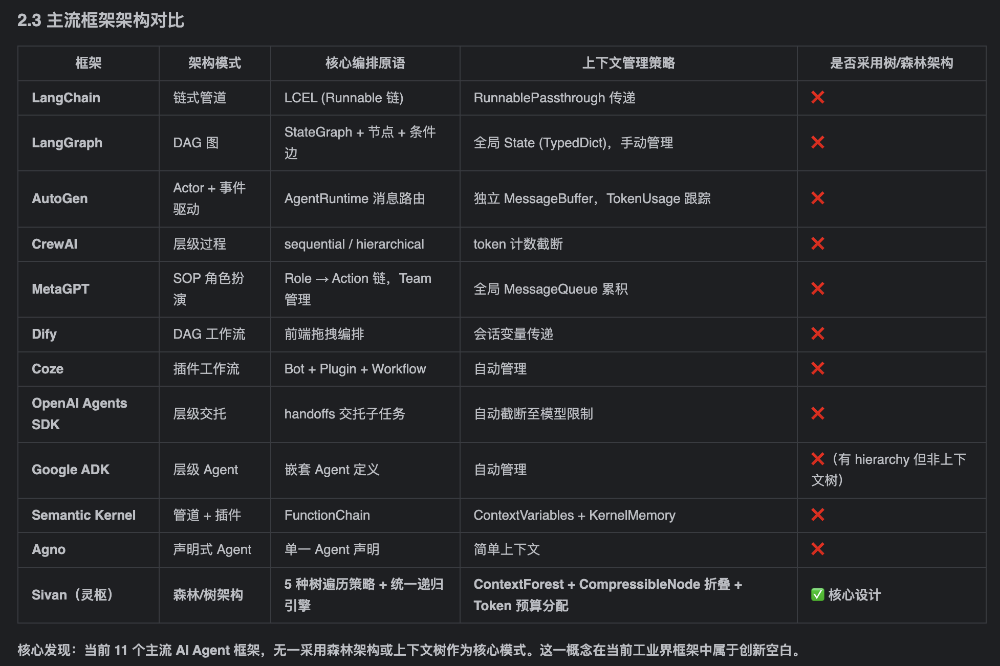

<div>
  <br/>
  
  
  
  
  
  <br/><br/>
</div>

# Sivan · 灵枢

**私人 AI 团队操作系统** — 森林架构驱动的多智能体协作平台。

Sivan 将单次对话扩展为跨轮次的项目推进，将单 Agent 回复升级为多角色团队的协作流水线。核心设计理念：所有上下文（执行树、消息、记忆）在同一个"森林"中统一管理。

---

---

## 架构理念

### 森林架构（Forest Architecture）

Sivan 的核心不是 Agent，而是**森林（Forest）**。一次对话 = 一个森林。

```
森林 (Forest)
├── 用户消息            ← 作为执行树的根节点
│   └── 执行树 (Tree)   ← 编排策略 + Agent 执行链路
│       ├── 任务节点    ← Agent 执行单元，产出即回复内容
│       └── 助手消息    ← 挂在执行树下
├── 下一轮消息
│   └── 下一棵执行树
└── 记忆 (Memory)      ← 从对话中提取的长期知识
```

执行树的节点结构与回复内容结构**统一**——聊天气泡直接按树形展示各 Agent 的产出。

## 核心差异

| 维度 | 传统 AI 助手 | Sivan |
|------|-------------|-------|
| **上下文管理** | 滑动窗口，用完即丢 | 三层压缩（HOT/WARM/COLD）+ Token 预算分配 |
| **执行方式** | 单次 LLM 调用 | 多 Agent 按编排模式协作，ReAct 循环 + 工具调用 |
| **记忆系统** | 无结构历史消息 | 三层递进记忆（SESSION→PROJECT→USER）+ 遗忘曲线 |
| **路由系统** | 固定提示词 | 三层贝叶斯路由（精确→语义→Thompson→LLM 创建）|
| **回复展示** | 扁平文本 | 树状结构展示各 Agent 产出 |
| **安全** | 依赖模型固有对齐 | 文件沙箱 + Bash 沙箱 + MCP 超时控制 |

## 功能模块

### 🔀 五种编排模式

| 模式 | 说明 |
|------|------|
| **SEQUENTIAL** | 顺序执行，前一个节点的输出累积传递 |
| **PARALLEL** | 并发执行，各节点独立输出后合成 |
| **CONDITIONAL** | 条件分支，仅满足条件的分支执行 |
| **CONSENSUS** | 多 Agent 独立分析 + SynthesisNode 合并报告 |
| **HIERARCHICAL** | 嵌套策略，子节点可继续分解 |

### 🧠 组合式路由

Agent 和技能独立匹配、组合使用：

| 层级 | Agent 路由 | 技能匹配 |
|------|-----------|---------|
| Tier 0 | `account_beta_params` 精确命中 | — |
| Tier 1 | pgvector 语义检索 + 贝叶斯加权 | Embedding 语义匹配 |
| Tier 2 | Thompson Beta 采样探索 | 低频技能探索 |
| Tier 3 | LLM 自动创建 Agent | LLM 自动创建技能 |

路由反馈闭环：执行完成后更新 Beta 参数 → 影响下次决策。用户点踩（dislike）立即降低该 Agent 的 Beta 分数。

### 📂 记忆系统

| 层级 | 保留期 | 晋升条件 | 衰减因子 λ |
|------|--------|---------|-----------|
| SESSION | 5h | 新建记忆默认 | 0.5 |
| PROJECT | 7d | 访问 >5 次 + 保留率 >0.5 | 0.05 |
| USER | 90d | 访问 >15 次 + 保留率 >0.7 | 0.01 |

每小时遗忘曲线调度自动归档低保留率记忆。情境闪现（Flashback）在每次对话前召回高相关度记忆注入上下文。

### 🔧 双轨工具系统

- **内部工具**：`bash`、`file_read/write/list/search` — 内置，始终可用
- **外部工具**：MCP 协议热加载，通过设置界面添加，永不修改代码
- 工具按 MCP 服务器选择动态过滤，未选中的服务器工具不会暴露给 Agent

### 🛡️ 安全沙箱

- 文件路径沙箱：所有文件操作限制在项目工作目录内
- Bash 沙箱：命令超时 + 危险命令拦截
- MCP 工具超时：60s 超时 + 熔断

## 技术栈

| 层级 | 技术 |
|------|------|
| **后端** | Spring Boot 3.4.5 + WebFlux + JDK 21 |
| **前端** | Vue 3 + TypeScript + Vite + Pinia（纯自定义组件） |
| **数据库** | PostgreSQL 16 + pgvector（统一表 `forest_nodes`）|
| **模型** | DeepSeek / Qwen3（vLLM / Ollama），OpenAI 兼容协议 |
| **构建** | Maven 多模块（8 模块）|

## 模块架构

```
sivan
├── sivan-core-api      核心端口（Agent/Model/Tool 接口），零框架依赖
├── sivan-common        公共枚举、异常、DTO
├── sivan-domain        领域实体、值对象、仓储接口，纯 POJO
├── sivan-infra         JPA/pgvector/Flyway 持久化 + SSE + 沙箱
├── sivan-agent         ReAct 循环、MCP 客户端、路由引擎、工具注册
├── sivan-application   应用服务（对话编排、森林执行、知识库、记忆管理）
└── sivan-web           Spring Boot 入口 + REST API + 安全配置
```

依赖方向：`web → application → agent → infra → domain`，`core-api` 被 `agent` 和 `domain` 依赖。

## 快速开始

### 前置要求

- JDK 21
- Docker & Docker Compose
- Node.js 18+
- Maven 3.9+

### 1. 启动数据库

```bash
docker compose -f docker/docker-compose.yml up -d
```

### 2. 启动后端

```bash
mvn clean compile
mvn spring-boot:run -pl sivan-web
```

### 3. 启动前端

```bash
cd sivan-ui
npm install
npm run dev    # http://localhost:5173
```

### 常用命令

```bash
mvn clean test                # 全部测试
mvn test -pl sivan-agent -Dtest=SequentialModeStrategyTest  # 单个测试
mvn compile                   # 编译
cd sivan-ui && npm run build   # 前端生产构建
cd sivan-ui && npx vue-tsc --noEmit  # TypeScript 检查
```

## 数据模型

所有数据统一存储在 `forest_nodes` 表中，通过 `node_type` 区分：

| node_type | 说明 |
|-----------|------|
| `conversation` | 对话容器（node_id = forestId = conversationId）|
| `message` | 消息（role: user/assistant/system）|
| `task` | 可执行任务（Agent 执行单元）|
| `inner_goal` | 编排策略节点（SEQUENTIAL/PARALLEL/CONSENSUS 等）|
| `synthesis` | CONSENSUS 模式的汇总节点 |
| `memory` | 记忆节点（含 vector 向量）|

树结构通过 `parent_node_id` 自引用 + 递归 CTE 加载。

## 详细文档

项目包含 17 篇功能模块文档，按功能而非代码模块组织：

| 章节 | 内容 |
|------|------|
| 00-目录与前言 | 全书结构、各章依赖关系 |
| 01-对话系统 | 消息模型、流式 SSE、多轮上下文 |
| 02-森林架构 | ContextForest、节点类型体系、metadata 治理 |
| 03-消息与执行树的关联 | linkMessage 机制、回退策略、树拓扑 |
| 04-组合式路由系统 | 三层贝叶斯路由、技能匹配、反馈闭环 |
| 05-编排策略 | 5 种编排模式、A2A 通信、合成策略 |
| 06-Agent 执行器 | ReAct 循环、工具调用、消息构建 |
| 07-叶子节点体系 | 各类 LeafExecutor 及扩展方式 |
| 08-记忆系统 | 三层递进、遗忘曲线、情境闪现 |
| 09-上下文压缩 | HOT/WARM/COLD 三层、Token 预算 |
| 10-工具系统 | 双轨工具、ToolRouter、安全沙箱 |
| 11-持久化与恢复 | forest_nodes 表设计、递归 CTE、断点恢复 |
| 12-可观测性 | 链路追踪、指标采集、SSE 进度 |
| 13-安全模型 | JWT、三层沙箱、审计、速率限制 |
| 14-架构演进实录 | V1→V2→V3 演进史、metadata 治理、拆表决策 |
| A-分库分表方案 | 按 account_id 分片策略 |
| B-扩展性讨论 | 添加节点/工具/模型/存储的扩展方式 |
| C-上下文管理 | 时间/空间/生命周期三维度管理 |
| D-邻接表与对象引用 | 数据库邻接表 ←→ 运行时对象引用的映射 |

文档位于 `docs/文档/`，使用 Markdown 编写。

## 作者

姚永超 — [tinton@msn.cn](mailto:tinton@msn.cn)

## 许可

本项目为个人开源项目，仅供学习和参考。
