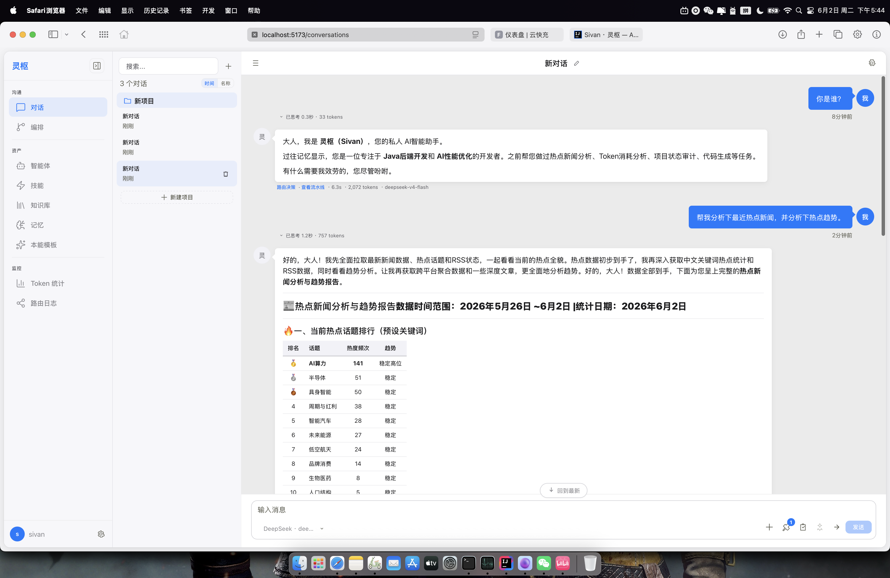
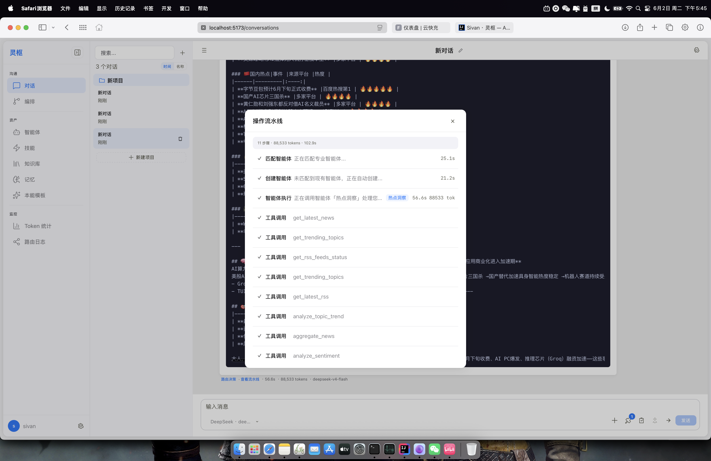
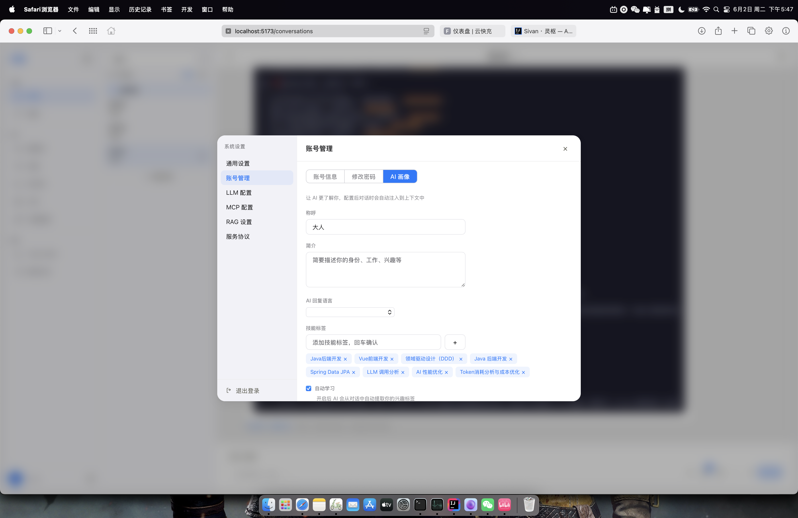

<div>
  <br/>
  
  
  
  
  
  <br/><br/>
</div>

# Sivan · 灵枢

**私人 AI 团队操作系统** — 把你的想法变成 AI 团队的持续交付。

Sivan 不是另一个 AI 聊天工具。它将单次对话扩展为跨轮次的项目推进，将单 Agent 回复升级为多角色团队的协作流水线。你能像聊天一样使用它，但它交付的不只是文字回复，而是真实完成的工作成果。

---




## 核心差异

| 维度 | 传统 AI 助手 | Sivan |
|------|-------------|-------|
| **对话** | 一问一答，关闭页面一切归零 | 支持文字/图片/语音，Goal 跨轮次追踪任务状态 |
| **执行** | 生成单次回复 | 多 Agent 团队按五种编排模式协作执行 |
| **记忆** | 上下文窗口用完即丢 | Ebbinghaus 遗忘曲线四层记忆，智能遗忘与自动晋升 |
| **安全** | 依赖模型固有对齐 | OS 沙箱 + 文件路径沙箱 + 归档拦截三层防御 |

## 功能速览

- **🤖 智能体自动创建** — LLM 根据任务描述推断名称、能力与系统提示词，向量语义对比避免重复
- **🔀 五模式编排** — SEQUENTIAL / PARALLEL / CONDITIONAL / HIERARCHICAL / CONSENSUS，两维独立配置
- **🧠 记忆森林** — SESSION / USER / TEAM / PROJECT 四层，Ebbinghaus 曲线衰减，Flashback 自动注入
- **🔧 双轨工具系统** — 内部文件/Bash 工具 + 外部 MCP 协议热加载，ReAct 循环三策略路由
- **🛡️ 安全沙箱** — OS 进程隔离 + 文件路径沙箱 + 归档只读保护，假设 LLM 输出可能有害
- **📂 本地文件访问** — 账户级物理隔离目录，file_read/write/list/search 受限访问
- **🎯 Goal 系统** — Milestone 拆解 + 跨轮次追踪 + 超时自动推进 + HITL 审核
- **👤 用户画像** — LLM 自动提取兴趣标签，语义过滤注入对话，变更历史可追溯
- **💡 本能模板** — 零 LLM 零延迟的场景识别，高频自动进化，低频自动降级归档

## 技术栈

| 层级 | 技术 |
|------|------|
| **后端** | Spring Boot 3.4.5 + Reactor + JDK 21 |
| **前端** | Vue 3 + TypeScript + Vite + Pinia（纯自定义组件，无第三方 UI 库） |
| **数据库** | PostgreSQL 16 + pgvector（Docker: pgvector/pgvector:0.8.0-pg16）|
| **模型** | Qwen3 模型族（Embedding-2B / Reranker-2B / VL），本地 LLM（OpenAI 兼容协议）|
| **构建** | Maven 多模块（8 个模块）|

## 快速开始

### 前置要求

- JDK 21
- Docker & Docker Compose
- Node.js 18+
- Maven 3.9+

### 1. 启动数据库

```bash
docker compose -f docker/docker-compose.yml up -d
```

### 2. 启动后端

```bash
# 首次运行前编译
mvn clean compile

# 运行应用（默认 dev profile，端口 8080）
mvn spring-boot:run -pl sivan-web
```

### 3. 启动前端

```bash
cd sivan-ui
npm install
npm run dev    # 开发服务器 http://localhost:5173
```

### 常用命令

```bash
mvn clean test                    # 运行全部测试
mvn test -pl sivan-web -Dtest=ConversationControllerTest  # 单个测试类
mvn clean package -DskipTests     # 打包
cd sivan-ui && npm run build       # 前端生产构建
```

## 模块架构

```
sivan
├── sivan-core-api         核心端口抽象（Agent/Model/Tool），零框架依赖
├── sivan-common           公共枚举、异常、DTO 基类
├── sivan-domain           领域实体、值对象、仓储接口，纯 POJO 零框架依赖
├── sivan-infrastructure   持久化（pgvector/JPA/Flyway）、模型服务封装、SSE 引擎
├── sivan-agent            ReAct 策略、MCP 客户端、模型路由、工具注册
├── sivan-orchestration    Squad 拓扑生成、异步执行引擎、契约系统、HITL
├── sivan-memory           遗忘曲线、情境闪现、本能模板
└── sivan-web              Spring Boot 启动、REST API、SSE 端点、安全配置
```

依赖方向：`web` → `agent`/`orchestration`/`memory` → `infrastructure` → `domain` → `common`；`core-api` 被 `agent` 和 `orchestration` 依赖。

## 编排模式

Squad 执行提供两维独立配置的五种模式：

| 模式 | 阶段间使用 | 阶段内使用 | 适用场景 |
|------|-----------|-----------|---------|
| SEQUENTIAL | ✅ | ✅ | 有严格先后依赖的流水线 |
| PARALLEL | ✅ | ✅ | 前后端并行开发、多源数据清洗 |
| CONDITIONAL | ✅ | ✅ | 审查通过才进入下一步 |
| HIERARCHICAL | ✅ | ✅ | 架构设计 → 子任务分解 |
| CONSENSUS | ✅ | ✅ | 多 Agent 独立评审后综合 |

## 记忆分层

| 层级 | 半衰期 | 描述 |
|------|--------|------|
| SESSION | 1h | 单次对话中的短期上下文，自动衰减 |
| USER | 24h | 跨对话的用户画像兴趣标签，LLM 自动提取 |
| TEAM | 7d | 跨账户共享的团队级决策记录 |
| PROJECT | 30d | 持久化的架构决策、代码片段等项目资产 |

## 作者

姚永超 — [tinton@msn.cn](mailto:tinton@msn.cn)

## 许可

本项目为个人开源项目，仅供学习和参考。
