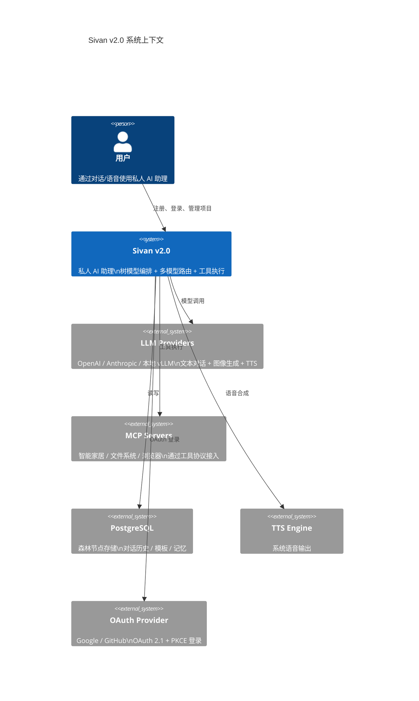
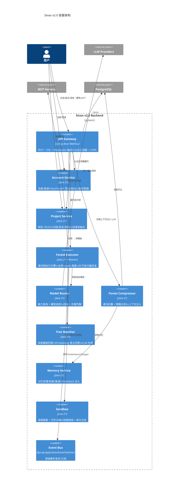
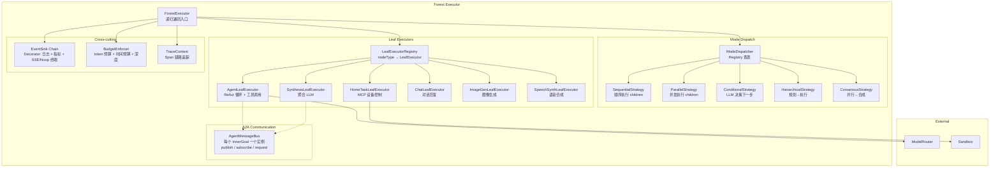
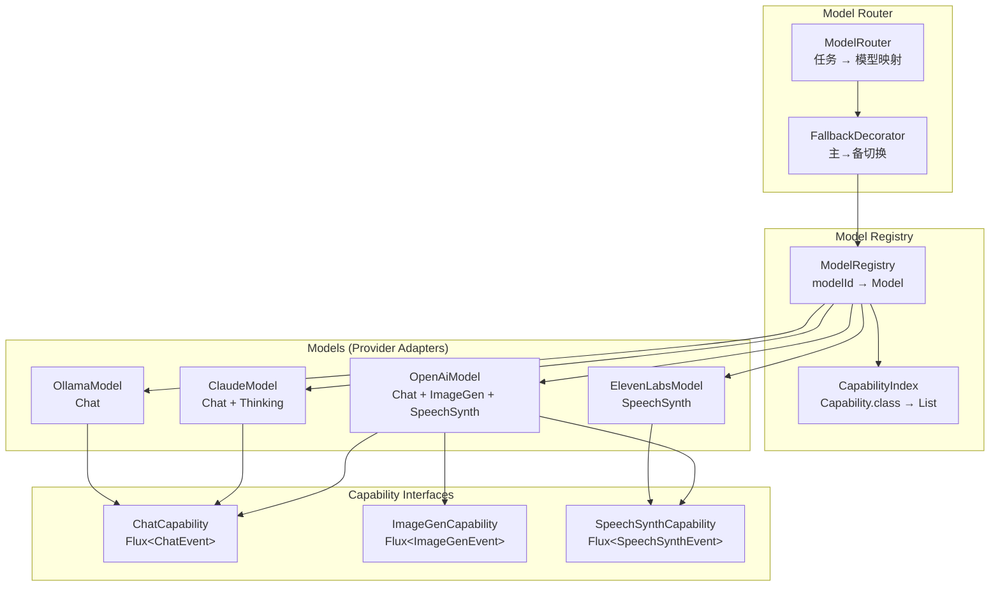
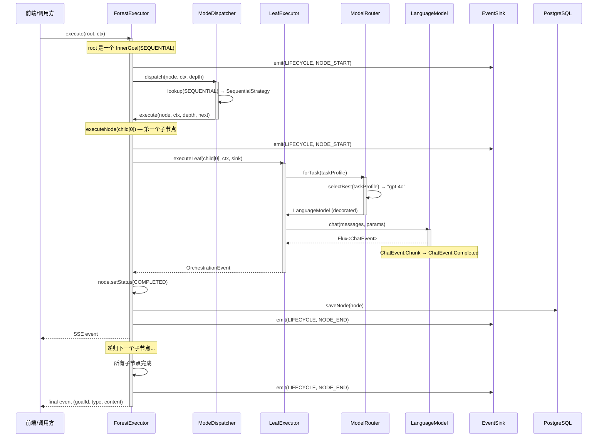
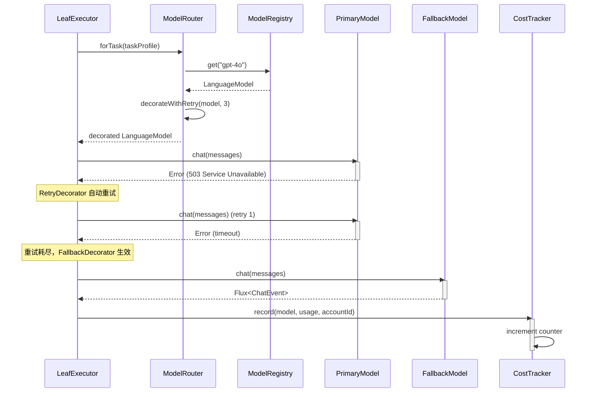
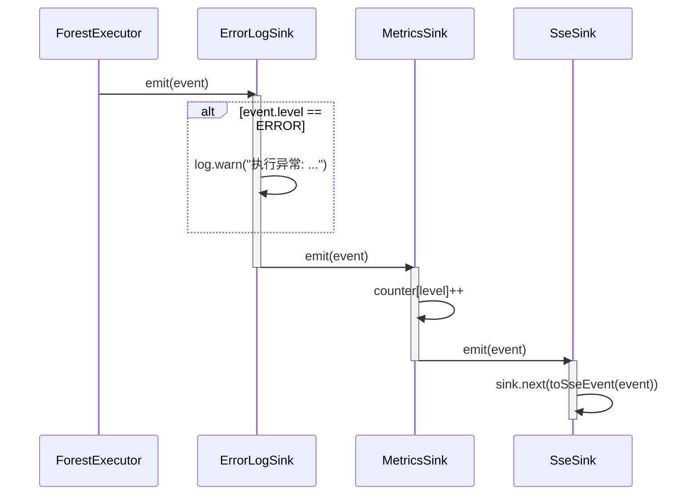
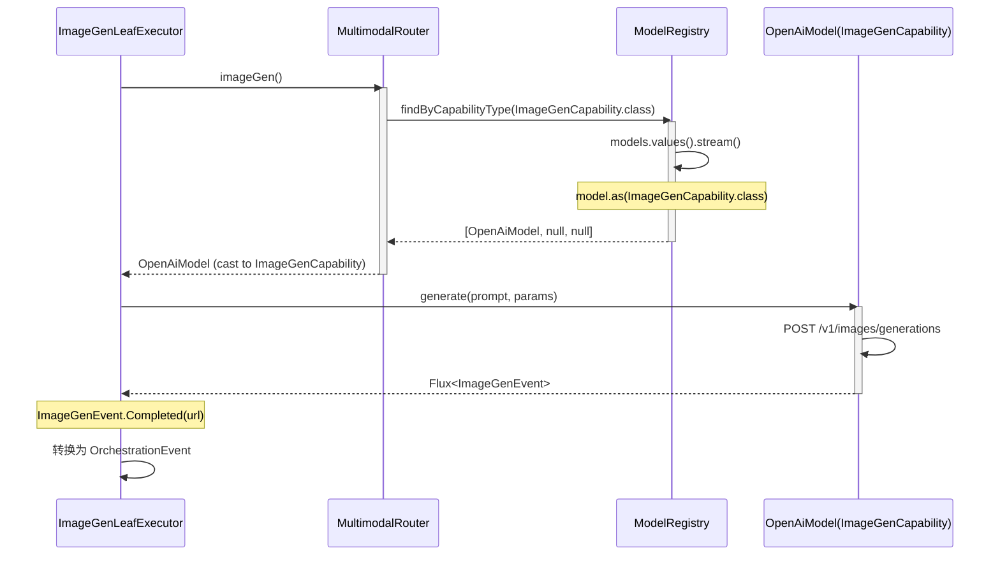
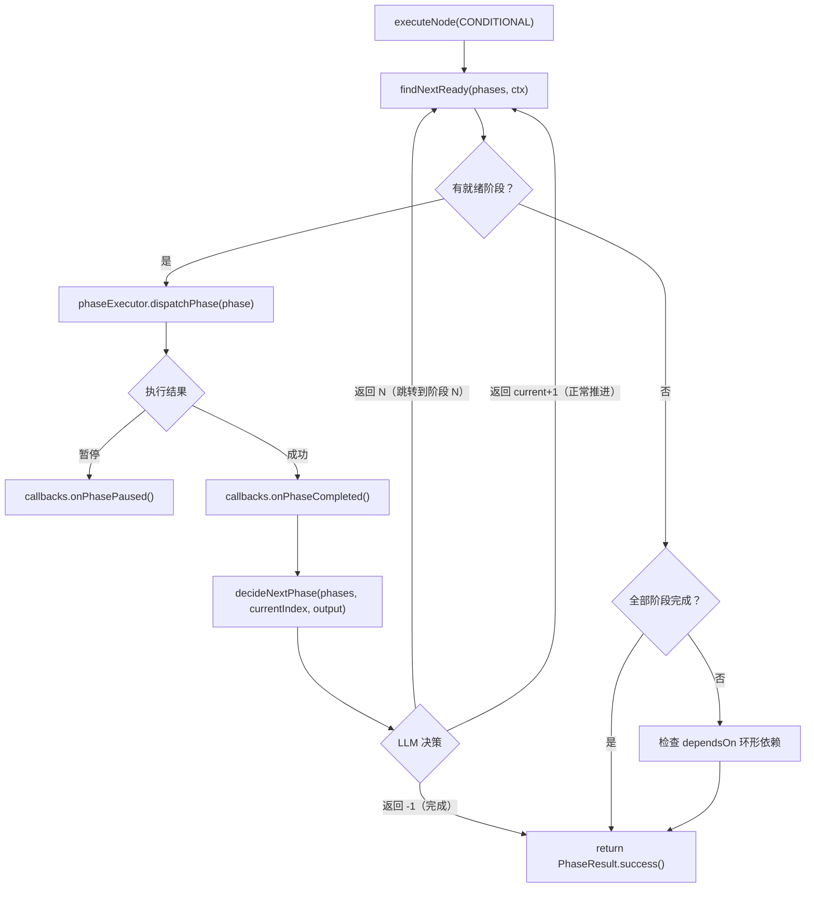

# C4 架构总览

> 日期：2026-06-05
> 状态：设计草案

本文档使用 C4 模型（Context → Container → Component → Code）描述 Sivan v2.0 的整体架构。
关键交互节点附带时序图和流程图。

---

## L1 — Context（系统上下文）

**说明**：
- 用户通过对话或语音与 Sivan 2.0 交互
- 用户需要先注册/登录（邮箱密码或 OAuth）才能使用系统
- Sivan 2.0 内部以树模型编排执行，不区分 CHAT / SINGLE_AGENT / SQUAD——所有输入都是树
- 所有请求携带 JWT 标识 accountId，贯穿全链路（零 ThreadLocal）
- LLM Providers 支持多模型（文本 + 图像 + 语音），通过统一的 `LanguageModel` 接口调用
- MCP Servers 提供工具执行能力（文件操作、设备控制等）
- PostgreSQL 是唯一的持久化存储，核心表为 `forest_nodes`（递归树结构）
- OAuth Provider 提供第三方认证登录（OAuth 2.1 + PKCE）

---

## L2 — Container（容器视图）

### 容器职责

| 容器 | 入口 | 核心接口 | 关键依赖 |
|---|---|---|---|
| API Gateway | HTTP / WebSocket | 认证过滤器 + `ForestTree.vue` 前端 | Account Service, Forest Executor |
| Account Service | `POST /auth/register` | `AuthService.login()` / `JwtTokenProvider` | OAuth Provider, DB |
| Project Service | `POST /projects` | `ProjectService.create()` / `ShortIdGenerator` | DB, FileSystem |
| Forest Executor | `ForestExecutor.execute()` | `ModeStrategy` / `LeafExecutor` | Model Router, Sandbox |
| Model Router | `ModelRouter.forTask()` | `LanguageModel.chat()` | LLM Providers |
| Forest Compressor | `ForestCompressor.compress()` | `FoldStrategy` / `GroupStrategy` | Memory Service |
| Tree Matcher | `TreeMatcher.match()` | `TemplateMatcher` | LLM, DB |
| Memory Service | `FlashbackService.inject()` | `RecallStrategy` | DB |
| Sandbox | `Sandbox.execute()` | `SandboxPolicy` | OS |
| Event Bus | `ApplicationEventPublisher` | `@EventListener` | — |

---

## L3 — Component 视图（关键子系统）

### L3a — Forest Executor 组件

### L3b — Model Router 与多模型支持

---

## L4 — Code（关键交互的时序图）

### 4.1 GoalTree 执行全流程

### 4.2 模型路由与回退

### 4.3 事件发射（STREAM 模式下的 Decorator 链）

### 4.4 多模态能力发现（运行时）

### 4.5 CONDITIONAL 模式执行

> 五种编排模式的完整流程图见 [01-森林架构-编排与执行.md §3.2](10-设计/01-森林架构-编排与执行.md)（Mermaid 渲染）。

---

## 配套文档

| 文档 | 对应 C4 层级 |
|---|---|
| [00-总览与路线图.md](00-总览/00-总览与路线图.md) | L1 + L2 规划 |
| [01-森林架构-编排与执行.md](10-设计/01-森林架构-编排与执行.md) | L3 + L4（执行引擎组件 + A2A AgentMessageBus + 代码） |
| [02-多模型支持与模型路由.md](10-设计/02-多模型支持与模型路由.md) | L3 + L4（路由组件 + 多模态能力） |
