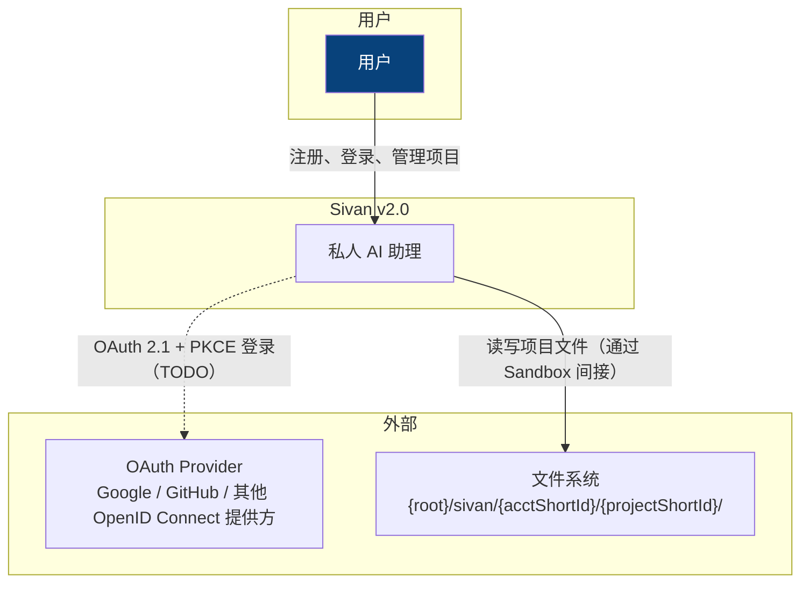
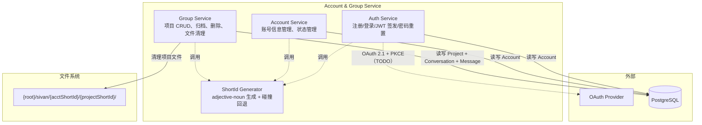
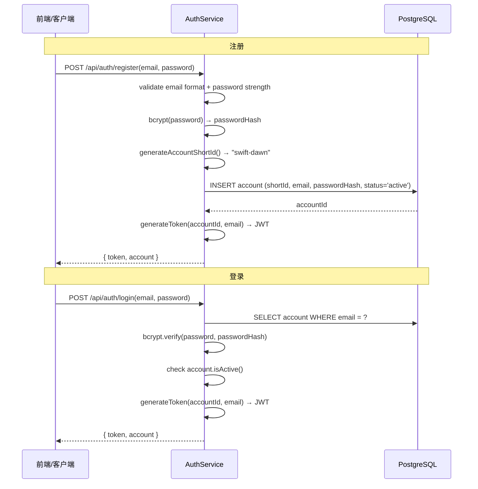
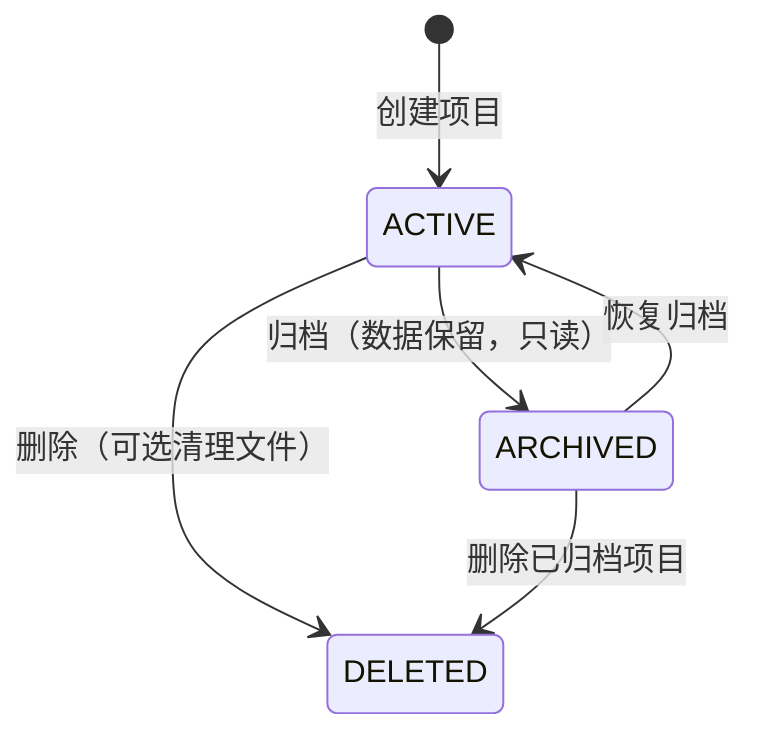

# 账号与项目管理 — Sivan v2.0

> 作者：姚永超
> 日期：2026-06-11
> 状态：实施完成

---

## 1. 概述

账号与项目管理是 v2.0 的基础领域，为所有其他领域提供**用户身份标识、租户隔离、项目生命周期**支持。

### 设计目标

1. **一人一账号，一账号多项目** — 单用户场景简单，但预留多账号扩展
2. **物理目录隔离 + 查询隔离** — 多账号共享同一套基础设施，但数据互不可见
3. **简洁生命周期** — 归档可恢复，删除不可逆（级联清理对话/消息）
4. **对外暴露短标识** — Docker 风格 `adjective-noun`，用户可读可记忆

### 核心概念

```java
// ===== 账号 =====

/** 系统用户。一人一个账号。 */
class Account {
    UUID accountId;
    String email;
    String passwordHash;       // bcrypt, null 表示 OAuth-only
    String shortId;            // 全局唯一形容词-名词, 如 "swift-dawn"
    String status;             // "active" / "disabled"（String 常量，无枚举）
    LocalDateTime createdAt;
    LocalDateTime updatedAt;
}

// ===== 项目 =====

/** 用户的工作空间。一个账号可创建多个项目。同一账号下允许同名。 */
class Project {
    UUID projectId;
    UUID accountId;            // 所属账号
    String name;               // 显示名称，允许同名
    String shortId;            // 按账号唯一形容词-名词, 如 "still-breeze"
    String localPath;          // 相对路径 {acctShortId}/{projectShortId}，不绑定 root-path
    boolean localPathAuto;     // true 表示由系统自动创建
    boolean archived;          // 归档标志，归档后只读
    OffsetDateTime archivedAt;
    LocalDateTime createdAt;
    LocalDateTime updatedAt;
}
```

---

## 2. L1 — Context



> OAuth 登录已规划但尚未实现，当前仅支持邮箱密码注册/登录。

---

## 3. L2 — Container



### 容器职责

| 容器 | 入口 | 核心接口 | 关键依赖 |
|------|------|----------|----------|
| Auth Service | `POST /api/auth/register` `POST /api/auth/login` | `AuthService.register()` / `AuthService.login()` | ShortId Generator |
| Account Service | 内部调用 | `AccountService.findByAccountId()` | DB |
| Group Service | `POST /api/groups` `DELETE /api/groups/{id}` | `GroupService.create()` / `GroupService.archive()` / `GroupService.delete()` | DB, FileSystem |
| ShortId Generator | 内部调用 | `ShortIdGenerator.generate()`（静态工具类） | 无（纯内存计算） |

---

## 4. L3 — Component

### 4.1 AuthService — 认证流程



### 4.2 JWT 认证

JWT 直接内联在 `AuthService` 中生成，无独立接口：

- **算法**：HMAC-SHA（HS256）
- **Secret**：`application.yml` 配置 `jwt.secret`（至少 256 位）
- **过期时间**：24 小时（`jwt.expiration=86400000`），单 token 机制
- **验证**：`JwtAuthenticationFilter` 在每个请求中解析 token、校验签名和过期时间，通过后将 `accountId` 写入 `exchange.getAttributes()` 供下游使用

```java
// AuthService.generateToken()
String generateToken(UUID accountId, String username) {
    return Jwts.builder()
        .subject(accountId.toString())
        .claim("username", username)
        .issuedAt(new Date())
        .expiration(new Date(System.currentTimeMillis() + expiration))
        .signWith(secretKey)
        .compact();
}
```

> refresh token 轮换和 OAuth 2.1 + PKCE 已规划但尚未实现。当前单 token 24h 机制对单用户场景够用。

### 4.3 GroupService — 项目生命周期



| 操作 | 行为 | 文件处理 |
|------|------|----------|
| 归档 | `archived = true`, 数据保留, API 只读 | 不处理 |
| 恢复归档 | `archived = false`, 恢复正常读写 | 无操作 |
| 删除 (`removeFiles=false`) | 从 DB 删除项目记录 | 保留本地文件目录 |
| 删除 (`removeFiles=true`) | 从 DB 删除项目记录 | 递归删除本地文件目录 |
| 删除级联 | 自动删除该项目下所有对话和消息 | — |

**路径策略**（v2026-06-11 重构）：
- DB 只存相对路径 `{acctShortId}/{projectShortId}`
- 运行时通过 `resolveLocalPath()` 拼上 `fileRootPath` 用于文件操作
- 所有对外展示（API 响应 / LLM 上下文）使用相对路径，不暴露服务器路径
- 禁止用户自设路径（`updateLocalPath` API 已去除）

### 4.4 ShortIdGenerator

工具类，非接口：

```java
final class ShortIdGenerator {
    /** 生成 adjective-noun 格式短标识。 */
    static String generate();

    /** 碰撞回退：追加 3 位随机后缀。 */
    static String generateWithSuffix();
}
```

- **词库**：adjective(32) × noun(32) = 1024 组合
- **全局唯一**：由调用方 `AuthService.generateAccountShortId()` 通过数据库循环检测保证
- **按账号唯一**：由调用方 `GroupService.generateShortIdForAccount()` 通过数据库循环检测保证

### 4.5 目录结构

```
{root}/
└── sivan/
    └── {accountShortId}/           ← 物理隔离
        ├── {projectShortId}/       ← 项目工作目录（创建时自动初始化）
        └── ...                     ← 其他项目
```

- 项目根目录在创建时自动创建
- `FileSecurityManager` 通过解析项目根路径，禁止跨项目访问
- 文件上传走 `FileStorageService` 的独立 `storage-path` 配置
- 项目删除时可选递归清理目录树

### 4.6 前端删除交互

删除项目时弹出三按钮确认弹窗：

| 按钮 | 行为 | 后端参数 |
|------|------|----------|
| 取消 | 不做任何操作 | — |
| 仅项目 | 从列表删除项目记录，保留本地文件 | `removeFiles=false` |
| 全部删除 | 删除项目记录 + 回收本地文件 | `removeFiles=true` |

---

## 5. 设计原则映射

### 5.1 零 ThreadLocal — accountId 显式传递

所有 Repository 方法显式带 `accountId`，通过 `@CurrentAccountId` 注解从 JWT 解析注入。

### 5.2 接口隔离

Auth / Account / Group 三个 Service 职责分离，各自依赖自己的 Repository。

---

## 6. 扩展点

| 扩展接口 | 默认实现 | 状态 |
|----------|----------|------|
| `PasswordEncoder` | BCrypt（Spring Security） | ✅ |
| `ShortIdGenerator` | 静态工具类 | 🟡 非接口，不可替换 |

> `JwtTokenProvider` 和 `OAuthClient` 接口已规划但尚未抽取，当前为内联实现。

---

## 7. 与外部领域的集成点

| 集成方 | 提供能力 | 消费方式 | 状态 |
|--------|----------|----------|------|
| 01-森林架构 | `ExecutionContext.accountId` | 通过 `@CurrentAccountId` 注入 | ✅ |
| 05-沙箱安全 | `Project.shortId` 解析目录路径 | `FileSecurityManager.validate()` | ✅ |
| 08-API 契约 | 认证过滤器校验 JWT | `JwtAuthenticationFilter` | ✅ |
| 09-持久化与恢复 | 事务边界包含 accountId | 所有 Repository 接口显式传参 | ✅ |
| 15-前端交互 | 登录/注册/项目列表/设置页 | REST API | ✅ |
