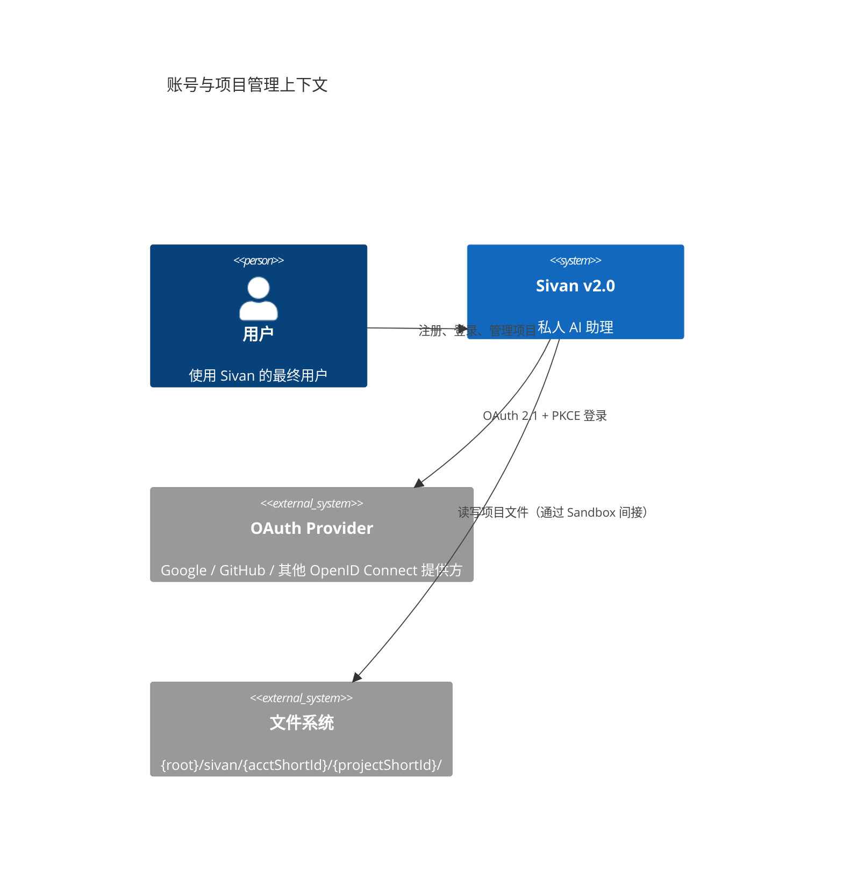
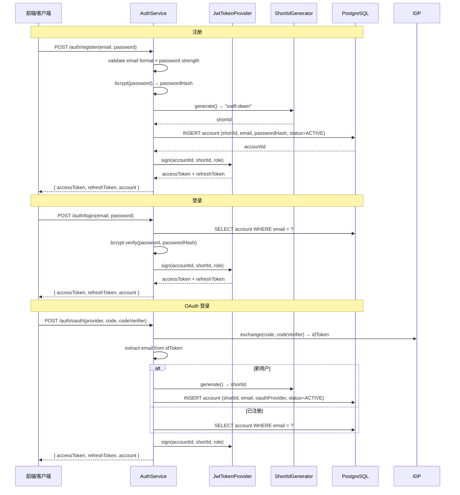
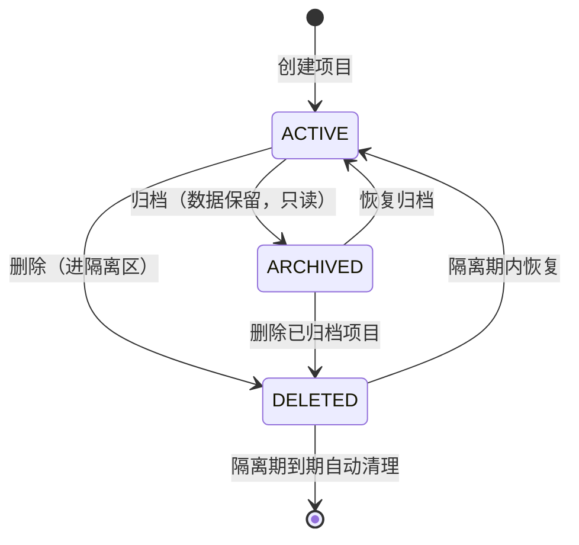

# 账号与项目管理 — Sivan v2.0

> 作者：姚永超
> 日期：2026-06-06
> 状态：设计草案

---

## 1. 概述

账号与项目管理是 v2.0 的基础领域，为所有其他领域提供**用户身份标识、租户隔离、项目生命周期**支持。

### 设计目标

1. **一人一账号，一账号多项目** — 单用户场景简单，但预留多账号扩展
2. **物理目录隔离 + 查询隔离** — 多账号共享同一套基础设施，但数据互不可见
3. **零中断生命周期** — 归档不删数据，删除进隔离区可恢复
4. **对外暴露短标识** — Docker 风格 `adjective-noun`，用户可读可记忆

### 核心概念

```java
// ===== 账号 =====

/** 系统用户。一人一个账号，支持 OAuth 2.1 登录。 */
class Account {
    UUID accountId;
    String email;
    String passwordHash;       // bcrypt, null 表示 OAuth-only
    String shortId;            // 全局唯一形容词-名词, 如 "swift-dawn"
    AccountStatus status;      // ACTIVE / DISABLED / FROZEN
    LocalDateTime createdAt;
    LocalDateTime updatedAt;
}

// ===== 项目 =====

/** 用户的工作空间。一个账号可创建多个项目。同一账号下允许同名。 */
class Project {
    UUID projectId;
    UUID accountId;            // 所属账号
    String name;               // 显示名称，允许同名
    String shortId;            // 按账号唯一形容词-名词, 如 "still-breeze"
    ProjectStatus status;      // ACTIVE / ARCHIVED / DELETED
    LocalDateTime createdAt;
    LocalDateTime updatedAt;
    LocalDateTime archivedAt;  // null 表示未归档
    LocalDateTime deletedAt;   // null 表示未删除，隔离期到期后自动清理
}
```

---

## 2. L1 — Context



---

## 3. L2 — Container

```mermaid
C4Container
  title 账号与项目管理容器架构

  System_Ext(idp, "OAuth Provider")
  System_Ext(db, "PostgreSQL")

  Boundary(b1, "Account & Project Service") {
    Container(auth, "Auth Service", "Java 21", "注册/登录/JWT 签发/OAuth 流程")
    Container(acct, "Account Service", "Java 21", "账号信息管理、状态管理")
    Container(proj, "Project Service", "Java 21", "项目 CRUD、归档、删除、隔离区")
    Container(shortId, "ShortId Generator", "Java 21", "adjective-noun 生成 + 碰撞回退")
  }

  Rel(auth, idp, "OAuth 2.1 + PKCE")
  Rel(auth, db, "读写 Account")
  Rel(acct, db, "读写 Account")
  Rel(proj, db, "读写 Project")
  Rel(proj, fs, "清理/隔离项目文件")

  Rel(auth, shortId, "生成短标识")
  Rel(acct, shortId, "生成短标识")
  Rel(proj, shortId, "生成短标识")
```

### 容器职责

| 容器 | 入口 | 核心接口 | 关键依赖 |
|------|------|----------|----------|
| Auth Service | `POST /api/v2/auth/register` `POST /api/v2/auth/login` | `AuthService.register()` / `AuthService.login()` | OAuth Provider, ShortId Generator |
| Account Service | `GET /api/v2/accounts/{id}` | `AccountService.findByAccountId()` | DB |
| Project Service | `POST /api/v2/projects` `DELETE /api/v2/projects/{id}` | `ProjectService.create()` / `ProjectService.archive()` | DB, FileSystem |
| ShortId Generator | 内部调用 | `ShortIdGenerator.generate()` | 无（纯内存计算） |

---

## 4. L3 — Component

### 4.1 AuthService — 认证流程



### 4.2 JwtTokenProvider

```java
interface JwtTokenProvider {
    /** 签发 access token（短期，默认 30 分钟） */
    String signAccess(UUID accountId, String shortId, String role);

    /** 签发 refresh token（长期，默认 7 天） */
    String signRefresh(UUID accountId);

    /** 校验 token，返回 payload */
    TokenPayload verify(String token);

    /** 刷新 access token */
    TokenPair refresh(String refreshToken);
}

record TokenPayload(
    UUID accountId,
    String shortId,
    String role,
    Instant expiresAt
) {}

record TokenPair(
    String accessToken,
    String refreshToken
) {}
```

**设计决策**：
- access token 短期（30 分钟），减少吊销延迟
- refresh token 支持轮换（rotation），每次刷新签发新 refresh token，旧 token 失效
- 支持账号状态校验：每次请求验证 account.status == ACTIVE

### 4.3 ProjectService — 项目生命周期



```java
interface ProjectService {
    Mono<Project> create(CreateProjectRequest req, UUID accountId);
    Mono<Project> findByProjectId(UUID projectId, UUID accountId);
    Flux<Project> findByAccountId(UUID accountId);
    Mono<Project> archive(UUID projectId, UUID accountId);
    Mono<Project> restore(UUID projectId, UUID accountId);
    Mono<Void> delete(UUID projectId, UUID accountId, boolean cleanupFiles);
    Mono<Project> restoreFromTrash(UUID projectId, UUID accountId);
}
```

| 操作 | 行为 | 文件处理 |
|------|------|----------|
| 归档 | `status = ARCHIVED`, 数据保留, API 只读 | 不处理 |
| 删除 | `status = DELETED`, 设 `deletedAt = now`，API 拒绝访问 | 可选清理；不移到隔离区则 30 天后自动清理 |
| 恢复归档 | `status = ACTIVE`，恢复正常读写 | 无操作 |
| 隔离期恢复 | `status = ACTIVE`，清 `deletedAt` | 如文件被清理过，恢复后文件工具返回空目录 |

### 4.4 ShortIdGenerator

```java
interface ShortIdGenerator {
    /** 生成全局唯一的短标识 */
    String generate(ShortIdScope scope, UUID ownerId);

    /** 校验短标识格式 */
    boolean isValid(String shortId);

    /** 根据短标识查询 ID（仅 Account/Project Service 内部用） */
    UUID resolveAccount(String shortId);
    UUID resolveProject(String accountShortId, String projectShortId);
}

enum ShortIdScope {
    ACCOUNT,  // 全局唯一
    PROJECT   // 按 accountId 唯一
}
```

**生成策略**（沿用 v1.0）：

```
词库: adjective(32) × noun(32) = 1024 组合
碰撞回退: SwiftDawn → swift-dawn-xyz（追加 3 位随机后缀）
```

### 4.5 目录结构

```
{root}/
└── sivan/
    └── {accountShortId}/           ← 物理隔离
        ├── {projectShortId}/
        │   ├── data/               ← 数据结构化存储
        │   ├── output/             ← 输出文件
        │   └── uploads/            ← 用户上传文件
        └── ...                     ← 其他项目
```

- 目录初始化在项目创建时由 `ProjectService` 自动完成
- `FileSecurityManager` 通过 `projectShortId` 解析项目根路径，禁止跨项目访问
- 项目删除时可选清理目录树

---

## 5. 设计原则映射

### 5.1 零 ThreadLocal — accountId 显式传递

所有 Repository 方法必须显式带 `accountId`：

```java
interface AccountRepository {
    Mono<Account> findByEmailAndAccountId(String email, UUID accountId);
}

interface ProjectRepository {
    Flux<Project> findByAccountId(UUID accountId);
    Mono<Project> findByProjectIdAndAccountId(UUID projectId, UUID accountId);
}
```

### 5.2 接口隔离

| 反面教材（胖接口） | 正确拆分 |
|------------------|----------|
| `AccountService`（注册+登录+JWT+OAuth+密码管理） | `AuthService` / `AccountService` / `JwtTokenProvider` / `OAuthClient` |

### 5.3 新增一个类，不修改现有代码

| 新增类型 | 不需要改的类 | 只需新增的类 |
|----------|-------------|-------------|
| 新增 OAuth provider | `AuthService` | `XxxOAuthClient implements OAuthClient` |
| 新增短标识词库 | `ShortIdGenerator` | 更新 adjective/noun 词库配置 |

---

## 6. 扩展点

| 扩展接口 | 默认实现 | 可替换场景 |
|----------|----------|-----------|
| `JwtTokenProvider` | `RsaJwtTokenProvider`（RS256） | 更换签名算法或 key 管理方式 |
| `OAuthClient` | `GenericOidcClient` | 适配非标准 OAuth provider |
| `PasswordEncoder` | BCrypt（Spring Security） | 更换加密算法 |
| `ShortIdGenerator` | `AdjectiveNounGenerator` | 更换短标识风格 |

---

## 7. 与外部领域的集成点

| 集成方 | 提供能力 | 消费方式 |
|--------|----------|----------|
| 01-森林架构 | `ExecutionContext.accountId` | 通过 API Gateway 从 JWT 提取注入 |
| 05-沙箱安全 | `Project.shortId` 解析目录路径 | `FileSecurityManager.validate()` |
| 08-API 契约 | 认证过滤器校验 JWT | `WebFilter` 解析 token → 写入 exchange attributes |
| 09-持久化与恢复 | 事务边界包含 accountId | 所有 Repository 接口显式传参 |
| 15-前端交互 | 登录/注册/项目列表/设置页 | REST API |

---

## 8. 跨领域共享组件

| 共享组件 | 使用者 | 说明 |
|----------|--------|------|
| `CurrentAccount`（`@RequestAttribute`） | 所有 Controller | JWT 解析后注入的当前用户信息 |
| `AccountId` 类型 | 所有 Repository | 强类型 ID，防止参数混淆 |

---

## 9. i18n

所有用户可见文本接入国际化：

| 文本 | Key 示例 |
|------|----------|
| 登录错误 | `auth.login.invalidCredentials` |
| 注册成功 | `auth.register.success` |
| 项目已归档 | `project.archive.success` |
| 隔离期剩余天数 | `project.trash.remainingDays` |
