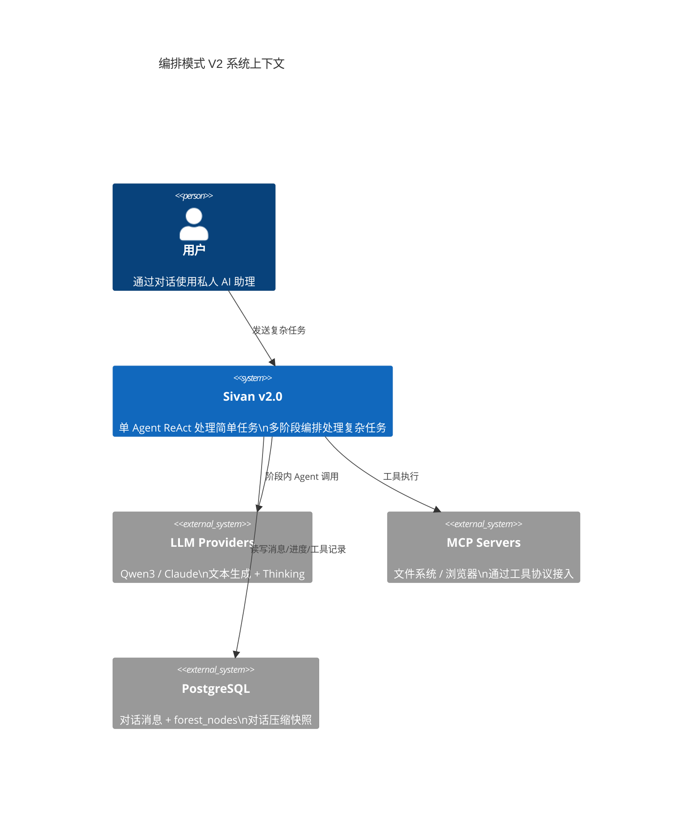
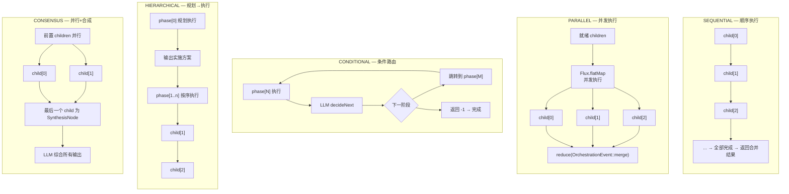
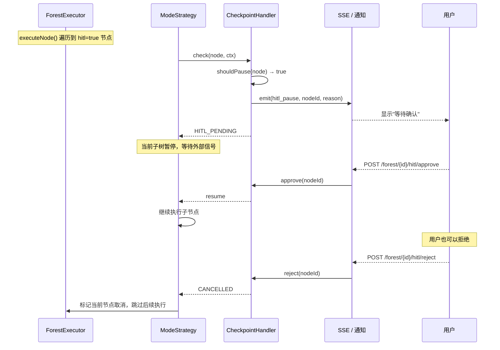
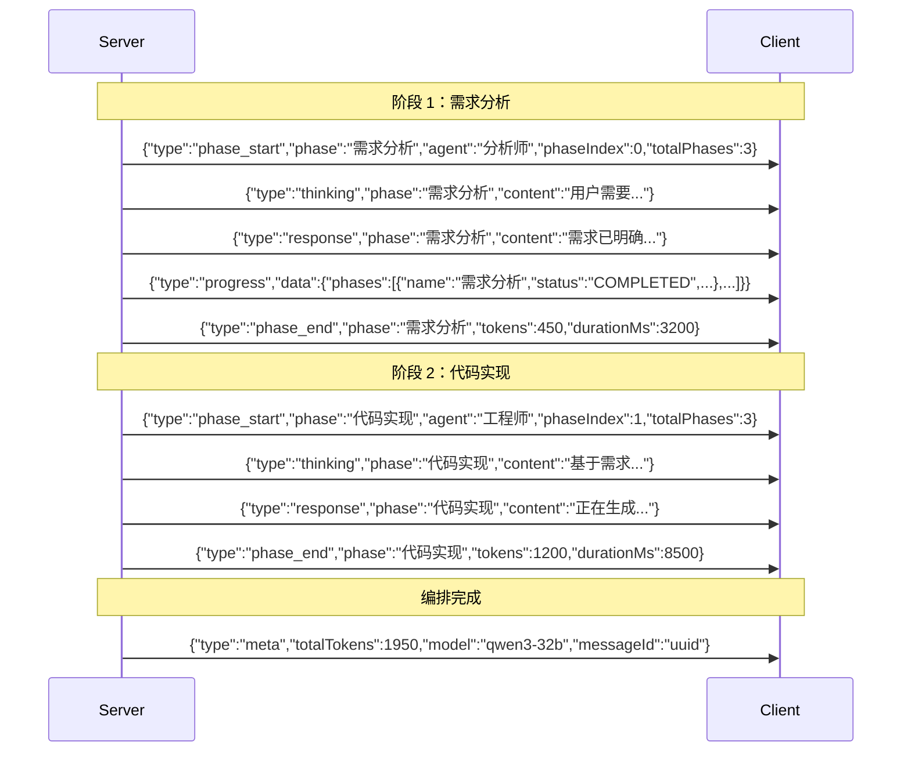
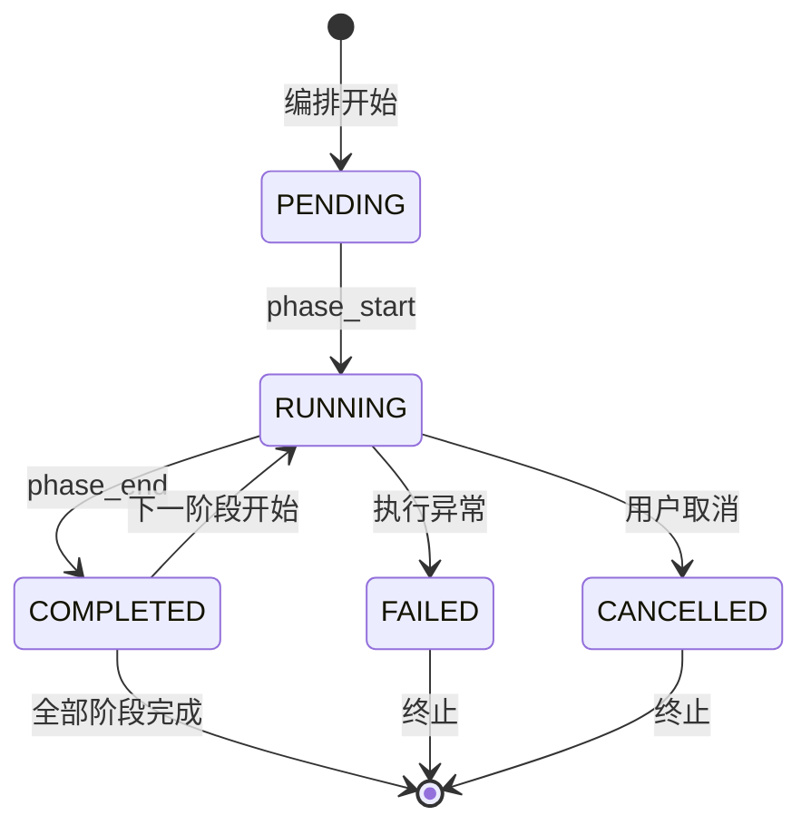
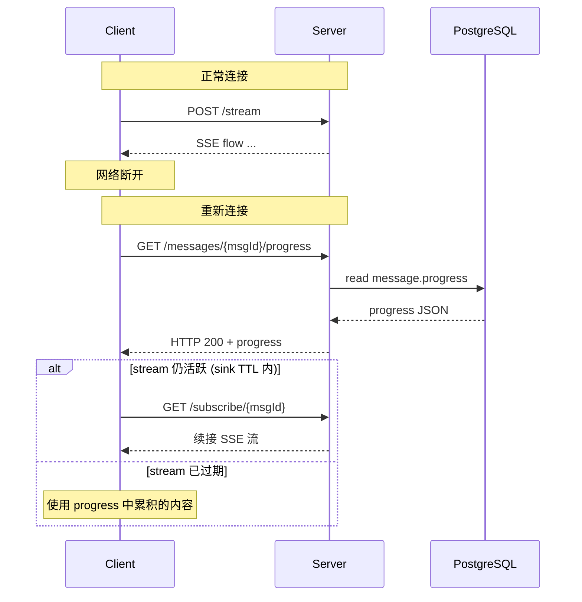
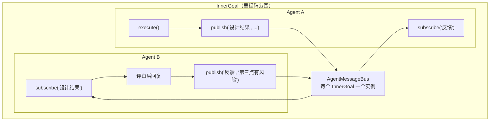

# 森林架构 — Sivan v2.0

> 作者：姚永超
> 日期：2026-06-04
> 状态：设计草案

---

## 1. 核心抽象

### 1.1 C4 系统上下文



### 1.2 设计原则

| 原则 | 说明 |
|---|---|
| **展示与推理分离** | sections/progress 仅用于前端展示，LLM 上下文只消费 content |
| **扁平消息，嵌套阶段** | 消息列表保持平面结构（user → assistant），阶段缩在单条 assistant 消息内 |
| **Server-Driven 进度** | 服务端维护权威进度状态，客户端不做状态推断 |
| **复用现有 Agent** | 编排不重新实现 Agent，只做多 Agent 调度器 |
| **SSE + REST 双通道** | SSE 推送实时事件，REST 提供断连恢复 |

### 1.4 C4 容器视图

```mermaid
C4Container
  title 编排模式 V2 容器视图

  Person(user, "用户")

  System_Ext(llm, "LLM Providers")
  System_Ext(mcp, "MCP Servers")
  System_Ext(db, "PostgreSQL")

  Boundary(b1, "Sivan Backend") {
    Container(api, "ConversationController", "Spring Boot WebFlux", "REST + SSE 端点\nstreamMessage / regenerate / subscribe")
    Container(svc, "ConversationService", "Java 21", "上下文构建 + 工具决议\nLLM 消息编排")
    Container(engine, "StreamingMessageEngine", "Java 21 + Reactor", "Agent 事件循环\nSSE 推送 + 周期 flush")
    Container(orche, "MultiAgentOrchestrator", "Java 21 + Reactor", "任务分解\n多 Agent 调度\n阶段管理 + 进度维护")
    Container(strategy, "Mode Strategies", "Java 21 + Reactor", "SEQUENTIAL / PARALLEL\nCONDITIONAL / HIERARCHICAL / CONSENSUS")
    Container(router, "ModelRouter", "Java 21", "模型选择 + 能力查询")
    Container(agent, "Agent", "Java 21 + Reactor", "Model + ToolProvider\n+ ExecutionStrategy")
    Container(tool, "ToolRegistry / MCP", "Java 21", "工具注册 + 执行\nMCP 连接管理")
    Container(memory, "Memory / Flashback", "Java 21", "记忆提取 + 情境闪现")
  }

  Boundary(b2, "Sivan Frontend") {
    Container(chat, "ChatBubble", "Vue 3", "消息气泡 + sections 展示")
    Container(phase, "PhaseCard", "Vue 3", "实时阶段卡片\n打字机效果")
    Container(pbar, "PhaseProgressBar", "Vue 3", "底部迷你进度条")
    Container(overview, "OrchestrationOverview", "Vue 3", "侧栏编排总览树")
  }

  Rel(user, api, "发送消息 (JWT)")
  Rel(api, svc, "streamMessage()")
  Rel(svc, engine, "start()")
  Rel(engine, orche, "execute(mode, subTasks)")
  Rel(orche, strategy, "dispatch(mode, subTasks)")
  Rel(strategy, agent, "execute(subTask)")
  Rel(agent, router, "getModel()")
  Rel(agent, tool, "executeTool()")
  Rel(engine, db, "flush content/sections/progress")
  Rel(orche, db, "更新 progress (JSONB)")
  Rel(engine, sse, "SSE 事件推送")
```

### 1.5 ForestNode

万物皆树。对话消息、执行任务、记忆条目、上下文块、文件快照……所有领域概念统一为递归节点。

```java
interface ForestNode {

    // ===== 标识 =====

    /** 节点唯一 ID */
    String nodeId();

    /** 节点类型 — 驱动渲染、执行、压缩时的策略选择 */
    NodeType nodeType();

    /** 节点的版本标识，用于增量更新判断 */
    String contentHash();

    // ===== 树结构 =====

    /** 父节点，null 表示根 */
    ForestNode parent();

    /** 子节点列表，空列表表示叶子 */
    List<ForestNode> children();

    /** 在兄弟节点中的序号 */
    int order();

    // ===== 执行语义（ExecutableNode 子类型有意义） =====

    /** 编排模式，非可执行节点返回 NONE */
    Mode mode();

    // ===== 状态 =====

    NodeStatus status();

    // ===== 压缩决策 =====

    /** 重要性 [0, 1] */
    double importance();

    /** 本节点展开（不含子节点）的 token 估算 */
    long estimateSelfTokens();

    /** 本节点及其所有子孙的 token 估算，缓存有效（ARC-08：节点 status 变更时增量维护）。
    cache 值为 -1 表示未计算或已失效。 */
    long estimateSubtreeTokens();

    // ===== 内容 =====

    /** 节点主体文本或摘要 */
    String content();

    /** 附带元数据（领域特定的 KV） */
    Map<String, Object> metadata();
}
```

### 1.2 类型体系

```
ForestNode
├── ExecutableNode          ← 有 mode，可被 ForestExecutor 驱动
│   ├── InnerGoalNode       — mode 驱动 children 调度
│   ├── TaskNode            — Agent + 工具调用
│   ├── SynthesisNode       — CONSENSUS 最后一步的自动合成
│   └── HomeTaskNode        — 智能家居设备控制（工具调用叶子）
│
└── ContentNode             ← 只读，不可执行
    ├── MessageNode         — 对话消息
    ├── MemoryNode          — 记忆条目
    ├── FileSnapshotNode    — 文件快照
    └── ContextBlockNode    — 自定义上下文块
```

### 1.3 存储

一张表自引用，一棵树一次查询。

```sql
CREATE TABLE forests (
    forest_id    UUID PRIMARY KEY,
    account_id   UUID NOT NULL,
    project_id   UUID,
    title        VARCHAR(255),
    root_node_id UUID,                   -- 插入根节点后回填
    created_at   TIMESTAMPTZ NOT NULL DEFAULT NOW(),
    updated_at   TIMESTAMPTZ NOT NULL DEFAULT NOW()
);

CREATE TABLE forest_nodes (
    node_id         UUID PRIMARY KEY,
    forest_id       UUID NOT NULL REFERENCES forests(forest_id),
    node_type       VARCHAR(32) NOT NULL,   -- 'inner_goal' / 'task' / 'message' / ...
    parent_id       UUID REFERENCES forest_nodes(node_id),
    "order"         INT NOT NULL DEFAULT 0,

    -- 类型：TEMPLATE（可复用模板） / INSTANCE（可执行实例）
    kind            VARCHAR(16) NOT NULL DEFAULT 'INSTANCE',

    -- 执行语义
    mode            VARCHAR(32),            -- SEQUENTIAL / PARALLEL / ...
    status          VARCHAR(32) NOT NULL DEFAULT 'PENDING',

    -- 内容
    content         TEXT,
    content_hash    VARCHAR(64),
    importance      DOUBLE PRECISION DEFAULT 0.5,
    estimate_tokens INT DEFAULT 0,

    -- 元数据（JSONB）
    -- 写入时校验：只允许 predefined keys（hitl、condition、agent_name、depends_on、view_url）
    -- 不允许自由写入任意 JSON，防止注入。校验逻辑在 ForestRepositoryAdapter 中。
    metadata        JSONB DEFAULT '{}',

#### metadata 的 JSONB 校验策略

当前设计只允许 predefined keys，扩展新节点类型时需修改校验代码，违反开闭原则。

**改进**：metadata 采用「宽松存储 + 业务层约束」策略：
- PostgreSQL 层：JSONB 列不设 CHECK 约束，接受任意 key-value
- 业务层：各 `LeafExecutor` / `FoldStrategy` 在消费 metadata 时自行校验所需 key 是否存在
- 约定：key 使用 `snake_case`，value 不超过 1 KB，不超过 10 个键值对

这样新增节点类型时不需要修改数据库或校验代码，只需要在对应的 LeafExecutor 中读取 metadata。

    -- 时间
    created_at      TIMESTAMPTZ NOT NULL DEFAULT NOW(),
    updated_at      TIMESTAMPTZ NOT NULL DEFAULT NOW(),
    completed_at    TIMESTAMPTZ
);

CREATE INDEX idx_fn_forest   ON forest_nodes(forest_id, parent_id);
CREATE INDEX idx_fn_status   ON forest_nodes(forest_id, status);
CREATE INDEX idx_fn_type     ON forest_nodes(forest_id, node_type);
```

进度查询是一条递归 CTE：

```sql
WITH RECURSIVE leaf_progress AS (
    SELECT node_id, parent_id, node_type, status
    FROM forest_nodes
    WHERE forest_id = ?
      AND node_type IN ('task', 'home_task', 'synthesis')
    UNION ALL
    SELECT n.node_id, n.parent_id, n.node_type, n.status
    FROM forest_nodes n
    JOIN leaf_progress lp ON n.parent_id = lp.node_id
    WHERE n.node_type IN ('task', 'home_task', 'synthesis')
)
SELECT
    COUNT(*) AS total,
    COUNT(*) FILTER (WHERE status = 'COMPLETED') AS completed
FROM leaf_progress;
```

任意子树进度等价可得——前端展开任意 InnerGoal 时传其 nodeId，WHERE 子句从 `forest_id = ?` 改为 `node_id = ?` 即可。

---

## 2. 树模板

### 2.1 模板与实例的关系

Squad 废除，替代为 GoalTreeTemplate。

```
GoalTreeTemplate（可复用的树结构）
  │
  ├─ 深拷贝 → GoalTree（可执行实例）
  │             └─ 注册到用户当前的 Forest
  │
  └─ 同表存储，字段 type = 'TEMPLATE' vs 'INSTANCE'
```

```java
class GoalTreeTemplate {
    UUID templateId;
    UUID accountId;
    InnerGoalNode root;            // 可复用的树结构，不含执行态信息
    String name;
    String description;
    int usageCount;
    double successRate;
    boolean active;
    LocalDateTime createdAt;
    LocalDateTime updatedAt;
}
```

模板和实例共享同一棵 `InnerGoalNode` 结构。实例化时通过 **Prototype 模式**深拷贝：

```java
interface GoalNodePrototype {
    /** 深度克隆树结构，重置所有执行态字段（status、completed_at 等）。 */
    GoalNodePrototype deepClone();
}

class InnerGoalNode implements GoalNodePrototype {
    public InnerGoalNode deepClone() {
        List<GoalNodePrototype> cloned = this.children.stream()
            .map(GoalNodePrototype::deepClone)
            .toList();
        return new InnerGoalNode(this.name, this.mode, cloned)
            .withStatus(NodeStatus.PENDING)
            .withCompletedAt(null);
    }
}

class TaskNode implements GoalNodePrototype {
    public TaskNode deepClone() {
        return new TaskNode(this.agentName, this.description)
            .withStatus(NodeStatus.PENDING)
            .withCompletedAt(null);
    }
}
```

### 2.2 模板匹配

```java
class TreeMatcher {

    /**
     * 匹配流程：
     * 1. 本能模板匹配（InstinctPattern 树结构）
     * 2. Embedding 语义匹配已有模板（子树级别）
     * 3. LLM 生成新树
     */
    Mono<TreeMatchResult> match(String taskDescription, UUID accountId);

    /**
     * 匹配结果：可以是整个模板，也可以是模板中的某个子树。
     */
    record TreeMatchResult(
        GoalTreeTemplate template,
        String subtreeNodeId,    // 非空时只实例化该子树
        double similarity,
        UUID patternId,          // 本能模板 ID（可能为空）
        Source source            // PATTERN / EMBEDDING / LLM
    );
}
```

匹配粒度的变化：从匹配整个 Squad 描述 → 匹配树中任意子树。

```
用户输入："帮我审一下登录模块的安全性"

匹配结果不只是：
  template "安全审计"（整个模板）

还可以是：
  template "项目开发" → subtree "安全审计"（模板中的一个子树）
  → 只深拷贝该子树，不实例化整个模板
```

---

## 3. 统一执行引擎

### 3.1 ForestExecutor

取代当前五个执行入口：`ChatFallbackStrategy` + `SingleAgentStrategy` + `PhaseScheduler` + `GoalScheduler` + `SquadExecutionService`。

```java
/**
 * 执行上下文：贯穿一次执行请求的「不变参数」。
 *
 * 架构纪律：
 * 1. 只承载一次执行请求中不会变化的数据
 * 2. 创建完成后调用 freeze()，冻结后的任何修改抛 IllegalStateException
 */
sealed interface ExecutionContext permits ExecutionContextImpl, FrozenContext {
    UUID accountId();
    UUID projectId();
    UUID conversationId();
    long timeoutMs();
    boolean isCancelled();
    ExecutionContext freeze();

    static ExecutionContext create(UUID accountId) {
        return new ExecutionContextImpl(accountId, null, null, 7_200_000, null);
    }
}

record ExecutionContextImpl(
    UUID accountId, UUID projectId, UUID conversationId,
    long timeoutMs, Disposable disposable
) implements ExecutionContext {
    ExecutionContextImpl withDisposable(Disposable d) {
        return new ExecutionContextImpl(accountId, projectId, conversationId, timeoutMs, d);
    }
    public boolean isCancelled() { return disposable != null && disposable.isDisposed(); }
    public ExecutionContext freeze() { return new FrozenContext(this); }
}

/** 冻结上下文——任何修改操作抛 IllegalStateException。 */
record FrozenContext(ExecutionContextImpl source) implements ExecutionContext {
    public UUID accountId() { return source.accountId(); }
    public UUID projectId() { return source.projectId(); }
    public UUID conversationId() { return source.conversationId(); }
    public long timeoutMs() { return source.timeoutMs(); }
    public boolean isCancelled() { return source.isCancelled(); }
    public ExecutionContext freeze() { return this; }  // 已冻结
}

class ForestExecutor {

    private EventSink sink;
    // R2：预创建 Continuation 实例，递归中复用
    private final Continuation continuation = (child, ctx, nc) -> executeNode(child, ctx, nc);

    Flux<OrchestrationEvent> execute(ExecutableNode root, ExecutionContext ctx) {
        ExecutionContext frozen = ctx.freeze();
        return executeNode(root, frozen, 0)
            .timeout(Duration.ofMillis(frozen.timeoutMs()))
            .onErrorResume(TimeoutException.class, e -> handleTimeout(root));
    }

    private Flux<OrchestrationEvent> executeNode(ExecutableNode node, ExecutionContext ctx, int depth) {
        // 取消检查
        if (ctx.isCancelled()) {
            node.setStatus(NodeStatus.CANCELLED);
            persistNode(node);
            return Flux.empty();
        }

        sink.emit(ForestEvent.lifecycle(node, EventType.NODE_START));

        var result = node.isLeaf()
            ? executeLeaf(node, ctx)
            : modeDispatcher.dispatch(node, ctx, depth, this::executeNode);

        return result
            .doOnTerminate(() -> {
                if (node.status() != NodeStatus.CANCELLED && node.status() != NodeStatus.FAILED) {
                    node.setStatus(NodeStatus.COMPLETED);
                }
                persistNode(node);
                eventPublisher.publish(new NodeStatusChanged(
                    node.nodeId(), node.nodeType(), null, node.status(),
                    forestId, Instant.now()
                ));
                sink.emit(ForestEvent.lifecycle(node, EventType.NODE_END));
            });
    }

    private Flux<OrchestrationEvent> handleTimeout(ExecutableNode root) {
        root.setStatus(NodeStatus.FAILED);
        persistNode(root);
        sink.emit(ForestEvent.error(root.nodeId(), "GoalTree 执行超时"));
        return Flux.empty();
    }
}

/** HITL（Human-In-The-Loop）：执行到指定节点时暂停，等待用户确认后继续。 */
record HitlPause(String nodeId, String reason) {
    /** 当前节点是否需要等待人工确认。节点 metadata.hitl = true 时触发。 */
    static boolean shouldPause(ForestNode node) {
        return Boolean.TRUE.equals(node.metadata().get("hitl"));
    }
}

// 在 SequentialModeStrategy 中集成 HITL（同理其他模式）：
// for (ForestNode child : ready) {
//     if (HitlPause.shouldPause(child)) {
//         sink.emit(ForestEvent.pause(child.nodeId(), "等待确认: " + child.content()));
//         return Flux.just(OrchestrationEvent.paused(child.nodeId())); // 暂停
//     }
//     chain = chain.concatWith(next.execute(child, ctx, depth + 1));
// }
```

### 3.2 五种 mode 的分派

五种 mode 的执行流程总览：



五种 mode 的执行策略通过 `ModeDispatcher` Registry 查找，**不出现任何 switch**。

```java
// ———— 策略接口 ————

/** 回调：继续执行子节点。避免 ModeStrategy 依赖 ForestExecutor。 */
@FunctionalInterface
/** 递归上下文：封装递归传递的参数，避免 depth/span 膨胀为独立参数。 */
record NodeContext(int depth, SpanContext span) {
    NodeContext next() { return new NodeContext(depth + 1, span.child()); }
    static NodeContext root(SpanContext span) { return new NodeContext(0, span); }
}

interface Continuation {
    Flux<OrchestrationEvent> execute(ExecutableNode child, ExecutionContext ctx, NodeContext nodeCtx);
}

interface ModeStrategy {
    /** 本策略支持的 Mode */
    Mode supportedMode();

    /** 执行一组 children，按本 mode 的调度规则 */
    Flux<OrchestrationEvent> execute(
        ExecutableNode node, ExecutionContext ctx, NodeContext nodeCtx, Continuation next
    );
}

// ———— 各 Mode 的策略实现（Spring 自动注册） ————

@Component
class SequentialModeStrategy implements ModeStrategy {
    Mode supportedMode() { return SEQUENTIAL; }

    Flux<OrchestrationEvent> execute(ExecutableNode node, ExecutionContext ctx, NodeContext nodeCtx, Continuation next) {
        List<ForestNode> ready = findReadyChildren(node, ctx);
        Flux<OrchestrationEvent> chain = Flux.empty();
        for (ForestNode child : ready) {
            chain = chain.concatWith(
                next.execute(child, ctx, nodeCtx.next())
                    .concatWith(updateContext(ctx, child))
            );
        }
        return chain;
    }
}

@Component
class ParallelModeStrategy implements ModeStrategy {
    Mode supportedMode() { return PARALLEL; }

    Flux<OrchestrationEvent> execute(ExecutableNode node, ExecutionContext ctx, NodeContext nodeCtx, Continuation next) {
        List<ForestNode> ready = findReadyChildren(node, ctx);

        return Flux.fromIterable(ready)
            .flatMap(child ->
                next.execute(child, ctx, nodeCtx.next())
                    // 失败节点返回 error 事件，不中断其他节点
                    .onErrorResume(e ->
                        Flux.just(OrchestrationEvent.error(
                            child.nodeId() + " 执行失败: " + e.getMessage()
                        ))
                    )
            )
            .collectList()
            .map(results -> {
                // 部分结果合并：包含成功和失败
                long successCount = results.stream()
                    .filter(e -> !"error".equals(e.getType())).count();
                long failCount = results.stream()
                    .filter(e -> "error".equals(e.getType())).count();
                return OrchestrationEvent.complete(Map.of(
                    "type", "parallel_done",
                    "successCount", successCount,
                    "failCount", failCount,
                    "partialResults", results.stream()
                        .map(OrchestrationEvent::getMessage)
                        .toList()
                ));
            });
    }
}

@Component
class ConditionalModeStrategy implements ModeStrategy {
    Mode supportedMode() { return CONDITIONAL; }

    // CONDITIONAL 模式下每次 LLM 决策调用设置独立超时（5s）和 TokenSource
    private static final Duration DECIDE_TIMEOUT = Duration.ofSeconds(5);

    Flux<OrchestrationEvent> execute(ExecutableNode node, ExecutionContext ctx, NodeContext nodeCtx, Continuation next) {
        return executeConditional(node, ctx, nodeCtx, next)
            .timeout(DECIDE_TIMEOUT)
            .onErrorResume(TimeoutException.class, e -> {
                log.warn("CONDITIONAL 决策超时，推进到下一阶段");
                return executeNextPhase(node, ctx, nodeCtx, next);
            });
    }
}

@Component
class HierarchicalModeStrategy implements ModeStrategy {
    Mode supportedMode() { return HIERARCHICAL; }

    Flux<OrchestrationEvent> execute(ExecutableNode node, ExecutionContext ctx, NodeContext nodeCtx, Continuation next) {
        return executeHierarchical(node, ctx, nodeCtx, next);
    }
}

@Component
class ConsensusModeStrategy implements ModeStrategy {
    Mode supportedMode() { return CONSENSUS; }

    Flux<OrchestrationEvent> execute(ExecutableNode node, ExecutionContext ctx, NodeContext nodeCtx, Continuation next) {
        return executeConsensus(node, ctx, nodeCtx, next);
    }
}

// ———— Registry（无 switch 查表） ————

@Component
class ModeDispatcher {

    private final Map<Mode, ModeStrategy> strategies;

    ModeDispatcher(List<ModeStrategy> strategyList) {
        this.strategies = strategyList.stream()
            .collect(Collectors.toMap(ModeStrategy::supportedMode, Function.identity()));
    }

    /** 入参为 ExecutableNode——非可执行节点不会进入此方法。 */
    Flux<OrchestrationEvent> dispatch(ExecutableNode node, ExecutionContext ctx, NodeContext nodeCtx, Continuation next) {
        ModeStrategy strategy = strategies.get(node.mode());
        if (strategy == null) {
            return Flux.empty(); // NONE 等无对应策略的 mode
        }
        return strategy.execute(node, ctx, nodeCtx, next);
    }
}
```

> **分支决策透明**：CONDITIONAL 模式下 LLM 决定下一阶段，用户只看到最终路径，看不到被跳过的分支。这可能导致用户误以为系统忽略了某些任务。
> 
> **改进**：SSE 事件中增加 `branch_decision` 事件类型，在每次 LLM 做出阶段决策时发送给前端：
> 
> ```
> event: branch_decision
> data: {"chosen": "Phase 2: code_review", "skipped": ["Phase 2: unit_test", "Phase 2: docs_update"], "reason": "变更范围较小，无需补充单元测试"}
> ```
> 
> 前端在 GoalTree 中将跳过的分支灰显，用户悬停时可查看跳过理由。这样用户既能感知决策过程，又不会被决策路径信息淹没。

**收益**：
- 新增 Mode = 新增一个 `@Component class XxxModeStrategy implements ModeStrategy`，`ModeDispatcher` 一行不改
- `ForestExecutor` 不再知道 Mode 枚举值的存在——它只调 `modeDispatcher.dispatch()`
- 编译器强制：如果 `supportedMode()` 返回 null 或重复，Spring 启动时报错


### 三级错误反馈

应对用户可见的错误消息按三级下钻：

```
第一级（对话中展示）：
  ❌ 开发阶段执行失败

第二级（可展开详情）：
  Problem: 后端 API 实现 TaskNode 调用 LLM 超时（已重试 3 次）
  Actions: ● 重试 ● 跳过继续 ● 降级模型 ● 取消

第三级（技术日志，点击后展示）：
  TraceId: goal-550e8400 | Error: LLM timeout 30s | Duration: 45234ms
```

SSE 事件中增加 `error_detail` 级别：

```json
{
  "type": "error",
  "message": "开发阶段执行失败",
  "error_detail": {
    "nodeId": "task-123",
    "reason": "LLM timeout after 30s (retry 3/3)",
    "actions": ["RETRY", "SKIP", "FALLBACK", "CANCEL"]
  }
}
```

#### 辅助方法契约

五种策略均依赖以下方法（由 ForestExecutor 或其上下文提供）：

```java
/**
 * 找 node 的子节点中"可以执行"的节点：
 * 1. status == PENDING（未执行过）
 * 2. 所有 dependsOn 指定的节点已完成
 * 3. 未被取消
 */
List<ForestNode> findReadyChildren(ForestNode node, ExecutionContext ctx) {
    return node.children().stream()
        .filter(child -> child.status() == NodeStatus.PENDING)
        .filter(child -> child instanceof ExecutableNode)
        .filter(child -> !((ExecutableNode) child).dependsOn().isEmpty()
            ? ((ExecutableNode) child).dependsOn().stream()
                .allMatch(depId -> ctx.completedNodes().contains(depId))
            : true)
        .toList();
}
```

### 3.3 叶子节点执行

```java
private Flux<OrchestrationEvent> executeLeaf(
    ForestNode node, ExecutionContext ctx
) {
    LeafExecutor executor = leafExecutors.forType(node.nodeType());
    if (executor == null) {
        log.warn("无匹配的叶子执行器: nodeType={}", node.nodeType());
        return Flux.empty();
    }
    return executor.execute(node, ctx, sink);  // ForestExecutor.sink 传入
}
```

每种叶子类型只需要实现 5-10 行的 `LeafExecutor`：

- `TaskNode` → agent + 工具调用（核心：ReAct 循环）
- `HomeTaskNode` → 调用 MCP 设备控制工具（工具权限由 MCP Server 的 scope 控制，每个工具注册时声明所需权限）
- `SynthesisNode` → 聚合前置 children 的 output，调用 LLM
- `MessageNode` → chat LLM 调用（就是现在的 CHAT 模式）

```java
interface LeafExecutor {
    /** 支持的节点类型 */
    String supportedType();

    /** 执行叶子节点。sink 由调用方传入，不关心 delivery。 */
    Flux<OrchestrationEvent> execute(
        ForestNode node,
        ExecutionContext ctx,
        EventSink sink
    );

    /** 可选：失败后是否重试，默认不重试。 */
    default int maxRetries() { return 0; }
}

// ———— Registry ————

@Component
class LeafExecutorRegistry {

    private final Map<String, LeafExecutor> executors;

    LeafExecutorRegistry(List<LeafExecutor> executorList) {
        this.executors = executorList.stream()
            .collect(Collectors.toMap(LeafExecutor::supportedType, Function.identity()));
    }

    LeafExecutor forType(String nodeType) {
        return executors.get(nodeType);
    }
}

> **禁止向下转型**：`LeafExecutor.execute()` 的入参是 `TreeNode`，执行器不应将其强制转换为具体子类（如 `(SearchKBNode) node`）。如需访问子接口方法：
> - 通用属性（content、metadata）走 `ContentNode` / `TreeNode` 接口方法
> - 特殊属性放入 `metadata` Map（Key-Value）
> - 如果某个属性被多个执行器使用，考虑提升到 `ContentNode` 或新增子接口
>
> 违反案例：`AgentLeafExecutor` 中将 `TreeNode` 强制转换为具体类型。这违反了里氏替换原则——如果传入的不是预期子类，会在运行时抛出 ClassCastException。应改用接口方法或 metadata 访问。

// ———— 带重试的叶子执行（在 ForestExecutor.executeLeaf 中集成） ————

private Flux<OrchestrationEvent> executeLeaf(ForestNode node, ExecutionContext ctx) {
    LeafExecutor executor = leafExecutors.forType(node.nodeType());
    if (executor == null) {
        log.warn("无匹配的叶子执行器: nodeType={}", node.nodeType());
        return Flux.empty();
    }

    Flux<OrchestrationEvent> attempt = executor.execute(node, ctx, sink);

    // 重试：只在部分失败时重试（HomeTaskNode 重试 1 次，TaskNode 不重试）
    for (int i = 0; i < executor.maxRetries(); i++) {
        attempt = attempt.onErrorResume(e -> {
            log.warn("叶子执行失败，重试 {}/{}: {}", i + 1, executor.maxRetries(), e.getMessage());
            sink.emit(ForestEvent.detail(node.nodeId(), "重试 " + (i + 1) + "/" + executor.maxRetries()));
            return executor.execute(node, ctx, sink);
        });
    }
    return attempt;
}
```

### 3.4 统一入口：TreeMatcher 产出树，Executor 只管跑

入口处不再有意图分类和 switch。`TreeMatcher` 直接产出树：

```java
// 入口（全响应式）
treeMatcher.match(userInput, accountId)
    .flatMapMany(tree -> forestExecutor.execute(tree, ctx))
    .subscribe(...);
```

`TreeMatcher` 匹配链：

```java
class TreeMatcher {
    Mono<ForestNode> match(String userInput, UUID accountId) {
        // 1. 本能模板匹配 → 返回 GoalTree
        // 2. Embedding 匹配已有 GoalTreeTemplate（子树级别）→ 返回实例化后的 GoalTree
        // 3. 路由匹配 Agent → 返回 TaskNode 单节点树
        // 4. 均不命中 → 返回 MessageNode 单节点树（等价于 CHAT）
        //
        // 三种树结构的差异只在于深度和节点类型：
        //
        //   MessageNode:     叶子，无 mode                ← CHAT
        //   TaskNode:        叶子，agent 属性              ← SINGLE_AGENT
        //   InnerGoalTree:   多层，mode 驱动 children      ← SQUAD
    }
}
```

**Intent 分类概念在架构中消失了**——没有什么"三种模式"，只有"匹配器产出不同深度的树，执行器统一遍历"。执行器不需要知道用户下发的是聊天还是复杂任务，它只看当前节点的 `mode` 和 `nodeType`。

```
CHAT:
  InnerGoal(mode=NONE) ── MessageNode("用户输入")

SINGLE_AGENT:
  InnerGoal(mode=SEQUENTIAL) ── TaskNode(agent="张三")

SQUAD:
  InnerGoal(mode=SEQUENTIAL)
    ├── InnerGoal(mode=PARALLEL, name="设计")
    │   ├── TaskNode(agent="张三")
    │   └── TaskNode(agent="李四")
    ├── InnerGoal(mode=CONDITIONAL, name="开发")
    │   ├── TaskNode(condition: "仅前端")
    │   └── TaskNode(condition: "全栈")
    └── InnerGoal(mode=CONSENSUS, name="审查")
        ├── TaskNode(agent="安全组")
        ├── TaskNode(agent="性能组")
        └── SynthesisNode()
```

**都是同一递归遍历，只分深度不同。**
- CHAT 遍历一层就到叶子
- SINGLE_AGENT 遍历两层到叶子
- SQUAD 遍历 N 层到叶子

### 3.5 传递模式

两种模式不是"输出内容详略不同"——它们是**不同的交互模型**。

| | **STREAM** | **SUMMARY** |
|---|---|---|
| **交互场景** | 对话窗口，用户看着执行 | 语音指令 / 后台任务 / 一句话开发 |
| **SSE 推送** | ✅ 实时推送每个 token、tool call、生命周期 | ❌ 不推 SSE，执行器静默运行 |
| **进度查询** | 通过 SSE 事件实时更新前端树组件 | `GET /forest/{id}/progress` 轮询 forest_nodes |
| **对话展示** | 实时 token 流拼接为回复 | 完成后一行汇总，可展开里程碑树 |
| **事件驱动** | EventSink → SSE | `GoalTreeCompleted` 领域事件 → TTS/通知 |

```java
enum Delivery {
    /** 对话模式：实时 SSE 推送，前端逐 token 渲染。 */
    STREAM,
    /** 异步模式：不推 SSE，完成后通知。进度通过 API 查询。 */
    SUMMARY;
}
```

#### STREAM 模式——对话式

```
用户发送消息 → TreeMatcher.match() → ForestExecutor.execute()
  → 每个节点执行时，sink.emit(ForestEvent) → SSE → 前端
  → 前端 ForestTree.vue 实时展开树，看到当前执行到哪个 Task
  → 执行完后，对话区看到完整的 token 流回复 + 里程碑树
```

```java
// ConversationService 中：
treeMatcher.match(userInput, accountId)
    .flatMapMany(tree -> {
        EventSink sink = SinkFactory.create(sseEmitter, Delivery.STREAM);
        forestExecutor.withSink(sink).execute(tree, ctx);
    })
    .subscribe();
```

#### SUMMARY 模式——异步式

```
用户语音"重构登录模块" → TreeMatcher.match() → ForestExecutor.execute()
  → 不创建 SSE 连接，EventSink 只写日志和指标（ErrorLogSink + MetricsSink）
  → 全部节点执行完 → 发布 GoalTreeCompleted 领域事件
  → 订阅者触发 TTS："登录模块重构完成，共 4 个任务"
  → 用户随时 GET /forest/{id}/progress 查看进度树
  → 对话区显示一行可展开的汇总卡片
```

```java
// 语音服务中：
treeMatcher.match("重构登录模块", accountId)
    .flatMapMany(tree -> {
        EventSink sink = SinkFactory.create(Delivery.SUMMARY);  // 只写日志+指标
        return forestExecutor.withSink(sink).execute(tree, ctx);
    })
    .subscribe();

// 完成后，用户可以在对话中展开查看：
// ┌─────────────────────────────────┐
// │ ✅ 登录模块重构完成 (4/4 任务)    │
// │ 点击查看详情 →                    │
// │                                 │
// │ (展开后):                        │
// │ ✅ 设计 (2/2)                   │
// │ ✅ 开发 (1/1)                   │
// │ ✅ 测试 (1/1)                   │
// └─────────────────────────────────┘
```

#### 对话展示建议：渐进式披露

你的疑问"展示里程碑信息还是最后汇总消息"的答案——**两者都要，分两层**：

```
第一层（默认收起，面积最小）：
  ┌──────────────────────────────────────┐
  │ ✅ 登录模块重构完成                    │
  │ 4/4 任务 ─ 总耗时 45s ─ 查看详情 →    │
  └──────────────────────────────────────┘

第二层（点击展开，看到进度树）：
  ┌──────────────────────────────────────┐
  │ ✅ 登录模块重构完成                    │
  │ [████████████████] 4/4 任务          │
  │                                      │
  │ □ 设计 (PARALLEL)  [2/2 ✅] ↔       │
  │   ✅ 线框稿                          │
  │   ✅ 高保真                          │
  │ □ 开发 (SEQUENTIAL) [1/1 ✅] →      │
  │   ✅ 后端 API                        │
  │ □ 测试 (CONSENSUS) [1/1 ✅] ⊕       │
  │   ✅ 安全审查                        │
  │   ✅ 综合报告（由 LLM 自动合成）       │
  └──────────────────────────────────────┘
```

**设计依据**：
1. **对话区不是控制台**——在对话中塞满实时 token 流对异步任务用户是干扰。第一层只给结论
2. **进度树是持久化的**——`forest_nodes` 表存着每个节点的 status，任何时候可以打开看
3. **语音场景没有屏幕**——TTS 只读第一行"重构完成"，想看细节去手机/电脑上查
4. **SUMMARY 也可以中途查进度**——虽然不推 SSE，但 `GET /forest/{id}/progress` 看到的树和 STREAM 模式执行完后看到的一样完整

#### SinkFactory 修正

SUMMARY 模式下不应创建 SseSink，只创建日志和指标链路：

```java
class SinkFactory {

    /** 创建 STREAM 模式的完整装饰器链（含 SSE）。 */
    static EventSink forStream(FluxSink<OrchestrationEvent> raw) {
        return new MetricsSink(new ErrorLogSink(new SseSink(raw)));
    }

    /** 创建 SUMMARY 模式的轻量链路（不含 SSE）。 */
    static EventSink forSummary() {
        return new MetricsSink(new ErrorLogSink(new NoopSink()));
    }
}

/** 无操作终端——SUMMARY 模式下所有 emit() 到此为止。 */
class NoopSink implements EventSink {
    @Override public void emit(ForestEvent event) { /* 静默 */ }
}
```

### 3.7 HITL — Human-in-the-Loop 人工审定

HITL 是核心执行引擎中不可或缺的检查点机制。当节点 `metadata.hitl = true` 时，执行暂停等待用户确认，恢复后才能继续。

#### 3.7.1 HITL 执行流程



#### 3.7.2 CheckpointHandler — 扩展点

```java
/** HITL 检查点处理器。每个账号可注册不同的实现。 */
interface CheckpointHandler {
    /**
     * 检查节点是否需要暂停。
     * @return 返回 PauseRequest 表示需要暂停，null 表示无需暂停
     */
    Mono<PauseRequest> check(ForestNode node, ExecutionContext ctx);

    /** 用户批准后恢复执行。 */
    Mono<Void> approve(String nodeId, UUID accountId);

    /** 用户拒绝后取消节点。 */
    Mono<Void> reject(String nodeId, UUID accountId, String reason);

    /** 暂停超时后的默认行为（默认：取消节点，继续执行）。 */
    default Duration timeout() { return Duration.ofMinutes(30); }
}

record PauseRequest(
    String nodeId,
    String reason,
    List<String> actions  // 用户可选择的操作，如 ["approve", "reject", "modify"]
) {}
```

**默认实现** — 基于 `metadata.hitl`：

```java
@Component
@ConditionalOnMissingBean(CheckpointHandler.class)
class MetadataCheckpointHandler implements CheckpointHandler {

    public Mono<PauseRequest> check(ForestNode node, ExecutionContext ctx) {
        if (Boolean.TRUE.equals(node.metadata().get("hitl"))) {
            String reason = (String) node.metadata().getOrDefault("hitl_reason",
                "需要人工确认后才能继续");
            return Mono.just(new PauseRequest(node.nodeId(), reason,
                List.of("approve", "reject")));
        }
        return Mono.empty();
    }

    public Mono<Void> approve(String nodeId, UUID accountId) {
        return resumeNode(nodeId);
    }

    public Mono<Void> reject(String nodeId, UUID accountId, String reason) {
        return cancelNode(nodeId);
    }
}
```

#### 3.7.3 在 ModeStrategy 中的集成

每种 ModeStrategy 在遍历子节点时集成 HITL 检查：

```java
// SequentialModeStrategy 中的集成（其他 Mode 同理）
Flux<OrchestrationEvent> execute(...) {
    List<ForestNode> ready = findReadyChildren(node, ctx);
    Flux<OrchestrationEvent> chain = Flux.empty();
    for (ForestNode child : ready) {
        chain = chain.concatWith(
            checkpointHandler.check(child, ctx)
                .flatMapMany(pause -> {
                    sink.emit(ForestEvent.hitlPause(child.nodeId(), pause.reason()));
                    return Flux.just(OrchestrationEvent.paused(child.nodeId()));
                })
                .switchIfEmpty(
                    next.execute(child, ctx, nodeCtx.next())
                )
        );
    }
    return chain;
}
```

| Mode | HITL 集成方式 |
|------|-------------|
| SEQUENTIAL | 遍历到 hitl 节点时暂停，批准后执行下一个 |
| PARALLEL | 所有子节点并行检查，任一 hitl 节点暂停不影响其他 |
| CONDITIONAL | 阶段切换前做 HITL 检查，用户确认后再进入下一阶段 |
| CONSENSUS | 合成前暂停，用户确认各参与节点的输出后 LLM 综合 |
| HIERARCHICAL | 规划完成后暂停，用户确认规划再进入执行阶段 |

#### 3.7.4 SSE 事件类型

| 事件 | 方向 | 说明 |
|------|------|------|
| `event: hitl_pause` | 服务端→前端 | 执行暂停，等待用户确认 |
| `event: hitl_resume` | 前端→服务端 `POST` | 用户批准，恢复执行 |
| `event: hitl_reject` | 前端→服务端 `POST` | 用户拒绝，取消节点 |

```json
// 服务端推送
event: hitl_pause
data: {"nodeId": "task-123", "reason": "请确认安全审计结果", "actions": ["approve", "reject"]}

// 前端提交
POST /api/v2/forest/{forestId}/hitl/approve
{"nodeId": "task-123"}
```

HITL 是 v1.0 已有功能的关键升级。v2.0 中将其从"特定模式的特殊逻辑"提升为**贯穿所有执行模式的通用检查点机制**，并通过 CheckpointHandler 扩展点支持账号级别的自定义 HITL 策略。

### 3.6 运行时消息结构

编排完成后，assistant 消息包含三段信息：

```json
{
  "messageId": "uuid",
  "role": "assistant",
  "content": "最终汇总答案...",            ← 仅此字段参与 LLM 推理
  "thinking": "全局思考（可选）",
  "sections": [                            ← 展示专用，不参与推理
    {
      "phase": "需求分析",
      "agent": "分析师",
      "mode": null,                        ← null 表示叶子阶段
      "status": "COMPLETED",
      "thinking": "...",
      "content": "...",
      "toolSummary": [{"name":"file_read","count":2,"status":"ok"}],
      "tokens": 450,
      "durationMs": 3200,
      "model": "qwen3-32b"
    },
    {
      "phase": "代码实现",
      "mode": "SEQUENTIAL",                ← 非 null 表示嵌套编排
      "status": "COMPLETED",
      "children": [
        { "phase": "API 开发", "agent": "后端工程师", "content": "..." },
        { "phase": "前端开发", "agent": "前端工程师", "content": "..." }
      ],
      "tokens": 1200,
      "durationMs": 8500
    }
  ],
  "progress": {                           ← 运行时字段，流完成后清除
    "totalPhases": 3,
    "completedPhases": 1,
    "currentPhase": "代码实现",
    "phases": [
      {"name":"需求分析","status":"COMPLETED","agent":"分析师"},
      {"name":"代码实现","status":"RUNNING","agent":"工程师","progress":45},
      {"name":"测试","status":"PENDING","agent":"QA"}
    ]
  }
}
```

**原则**：推理链与展示链物理隔离。`content` 参与 LLM 推理和历史压缩，`sections`/`progress` 仅用于前端渲染和断连恢复。

### 3.7 SSE 事件协议

执行引擎通过 SSE 推送实时事件，每个阶段的状态变化都有对应事件通知。

| 事件类型 | 方向 | 说明 |
|---|---|---|
| `phase_start` | 服务端→前端 | 阶段开始，含阶段名和 Agent 名 |
| `thinking` | 服务端→前端 | 当前阶段的思考内容（打字机效果） |
| `response` | 服务端→前端 | 当前阶段的正文输出（打字机效果） |
| `progress` | 服务端→前端 | 进度快照，含所有阶段状态 |
| `phase_end` | 服务端→前端 | 阶段结束，含 token 数和耗时 |
| `hitl_pause` | 服务端→前端 | 执行暂停，等待人工确认 |
| `branch_decision` | 服务端→前端 | CONDITIONAL 模式的分支选择 |

**SSE 事件时序：**



`thinking`/`response` 事件携带 `phase` 字段，客户端根据当前 phase 将内容渲染到对应 PhaseCard，而非直接追加到气泡正文。

### 3.8 进度状态生命周期



**ProgressState 序列化（运行时存于 Message.progress JSONB）：**

```json
{
  "status": "RUNNING",
  "totalPhases": 3,
  "completedPhases": 1,
  "currentPhase": "代码实现",
  "phases": [
    { "name": "需求分析", "status": "COMPLETED", "content": "...", "thinking": "...", "tools": [] },
    { "name": "代码实现", "status": "RUNNING", "content": "部分内容...", "thinking": "..." },
    { "name": "测试",     "status": "PENDING" }
  ],
  "elapsedMs": 8500,
  "totalTokens": 650
}
```

流完成后清除 `progress`，保留 `sections`（只读展示）。

### 3.9 断连恢复协议



### 3.10 推理链与展示链隔离

```
推理链 (参与 LLM 上下文)          展示链 (不参与 LLM)
──────────────────────────       ──────────────────────
message.content                  message.sections (阶段详情)
message.thinking                 message.progress (运行时进度)
                                 tool_usage 表 (全量工具记录)

消费方:                         消费方:
ConversationCompressor          ChatBubble
MemoryService                   PhaseCard
RoutingDecisionRecorder         工具统计页面
```

### 3.11 Agent-to-Agent 通信

#### 3.8.1 解决的问题

五种编排模式下 Agent 之间缺乏直接通信能力：

```
当前（隐式传递，编排器中转）：
  TaskNode "架构师" → 输出落 context → 编排器传递 → TaskNode "开发者" 读 context

目标（A2A，Agent 直接对话）：
  TaskNode "架构师" → publish("方案评估", "第三点有风险")
                     → Agent "开发者" subscribe("方案评估") 后直接回复
```

A2A 让五种编排模式的协作效率更高，且不破坏树的静态结构。

#### 3.8.2 AgentMessageBus

```java
/**
 * Agent 消息总线——每个 InnerGoal（里程碑）范围内有效。
 * Agent 在 TaskNode 执行期间通过此总线互相发现和通信。
 */
class AgentMessageBus {

    private final Map<String, FluxSink<AgentMessage>> subscribers = new ConcurrentHashMap<>();
    private final List<AgentMessage> history = new CopyOnWriteArrayList<>();

    /** 广播消息到所有订阅了本 topic 的 Agent。 */
    void publish(AgentMessage msg) {
        history.add(msg);
        String topic = msg.topic();
        FluxSink<AgentMessage> sink = subscribers.get(topic);
        if (sink != null) sink.next(msg);
    }

    /** 订阅一个 topic。返回 Flux，Agent 在 execute() 中可合并到主 Flux。 */
    Flux<AgentMessage> subscribe(String topic) {
        return Flux.<AgentMessage>create(sink -> {
            subscribers.put(topic, sink);
            // 补发历史消息
            history.stream()
                .filter(m -> m.topic().equals(topic))
                .forEach(sink::next);
        });
    }

    /** 向指定 Agent 发送请求并等待回复。 */
    <T> Mono<T> request(String targetAgentId, String query, Class<T> responseType) {
        String correlationId = UUID.randomUUID().toString();
        publish(new AgentMessage("local", targetAgentId, correlationId, query, MessageType.REQUEST));

        return subscribe(correlationId)
            .next()
            .map(msg -> parseResponse(msg.content(), responseType))
            .timeout(Duration.ofSeconds(30));
    }

    /** 当前里程碑内所有活跃 Agent。 */
    List<String> activeAgents() { return List.copyOf(subscribers.keySet()); }
}

/** 消息类型。 */
enum MessageType {
    REQUEST,     // 请求：需要回复
    RESPONSE,    // 回复：对 REQUEST 的回答
    BROADCAST,   // 广播：无需回复的通知
    DELEGATE     // 委派：请另一个 Agent 代为执行子任务
}

record AgentMessage(
    String sourceAgentId,
    String targetAgentId,   // null = 广播
    String topic,
    String content,
    MessageType type
) {}
```

#### 3.8.3 与五种模式的集成



各模式的集成方式：

```
SEQUENTIAL + A2A:
  Agent A 执行完 → publish("milestone.design.done", output)
  Agent B subscribe("milestone.design.done") 后自动启动
  替代"编排器把 A 的输出塞 context → 传给 B"的隐式传递

PARALLEL + A2A:
  Agent A 和 Agent B 同时执行
  A 发现需要 B 的数据 → request("B", "你的中间结果？")
  B 收到 REQUEST 后回复 RESPONSE
  A 拿到数据后继续执行
  效果：并行 Agent 之间可以协调，不做重复工作

CONDITIONAL + A2A:
  Agent 执行中遇到不确定的分支判断
  → publish("决策求助", "走快速路径还是完整路径？")
  → 其他 Agent 回复建议
  → 当前 Agent 综合后做出分支选择
  效果：分支决策不再只依赖 LLM 自身，参考了队友意见

CONSENSUS + A2A（天然适合）:
  各 Agent 并行分析后，在 bus 上辩论
  Agent "安全": "我发现了 SQL 注入风险"
  Agent "性能": "安全修复对性能影响 5%，可接受"
  SynthesisNode 最后 subscribe 所有讨论结果 → 综合报告
  效果：共识不再是"并行跑完 → LLM 汇总"，而是真实讨论

HIERARCHICAL + A2A:
  规划 Agent 执行后 → publish("执行方案", detailedPlan)
  各执行 Agent subscribe 到自己的任务段 → 自动开始执行
  效果：规划到执行的过渡不再需要编排器介入
```

#### 3.8.4 与 TaskNode 的集成

```java
class TaskNode extends ExecutableNode {
    String agentId;

    @Override
    public Flux<OrchestrationEvent> execute(ExecutionContext ctx, AgentMessageBus bus, EventSink sink) {
        // 1. 如果有其他 Agent 需要本 Agent 的数据，先处理订阅
        Flux<AgentMessage> incoming = bus.subscribe("request." + agentId)
            .map(msg -> {
                String reply = llm.call("回答: " + msg.content());
                bus.publish(new AgentMessage(agentId, msg.sourceAgentId(), msg.topic(), reply, RESPONSE));
                return null;
            });

        // 2. 主执行逻辑
        Flux<OrchestrationEvent> main = llm.chat(buildPrompt())
            .map(event -> toOrchestrationEvent(event, sink));

        // 3. 合并：一边处理执行，一边响应其他 Agent 的请求
        return Flux.merge(main, incoming).ofType(OrchestrationEvent.class);
    }
}

// ForestExecutor 中创建总线并注入
private Flux<OrchestrationEvent> executeLeaf(ForestNode node, ExecutionContext ctx, AgentMessageBus bus) {
    if (node instanceof TaskNode task) {
        return task.execute(ctx, bus, sink);
    }
    return leafExecutors.forType(node.nodeType()).execute(node, ctx, sink);
}
```

#### 总线生命周期与作用域

每个 `InnerGoal` 创建独立的 `AgentMessageBus` 实例。CONDITIONAL 模式下同一阶段内的多个子节点**不共享总线**——每个子节点在 `executeNode()` 时获得自己的总线实例：

```
CONDITIONAL Phase 1:
  InnerGoal A → Bus A
    ├── Task A.1 → Bus A.1（子节点独享）
    └── Task A.2 → Bus A.2（子节点独享）
  
CONDITIONAL Phase 2（下一阶段）:
  InnerGoal B → Bus B（新阶段新总线）
```

**设计理由**：
1. 避免 CONDITIONAL 模式下同一阶段内子节点间的意外通信干扰。
2. 总线随 InnerGoal 生命周期创建和销毁，不在 ForestExecutor 级别共享，防止跨越不同 GoalTree 的消息泄漏。
3. Agent 间的跨树通信应走领域事件（`GoalTreeCompleted` 等），不走 AgentMessageBus。

#### 3.8.5 与竞品的差距覆盖

A2A 的引入直接覆盖了竞品分析中 G1 差距（Agent 间无显式通信协议），并将 Sivan 的协作模型从"编排器驱动"升级为"编排器 + Agent 自主协作"双模型——**树的静态结构保证执行路径的可预测性，A2A 在叶子内部赋予 Agent 灵活协作的能力**。两者不矛盾，互补。

---

## 4. 统一压缩引擎

### 4.1 ForestCompressor

取代 `HistoryCompressor` + `buildGoalContext()` + `FlashbackService` + `ContextForest.allocateBudget()`。

```java
class ForestCompressor {

    /**
     * 对整个森林按场景和 token 预算做压缩。
     * 遍历每棵树，对超过预算的子树做折叠/摘要/裁剪。
     */
    Forest compress(Forest forest, String scene, int maxTokens);

    private CompressResult compressNode(ForestNode node, TokenBudget budget) {
        // 已折叠 → 跳过
        if (node.status() == NodeStatus.FOLDED) {
            return CompressResult.skipped();
        }

        // 按节点类型选择折叠策略
        FoldStrategy strategy = strategies.forType(node.nodeType());
        FoldDecision decision = strategy.decide(node, budget);

        return switch (decision.action()) {
            case KEEP      -> keep(node, budget);
            case FOLD      -> fold(node, decision.summary());
            case REMOVE    -> remove(node);
            case SUMMARIZE -> summarize(node, decision.summary());
        };
    }
}
```

### 4.2 按节点类型的折叠策略

| nodeType | 折叠策略 | 示例 |
|---|---|---|
| `task` (COMPLETED) | 折叠为一行 → `"✅ 密码重置校验"` | 已完成无需保留细节 |
| `task` (FAILED) | 折叠为警告 → `"❌ 集成测试失败"` | 保留失败信息 |
| `message` (历史) | LLM 摘要 | 替代 HistoryCompressor |
| `memory` (低 importance) | 删除或摘要 | 替代 Ebbinghaus 裁剪 |
| `inner_goal` (子树全完成) | 折叠为一行 → `"✅ 设计(2/2)"` | 已完成阶段 |
| `inner_goal` (运行中) | 保留，递归压缩子节点 | 保持结构 |
| `file_snapshot` | `keepTopN(5)` | 只保留最新 5 个文件 |

每个策略实现 `FoldStrategy` 接口，新增节点类型只需新增一个实现，不改压缩器：

```java
interface FoldStrategy {
    String supportedType();
    FoldDecision decide(ForestNode node, TokenBudget budget);
}
```

### 4.3 注入

```java
// 统一入口：无论什么类型的内容，都走同一管道
Forest compressed = compressor.compress(forest, "CHAT", llmBudget);
String context = compressed.render();

// 注入到 system prompt：
//
// ## 当前执行目标
// ✅ 设计(2/2) → 🔄 开发(1/3) → ⏳ 测试(0/3)
//
// ## 相关记忆
// 【项目】用户偏好模块化设计...(折叠)
//
// ## 工作目录
// src/components/Login.vue
```

---

## 5. 前端

### 5.1 递归组件

单组件替代 PipelineDialog + goal-card 两套。

```vue
<template>
  <ForestTree :node="root" :depth="0" />
</template>

<!--
根 (SEQUENTIAL)          [8/12 🔄]
  ├─ 设计 (PARALLEL)    [2/2 ✅]  ↔
  │  ├─ 线框稿             [✅]
  │  └─ 高保真             [✅]
  ├─ 开发 (SEQUENTIAL)  [1/3 🔄]  →
  │  ├─ 后端 API           [✅]
  │  ├─ 前端界面           [⏳] ← 当前
  │  └─ 交互优化           [⏳]
  └─ 审查 (CONSENSUS)   [0/3]     ⊕
     ├─ 安全审计           [⏳]
     ├─ 性能测试           [⏳]
     └─ 综合报告           [⏳]
-->
```

### 5.2 默认折叠深度

| 场景 | 默认深度 |
|---|---|
| `Delivery.STREAM` | 展开到叶子 |
| `Delivery.SUMMARY` | 折叠到 depth ≤ 1（只看阶段概览） |
| 回顾历史 | 折叠已完成子树，展开运行中子树 |

### 5.3 模式标签

行尾轻量标注，不扰民但需要时可见：

```
(PARALLEL)    ↔
(SEQUENTIAL)  →
(CONDITIONAL) ⚡
(HIERARCHICAL)⊞
(CONSENSUS)   ⊕
```

---

## 6. 场景验证

### 6.1 一句话代码开发 → 完成后通知

```java
// 用户语音："帮我重构登录模块"
treeMatcher.match("重构登录模块", accountId)
    .flatMapMany(tree -> forestExecutor.execute(tree, ctx))
    .doOnComplete(() -> notifyUser("登录模块重构完成，安全实现和 UI 适配已通过，测试覆盖率达到 92%。"))
    .subscribe();
```

### 6.2 智能家居定时控制

```java
// 用户："7点开空调到24度"
ForestNode task = Trees.singleHomeTask("ac_001", "set_temp", Map.of("temp", 24));

scheduler.schedule(task.nodeId(), "0 7 * * *");
// → 07:00 触发：
forestExecutor.execute(task, ctx)
    .doOnComplete(() -> tts.speak("空调已设为24度"))
    .subscribe();
// → 发射："正在设置空调温度 → 空调已设为24度"
```

### 6.3 多任务并发在森林中

```
用户 Forest
├── GoalTree "重构登录" (active, Delivery=SUMMARY)   ← 后台跑
├── GoalTree "7点空调"  (scheduled, Delivery=SUMMARY) ← 等触发
├── GoalTree "写周报"   (paused)                     ← 暂停
└── GoalTree "安全审计"  (pending, dependsOn="重构登录") ← 依赖
```

每棵树独立执行，互不干扰。依赖关系通过 `metadata.depends_on` + 事件监听实现——GoalTree B 监听 GoalTree A 的 `root.status == COMPLETED` 后自动触发。

### 6.4 智能手表语音任务

```java
// 用户对着手表说："重构登录模块"
// 手表端：
watchVoiceInput.listen("重构登录模块")
    .flatMap(text -> api.executeGoal(text))  // 调用服务端 API
    .subscribe(response -> {
        showResult(response);   // 回调处理
    });

// 服务端（SUMMARY 模式，无 SSE）：
@PostMapping("/goals/voice")
Mono<Void> executeFromWatch(@RequestBody VoiceGoalRequest req) {
    return treeMatcher.match(req.text(), req.accountId())
        .flatMap(tree -> {
            EventSink sink = SinkFactory.forSummary();  // 不连 SSE
            return forestExecutor.withSink(sink).execute(tree, ctx);
        })
        .doOnTerminate(() -> {
            // 结果通过推送通道回手表
            pushService.send(req.deviceId(), PushMessage.builder()
                .title("✅ " + task.title() + " 已完成")
                .body(task.summary())
                .type(completed ? "success" : "error")
                .build());
        });
}
```

**手表端用户体验**：
```
[发送语音] → 显示"任务已提交" → 熄屏
[几分钟后] → 振动 + "登录模块重构完成"
[可选] → 抬腕查看 → 展开里程碑摘要

如果失败：
[振动手表] → "开发阶段出错: 测试失败"
```

关键设计验证：
- 手表没有持久化 UI 来接收 SSE 流——SUMMARY 模式 **不需要 SSE** 正好契合
- 用户不需要盯着进度看——`forest_nodes` 表存着完整进度，任何时候手表拉 `/goals/{id}/progress` 都能看到
- 结果和异常是唯一需要主动推送的消息——`GoalTreeCompleted` / `NodeExecutionFailed` 事件触发推送

---

## 7. 重构顺序

### Phase 1：数据结构 + 存储

产出：
- `Forest` / `ForestNode` domain 类
- `ForestNode` 的 5 个实现：`InnerGoalNode`、`TaskNode`、`SynthesisNode`、`MessageNode`、`MemoryNode`
- `ForestRepository` 接口 + JPA/WebFlux 实现
- Flyway V1/V2 建表

不依赖任何执行逻辑，可以独立写单元测试。

**速率限制**：`TreeMatcher.match()` 和 `ForestExecutor.execute()` 入口处加令牌桶限流。
默认每账号 10 次/分钟，防滥用。限流逻辑在 Controller 或 WebFilter 层。

### Phase 2：ForestExecutor + mode 分派

产出：
- `ForestExecutor` 核心递归遍历
- 五种 mode 的 dispatcher（算法逻辑参考当前 PhaseSchedulingStrategy 但重新实现，不保留旧代码）
- `LeafExecutor` 接口 + `AgentLeafExecutor`（核心 task 叶子执行）

这个阶段 SQUAD 模式可用了：从模板创建 GoalTree → ForkJoin 递归执行 → 每步 `status` 持久化。

### Phase 3：LeafExecutor 类型扩展

产出：
- `ChatLeafExecutor`（替代 ChatFallbackStrategy）
- `SynthesisLeafExecutor`（CONSENSUS 合成）
- `HomeTaskLeafExecutor`（智能家居，对接 MCP）

### Phase 4：ForestCompressor

产出：
- `ForestCompressor` 递归折叠
- `FoldStrategy` 接口 + 各 nodeType 的实现
- 替换旧的四套压缩逻辑

### Phase 5：TreeMatcher

产出：
- `TreeMatcher` 子树匹配
- `GoalTreeTemplate` 管理（增删改查）
- 本能模板的树结构存储

### Phase 6：前端

产出：
- `ForestTree.vue` 递归组件
- 旧的 PipelineDialog、goal-card、消息列表逐步废弃

---

## 8. 收益总结

| 指标 | v1.0 | v2.0 |
|---|---|---|
| 核心领域表 | 7+ 张 | 2 张（`forests` + `forest_nodes`） |
| 执行入口 | 5 个 | 1 个（`ForestExecutor.execute()`） |
| 压缩逻辑 | 4 套 | 1 套（`ForestCompressor.compress()`） |
| 入口路径 | 意图分类 + 5 个执行入口 | `TreeMatcher.match()` → `ForestExecutor.execute()` |
| SQUAD 进度 | 永远 0/5 | 递归 CTE 实时正确 |
| 新增叶子类型 | 新表 + 新执行器 | 实现 LeafExecutor（10 行） |
| 语音场景 | 需要额外拼接 | Delivery.SUMMARY 原生支持 |

## 9. 设计决策（原未解决问题）

### 9.1 进度聚合：Strategy 模式

**问题**：不同 Mode 的进度计算规则不同（SEQUENTIAL 算全部，CONDITIONAL 只算已触及），但 `ProgressAggregator` 里一个 switch 分发五种逻辑，新增 Mode 要改聚合器。

**模式：Strategy**

```
不变：      遍历树结构，对叶子节点计数
变化：      每个 Mode 的叶子计算规则不同
解耦：      ProgressStrategy 接口，Mode → 实现
```

```java
// ———— 策略接口 ————

interface ProgressStrategy {
    /**
     * 计算一个节点的局部进度。
     * 只算本节点的直接 children（不递归），由调用方递归。
     */
    Progress compute(ForestNode node);
}

record Progress(int completed, int activated, int total) {
    static Progress ZERO = new Progress(0, 0, 0);
}

// ———— 各 Mode 的策略实现 ————

class SequentialProgress implements ProgressStrategy {
    public Progress compute(ForestNode node) {
        int c = 0, a = 0, t = 0;
        for (ForestNode child : node.children()) {
            if (child.isLeaf()) { t++;
                if (child.status() == COMPLETED) { c++; a++; }
                else if (child.status() == RUNNING || child.status() == PENDING) { a++; }
            } else {
                Progress sub = aggregate(child);    // 递归调用聚合器
                c += sub.completed; a += sub.activated; t += sub.total;
            }
        }
        return new Progress(c, a, t);
    }
}

class ConditionalProgress implements ProgressStrategy {
    public Progress compute(ForestNode node) {
        int c = 0, a = 0, t = 0;
        for (ForestNode child : node.children()) {
            if (child.isLeaf()) { t++;
                if (child.status() == COMPLETED) { c++; a++; }
                else if (child.status() == RUNNING) { a++; }
                // PENDING → UNTOUCHED，不计入 activated
            } else {
                Progress sub = aggregate(child);
                c += sub.completed; a += sub.activated; t += sub.total;
            }
        }
        return new Progress(c, a, t);
    }
}

class ParallelProgress extends SequentialProgress { /* 规则和 SEQUENTIAL 一致 */ }
class ConsensusProgress extends SequentialProgress { /* 一致 */ }
class HierarchicalProgress extends SequentialProgress { /* 一致 */ }


/** 并发安全的 token 缓存：使用 AtomicLong + 祖先链写保护。 */
class SafeTokenCache {
    private final AtomicLong cachedTokens = new AtomicLong(-1);

    long get() { return cachedTokens.get(); }
    void set(long v) { cachedTokens.set(v); }
    boolean isStale() { return cachedTokens.get() < 0; }
    void invalidate() { cachedTokens.set(-1); }

    /** 叶子节点完成时更新祖先链（synchronized 保护链）。 */
    synchronized void updateAncestors(TreeNode node) {
        invalidate();
        TreeNode p = node.parent();
        while (p != null) {
            if (p instanceof CompressibleNode cn) {
                ((SafeTokenCache) cn.tokenCache()).invalidate();
            }
            p = p.parent();
        }
    }
}

// ———— 上下文：聚合器，持有策略映射 ————

class ProgressAggregator {
    private final Map<Mode, ProgressStrategy> strategies;

    ProgressAggregator() {
        this.strategies = Map.of(
            SEQUENTIAL,  new SequentialProgress(),
            PARALLEL,    new ParallelProgress(),
            CONDITIONAL, new ConditionalProgress(),
            CONSENSUS,   new ConsensusProgress(),
            HIERARCHICAL,new HierarchicalProgress()
        );
    }

    /** 从根节点递归聚合整棵树的进度。 */
    Progress aggregate(ForestNode root) {
        return aggregate(root); // 递归入口
    }

    /** 递归计算，内部方法。 */
    Progress aggregate(ForestNode node) {
        if (node.isLeaf()) {
            return switch (node.status()) {
                case COMPLETED -> new Progress(1, 1, 1);
                case RUNNING   -> new Progress(0, 1, 1);
                default        -> new Progress(0, 0, 1); // PENDING / UNTOUCHED
            };
        }
        return strategyFor(node.mode()).compute(node);
    }

    private ProgressStrategy strategyFor(Mode mode) {
        return strategies.getOrDefault(mode, SequentialProgress::new);
    }
}
```

**收益**：
- 新增 Mode（假如将来有 `ROUND_ROBIN`）→ 新增一个 `RoundRobinProgress` 实现，不修改聚合器
- 叶子状态判定逻辑集中在 `aggregate(ForestNode)` 一个地方，各策略只关心**孩子之间的聚合语义**
- 可独立单元测试：`new SequentialProgress().compute(testNode)` 不用跑整棵树

#### ProgressHeartbeat：进度心跳节流

**问题**：PARALLEL 模式下多个 TaskNode 同时完成，每个 completion 都触发一次 `ProgressAggregator.aggregate()` 遍历整棵树。节点越多，读写竞争越频繁。

**设计**：进度重算使用「心跳节流」——节点更新后不立即重算，而是标记脏标志，由定时线程统一重算。

```java
@Component
class ProgressHeartbeat {

    /** 脏标志 — 节点完成时标记，定时线程消费后清空。 */
    private volatile boolean dirty = false;

    /** 定时周期（5 秒），避免 PARALLEL 模式下频繁重算。 */
    @Scheduled(fixedRate = 5000)
    void beat(ProgressAggregator aggregator, ForestNode root) {
        if (!dirty) return;                     // 无变更跳过
        Progress p = aggregator.aggregate(root); // 统一重算
        dirty = false;
        emitProgress(p);
    }

    /** 节点完成时由 LeafExecutor 或 ModeStrategy 调用。 */
    void markDirty() { this.dirty = true; }
}
```

**效果**：无论 PARALLEL 模式下有多少节点同时完成，进度重算频率被限制为每 5 秒一次。节点更新 O(n) → 心跳 O(1)（标记脏标志），重算 O(n) 由定时线程串行执行，消除读写竞争。

**约束**：心跳节流意味着进度更新最多有 5 秒延迟。SUMMARY 交付模式（非实时）无感知；实时对话场景的进度条可能有短暂停顿，属可接受范围。

### 9.2 事件发射：Decorator 模式

**问题**：`emit()` 方法里一个 `if (delivery == STREAM)` 判断所有事件。后续加"错误重试"、"日志记录"、"指标采集"等横切关注点，都会往 `emit()` 里加 if。

**模式：Decorator**

```
不变：      把事件推给消费者
变化：      不同类型的消费者（STREAM / SUMMARY / 日志 / 指标）
解耦：      EventSink 接口 + 多层装饰
```

```java
// ———— 组件接口 ————

@FunctionalInterface
interface EventSink {
    void emit(ForestEvent event);

    /** 装饰器辅助方法：前置过滤 */
    default EventSink filter(Predicate<ForestEvent> predicate) {
        EventSink self = this;
        return event -> { if (predicate.test(event)) self.emit(event); };
    }

    /** 装饰器辅助方法：后置转换 */
    default EventSink map(Consumer<ForestEvent> after) {
        EventSink self = this;
        return event -> { self.emit(event); after.accept(event); };
    }
}

// ———— 终端：写入 SSE ————

class SseSink implements EventSink {
    private final FluxSink<OrchestrationEvent> sink;

    void emit(ForestEvent event) {
        sink.next(event.toSseEvent());
    }
}

// ———— 装饰器 ————

/**
 * SUMMARY 装饰器：过滤掉 DETAIL 级别的事件。
 * 只装饰，不改终端。
 */
class SummarySink implements EventSink {
    private final EventSink wrapped;

    void emit(ForestEvent event) {
        if (event.level() != EventLevel.DETAIL) {
            wrapped.emit(event);
        }
    }
}

/**
 * 错误日志装饰器：拦截 ERROR 事件写日志。
 * 不影响事件继续传递。
 */
class ErrorLogSink implements EventSink {
    private final EventSink wrapped;

    void emit(ForestEvent event) {
        if (event.level() == EventLevel.ERROR) {
            log.warn("执行异常: nodeId={}, message={}", event.nodeId(), event.message());
        }
        wrapped.emit(event);
    }
}

/**
 * 指标装饰器：统计各类型事件的发射次数。
 */
class MetricsSink implements EventSink {
    private final EventSink wrapped;
    private final AtomicLong lifecycleCount = new AtomicLong();
    private final AtomicLong errorCount = new AtomicLong();

    void emit(ForestEvent event) {
        switch (event.level()) {
            case LIFECYCLE -> lifecycleCount.incrementAndGet();
            case ERROR     -> errorCount.incrementAndGet();
        }
        wrapped.emit(event);
    }

    Map<String, Long> snapshot() {
        return Map.of("lifecycle", lifecycleCount.get(), "error", errorCount.get());
    }
}

// ———— 工厂 ————

class SinkFactory {

    /** STREAM 模式：完整链路，终点是 SSE。 */
    static EventSink forStream(FluxSink<OrchestrationEvent> raw) {
        return new MetricsSink(new ErrorLogSink(new SseSink(raw)));
    }

    /** SUMMARY 模式：轻量链路，终点是 Noop（只记录日志和指标）。 */
    static EventSink forSummary() {
        return new MetricsSink(new ErrorLogSink(new NoopSink()));
    }
}
        return chains.get(delivery);
    }
}
```

**收益**：
- `emit()` 里不再有 `if (delivery == ...)`——这是 Decorator 分离的最直接信号
- 横切关注点可组合：`new ErrorLogSink(new MetricsSink(new SummarySink(new SseSink(...))))`
- 新增横切关注点（如"异常事件自动重试"）写一个 Decorator 即可，不涉及执行器代码

### 9.3 多树执行控制：Command + Scheduler 模式

**问题**：`ForestScheduler` 里信号量 + 队列 + 执行逻辑写在一起。新增调度策略（优先级队列、依赖感知）要改 `submit()`。

**模式：Command + Scheduler**

```
不变：      提交 → 排队 → 执行 → 完成 → 取下一个
变化：      排队策略（FIFO / 优先级 / 依赖感知）
解耦：      Command 封装执行单元，Scheduler 只关心调度策略
```

```java
// ———— Command：封装一次执行请求 ————

class ExecutionCommand implements Comparable<ExecutionCommand> {
    final GoalTree tree;
    final int priority;       // 用户指定或系统推断
    final Instant submittedAt;

    Mono<Void> execute(ForestExecutor executor, ExecutionContext ctx) {
        return executor.execute(tree, ctx).then();
    }

    @Override
    public int compareTo(ExecutionCommand other) {
        // 默认：优先级高优先，同级按提交时间
        int p = Integer.compare(other.priority, this.priority);
        return p != 0 ? p : this.submittedAt.compareTo(other.submittedAt);
    }
}

// ———— Scheduler：只负责排队和并发控制，不碰执行逻辑 ————

class ForestScheduler {
    private final Semaphore slot = new Semaphore(MAX_CONCURRENT);
    private final ForestExecutor executor;
    private final Queue<ExecutionCommand> queue; // 可插拔

    ForestScheduler(ForestExecutor executor, Queue<ExecutionCommand> queue) {
        this.executor = executor;
        this.queue = queue;       // PriorityBlockingQueue / FIFO 都行
    }

    /**
     * 提交执行请求。
     *
     * @param command 封装好的执行单元（可由外部构造）
     */
    void submit(ExecutionCommand command, ExecutionContext ctx) {
        if (slot.tryAcquire()) {
            run(command, ctx);
        } else {
            queue.offer(command);
        }
    }

    private void run(ExecutionCommand command, ExecutionContext ctx) {
        command.execute(executor, ctx)
            .subscribeOn(Schedulers.boundedElastic())
            .doFinally(s -> {
                slot.release();
                runNext(ctx);
            })
            .subscribe(
                null, // onNext 已在 command 内部处理
                error -> log.error("GoalTree 执行异常: {}", error.getMessage()),
                () -> {} // onComplete 空实现
            );
    }

    private void runNext(ExecutionContext ctx) {
        ExecutionCommand next = queue.poll();
        if (next != null && slot.tryAcquire()) {
            run(next, ctx);
        }
    }
}
```

**常见的排队策略实现**：

```java
// FIFO：调试简单，行为可预测
new ForestScheduler(executor, new LinkedList<>());

// 优先级：用户标注高优先级的 GoalTree 先执行
new ForestScheduler(executor, new PriorityBlockingQueue<>());

// 依赖感知：被其他树依赖的树优先执行
new ForestScheduler(executor, new DependencyAwareQueue(forestRepo));
```

**收益**：
- Scheduler 不依赖具体执行逻辑，Executor 不依赖调度策略
- 新增调度策略 = 传入不同的 `Queue` 实现
- 单测可 mock：`new ForestScheduler(mockExecutor, queue)` → 验证排队顺序

### 9.6 Trigger 扩展（G2/G3）

当前只支持手动触发和 Cron 定时触发。增加事件、条件、位置触发以覆盖竞品差距。

```java
/** 触发条件——GoalTree 开始执行的条件。 */
sealed interface Trigger {
    Optional<Instant> nextFireTime();
}

record CronTrigger(String expression) implements Trigger {
    public Optional<Instant> nextFireTime() {
        return Optional.ofNullable(new CronExpression(expression).nextTimeAfter(Instant.now()));
    }
}

record EventTrigger(String eventSource, String eventType) implements Trigger {
    public Optional<Instant> nextFireTime() { return Optional.empty(); }
}

record ConditionTrigger(String conditionScript) implements Trigger {
    public Optional<Instant> nextFireTime() { return Optional.empty(); }
}

record LocationTrigger(double lat, double lng, double radiusMeters, boolean onEntry) implements Trigger {
    public Optional<Instant> nextFireTime() { return Optional.empty(); }
}

record GoalDependencyTrigger(UUID dependsOnGoalId) implements Trigger {
    public Optional<Instant> nextFireTime() { return Optional.empty(); }
}
```

**TriggerRegistry**：

```java
@Component
class TriggerRegistry {
    private final Map<UUID, Trigger> triggers = new ConcurrentHashMap<>();

    void register(UUID goalTreeId, Trigger trigger) {
        triggers.put(goalTreeId, trigger);
        trigger.nextFireTime().ifPresent(time -> scheduler.schedule(goalTreeId, time));
    }

    void fire(UUID goalTreeId) {
        scheduler.submit(buildCommand(goalTreeId), ctx);
    }
}
```

**使用场景**：

```java
triggerRegistry.register(goalId, new CronTrigger("0 7 * * *"));         // 每天 7 点
triggerRegistry.register(goalId, new EventTrigger("mcp:smart_home", "door_open")); // 开门时
triggerRegistry.register(goalId, new LocationTrigger(39.9, 116.4, 500, true));    // 到家时
```

Trigger 与现有 `ForestScheduler` 共享同一个执行队列，不新增执行路径。

### 9.4 消息树化：Builder 模式

**问题**：从扁平 `messages` 表到瞬态 `ForestNode` 树的转换逻辑被 `MessageTreeBuilder` 内部消化。如果将来要支持不同的消息分组策略（按 turn / 按主题 / 按角色），`MessageTreeBuilder` 内部会膨胀。

**模式：Builder**

```
不变：      输入 List<Message>，输出 ForestNode 树
变化：      消息分组策略（按 turn / 按角色 / 按时间窗口）
解耦：      消息源与构建算法
```

```java
// ———— 构建器 ————

class MessageTreeBuilder {

    private final GroupStrategy groupStrategy;
    private final FoldStrategy foldStrategy;

    MessageTreeBuilder(GroupStrategy groupStrategy, FoldStrategy foldStrategy) {
        this.groupStrategy = groupStrategy;
        this.foldStrategy = foldStrategy;
    }

    /** 构建瞬态消息树 */
    ForestNode build(UUID conversationId, int maxTokens) {
        List<Message> messages = messageRepo.findRecent(conversationId, 100);
        if (messages.isEmpty()) return null;

        // 1. 分组：按策略将消息分成子树
        List<MessageGroup> groups = groupStrategy.group(messages);

        // 2. 构建树：根是一个 InnerGoal(NONE)，children 是各组
        List<ForestNode> children = groups.stream()
            .map(g -> g.toMessageNode())
            .toList();

        ForestNode root = new InnerGoalNode(UUID.randomUUID(), NONE, children);

        // 3. 压缩：按 budget 折叠
        return foldStrategy.fold(root, maxTokens);
    }
}

// ———— 分组策略接口（Builder 的委派） ————

interface GroupStrategy {
    List<MessageGroup> group(List<Message> messages);
}

/**
 * 按对话轮次分组：同一 turn 的 user + assistant 归为一组。
 * 这是默认策略，行为最稳定。
 */
class TurnGroupStrategy implements GroupStrategy {
    public List<MessageGroup> group(List<Message> messages) {
        // user → assistant(tool_call*)(tool_result*)(text*) 为一轮
    }
}

/**
 * 按主题分组：embedding 聚类，同一话题的连续消息归为一组。
 * 用于超长历史对话的语义压缩。
 */
class TopicGroupStrategy implements GroupStrategy {
    public List<MessageGroup> group(List<Message> messages) {
        // embedding 相似度聚类
    }
}

/**
 * 按角色分组：所有 user 消息一组，所有 assistant 消息一组。
 * 最轻量，适合 token 预算很紧时。
 */
class RoleGroupStrategy implements GroupStrategy {
    public List<MessageGroup> group(List<Message> messages) {
        // role 分组
    }
}

// ———— 折叠策略（策略模式嵌套） ————

interface FoldStrategy {
    ForestNode fold(ForestNode tree, int maxTokens);
}
```

**收益**：
- 消息分组和消息存储完全解耦——`messages` 表不需要知道自己是"按 turn 存"还是"按主题存"
- 新增分组策略 = 实现 `GroupStrategy` 接口
- Builder 本身就是 Design Pattern，这里用它的意图是**将复杂对象的构建过程与表示分离**——`messages`（扁平）到 `ForestNode`（树）的转换封装在 Builder 内部

### 9.5 五个模式的调度：一种模式统一五种模式

在进入具体问题之前，先看整个架构的**元模式**——如何用同一套机制派发不同 mode 的执行。

```
ForestExecutor.executeNode()
  │
  ├─ 叶子节点：LeafExecutor（策略模式）
  │   ├─ TaskNode       → AgentLeafExecutor
  │   ├─ HomeTaskNode   → HomeLeafExecutor
  │   ├─ SynthesisNode  → SynthesisLeafExecutor
  │   └─ MessageNode    → ChatLeafExecutor
  │
  └─ 内部节点：ModeDispatcher（策略模式）
      ├─ SEQUENTIAL  → SequentialDispatcher
      ├─ PARALLEL    → ParallelDispatcher
      ├─ CONDITIONAL → ConditionalDispatcher
      ├─ HIERARCHICAL→ HierarchicalDispatcher
      └─ CONSENSUS   → ConsensusDispatcher
```

上面 9.1-9.4 的设计模式关联：

| 关注点 | 模式 | 变化方向 | 稳定接口 |
|---|---|---|---|
| 进度计算 | Strategy | Mode 数量 | `ProgressStrategy.compute()` |
| 事件发射 | Decorator | 消费端类型 + 横切关注点 | `EventSink.emit()` |
| 多树排队 | Command + Scheduler | 排队策略 | `ExecutionCommand` 封装 |
| 消息树化 | Builder | 消息分组方式 | `GroupStrategy.group()` |
| 叶子执行 | Strategy | 叶子类型数量 | `LeafExecutor.execute()` |
| 内部调度 | Strategy | Mode 数量 | `ModeDispatcher.dispatch()` |
| 树遍历 | Visitor（经典 accept） | 遍历目的（执行/压缩/渲染） | `TreeNode.accept(visitor)` + `ForestVisitor.visit*(node)` |
| 树结构 | Composite | 节点类型 | `ForestNode.children()` |

---

## 10. SOLID + DDD 审计与防腐设计

### 10.1 SOLID 逐条审查

#### S — 单一职责

| 类 | 当前责任 | 是否单一 | 风险 |
|---|---|---|---|
| `ForestNode` 接口 | 树结构 + 执行语义 + 压缩信息 + 内容存储 | ❌ 四个职责 | 新增场景（如"加入审计日志"）会往这个接口加方法 |
| `ForestExecutor` | 递归遍历 + mode 分派 + leaf 委派 + sink 组装 | ⚠️ 三个职责 | sink 组装应该外置 |
| `ForestCompressor` | 遍历折叠 + 策略分发 + 消息树构建 | ⚠️ 跨了两个上下文 | 触达了 MessageRepository |
| `ProgressStrategy` 各实现 | 只用计算本 mode 的进度聚合规则 | ✅ | — |

**修复措施**：

```java
// 1. ForestNode 的职责应该拆分到不同接口
//    （见下方 ISP 节）

// 2. ForestCompressor 不应该依赖 MessageRepository
//    改为依赖 MessageTreeBuilder 的产出
class ForestCompressor {
    // 改为：消息树由调用方注入，compressor 只负责折叠
    Forest compress(ForestNode execTree, ForestNode msgTree, int budget);
}

// 3. ForestExecutor 的 sink 组装交给工厂
class SinkFactory {
    static EventSink forStream(FluxSink<OrchestrationEvent> raw) {
        return new MetricsSink(new ErrorLogSink(new SseSink(raw)));
    }
    static EventSink forSummary() {
        return new MetricsSink(new ErrorLogSink(new NoopSink()));
    }
}
```

#### O — 开闭原则

当前架构已用策略模式覆盖了所有主要扩展方向：

| 扩展方向 | 不需要改的类 | 只需新增的类 |
|---|---|---|
| 新增 Mode | `ForestExecutor` / `ProgressAggregator` / `ForestNode` | `XXXDispatcher` + `XXXProgress` |
| 新增叶子类型 | `ForestExecutor` / `ModeDispatcher` | `XXXLeafExecutor` |
| 新增事件消费者 | `ForestExecutor` / 所有 `LeafExecutor` | `XXXSink`（实现 `EventSink`） |
| 新增排序策略 | `ForestScheduler` | `new ForestScheduler(..., new XXXQueue())` |
| 新增消息分组 | `MessageTreeBuilder` / `messages` 表 | `XXXGroupStrategy`（实现 `GroupStrategy`） |
| 新增折叠策略 | `ForestCompressor` | `XXXFoldStrategy`（实现 `FoldStrategy`） |

**唯一的风险点**：`ForestNode.nodeType()` 返回的字符串被用来做 `switch` / `if-else` 分派。如果 `ForestExecutor` 之外的地方也出现了 `switch(nodeType)`，就产生了腐化。

```java
// ❌ 腐化信号：其他类中出现 nodeType 的 switch
// （说明这个类的职责应该委派给对应的 LeafExecutor）
class XxxService {
    void handle(ForestNode node) {
        switch (node.nodeType()) {
            case "task" -> ...   // ← 应该由 LeafExecutor 处理
            case "memory" -> ... // ← 应该由 FoldStrategy 处理
        }
    }
}
```

**规则**：全架构零 `switch(nodeType)`。所有分派走 Registry（`LeafExecutorRegistry` / `ModeDispatcher` / `FoldStrategyRegistry`）。出现 `switch(nodeType)` 是架构违规。

#### L — 里氏替换

`ForestNode` 的每个子类型必须可被 `ForestVisitor` / `ForestExecutor` 一致对待：

| 替换场景 | 风险 | 验证 |
|---|---|---|
| `InnerGoalNode` → `ForestNode` | `isLeaf()` 必须返回 false | 单测验证 |
| `TaskNode` → `ForestNode` | `children()` 必须返回空列表 | 单测验证 |
| `SynthesisNode` → `ForestNode` | `execute()` 必须跑完后置合成步骤 | 集成测试验证 |
| `MessageNode` → `ForestNode` | `execute()` 必须返回空（CHAT 模式走 LeafExecutor） | 单测验证 |

**风险**：`parent()` 反向引用可能为 null。`ForestNode` 的实现者必须保证 `parent()` 在树加载后被正确赋值。违反里氏替换的常见情况是"某节点类型需要特殊处理"。

**规则**：`ForestVisitor` 的三个 Visitor 必须能处理**所有** `ForestNode` 子类型，不能出现 `if (node instanceof TaskNode)` 的特判。引入经典 Visitor 模式的 `accept` 方法后（见 §10.5），编译器会强制要求每个节点类型都有对应的 `visit*` 方法——漏掉一个节点类型会直接编译报错，不再是运行时隐患。

#### I — 接口隔离

`ForestNode` 当前是一个**胖接口**：

```java
interface ForestNode {
    // 树结构
    String nodeId(); ForestNode parent(); List<ForestNode> children(); int order();

    // 执行语义（只有 ExecutableNode 需要）
    Mode mode();

    // 状态（树中节点都可能需要）
    NodeStatus status();

    // 压缩（只有可压缩节点需要）
    double importance(); long estimateSelfTokens(); long estimateSubtreeTokens();

    // 内容（有文本内容的节点需要）
    String content(); Map<String, Object> metadata();
}
```

四种方法、四种调用者。`MemoryNode` 不需要 `mode()`，`InnerGoalNode` 不需要 `content()`。虽然 Java 默认实现可以返回默认值（`Mode.NONE`、空字符串），但这个接口模糊了子类型的语义边界。

**修复：拆分为三个子接口**

```java
// ———— 接口 1：树结构（所有节点都需要） ————

interface TreeNode {
    String nodeId();
    TreeNode parent();
    void setParent(TreeNode parent);
    List<TreeNode> children();
    void setChildren(List<TreeNode> children);
    int order();
    default boolean isLeaf() { return children().isEmpty(); }
}

// ———— 接口 2：可执行（有 mode 的节点） ————

interface ExecutableNode extends TreeNode {
    Mode mode();
    NodeStatus status();
    void setStatus(NodeStatus status);
    // isLeavesComplete() 等执行辅助方法
    default boolean isCompletable() { return status() == RUNNING; }
}

// ———— 接口 3：可压缩（参与折叠决策的节点） ————

interface CompressibleNode extends TreeNode {
    double importance();
    long estimateSelfTokens();

    /** 子树 token 估算，带缓存（ARC-08）。缓存值 -1 表示需重新计算。 */
    long estimateSubtreeTokens();
    default void invalidateTokenCache() {}  // 节点完成时调用，使祖先链缓存失效

    default boolean isFoldable() { return importance() < 0.3; }

    /** 节点 status 变更时增量更新祖先链的 token 缓存（O(log n)）。 */
    default void onStatusChanged() {
        invalidateTokenCache();
        TreeNode p = parent();
        while (p != null) {
            if (p instanceof CompressibleNode cn) {
                cn.invalidateTokenCache();
            }
            p = p.parent();
        }
    }
}

// ———— 接口 4：有内容（含文本、元数据） ————

interface ContentNode extends TreeNode {
    String content();
    Map<String, Object> metadata();
}
```

子类型按需实现：

```
InnerGoalNode → ExecutableNode + CompressibleNode  ← 可执行、可压缩、无文本内容
TaskNode      → ExecutableNode + CompressibleNode + ContentNode
SynthesisNode → ExecutableNode + ContentNode            ← 可执行、有内容、不参与 token 估算
MessageNode   → TreeNode + ContentNode                  ← 只读、有内容
MemoryNode    → CompressibleNode + ContentNode          ← 只读、可压缩、有内容
FileNode      → TreeNode + ContentNode                  ← 只读、有内容
```

遍历器按需访问接口子集。为了避免 `instanceof` 运行时判断，采用经典 Visitor 模式——`ForestVisitor` 定义为每个节点类型的 typed visit 方法，`TreeNode` 增加 `accept(ForestVisitor)`，每个具体节点在 `accept` 中委派到对应的 `visit*`：

```java
// ———— ForestVisitor：编译期安全的访问者接口 ————

interface ForestVisitor {
    void visitInnerGoal(InnerGoalNode node);
    void visitTask(TaskNode node);
    void visitSynthesis(SynthesisNode node);
    void visitMessage(MessageNode node);
    void visitMemory(MemoryNode node);
}

// ———— TreeNode 增加 accept 方法 ————

interface TreeNode {
    // ... 原有方法 ...
    void accept(ForestVisitor visitor);
}

// ———— 各节点实现 accept，委派到对应的 visit* ————

class InnerGoalNode implements ExecutableNode, CompressibleNode {
    void accept(ForestVisitor v) { v.visitInnerGoal(this); }
}

class TaskNode implements ExecutableNode, CompressibleNode, ContentNode {
    void accept(ForestVisitor v) { v.visitTask(this); }
}

class SynthesisNode implements ExecutableNode, ContentNode {
    void accept(ForestVisitor v) { v.visitSynthesis(this); }
}

class MessageNode implements TreeNode, ContentNode {
    void accept(ForestVisitor v) { v.visitMessage(this); }
}

class MemoryNode implements CompressibleNode, ContentNode {
    void accept(ForestVisitor v) { v.visitMemory(this); }
}
```

Visitor 实现不再需要 `instanceof`——编译器保证每个节点类型都有对应方法：

```java
// 执行器只关心 ExecutableNode，其他类型给空实现
class ExecuteVisitor implements ForestVisitor {
    void visitInnerGoal(InnerGoalNode node)  { dispatch(node); }
    void visitTask(TaskNode node)            { dispatch(node); }
    void visitSynthesis(SynthesisNode node)  { dispatch(node); }
    void visitMessage(MessageNode node)      {} // 非执行节点
    void visitMemory(MemoryNode node)        {} // 非执行节点
}

// 压缩器只关心 CompressibleNode
class CompressVisitor implements ForestVisitor {
    void visitInnerGoal(InnerGoalNode node) {
        if (node.estimateSubtreeTokens() > budget) fold(node);
    }
    void visitTask(TaskNode node) {
        if (node.estimateSubtreeTokens() > budget) fold(node);
    }
    void visitMemory(MemoryNode node) {
        if (node.estimateSubtreeTokens() > budget) fold(node);
    }
    void visitSynthesis(SynthesisNode node) {} // 不可压缩
    void visitMessage(MessageNode node)     {} // 不可压缩
}

// 渲染器遍历所有 TreeNode
class RenderVisitor implements ForestVisitor {
    void visitInnerGoal(InnerGoalNode node)  { renderLine(node); }
    void visitTask(TaskNode node)            { renderLine(node); }
    void visitSynthesis(SynthesisNode node)  { renderLine(node); }
    void visitMessage(MessageNode node)      { renderLine(node); }
    void visitMemory(MemoryNode node)        { renderLine(node); }
}
```

**这使得 LSP 有了编译期层面的保障**——`ForestVisitor` 必须为每种节点类型提供 `visit*` 方法，漏掉一个节点类型会直接编译报错，不再是运行时隐患。

#### D — 依赖反转

当前依赖方向：

```
                     ┌─────────────┐
                     │ ForestNode  │  ← 领域层接口（无框架依赖）
                     ├─────────────┤
                     │ InnerGoal   │
                     │ TaskNode    │
                     │ Synthesis   │
                     └──────┬──────┘
                            │ 实现
    ┌───────────────────────┼───────────────────────┐
    │ 执行器                 │ 压缩                  │
    │ ForestExecutor         │ ForestCompressor      │
    │ ModeDispatcher (iface) │ FoldStrategy (iface)  │
    │ LeafExecutor (iface)   │ ProgressStrategy      │
    │ EventSink (iface)      │ GroupStrategy (iface) │
    └───────────────────────┴───────────────────────┘
                            │ 实现
    ┌───────────────────────┼───────────────────────┐
    │ 基础设施               │                       │
    │ ForestRepositoryImpl   │   PostgreSQL           │
    │ MessageRepo            │   SSE／Redis           │
    │ SseSink                │                       │
    └───────────────────────┴───────────────────────┘
```

**方向正确**：领域层（`ForestNode` 等）不依赖基础设施，基础设施依赖领域层定义接口。

**违规**：`ForestCompressor` 当前设计直接依赖 `MessageRepository`——这是压缩引擎触达了消息存储，跨了上下文。

**修复**：`ForestCompressor` 改为依赖消息树的 `ForestNode` 引用，不依赖 `MessageRepository`。消息树的构建由**调用方**在注入压缩器之前组装好。

```java
// ❌ 当前：压缩器内部调 MessageTreeBuilder
class ForestCompressor {
    Forest compress(Forest forest, int maxTokens) {
        ForestNode execTree = forestRepo.findSubtree(...);
        ForestNode msgTree = messageTreeBuilder.build(...);  // ← 依赖了 MessageRepository
        return fold(execTree, msgTree, maxTokens);
    }
}

// ✅ 修复后：压缩器只接收 ForestNode，不管来源
class ForestCompressor {
    Forest compress(ForestNode execTree, ForestNode msgTree, int maxTokens) {
        // 两个参数都是 ForestNode，压缩器不关心谁是持久化来的谁是构造来的
        return fold(execTree, msgTree, maxTokens);
    }
}

// 调用方负责组装：
ForestNode execTree = forestRepo.findSubtree(forest.rootNodeId());
ForestNode msgTree = messageTreeBuilder.build(conversationId, budget);
Forest compressed = compressor.compress(execTree, msgTree, budget);
```

### 10.2 DDD 战术模式

#### 聚合根

| 聚合根 | 包含 | 仓储 | 事务边界 |
|---|---|---|---|
| `Forest` | `rootNodeId`、账户/项目信息 | `ForestRepository` | 单棵树的加载/保存 |
| `GoalTreeTemplate` | 可复用的 `InnerGoalNode` 结构 | `TemplateRepository` | 模板的增删改 |
| `Message` | 单条消息，不聚合 | `MessageRepository` | 批量写入，非强一致 |

**Forest 是核心聚合根**——加载 Forest 意味着加载整棵目标树。不加载其他 Forest 的节点，不跨聚合事务。

#### 实体 vs 值对象

| 类型 | 分类 | 原因 |
|---|---|---|
| `Forest` | 实体 | 有唯一 ID，有生命周期，状态可变 |
| `ForestNode` / `InnerGoalNode` / `TaskNode` | 实体 | 有 nodeId，status 在运行中变化 |
| `GoalTreeTemplate` | 实体 | 有 templateId，可被引用 |
| `Progress` | 值对象 | 不可变，由参数决定相等性 |
| `ForestEvent` | 值对象 | 不可变，一次性传递 |
| `ExecutionCommand` | 值对象 | 封装一次请求参数 |
| `Delivery` / `Mode` / `NodeStatus` / `NodeType` | 枚举/值对象 | 纯语义标记 |

#### 领域事件

节点状态变更是核心领域事件，驱动跨上下文的副作用。**事件只用于跨边界通信，同一聚合内的流程保持同步方法调用。**

##### 事件定义

```java
// ———— 事件（值对象，不可变） ————

/** 任意节点的 status 变更。触发进度重算 + 依赖检查。 */
record NodeStatusChanged(
    String nodeId,
    NodeType nodeType,
    NodeStatus oldStatus,
    NodeStatus newStatus,
    String forestId,
    Instant occurredAt
) {}

/** GoalTree 根节点完成。触发依赖树启动 + 模板成功率更新 + 用户通知。 */
record GoalTreeCompleted(
    String rootNodeId,
    String forestId,
    String templateId,   // 可能为空（手动创建的无模板 GoalTree）
    boolean success,
    Instant occurredAt
) {}

/** 叶子节点执行时产生异常。触发错误通知。 */
record NodeExecutionFailed(
    String nodeId,
    String forestId,
    String errorMessage,
    Instant occurredAt
) {}

/** InnerGoal 下所有子节点完成，即 Milestone 边界。触发进度推进和前端阶段切换。 */
record MilestoneCompleted(
    String nodeId,
    String forestId,
    int completedChildren,
    int totalChildren,
    Instant occurredAt
) {}
```

##### 事件边界

```
                ┌─────────────────────────────────────────┐
                │         同步方法调用（同一聚合内）          │
                │                                         │
                │  ForestExecutor                          │
                │    ├─ node.setStatus(COMPLETED)          │
                │    ├─ forestRepo.saveNode(node)          │
                │    └─ eventPublisher.publish(event)  ────┼──→ 事件总线
                │                                         │
                │  ModeDispatcher                          │
                │    └─ strategy.execute(..., next)        │  ← 同步，无事件
                │                                         │
                │  ForestCompressor                        │
                │    └─ compressNode(node, budget)         │  ← 外部触发，非事件驱动
                └─────────────────────────────────────────┘
                                   │
                                   ▼
                ┌─────────────────────────────────────────┐
                │     事件订阅（跨上下文，最终一致）          │
                │                                         │
                │  NodeStatusChanged 的订阅者：              │
                │    ├─ ProgressAggregator → 重算进度       │
                │    └─ (预留) 审计日志 → 记录变更           │
                │                                         │
                │  GoalTreeCompleted 的订阅者：              │
                │    ├─ ForestScheduler → 启动依赖树         │
                │    ├─ TemplateService → 更新成功率         │
                │    └─ NotificationService → 语音/通知      │
                │                                         │
                │  NodeExecutionFailed 的订阅者：            │
                │    └─ NotificationService → 即时错误通知    │
                │                                         │
                │  MilestoneCompleted 的订阅者：              │
                │    └─ 前端 → 阶段切换指示器                 │
                │    └─ ProgressAggregator → 推进 currentPhase│
                └─────────────────────────────────────────┘
```

##### 同步与事件的决策规则

```
一个变化引发多个反应，按以下规则分派：

1. 如果反应和被反应的对象在同一个聚合根内
   → 同步方法调用（Method call）

2. 如果反应和被反应的对象跨聚合根 / 跨限界上下文
   → 领域事件（Spring ApplicationEventPublisher）

3. 如果反应是"把数据推给前端"（SSE / WebSocket）
   → EventSink（Decorator 模式），不走领域事件
```

具体应用：

| 触发点 | 反应 | 目前方案 | 是否事件化 | 原因 |
|---|---|---|---|---|
| 节点 status 变更 | 更新同一条 forest_nodes 的 status 列 | `persistNode(node)` 同步 | ❌ 保持同步 | 同聚合，同一条记录 |
| 节点 status 变更 | 重算父树的进度 | `progressAggregator.aggregate(root)` 同步 | ⚠️ 可选异步 | 进度最终一致可接受，但同步更简单 |
| 节点 status 变更 | EventSink 发射 SSE | `sink.emit(event)` 同步 | ❌ 保持同步 | EventSink 本身就是事件流，不套两层 |
| GoalTree 完成 | 启动依赖该树的下一棵树 | `DependencySubscriber` 监听事件 | ✅ **事件化** | 跨 GoalTree，跨聚合根 |
| GoalTree 完成 | 更新模板的 successRate | `TemplateSuccessSubscriber` 监听事件 | ✅ **事件化** | 执行上下文 → 匹配上下文 |
| GoalTree 完成 | TTS 通知用户"重构完成" | `NotificationSubscriber` 监听事件 | ✅ **事件化** | 执行 → 通知，跨上下文 |
| InnerGoal 完成 | 前端阶段切换 | `MilestoneCompleted` 事件 | ✅ **事件化** | 执行 → 前端，跨上下文 |
| InnerGoal 完成 | 推进 next sibling | 递归执行器下一轮迭代 | ❌ 保持同步 | 同递归，同线程 |
| 叶子执行失败 | 即时通知用户"开灯失败" | `NodeExecutionFailed` 事件 | ✅ **事件化** | 执行 → 通知，且可能跨树 |

##### 事件驱动后的架构变化

**执行器不再依赖具体服务**：

```java
// ❌ 当前：ForestExecutor 直接调 ProgressAggregator 和 NotificationService
class ForestExecutor {
    void onNodeStatusChanged(ForestNode node, NodeStatus old) {
        eventPublisher.publish(new NodeStatusChanged(...)); // 只发事件
        // 不再调 progressAggregator.aggregate(root)
        // 不再调 notifyUser(...)
    }
}

// ✅ 事件订阅者各自处理
@Component
class ProgressSubscriber {
    @EventListener
    void on(NodeStatusChanged event) {
        progressAggregator.aggregate(forestRepo.findSubtree(event.forestId()));
    }
}

@Component
class DependencySubscriber {
    @EventListener
    void on(GoalTreeCompleted event) {
        // 查找依赖 event.rootNodeId 的 GoalTree，提交执行
        forestScheduler.submit(dependentTree, ctx);
    }
}

@Component
class NotificationSubscriber {
    @EventListener
    void on(GoalTreeCompleted event) {
        ForestNode root = forestRepo.findNode(event.rootNodeId());
        tts.speak(root.summary());
    }

    @EventListener
    void on(NodeExecutionFailed event) {
        tts.speak(event.errorMessage());  // "开灯失败，设备未响应"
    }
}

@Component
class TemplateSuccessSubscriber {

    /** 异步订阅者增加 @Retryable（ARC-07），防止静默失败。 */
    @Async
    @Retryable(maxAttempts = 3, backoff = @Backoff(delay = 1000))
    @EventListener
    void on(GoalTreeCompleted event) {
        if (event.templateId() != null) {
            templateRepo.findById(event.templateId())
                .ifPresent(tpl -> {
                    tpl.recordExecutionOutcome(event.success());
                    templateRepo.save(tpl);
                });
        }
    }
}
```

**收益**：
- `ForestExecutor` 不再知道 `ProgressAggregator`、`TtsService`、`TemplateRepository` 的存在——它只发事件
- 新增"GoalTree 完成后发邮件"= 新增一个 `@EventListener` 方法，不碰执行器
- 事件是异步的——进度聚合不阻塞节点状态变更
- 跨上下文通信从编译时依赖降到运行时事件

**代价**：
- 进度最终一致：节点状态变更后到进度条刷新有短暂延迟（毫秒级，可接受）
- 调试时事件流比调用栈难追踪——需要加事件日志（`@EventListener` 方法内打一行 log 即可）
- 事件风暴：如果同一个事件触发多个订阅者，且订阅者又发事件，可能形成事件链。当前只有三个事件类型，可控

**不引入独立事件总线**——Spring 的 `ApplicationEventPublisher` 就够用。只有三个事件类型、五个订阅者，不需要 RabbitMQ / Kafka。

##### 事务一致性

`ForestExecutor` 中节点状态变更和事件发布在同一个事务中：

```java
@Transactional
void completeNode(ExecutableNode node) {
    // 1. 持久化节点状态
    node.setStatus(NodeStatus.COMPLETED);
    forestRepo.saveNode(node);

    // 2. 发布领域事件（同一事务，失败一起回滚）
    eventPublisher.publish(new NodeStatusChanged(
        node.nodeId(), node.nodeType(), null, NodeStatus.COMPLETED,
        forestId, Instant.now()
    ));
}
```

Spring 的 `ApplicationEventPublisher` 默认同步调用 `@EventListener` 方法。如果订阅者抛出异常，事务回滚，节点状态恢复 PENDING。**不需要事务发件箱模式**——同步事件 + 单库事务就够。

如果未来引入异步事件（`@Async` + 消息队列），才需要事务发件箱（Transactional Outbox）来保证"DB 写 + 消息发"的原子性。v2.0 不做。

> **注意：跨聚合根事务边界**。`GoalTreeCompleted` 被 `ForestScheduler`、`TemplateService`、`NotificationService` 等多个订阅者消费。其中 `TemplateService.updateSuccessRate()` 操作 `shared_templates` 表，与 `forest_nodes` 的节点状态更新不在同一事务中。
>
> 如果模板成功率更新失败，节点已完成但模板统计丢失，造成数据不一致。解决方案：
> 1. **Phase 0/1**：`TemplateService` 内部使用独立事务（`@Transactional(propagation = REQUIRES_NEW)`），失败仅影响模板统计，不回滚节点状态。
> 2. **Phase 2+**：引入事务性发件箱（Transactional Outbox）模式——节点状态与领域事件写入同一本地事务，由发件箱转发器确保事件至少投递一次。

#### 事件持久化与发件箱

`GoalTreeCompleted` 的订阅者若执行失败（DB 临时不可用），事件会丢失且无重试。

**解决方案**：引入事务性发件箱（Transactional Outbox）：
1. 节点状态更新与领域事件写入 `event_outbox` 表在**同一本地事务**中完成。
2. 独立的 `OutboxForwarder` 定时轮询 `event_outbox`，将事件投递给订阅者。
3. 投递成功标记为 `processed`，失败重试（最多 3 次，指数退避）。

```java
@Component
class OutboxForwarder {
    @Scheduled(fixedRate = 5000)
    void forward() {
        List<OutboxEvent> pending = outboxRepo.findPending(10); // 每次最多 10 条
        for (OutboxEvent event : pending) {
            try {
                eventBus.publish(event);
                outboxRepo.markProcessed(event.id());
            } catch (Exception e) {
                if (event.retryCount() >= 3) {
                    outboxRepo.markDead(event.id()); // 死信队列
                } else {
                    outboxRepo.incrementRetry(event.id()); // 指数退避
                }
            }
        }
    }
}
```

Phase 0/1 使用同步事件（简单，单事务），Phase 2 引入发件箱模式。

##### EventSink 与领域事件的分工

两条事件流的分工明确：

```
领域事件（Domain Events）             EventSink（输出事件）
───────────────                       ───────────────
目的：系统内部解耦                    目的：推送给用户（SSE / 语音）
消费者：ProgressSubscriber 等        消费者：前端 SSE、TTS 引擎
投递方式：Spring ApplicationEventPub   投递方式：sink.emit()
一致性：事务内同步                    一致性：最终一致（用户看到的是过去的快照）
例子：NodeStatusChanged              例子：ForestEvent.detail("正在写入文件")
```

**两者不重叠**：
- 领域事件不在 EventSink 中投递，EventSink 的事件不在领域事件中发布
- EventSink 的过滤（DETAIL/SUMMARY）不影响领域事件的投递
- EventSink 的 Frame（前端可见事件）和领域事件（系统内部事件）是两道独立的管线

#### 仓储契约

```java
// 领域层定义接口（纯 POJO，无框架依赖）
interface ForestRepository {

    /** 按 forestId 加载 Forest，空表示不存在。所有查询强制带 accountId。 */
    Forest findByForestIdAndAccount(UUID forestId, UUID accountId);

    /** 加载子树（扁平结果，由调用方构建树结构）。 */
    List<ForestNode> findSubtree(UUID rootNodeId, UUID accountId);

    /** 单节点更新（status 变更等）。 */
    void saveNode(ForestNode node);

    /** 整树保存。 */
    void saveSubtree(ForestNode root);

    /** 进度查询，非必须（CTE 也可在 infra 实现）。 */
    Progress computeProgress(UUID subtreeNodeId, UUID accountId);
}

// 基础设施层实现（JPA / R2DBC / JDBC）
class ForestRepositoryAdapter implements ForestRepository {
    // 所有 SQL 查询追加 WHERE account_id = ?
    // 防止跨账号数据泄漏
}
```

#### 限界上下文

```
┌─────────────────────────────────────────────────────────┐
│                    Sivan 2.0                             │
│                                                          │
│  ┌─────────────┐  ┌─────────────┐  ┌─────────────┐      │
│  │ 执行上下文    │  │ 压缩上下文  │  │ 匹配上下文  │      │
│  │             │  │             │  │             │      │
│  │ ForestExec  │  │ ForestComp  │  │ TreeMatcher │      │
│  │ ModeDispat  │  │ FoldStrat   │  │ GoalTreeTpl │      │
│  │ LeafExec    │  │ GroupStrat  │  │             │      │
│  │ EventSink   │  │             │  │             │      │
│  └──────┬──────┘  └──────┬──────┘  └──────┬──────┘      │
│         │                │                │              │
│  ┌──────┴────────────────┴────────────────┴──────┐      │
│  │                 领域共享层                       │      │
│  │         ForestNode / TreeNode / ...              │      │
│  │         Progress / ForestEvent / ...             │      │
│  └──────────────────────┬──────────────────────────┘      │
│                         │                                 │
│  ┌──────────────────────┴──────────────────────────┐      │
│  │              基础设施层                            │      │
│  │    ForestRepository / MessageRepo / SseSink       │      │
│  │    PostgreSQL / Redis / MCP Client                │      │
│  └──────────────────────────────────────────────────┘      │
└─────────────────────────────────────────────────────────┘
```

**上下文间通信**：

| 上下文 | 依赖 | 通信方式 |
|---|---|---|
| 执行 → 共享层 | ForestNode / Progress | 编译时依赖 |
| 压缩 → 共享层 | ForestNode / FoldStrategy | 编译时依赖 |
| 匹配 → 共享层 | ForestNode / GoalTreeTemplate | 编译时依赖 |
| 压缩 → 消息（跨上下文） | ForestNode（瞬态树） | 调用方组装后传入，不直接依赖 MessageRepository |
| 执行 → 压缩（跨上下文） | 无直接依赖，执行器状态变更 → 进度聚合 | `NodeStatusChanged` 领域事件 |

### 10.3 腐化预警清单

以下信号出现任意一个，说明架构开始腐化。每个信号附带修复规则。

| # | 腐化信号 | 出现场景 | 修复规则 |
|---|---|---|---|
| 1 | `ForestNode` 接口新增了一个方法，只有部分子类型有实际实现 | 新增需求："节点要支持标签"→ `tags()` 加到 `ForestNode` | **停止**。加到对应的子接口（`ContentNode`），或在 `metadata` 中承载 |
| 2 | 某个类里出现了 `switch (nodeType)` | 新来的开发者不熟悉架构，在 Service 里用 nodeType 做分支 | **重构**。全架构零 `switch(nodeType)`。所有分派已走 Registry。出现 switch 说明走错路了 |
| 3 | `ProgressStrategy` 各实现中出现了重复的递归遍历代码 | 新增 Mode 时 copy-paste 了 `aggregateAll()` 的逻辑 | **抽取**。公共遍历逻辑抽出为 `TreeTraverser.traverseLeaves(root, leafConsumer)` |
| 4 | `EventSink` 的实现中出现了 `if (delivery == STREAM)` | 新增一个 Sink 时觉得"这个事件 SUMMARY 模式也要单独处理" | **用 Decorator 组合**。不要在一个 Sink 内部做 Delivery 判断 |
| 5 | `ForestScheduler` 的 `submit()` 开始接受 `priority` 以外的调度参数 | 新增"超时取消"功能 → 给 `ExecutionCommand` 加 `timeoutMs` 字段 | **Command 模式**。所有调度参数封装在 `ExecutionCommand` 中，Scheduler 只消费 `compareTo()` |
| 6 | 某个 `LeafExecutor` 的实现中出现了 `instanceof TaskNode` | TaskNode 有特殊属性（如 `agentName`）被其他叶子类型引用 | **LeafExecutor 只通过 ForestNode 的通用接口获取数据**。特殊属性放入 `metadata` |
| 7 | `ForestCompressor` 中出现了 `if (nodeType == "message")` 的特殊折叠逻辑 | 消息树的折叠规则和 Goal 子树不同，但 `FoldStrategy` 没有注册对应的类型 | **检查 `FoldStrategy` 注册表**。每种 nodeType 对应唯一一个 FoldStrategy，不要 fallback 到默认行为 |
| 8 | 跨上下文直接依赖了仓储 | 压缩上下文直接调用了 `MessageRepository` | **Context 间只通过领域对象通信**。调用方负责组装 |

### 10.4 开发约定

```
1. ForestNode 接口不可新增方法。
   需要新能力 → 新增子接口（如 AuditableNode），ForestNode 不加。

2. 全架构零 switch(nodeType)。所有分派走 Registry（ModeDispatcher / LeafExecutorRegistry / FoldStrategyRegistry）。
   其他地方出现 → code review 打回。

3. 每新增一个 LeafExecutor，必须同时新增对应的 FoldStrategy。
   只执行、压缩时崩了，等于没做完。

4. ForestScheduler 不依赖 ForestNode 具体类型。
   Scheduler 队列中的元素是 ExecutionCommand，不是 ForestNode。

5. 跨上下文调用必须通过领域对象，不直接依赖基础设施。
   压缩上下文需要消息树 → 调用方构造好 ForestNode 传进来。

6. 所有扩展点必须有一对单测：
   - 新增 Mode → 对应 ProgressStrategy 的计算单测
   - 新增 Sink → EventSink.emit() 发射逻辑单测
   - 新增 LeafExecutor → 正常执行 + 错误回退单测
```

八个模式，覆盖了整个森林架构的所有变化点。新增一个变化（新 Mode、新叶子类型、新事件消费者）对应新增一个类，不需要改现有代码。**这是"开闭原则"在架构层面的兑现。**

---

## 11. 性能切面监控

### 11.1 问题

森林架构的递归执行模式使得性能分析比传统的线性调用栈更困难：

- 一个 GoalTree 可能有数十个节点，每个节点的耗时在毫秒到分钟不等
- 递归调用栈不反映真实耗时分布——一个慢叶子会阻塞整棵子树
- LLM 调用、工具调用、DB 写入三种 IO 混合，各自延迟特征不同
- 没有监控时，性能问题表现为"整个 GoalTree 执行慢"，无法定位到具体节点

### 11.2 方案：分层监控 + AOP 装配

性能监控分为四个层级，每个层级独立可插拔：

```
┌──────────────────────────────────────────────┐
│  L4: 聚合分析                                  │
│  跨多次执行的统计：P50/P95/P99、趋势、回归检测   │
│  (PeriodicAggregator)                          │
├──────────────────────────────────────────────┤
│  L3: Trace                                    │
│  每次执行的完整路径：每个节点的入参/出参/耗时    │
│  (SpanContext / TraceDecorator)               │
├──────────────────────────────────────────────┤
│  L2: 指标                                      │
│  节点级计数器：count / duration / tokens        │
│  (MetricsSink / Micrometer)                   │
├──────────────────────────────────────────────┤
│  L1: 预算控制                                   │
│  执行前检查：token budget / time budget / depth │
│  (BudgetEnforcer / TimeoutSink)               │
└──────────────────────────────────────────────┘
```

每层都是一个 Decorator，可以独立组合启用或禁用。

### 11.3 L1 — 预算控制

在 `ForestExecutor` 执行每个节点前检查预算，超预算时自动终止子树。

```java
@FunctionalInterface
interface BudgetPolicy {
    /** 检查当前节点是否在预算内。返回 true 表示允许执行。 */
    boolean check(ExecutableNode node, ExecutionContext ctx);
}

// ———— 内置策略 ————

/** Token 预算：已消耗 token 超过阈值时终止。 */
class TokenBudgetPolicy implements BudgetPolicy {
    private final int maxTokens;

    public boolean check(ExecutableNode node, ExecutionContext ctx) {
        return ctx.tokensSpent() < maxTokens;
    }
}

/** 时间预算：执行耗时超过阈值时终止。 */
class TimeBudgetPolicy implements BudgetPolicy {
    private final long maxMillis;

    public boolean check(ExecutableNode node, ExecutionContext ctx) {
        return ctx.elapsedMs() < maxMillis;
    }
}

/** 深度预算：递归深度超过阈值时终止。防止无限递归或畸形树。 */
class DepthBudgetPolicy implements BudgetPolicy {
    private final int maxDepth;

    public boolean check(ExecutableNode node, ExecutionContext ctx) {
        return ctx.depth() < maxDepth;
    }
}

// ———— 预算检查器（Chain of Responsibility） ————

class BudgetEnforcer {
    private final List<BudgetPolicy> policies;

    /**
     * 任意一条策略检查失败 → 跳过当前子树。
     * 不抛异常，设 status = SKIPPED，继续执行同级节点。
     */
    boolean tryAcquire(ExecutableNode node, ExecutionContext ctx) {
        boolean allowed = policies.stream().allMatch(p -> p.check(node, ctx));
        if (!allowed) {
            node.setStatus(NodeStatus.SKIPPED);
            // EventSink 发射 SKIPPED 事件，前端显示为灰色跳过
            sink.emit(ForestEvent.lifecycle(node.nodeId(), EventType.NODE_SKIPPED));
        }
        return allowed;
    }
}

// ———— 在 ForestExecutor 中装配 ————

private Flux<OrchestrationEvent> executeNode(ExecutableNode node, ExecutionContext ctx, int depth) {
    // 预算检查：超预算则跳过
    if (!budgetEnforcer.tryAcquire(node, ctx)) {
        persistNode(node);
        return Flux.empty();
    }

    sink.emit(ForestEvent.lifecycle(node, EventType.NODE_START));
    // ... 原有执行逻辑 ...
}
```

### 11.4 L2 — 指标采集

使用 Micrometer（项目已有依赖）采集节点级执行指标，以 Decorator 方式织入。

```java
// ———— 指标装饰器（装饰 ForestExecutor） ————

class MeteredExecutor implements ForestExecutor {
    private final ForestExecutor delegate;
    private final MeterRegistry registry;

    // 每个 nodeType 一个计时器
    private final Map<String, Timer> timers = new ConcurrentHashMap<>();

    @Override
    public Flux<OrchestrationEvent> execute(ExecutableNode root, ExecutionContext ctx) {
        return delegate.execute(root, ctx)
            .transform(flux -> instrument(flux, root));
    }

    private Flux<OrchestrationEvent> instrument(Flux<OrchestrationEvent> flux, ExecutableNode root) {
        Sample sample = Timer.start(registry);
        return flux
            .doOnSubscribe(s -> sample.start())
            .doOnComplete(() -> {
                sample.stop(timerFor(root.nodeType()));
                registry.counter("goal.node.completed",
                    "nodeType", root.nodeType().name(),
                    "mode", root.mode().name()
                ).increment();
            })
            .doOnError(e -> {
                registry.counter("goal.node.failed",
                    "nodeType", root.nodeType().name(),
                    "error", e.getClass().getSimpleName()
                ).increment();
            });
    }

    private Timer timerFor(NodeType type) {
        return timers.computeIfAbsent(type.name(),
            k -> Timer.builder("goal.node.duration")
                .tag("nodeType", k)
                .publishPercentiles(0.5, 0.95, 0.99)
                .register(registry));
    }
}

// ———— 通过 Spring AOP 自动装配 ————

@Aspect
@Component
class ForestExecutorMonitoringAspect {

    private final MeterRegistry registry;

    @Around("execution(* ForestExecutor.execute(..))")
    public Object monitorExecution(ProceedingJoinPoint pjp) {
        ExecutableNode root = (ExecutableNode) pjp.getArgs()[0];
        Sample sample = Timer.start(registry);

        try {
            Object result = pjp.proceed();
            if (result instanceof Flux<?> flux) {
                return flux.doOnComplete(() ->
                    sample.stop(Timer.builder("goal.tree.duration")
                        .tag("rootType", root.nodeType().name())
                        .tag("mode", root.mode().name())
                        .publishPercentiles(0.5, 0.95)
                        .register(registry))
                );
            }
            return result;
        } catch (Throwable e) {
            registry.counter("goal.tree.failed",
                "nodeType", root.nodeType().name()
            ).increment();
            throw e;
        }
    }
}

// ———— 在 MetricsSink 中集成到 EventSink 链 ————

class MetricsSink implements EventSink {
    private final EventSink wrapped;
    private final Counter lifecycleCounter;
    private final Counter errorCounter;
    private final Counter detailCounter;

    @Override
    public void emit(ForestEvent event) {
        switch (event.level()) {
            case LIFECYCLE -> lifecycleCounter.increment();
            case ERROR     -> errorCounter.increment();
            case DETAIL    -> detailCounter.increment();
        }
        wrapped.emit(event);
    }
}
```

采集的指标清单：

| 指标名 | 类型 | 标签 | 来源 |
|---|---|---|---|
| `goal.tree.duration` | Timer | rootType, mode | ForestExecutor 执行前后 |
| `goal.node.duration` | Timer | nodeType, mode | 每个 executeNode 调用 |
| `goal.node.completed` | Counter | nodeType, mode | 节点正常完成 |
| `goal.node.failed` | Counter | nodeType, error | 节点异常终止 |
| `goal.node.skipped` | Counter | nodeType, policy | 预算控制跳过 |
| `event.sink.emitted` | Counter | level, delivery | MetricsSink |
| `leaf.executor.invocation` | Timer | leafType | LeafExecutor.execute() |
| `llm.call.duration` | Timer | modelName | AgentLeafExecutor 内部 |

### 11.5 L3 — 执行链路追踪

每次 `ForestExecutor.execute()` 调用创建一个 Trace，贯穿整棵树的递归执行。

```java
// ———— Trace 上下文（在 ExecutionContext 中传递） ————

record SpanContext(
    String traceId,       // 一次 GoalTree 执行的唯一 ID
    String parentSpanId,  // 父节点 span ID
    String spanId,        // 当前节点 span ID
    Instant startTime
) {
    static SpanContext root(String traceId) {
        return new SpanContext(traceId, null, traceId, Instant.now());
    }

    SpanContext child(String nodeId) {
        return new SpanContext(traceId, spanId, traceId + "." + nodeId, Instant.now());
    }
}

// ———— Trace 装饰器（装饰 ForestExecutor） ————

class TracedExecutor implements ForestExecutor {
    private final ForestExecutor delegate;
    private final SpanExporter exporter;

    @Override
    public Flux<OrchestrationEvent> execute(ExecutableNode root, ExecutionContext ctx) {
        SpanContext rootSpan = SpanContext.root(root.nodeId());
        return delegate.execute(root, ctx.withSpan(rootSpan))
            .doOnComplete(() -> exporter.export(
                Span.finished(rootSpan, "completed")
            ));
    }
}

// ———— 在 executeNode 中集成（递归时创建 child span） ————

private Flux<OrchestrationEvent> executeNode(ExecutableNode node, ExecutionContext ctx, int depth) {
    SpanContext span = ctx.span().child(node.nodeId());

    long startNanos = System.nanoTime();
    sink.emit(ForestEvent.lifecycle(node.nodeId(), EventType.NODE_START));

    return super.executeNode(node, ctx.withSpan(span), depth)
        .doFinally(signal -> {
            long durationNanos = System.nanoTime() - startNanos;
            exporter.export(Span.finished(span, signal.toString(), durationNanos));
        });
}
```

Trace 输出示例：

```json
{
  "traceId": "goal-550e8400",
  "spans": [
    { "spanId": "goal-550e8400", "parent": null, "node": "重构登录", "type": "inner_goal", "durationMs": 45000, "status": "completed" },
    { "spanId": "goal-550e8400.design", "parent": "goal-550e8400", "node": "设计", "type": "parallel", "durationMs": 12000, "status": "completed" },
    { "spanId": "goal-550e8400.design.0", "parent": "goal-550e8400.design", "node": "线框稿", "type": "task", "durationMs": 8000, "status": "completed" },
    { "spanId": "goal-550e8400.design.1", "parent": "goal-550e8400.design", "node": "高保真", "type": "task", "durationMs": 11000, "status": "completed" },
    { "spanId": "goal-550e8400.dev", "parent": "goal-550e8400", "node": "开发", "type": "conditional", "durationMs": 28000, "status": "completed" }
  ]
}
```

### 11.6 L4 — 聚合分析

跨多次执行的历史数据聚合，用于性能基线对比和回归检测。

```java
@Repository
class ExecutionStatRepository {

    /** 保存一次执行的聚合摘要 */
    void save(ExecutionSummary summary);

    /** 查询最近 N 次同一模板的执行耗时。 */
    List<ExecutionSummary> findRecentByTemplate(UUID templateId, int limit);

    /** 查询各节点类型的 P50/P95/P99 耗时。 */
    Map<String, Percentiles> percentileByNodeType(UUID accountId);
}

record ExecutionSummary(
    UUID goalTreeId,
    UUID templateId,          // 可能为空
    long totalDurationMs,
    int totalNodes,
    int completedNodes,
    int skippedNodes,
    int failedNodes,
    Map<String, Long> nodeTypeDurations,  // nodeType → 累计耗时
    Map<String, Integer> nodeTypeCounts,
    int totalTokens,
    Instant executedAt
) {}

// ———— 聚合订阅者 ————

@Component
class ExecutionAnalysisSubscriber {

    @EventListener
    void onGoalTreeCompleted(GoalTreeCompleted event) {
        // 从 trace exporter 拉取本次执行的 span 数据
        List<Span> spans = spanExporter.retrieve(event.rootNodeId());
        ExecutionSummary summary = ExecutionAnalyzer.analyze(spans, event);
        statRepo.save(summary);

        // 回归检测：对比最近 5 次相同模板的执行
        if (event.templateId() != null) {
            List<ExecutionSummary> recent = statRepo.findRecentByTemplate(
                UUID.fromString(event.templateId()), 5);
            if (recent.size() >= 3) {
                RegressionDetector.check(recent);
            }
        }
    }
}

// ———— 回归检测 ————

class RegressionDetector {
    /**
     * 如果最近 5 次执行中，最近一次的总耗时超过前 4 次 P95 的 1.5 倍，
     * 或某节点类型的耗时占比偏移超过 20%，触发告警。
     */
    static Optional<RegressionAlert> check(List<ExecutionSummary> recent) {
        ExecutionSummary latest = recent.get(0);
        List<ExecutionSummary> baseline = recent.subList(1, recent.size());

        // 总耗时检测
        double p95 = percentile(baseline, ExecutionSummary::totalDurationMs, 0.95);
        if (latest.totalDurationMs() > p95 * 1.5) {
            return Optional.of(new RegressionAlert("总耗时", p95, latest.totalDurationMs()));
        }

        // 节点类型耗时偏移检测
        for (var entry : latest.nodeTypeDurations().entrySet()) {
            double baselinePct = avgPercentage(baseline, entry.getKey());
            double latestPct = (double) entry.getValue() / latest.totalDurationMs();
            if (Math.abs(latestPct - baselinePct) > 0.20) {
                return Optional.of(new RegressionAlert(
                    entry.getKey() + " 耗时占比", baselinePct, latestPct));
            }
        }

        return Optional.empty();
    }
}

record RegressionAlert(String metric, double expected, double actual) {
    void notify() {
        log.warn("性能回归: {} 期望={}, 实际={}", metric, expected, actual);
        // 可选：推送到前端 / 发通知
    }
}
```

### 11.7 装配 & 启用

性能监控的四个层级通过配置开关独立控制：

```yaml
sivan:
  performance:
    budget:
      enabled: true            # L1 预算控制
      max-tokens: 100000
      max-time-ms: 3600000
      max-depth: 50
    metrics:
      enabled: true            # L2 指标采集
      percentiles: [0.5, 0.95, 0.99]
    tracing:
      enabled: true            # L3 链路追踪
      exporter: logging        # logging / prometheus / zipkin
    analysis:
      enabled: true            # L4 聚合分析
      regression-threshold: 1.5
```

```java
@Configuration
class PerformanceMonitoringConfig {

    @Bean
    ForestExecutor monitoredExecutor(
        ForestExecutor delegate,
        MeterRegistry registry,
        SpanExporter exporter,
        @Value("${sivan.performance.budget}") BudgetConfig budget
    ) {
        ForestExecutor executor = delegate;

        // L3: Trace（最外层）
        if (tracingEnabled) {
            executor = new TracedExecutor(executor, exporter);
        }

        // L2: 指标
        if (metricsEnabled) {
            executor = new MeteredExecutor(executor, registry);
        }

        return executor;
    }
}
```

**注意**：L1 预算控制不在此链中——它嵌入在 `ForestExecutor.executeNode()` 内部，因为它在递归的每一层都需要检查，无法在顶层包装。L4 聚合分析通过领域事件 `GoalTreeCompleted` 的订阅者触发，不在执行路径上。

### 11.8 四层职责总结

| 层级 | 模式 | 生效时机 | 失败影响 | 可开关 |
|---|---|---|---|---|
| L1 预算控制 | Chain of Responsibility | 每个节点执行前 | 跳过超预算子树，不影响同级 | ✅ |
| L2 指标采集 | Decorator + AOP | 节点开始/完成 | 指标丢失，不影响执行 | ✅ |
| L3 链路追踪 | Decorator | 全生命周期 | Trace 丢失，不影响执行 | ✅ |
| L4 聚合分析 | Event Listener | 整棵树完成后 | 统计缺失，不影响执行 | ✅ |

L2/L3/L4 任意一层关闭或异常，执行引擎不受影响。L1 关闭后不执行预算检查，所有节点都会执行——适用于开发和测试环境。

---

## 12. 与现有系统的交互

| 子系统 | 影响说明 |
|---|---|
| **对话压缩**（ConversationCompressor） | 只读 content，不感知 sections |
| **记忆提取**（FlashbackScanner / MemoryService） | 从 MessageCompletedEvent 提取 content |
| **路由决策**（RoutingDecisionRecorder） | 在编排前已完成，不感知编排内部 |
| **工具记录**（tool_usage 表） | agent_name 字段区分阶段，表结构不变 |
| **生成版本切换**（switchGeneration） | 版本间 sections 整体替换，粒度不变 |
| **消息分页**（getMessages） | sections 随 Message 序列化，前端按需渲染 |

## 13. 数据一致性保证

```
编排执行 → StreamingMessageEngine
  │
  ├─ Agent 事件 → SSE 推送（实时）
  │
  ├─ 周期 flush（2s 间隔）
  │   ├─ save message.content
  │   ├─ save message.sections
  │   └─ save message.progress
  │
  └─ 流终结
      ├─ 最终 save（content + sections）
      ├─ 清除 progress（设为 null）
      └─ 发布 MessageCompletedEvent
```

- **SSE 断开不影响数据持久化** — 服务端后台线程持续写入
- **Client 重连时** — REST 接口返回最新 progress，含已完成的 phase 累积内容
- **编排中途崩溃** — 最后一次 flush 的内容在 DB 中，重启后可恢复（RUNNING 状态消息）
