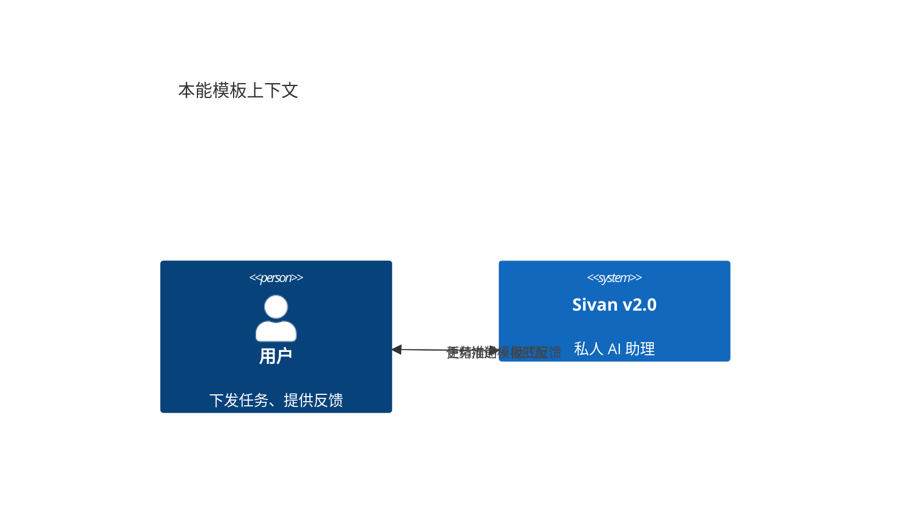
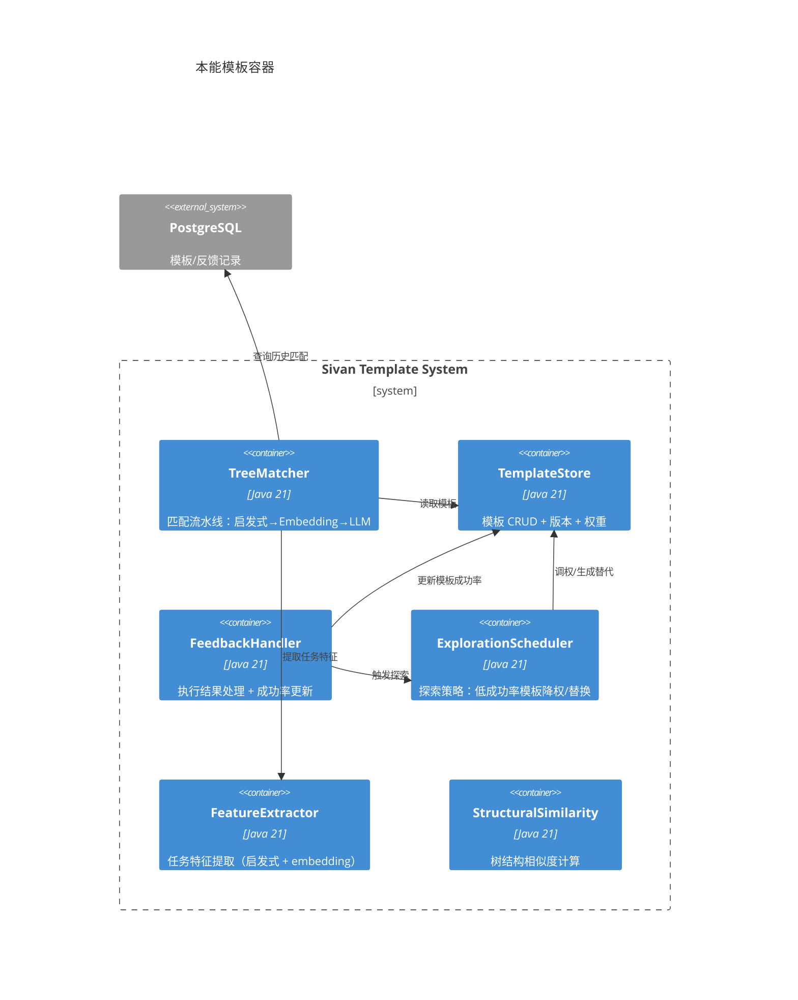
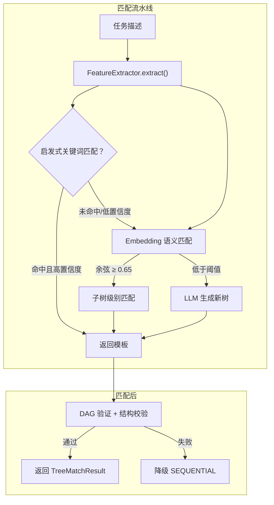
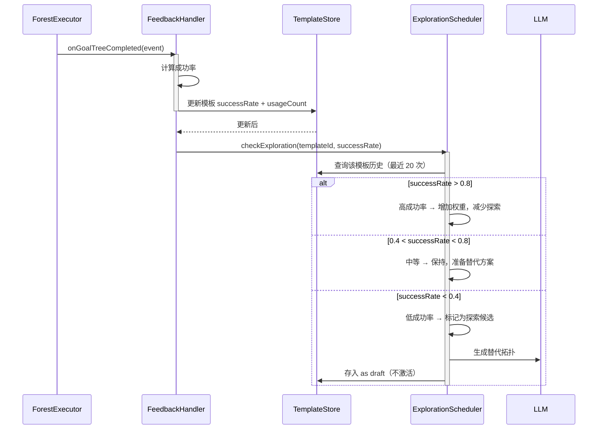
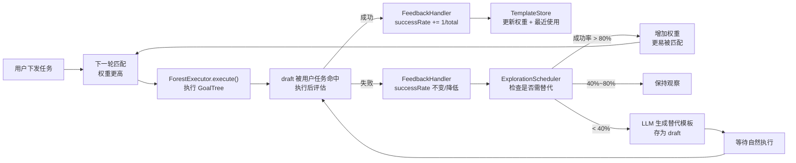
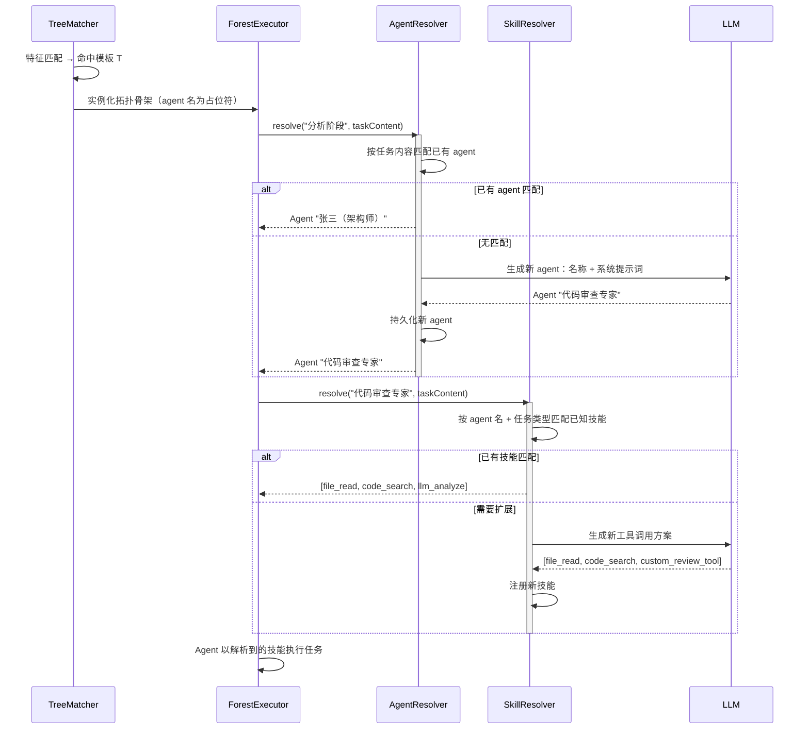

# 本能模板与正向反馈

> 日期：2026-06-05
> 状态：设计草案

---

v2.0 的本能模板与 v1.0 有本质区别：

```
v1.0（错误）：
  "帮我把登录模块重构了" → LLM 生成拓扑 → 模板存的是"重构登录模块"
  "帮我把支付模块重构了" → 不匹配 → 重新调 LLM

v2.0（正确）：
  "帮我把登录模块重构了" → 特征提取 → 匹配模板 { type:refactor, scope:module }
  "帮我把支付模块重构了" → 同样特征 → 复用同一模板
                              ↓
        执行时根据具体任务动态加载/生成 agent 技能
```

**本能模板的定位**：它是**一类问题的执行路径蓝图**，不是某次具体任务的执行记录。模板存储的是：

- 任务的特征向量（`taskType: refactor, scope: module`）
- 拓扑骨架（阶段划分 + mode 组合，agent 名是占位符）
- **不存储任何具体任务描述**、agent 名称、任务内容

**执行时动态绑定**：模板匹配命中后，在执行阶段根据当前任务的具体内容：
- 匹配已有 agent 或自动创建
- 动态加载/生成适用的技能
- 注入具体任务上下文

---

## 1. L1 — Context



**核心问题**：

| 问题 | 现状（v1.0） | 目标（v2.0） |
|---|---|---|
| 模板匹配粒度粗 | 只匹配整个 Squad 描述 embedding | 任意子树匹配（树的任意层级） |
| 反馈回路不闭环 | 执行结果只记录，不用于优化模板 | 执行成功率 → 模板权重调整 → 更优匹配 |
| 探索 vs 利用 | 无策略，全量匹配 | 成功率驱动：高成功率模板优先，低成功率模板探索替代 |
| 模板来源单一 | 仅本能模板 + LLM 生成 | 本能模板 + 历史成功树 + LLM 生成 + 手动创建 |

---

## 2. L2 — Container



---

## 3. L3 — Component

### 3.1 匹配流水线



### 3.2 正向反馈闭环



---

## 4. L4 — Code

### 4.1 核心实体

```java
/**
 * 本能模板——一条可复用的执行树结构。
 * 每个模板对应一棵 InnerGoalNode 树（任意深度）。
 */
/**
 * 本能模板——一类任务的执行路径蓝图。
 *
 * 不存储任何具体任务内容。模板只描述"这类问题怎么解"的拓扑骨架，
 * 不关心具体是"重构登录"还是"重构支付"。
 *
 * 执行时根据当前任务的实际内容动态绑定 agent 和技能。
 */
class InstinctPattern {
    final UUID patternId;
    final UUID accountId;

    /** 任务特征：{ taskType, scope, techStack, complexity, ... } */
    final TaskFeatureVector features;

    /** 模板的拓扑骨架（占位符化的 InnerGoalNode 树）。 */
    final String topologyJson;

    /** 统计信息。 */
    int usageCount;
    double successRate;
    double avgDurationMs;
    double weight;

    boolean active;
    boolean draft;

    LocalDateTime createdAt;
    LocalDateTime lastUsedAt;
}

/**
 * 任务特征向量——本能模板匹配的核心依据。
 * 由 FeatureExtractor 从任务描述中提取，不包含原始文本。
 */
record TaskFeatureVector(
    String taskType,        // "refactor" / "coding" / "review" / "analysis" / ...
    String scope,           // "module" / "project" / "single_file" / ...
    String techStack,       // "java" / "python" / "frontend" / ...
    String complexity,      // "simple" / "moderate" / "complex"
    Set<String> tags        // 额外标签：["security", "performance", "migration", ...]
) {
    /** 特征向量的相似度计算。 */
    double cosineSimilarity(TaskFeatureVector other) {
        // 各项特征的加权余弦相似度
        // taskType 权重 0.4, scope 权重 0.3, techStack 权重 0.2, complexity 权重 0.1
    }
}

/**
 * 树结构相似度：比较两棵 InnerGoalNode 树的语义匹配程度。
 */
class StructuralSimilarity {

    /** 计算两棵树的相似度 [0, 1]。考虑节点数、mode、depth 的加权。 */
    static double compute(List<PhaseNode> template, List<PhaseNode> actual) {
        if (template.isEmpty() && actual.isEmpty()) return 1.0;
        if (template.isEmpty() || actual.isEmpty()) return 0.0;

        double depthScore = scoreDepth(template, actual);
        double modeScore = scoreMode(template, actual);
        double sizeScore = scoreSize(template, actual);

        return 0.4 * depthScore + 0.3 * modeScore + 0.3 * sizeScore;
    }

    private static double scoreDepth(List<PhaseNode> a, List<PhaseNode> b) {
        return 1.0 - (double) Math.abs(avgDepth(a) - avgDepth(b)) / Math.max(avgDepth(a), avgDepth(b));
    }

    private static double scoreMode(List<PhaseNode> a, List<PhaseNode> b) {
        long same = 0;
        int min = Math.min(a.size(), b.size());
        for (int i = 0; i < min; i++) {
            if (a.get(i).getMode() == b.get(i).getMode()) same++;
        }
        return (double) same / Math.max(a.size(), b.size());
    }

    private static double scoreSize(List<PhaseNode> a, List<PhaseNode> b) {
        return 1.0 - (double) Math.abs(a.size() - b.size()) / Math.max(a.size(), b.size());
    }
}
```

### 4.2 TreeMatcher（增强版）

```java
@Component
class TreeMatcher {

    private final TemplateStore store;
    private final FeatureExtractor extractor;
    private final EmbeddingService embedding;
    private final ModelRouter router;

    /**
     * 匹配流水线：
     *   1. 启发式匹配（关键词 → 快速筛选）
     *   2. Embedding 语义匹配 + 子树匹配
     *   3. LLM 生成（本次任务入新模板库）
     */
    Mono<TreeMatchResult> match(String taskDescription, UUID accountId) {

        // 1. 启发式匹配
        List<String> heuristic = extractor.extractHeuristic(taskDescription);
        List<InstinctPattern> candidates = store.findByHeuristics(accountId, heuristic);

        if (!candidates.isEmpty()) {
            // 按 weight × successRate 排序，取最优
            InstinctPattern best = candidates.stream()
                .filter(p -> p.active && !p.draft)
                .max(Comparator.comparingDouble(p -> p.weight * p.successRate))
                .orElse(null);
            if (best != null && best.weight * best.successRate > 0.5) {
                return Mono.just(TreeMatchResult.fromPattern(best));
            }
        }

        // 2. Embedding 语义匹配
        float[] taskVec = embedding.embed(taskDescription);
        List<InstinctPattern> patterns = store.findAllActive(accountId);

        return Flux.fromIterable(patterns)
            .flatMap(pattern -> Mono.fromCallable(() -> {
                float sim = CosineSimilarity.compute(taskVec, pattern.embedding);
                return new Scored(pattern, sim);
            }))
            .filter(scored -> scored.similarity >= 0.65)
            .sort(Comparator.<Scored>comparingDouble(s -> s.similarity).reversed())
            .next()
            .flatMap(scored -> {
                // 子树匹配：支持返回模板中的某个子树
                return extractSubtree(scored.pattern, taskDescription);
            })
            .switchIfEmpty(Mono.defer(() -> {
                // 3. LLM 生成 → 存入 draft
                return generateTree(taskDescription, accountId);
            }));
    }

    /** 子树提取：匹配模板中与任务最匹配的子树。 */
    private Mono<TreeMatchResult> extractSubtree(InstinctPattern pattern, String task) {
        GoalNode root = deserialize(pattern.topologyJson);
        // 对根节点下的每个子树做 embedding 匹配
        GoalNode best = root.children().stream()
            .max(Comparator.comparingDouble(child -> {
                String desc = child.description();
                float[] childVec = embedding.embed(desc);
                return CosineSimilarity.compute(embedding.embed(task), childVec);
            }))
            .orElse(root);
        return Mono.just(TreeMatchResult.builder()
            .template(pattern)
            .subtreeNodeId(best.nodeId())
            .similarity(0.8)
            .source(MatchSource.EMBEDDING)
            .build());
    }

    private record Scored(InstinctPattern pattern, double similarity) {}
}
```

### 4.3 FeedbackHandler

```java
@Component
class FeedbackHandler {

    private final TemplateStore store;
    private final ExplorationScheduler explorer;

    /** 由 GoalTreeCompleted 领域事件触发。 */
    @EventListener
    void onGoalTreeCompleted(GoalTreeCompleted event) {
        if (event.templateId() == null) return; // 非模板创建的 GoalTree

        store.findById(UUID.fromString(event.templateId()))
            .ifPresent(pattern -> {
                // 更新成功率（滑动窗口：最近 20 次）
                pattern.usageCount++;
                pattern.successRate = recalcSuccessRate(pattern, event.success());
                pattern.lastUsedAt = LocalDateTime.now();
                store.save(pattern);

                // 触发探索检查
                explorer.checkExploration(pattern);
            });
    }

    private double recalcSuccessRate(InstinctPattern pattern, boolean latestSuccess) {
        double total = pattern.usageCount;
        double currentRate = pattern.successRate * (total - 1) / total;
        return currentRate + (latestSuccess ? 1.0 / total : 0);
    }
}
```

### 4.4 ExplorationScheduler

```java
@Component
class ExplorationScheduler {

    private final TemplateStore store;
    private final ModelRouter router;

    /** 根据成功率决定探索策略。 */
    void checkExploration(InstinctPattern pattern) {
        if (pattern.usageCount < 3) return; // 样本不足，不判定

        if (pattern.successRate < 0.4) {
            log.warn("模板成功率过低: patternId={}, rate={}，生成替代", pattern.patternId, pattern.successRate);
            generateAlternative(pattern);
        }

        if (pattern.draft && pattern.successRate > 0.7 && pattern.usageCount > 5) {
            pattern.active = true;
            pattern.draft = false;
            store.save(pattern);
            log.info("draft 模板激活: patternId={}", pattern.patternId);
        }
    }

    /** A/B 测试（G6）：按流量比例分配 draft 和 baseline，自动化较成功率。 */
    void startABTest(InstinctPattern baseline, InstinctPattern draft, double draftTraffic) {
        // draftTraffic: 0.1 = 10% 用户走 draft, 90% 走 baseline
        if (ThreadLocalRandom.current().nextDouble() < draftTraffic) {
            draft.weight = 10.0;  // 临时提高 draft 权重使其被匹配
            store.save(draft);
        }
        // 30 次执行后自动对比
        scheduleComparison(baseline, draft, 30);
    }

    private void scheduleComparison(InstinctPattern a, InstinctPattern b, int afterExecutions) {
        // 在 afterExecutions 次执行后比较两者的 successRate
        // 如果 b 显著优于 a → 激活 b，归档 a
        // 如果 b 无显著差异 → 保留 a，归档 b
    }

    private void generateAlternative(InstinctPattern lowPerformer) {
        // LLM 基于原模板生成一个替代拓扑
        String prompt = "该模板执行任务成功率偏低 (" + lowPerformer.successRate + ")。"
            + "请提供一个替代的执行方案，保持任务目标不变，但调整阶段划分或模式。";

        router.defaultModel().complete(List.of(
            Msg.of(Role.USER, prompt)
        )).subscribe(response -> {
            InstinctPattern draft = InstinctPattern.builder()
                .name(lowPerformer.name + " (v2)")
                .description(lowPerformer.description)
                .topologyJson(parseJson(response.text()))
                .active(false)
                .draft(true)
                .weight(lowPerformer.weight * 0.5) // 新模板初始权重较低
                .build();
            store.save(draft);
        });
    }
}
```

### 4.5 FeatureExtractor

```java
/**
 * 特征提取器——从任务描述中提取结构化的特征向量。
 * 这是本能模板匹配的入口：任务描述 → 特征向量 → 匹配模板。
 *
 * 提取的特征不包含原始文本，只包含结构化类型信息。
 * 这是本能模板可复用的关键——"重构登录"和"重构支付"提取出同一组特征。
 */
@Component
class FeatureExtractor {

    /** 从任务描述中提取特征向量，不保留原始文本。 */
    TaskFeatureVector extract(String task) {
        String taskType = detectTaskType(task);
        String scope = detectScope(task);
        String techStack = detectTechStack(task);
        String complexity = detectComplexity(task);
        Set<String> tags = extractTags(task);

        return new TaskFeatureVector(taskType, scope, techStack, complexity, tags);
    }

    private String detectTaskType(String task) {
        if (task.contains("重构") || task.contains("优化")) return "refactor";
        if (task.contains("实现") || task.contains("开发") || task.contains("编码")) return "coding";
        if (task.contains("测试")) return "testing";
        if (task.contains("审查") || task.contains("审计")) return "review";
        if (task.contains("分析") || task.contains("总结")) return "analysis";
        if (task.contains("翻译")) return "translation";
        if (task.contains("写") || task.contains("撰写") || task.contains("生成")) return "writing";
        return "general";
    }

    private String detectScope(String task) {
        if (task.contains("项目") || task.contains("系统")) return "project";
        if (task.contains("模块") || task.contains("功能")) return "module";
        if (task.contains("文件") || task.contains("代码")) return "single_file";
        return "unknown";
    }

    private String detectTechStack(String task) {
        if (task.contains("java")) return "java";
        if (task.contains("python")) return "python";
        if (task.contains("vue") || task.contains("react") || task.contains("前端")) return "frontend";
        return "general";
    }

    private String detectComplexity(String task) {
        if (task.contains("简单") || task.contains("小")) return "simple";
        if (task.contains("复杂") || task.contains("大型") || task.contains("大规模")) return "complex";
        return "moderate";
    }

    private Set<String> extractTags(String task) {
        Set<String> tags = new HashSet<>();
        if (task.contains("安全")) tags.add("security");
        if (task.contains("性能")) tags.add("performance");
        if (task.contains("迁移") || task.contains("升级")) tags.add("migration");
        if (task.contains("API") || task.contains("接口")) tags.add("api");
        if (task.contains("数据库") || task.contains("db")) tags.add("database");
        return tags;
    }
}
```

---

## 5. 正向反馈数据流（完整闭环）



---

## 6. 执行时动态技能绑定

本能模板只提供拓扑骨架（阶段划分 + mode），不包含具体 agent 和技能。执行阶段根据当前任务的具体内容动态解析：



```java
/**
 * Agent 解析器——根据任务内容动态加载或生成 agent。
 */
@Component
class AgentResolver {

    private final AgentRepository agentRepo;
    private final ModelRouter router;

    /**
     * 为拓扑骨架中的一个占位角色动态绑定实际 agent。
     *
     * @param roleName  拓扑中的占位角色名（如 "架构师"、"开发者"）
     * @param taskContent 当前任务的具体内容（如 "重构登录模块"）
     * @return 绑定的 agent 名称
     */
    String resolve(String roleName, String taskContent) {
        // 1. 按任务内容 + 角色名匹配已有 agent
        List<AgentDefinition> candidates = agentRepo.findByAccount(task.getAccountId());

        AgentDefinition best = candidates.stream()
            .filter(a -> a.matchesTask(taskContent))
            .max(Comparator.comparingDouble(AgentDefinition::getMatchScore))
            .orElse(null);

        if (best != null) return best.getAgentName();

        // 2. 无匹配 → LLM 生成新 agent
        ChatResult response = router.defaultModel().complete(List.of(
            Msg.of(Role.SYSTEM, "你是一个 agent 设计师。根据任务描述创建合适的 agent。返回 JSON。"),
            Msg.of(Role.USER, "角色：" + roleName + "\n任务：" + taskContent)
        )).block();

        AgentDefinition newAgent = parseAgentFrom(response.text());
        agentRepo.save(newAgent);
        return newAgent.getAgentName();
    }
}

/**
 * 技能解析器——根据任务内容动态绑定工具技能。
 */
@Component
class SkillResolver {

    private final ToolRegistry toolRegistry;
    private final ModelRouter router;

    List<ToolSpec> resolve(String agentName, String taskContent) {
        // 1. 查询该 agent 已有的技能绑定
        List<String> knownSkills = skillRepo.findByAgentName(agentName);

        // 2. 按任务内容评估是否需要扩展
        if (knownSkills.isEmpty() || needsExtension(taskContent, knownSkills)) {
            // LLM 推荐额外工具
            List<ToolSpec> recommended = router.defaultModel().complete(...)
                .map(response -> parseToolList(response.text()))
                .block();

            // 注册新技能
            for (ToolSpec tool : recommended) {
                skillRepo.bind(agentName, tool.name());
            }
            return recommended;
        }

        return toolRegistry.listAvailable().stream()
            .filter(t -> knownSkills.contains(t.name()))
            .toList();
    }
}
```

**与本能模板的关系**：

```
本能模板：{ taskType: refactor, scope: module } → 拓扑骨架
                    ↓
              执行时动态绑定
                    ↓
AgentResolver:  占位角色 "架构师" → 匹配已有 agent / LLM 生成
SkillResolver:  占位工具 "代码分析" → 匹配已有技能 / LLM 生成
                    ↓
              最终 GoalTree：具体 agent + 具体技能 + 具体任务内容
```

这样，同一个本能模板可以适配"重构登录模块"和"重构支付模块"两种不同的具体任务——关键在于特征匹配命中模板，执行时动态解析具体实现。


## 7. Agent 与 Skill 管理

本能模板的拓扑骨架只包含占位角色，执行时需要具体的 Agent 和 Skill 填充。Agent 和 Skill 的管理是 v1.0 已有能力，v2.0 中作为模板系统的配套子系统保留。

### 7.1 AgentDefinition — 智能体定义

```java
/**
 * 智能体定义 — 一个可复用的 AI 角色。
 * 保存名称、系统提示词、匹配标签，执行时动态绑定技能。
 */
class AgentDefinition {
    UUID agentId;
    UUID accountId;

    /** 智能体名称（唯一，用户可读）。如 "张三（架构师）"。 */
    String name;

    /** 系统提示词 — Agent 执行时的行为指导。 */
    String systemPrompt;

    /** 能力标签 — 用于匹配任务。如 ["java", "架构设计", "security"]。 */
    List<String> tags;

    /** 匹配评分缓存（由 ProfileLearner 定期更新）。 */
    double matchScore;

    LocalDateTime createdAt;
    LocalDateTime updatedAt;
    boolean active;
}
```

**管理 API**：

| 端点 | 说明 |
|------|------|
| `POST /api/v2/agents` | 创建智能体 |
| `GET /api/v2/agents` | 列出智能体 |
| `GET /api/v2/agents/{id}` | 查看详情 |
| `PUT /api/v2/agents/{id}` | 更新名称/提示词/标签 |
| `DELETE /api/v2/agents/{id}` | 删除智能体 |
| `POST /api/v2/agents/{id}/skills` | 绑定技能 |
| `GET /api/v2/agents/{id}/skills` | 查看已绑定的技能 |

### 7.2 Skill — 技能定义

```java
/**
 * 技能 — 绑定到 Agent 的工具调用能力。
 * 一个技能对应一个或多个工具调用模板。
 */
class Skill {
    UUID skillId;
    UUID accountId;

    /** 技能名称。如 "代码审查"、"单元测试"。 */
    String name;

    /** 技能描述 — 用于匹配任务。 */
    String description;

    /** 绑定的工具列表（可包含工具调用参数模板）。 */
    List<SkillToolBinding> tools;

    /** 技能标签。 */
    List<String> tags;

    boolean active;
    LocalDateTime createdAt;
}

/**
 * 技能工具绑定 — 一个工具及其默认参数。
 */
record SkillToolBinding(
    String toolName,
    Map<String, Object> defaultArgs  // 可选默认参数
) {}
```

**管理 API**：

| 端点 | 说明 |
|------|------|
| `POST /api/v2/skills` | 创建技能 |
| `GET /api/v2/skills` | 列出技能 |
| `PUT /api/v2/skills/{id}` | 更新技能 |
| `DELETE /api/v2/skills/{id}` | 删除技能 |

### 7.3 Agent 与 Skill 的匹配

执行时 `AgentResolver` 按以下流程匹配：

```java
@Component
class AgentResolver {

    private final AgentRepository agentRepo;
    private final SkillRepository skillRepo;
    private final ProfileLearner profileLearner;

    /**
     * 为拓扑骨架中的占位角色匹配最佳 Agent。
     *
     * 匹配策略：
     *   1. 按任务特征向量 × Agent 标签余弦相似度排序
     *   2. 取 top-3，按 matchScore × 历史成功率排序
     *   3. 无匹配时 LLM 生成新 Agent
     */
    String resolve(String roleName, String taskContent, UUID accountId) {
        // 1. 获取当前账户所有活跃 Agent
        List<AgentDefinition> agents = agentRepo.findByAccountAndActiveTrue(accountId);

        // 2. 按任务内容的 embedding 与 Agent 标签做余弦匹配
        float[] taskVec = embedding.embed(taskContent);
        List<ScoredAgent> scored = agents.stream()
            .map(agent -> {
                float[] tagVec = embedding.embed(String.join(" ", agent.getTags()));
                double sim = CosineSimilarity.compute(taskVec, tagVec);
                return new ScoredAgent(agent, sim);
            })
            .filter(s -> s.similarity >= 0.65)  // 沿用 v1.0 阈值
            .sorted(Comparator.<ScoredAgent>comparingDouble(s -> s.similarity).reversed())
            .toList();

        if (!scored.isEmpty()) {
            return scored.get(0).agent.getName();
        }

        // 3. 无匹配 → LLM 生成新 Agent（自动持久化）
        return generateAndSaveAgent(roleName, taskContent, accountId);
    }

    /** 获取 Agent 绑定的技能工具列表。 */
    List<ToolSpec> resolveSkills(String agentName, UUID accountId) {
        List<String> skillNames = skillRepo.findByAgentName(agentName);
        return toolRegistry.listAvailable(accountId).stream()
            .filter(t -> skillNames.contains(t.name()))
            .toList();
    }

    private record ScoredAgent(AgentDefinition agent, double similarity) {}
}
```

### 7.4 模板执行时的完整绑定流程

```
本能模板命中 → 实例化拓扑骨架
    ↓
AgentResolver.resolve("架构师", taskContent)
    ↓ 匹配已有 Agent / LLM 生成新 Agent
Agent "张三（架构师）" 绑定到 TaskNode.agentName
    ↓
SkillResolver.resolve("张三（架构师）", taskContent)
    ↓ 查询 Agent-Skill 绑定 / 扩展
[file_read, code_search, llm_analyze] 注入到 Agent 的 ToolProvider
    ↓
AgentLeafExecutor.execute()
    ↓ ReAct 循环中使用绑定的工具执行任务
```

### 7.5 与本能模板的协作

| 场景 | 模板匹配 | Agent/Skill 解析 |
|------|---------|-----------------|
| 同一任务重复执行 | 高权重模板命中 | 复用上次的 Agent 和 Skill |
| 类似任务不同领域 | 同一模板（任务类型相同） | 生成不同 Agent（领域标签不同） |
| 新用户无历史 | 预置模板匹配 | AgentResolver 自动生成新 Agent |
| Agent 失效/删除 | 模板不变 | 执行时重新匹配/生成 |

Agent 和 Skill 的 CRUD 由前端管理页面提供（属于领域 15-前端交互升级），后端仅提供 REST API 和匹配逻辑。

---

## 8. 新用户预置模板

新用户无执行历史，反馈闭环空跑。预置通用模板让新用户从第一次起就体验模板匹配。

| 模板 | 特征 | 场景 |
|---|---|---|
| 代码审查 | `{taskType:review}` | 审查 PR |
| 周报生成 | `{taskType:writing}` | 写周报 |
| 智能家居 | `{taskType:automation}` | 设备控制 |
| 文本总结 | `{taskType:analysis}` | 总结对话 |

## 7. 设计检查清单

- [ ] 新增一种匹配策略需要改几个文件？→ 1 个（实现 `TemplateMatcher`）
- [ ] 模板成功率是否使用滑动窗口而非累计平均？→ 是，最近 20 次
- [ ] 探索策略是否可插拔？→ 是，`ExplorationScheduler` 可替换
- [ ] 低成功率模板自动降权是否会影响用户？→ 不直接删除，降权 + 生成替代
- [ ] 子树匹配是否可独立于全模板匹配工作？→ 是，`extractSubtree()` 独立
- [ ] 反馈数据是否闭环（执行结果→模板优化→更好匹配）？→ 是

## 8. 模板共享与网络效应

### 8.1 共享模型

默认「严格账户隔离」，叠加 **Opt-in 共享池**——用户主动选择共享模板后才对外可见。共享的是模板的拓扑结构和特征向量，**不共享原始任务描述**。

```
┌─────────────────────────────────────────┐
│           shared_templates               │
│  (owner_account_id, visibility, data)    │ ← 任何人可发现（匿名）
├─────────────────────────────────────────┤
│         instinct_patterns                │
│  visibility = PUBLIC    → 提升匹配优先级  │
│  visibility = PRIVATE   → 仅自己可见      │
└─────────────────────────────────────────┘
```

### 8.2 数据表

```sql
CREATE TABLE shared_templates (
    template_id      UUID PRIMARY KEY,
    source_pattern_id UUID NOT NULL REFERENCES instinct_patterns(pattern_id),
    owner_account_id UUID NOT NULL,

    -- 共享数据（脱敏）
    feature_vector   JSONB NOT NULL,         -- 特征向量（无原始文本）
    topology_json    JSONB,                  -- 拓扑结构（agent 名可选泛化）
    execution_mode   VARCHAR(32) NOT NULL,

    -- 可见性
    visibility       VARCHAR(16) NOT NULL DEFAULT 'PUBLIC',
        -- PUBLIC: 所有人可见 | TENANT: 同租户可见 | LIST: 指定白名单
    allowed_accounts UUID[],

    -- 统计
    use_count        INTEGER DEFAULT 0,
    success_count    INTEGER DEFAULT 0,

    source_version   INTEGER DEFAULT 1,
    created_at       TIMESTAMP NOT NULL DEFAULT NOW(),
    updated_at       TIMESTAMP NOT NULL DEFAULT NOW()
);

CREATE INDEX idx_shared_features ON shared_templates USING gin (feature_vector);
```

### 8.3 匹配流程（含共享池）

```
TaskFeatures
   │
   ├── ① 自有模板匹配（instinct_patterns WHERE account_id = ?）
   │      └── 命中 → 执行
   │
   └── ② 自有未命中 → 共享池匹配（shared_templates）
          │
          ├── visibility = PUBLIC：全部可查
          ├── visibility = TENANT：同租户可查（预留）
          └── visibility = LIST：白名单匹配

          └── 命中 → 本地创建副本 → 执行
               └── 未命中 → LLM 生成
```

共享模板命中后，在本地账户创建一份副本（`instinct_patterns` 的新行，关联 `source_pattern_id`）。此后该账户的模板演进独立于共享源。

### 8.4 模板分叉与同步

共享模板被实例化时执行深拷贝到本地账户。此后原始模板的改进（成功率更新、拓扑优化）不会同步到副本，形成模板分叉。

**设计决策**：v2.0 接受模板分叉，暂不实现自动同步。理由：
1. 用户对本地副本的定制（参数调整、子任务增删）可能与原始模板产生冲突，自动同步可能覆盖用户的个性化修改。
2. 模板共享池的排序算法（usageCount × successRate）会自然将高成功率模板推向前，用户可以看到原始模板的改进趋势。
3. 如果将来需要同步，可在 `shared_templates` 表增加 `version` 字段，本地副本定期检查版本号并提示用户"模板有更新，是否同步"。

**后续优化方向**：Phase 3 评估「增量同步」需求——仅同步拓扑结构和默认参数，跳过用户自定义的覆盖参数。

### 8.5 安全措施

| 风险 | 应对 |
|---|---|
| 模板泄漏原始任务 | 共享前自动扫描 topologyJson 是否含文本残留；agent 名可泛化为通用名 |
| 恶意模板注入 | 共享模板不直接执行，仅作拓扑参考；LLM 可二次验证；低质量模板自然淘汰 |
| 隐私逆向推理 | 不存 `task_description`，特征向量不可逆推原始输入 |
| 删除账户牵连 | 账户删除时共享模板标记 ORPHANED 保留 30 天 |

### 8.6 作为增长引擎

| 层级 | 能力 | 增长引擎 |
|---|---|---|
| 免费 | 严格隔离，自有模板 | — |
| Pro | 可使用共享池模板 | 共享池越丰富，Pro 越值 |
| 团队 | 可创建团队共享模板 | 邀请更多人 = 团队模板更丰富 |
| 企业 | 私有共享池 + 管理策略 | 数据不出租户，合规升级 |

### 8.7 
## 5. 模板匹配感知

用户在对话中应当感知到本能模板的匹配过程。

### 5.1 匹配信息嵌入 SSE

GoalTree 执行的第一条事件携带模板匹配信息：

```json
{
  "type": "step_start",
  "step": "match_template",
  "message": "已匹配模板「模块重构（v3）」- 成功率 96%（42/44）"
}
```

### 5.2 执行完成展示

完成后摘要中带上模板效果：

```
✅ 登录模块重构完成（3/3 任务）
   使用模板：模块重构（v3）— 共使用 43 次，成功率 95%
   [⭐ 收藏] [📊 查看所有模板]
```

### 5.3 匹配原因（高级）

高级用户可展开匹配详情：

```
🔄 已匹配模板「模块重构（v3）」
   匹配依据：
     · 任务类型：重构 ✅
     · 技术栈：Java ✅
     · 团队规模：1-2 人 ✅
```

---

设计检查清单

- [ ] 共享是否默认关闭？→ 是，用户主动选择
- [ ] 共享是否脱敏（无原始任务描述）？→ 是
- [ ] 共享模板是否创建本地副本而非引用执行？→ 是
- [ ] 是否有可见性控制（PUBLIC/TENANT/LIST）？→ 是
- [ ] 是否有定价层级的增长引擎映射？→ 是
