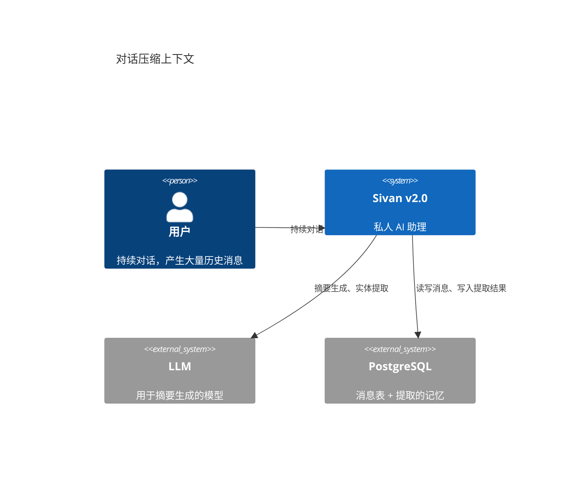
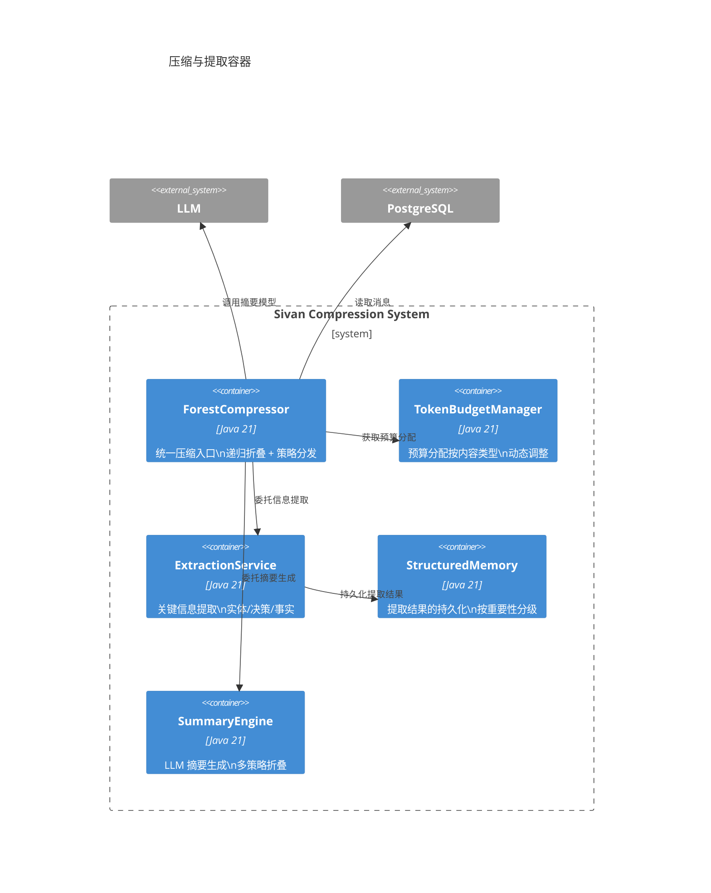
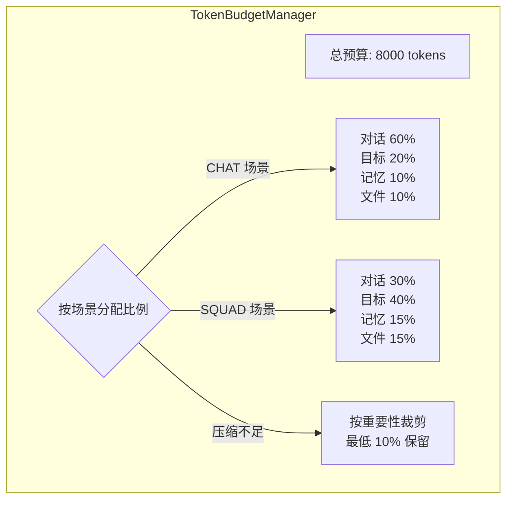
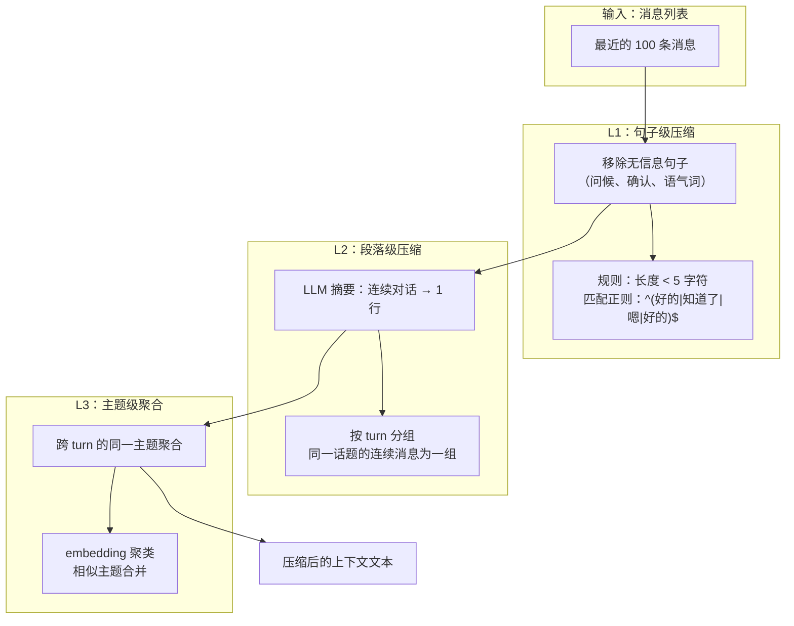
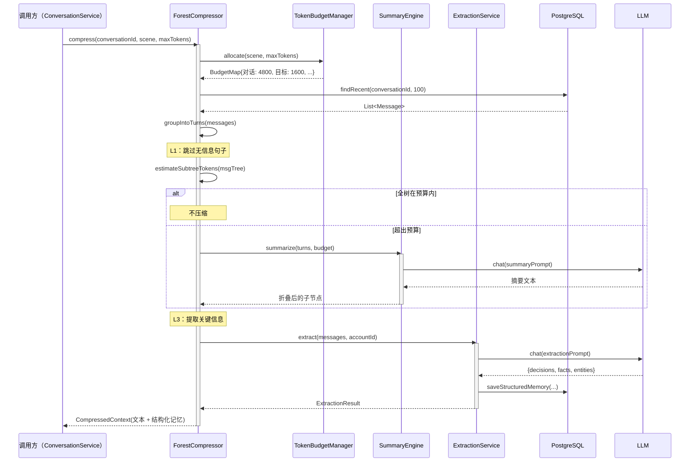

# 对话历史智能压缩与提取

> 日期：2026-06-05
> 状态：设计草案

---

## 1. L1 — Context



**核心问题**：

| 问题 | 现状（v1.0） | 目标（v2.0） |
|---|---|---|
| 压缩策略单一 | `HistoryCompressor` 只做简单的 token 截断 | 多层级压缩：句子折叠 → 段落摘要 → 主题聚合 |
| 提取不自知 | 无结构化信息提取，所有历史"一刀切" | 提取实体、决策、关键事实，结构化存储 |
| 预算分配固化 | 对话历史固定占比 70%，无优先级 | 按重要性动态分配：高价值内容多留，低价值优先裁剪 |
| 压缩不可逆 | 压缩后原始消息丢失 | 消息原文始终在 `messages` 表，压缩只影响注入的上下文 |

---

## 2. L2 — Container



---

## 3. L3 — Component

### 3.1 压缩预算分配



### 3.2 消息压缩层级



### 3.3 压缩流程时序



---

## 4. L4 — Code

### 4.1 预算分配策略

```java
/**
 * Token 预算分配策略——按场景和内容类型分配。
 * 实现 Strategy 模式，可扩展新场景。
 */
interface BudgetAllocationStrategy {
    /** 返回 {类型 → token 预算} 映射。 */
    Map<String, Integer> allocate(int totalBudget);

    /** 适用的场景。 */
    String scene();
}

@Component
class ChatBudgetStrategy implements BudgetAllocationStrategy {
    @Override public String scene() { return "CHAT"; }

    @Override
    public Map<String, Integer> allocate(int total) {
        return Map.of(
            "conversation", (int) (total * 0.60),
            "goal",         (int) (total * 0.20),
            "memory",       (int) (total * 0.10),
            "file",         (int) (total * 0.10)
        );
    }
}

@Component
class SquadBudgetStrategy implements BudgetAllocationStrategy {
    @Override public String scene() { return "SQUAD"; }

    @Override
    public Map<String, Integer> allocate(int total) {
        return Map.of(
            "conversation", (int) (total * 0.30),
            "goal",         (int) (total * 0.40),
            "memory",       (int) (total * 0.15),
            "file",         (int) (total * 0.15)
        );
    }
}
```

### 4.2 消息重要性评分

```java
/**
 * 消息重要性评估——决定哪些消息优先保留、哪些可以被压缩。
 */
class MessageImportanceScorer {

    /**
     * 给单条消息打分 [0, 1]。
     * 1 = 必须保留（关键决策）；0 = 可完全丢弃（问候）。
     */
    double score(Message msg) {
        double score = 0.3; // 基础分

        // 角色权重
        if (msg.role().equals("user")) score += 0.1;
        if (msg.role().equals("assistant") && msg.toolCalls() != null) score += 0.1;

        // 包含关键信息
        if (containsDecision(msg.content())) score += 0.3;
        if (containsCode(msg.content())) score += 0.2;
        if (containsUrl(msg.content())) score += 0.1;

        // 长度权重（太短的消息信息量少）
        if (msg.content().length() < 10) score -= 0.2;

        // 时间衰减（越近的消息越重要）
        double hoursAge = ChronoUnit.HOURS.between(msg.createdAt(), LocalDateTime.now());
        score *= Math.max(0.1, 1.0 - hoursAge / 720); // 30 天衰减到 10%

        return Math.max(0, Math.min(1, score));
    }

    private boolean containsDecision(String text) {
        return text.contains("决定") || text.contains("选择") || text.contains("采用");
    }

    private boolean containsCode(String text) {
        return text.contains("```") || text.contains("public ") || text.contains("function");
    }

    private boolean containsUrl(String text) {
        return text.contains("http://") || text.contains("https://");
    }
}
```

### 4.3 SummaryEngine

```java
/**
 * 摘要引擎——将一组消息缩减为摘要。
 * 不同层级使用不同的摘要策略。
 */
class SummaryEngine {

    private final ModelRouter router;

    /** L2 摘要：单个 turn 的摘要。 */
    String summarizeTurn(List<Message> turn) {
        String text = turn.stream().map(Message::content).collect(Collectors.joining("\n"));
        if (estimateTokens(text) < 50) return text; // 太短，不摘要

        return router.defaultModel()
            .complete(List.of(
                Msg.of(Role.SYSTEM, "你是一个对话摘要助手。将以下对话压缩为 1-2 句话，保留关键信息。"),
                Msg.of(Role.USER, text)
            ))
            .block()
            .text();
    }

    /** L3 摘要：同一主题的多轮对话的聚合摘要。 */
    String summarizeTopic(List<List<Message>> turns) {
        StringBuilder sb = new StringBuilder();
        for (var turn : turns) {
            sb.append(summarizeTurn(turn)).append("\n");
        }
        // 递归压缩
        String text = sb.toString();
        if (estimateTokens(text) > 500) {
            return summarizeTurn(List.of(Message.system(text)));
        }
        return text;
    }

    private int estimateTokens(String text) {
        return text.length() / 4; // 粗略估算
    }
}
```

### 4.4 ExtractionService

```java
/**
 * 信息提取服务——从对话中提取结构化信息。
 * 提取结果存入 StructuredMemory，下次压缩时可直接引用，
 * 不依赖原始消息的长文本。
 */
@Component
class ExtractionService {

    private final StructuredMemoryRepo repo;
    private final ModelRouter router;

    /** 从消息列表中提取关键信息。 */
    ExtractionResult extract(List<Message> messages, UUID accountId) {
        // 只提取全量的 1%（或最后 50 条），避免重复提取
        List<Message> sample = messages.size() > 50
            ? messages.subList(messages.size() - 50, messages.size())
            : messages;

        String text = sample.stream().map(Message::content).collect(Collectors.joining("\n"));

        ExtractionResult result = llmExtract(text);
        repo.saveAll(result.toMemoryRecords(accountId));
        return result;
    }

    private ExtractionResult llmExtract(String text) {
        String prompt = "从以下对话中提取：\n"
            + "1. 用户的关键决策（格式：- 决定: ...）\n"
            + "2. 事实性信息（格式：- 事实: ...）\n"
            + "3. 用户提到的技术栈/工具（格式：- 技术: ...）\n\n"
            + text;

        ChatResult response = router.defaultModel()
            .complete(List.of(Msg.of(Role.USER, prompt)))
            .block();

        return parseExtraction(response.text());
    }

    private ExtractionResult parseExtraction(String text) {
        ExtractionResult result = new ExtractionResult();
        for (String line : text.split("\n")) {
            if (line.startsWith("- 决定:")) result.decisions.add(line.replace("- 决定:", "").trim());
            if (line.startsWith("- 事实:")) result.facts.add(line.replace("- 事实:", "").trim());
            if (line.startsWith("- 技术:")) result.techs.add(line.replace("- 技术:", "").trim());
        }
        return result;
    }
}

record ExtractionResult(List<String> decisions, List<String> facts, List<String> techs) {
    ExtractionResult() { this(new ArrayList<>(), new ArrayList<>(), new ArrayList<>()); }

    List<StructuredMemory> toMemoryRecords(UUID accountId) {
        List<StructuredMemory> records = new ArrayList<>();
        for (String d : decisions) records.add(StructuredMemory.decision(accountId, d));
        for (String f : facts) records.add(StructuredMemory.fact(accountId, f));
        for (String t : techs) records.add(StructuredMemory.tech(accountId, t));
        return records;
    }
}
```

### 4.5 与 ForestCompressor 的集成

```java
@Component
class ForestCompressor {

    private final MessageImportanceScorer scorer;
    private final SummaryEngine summaryEngine;
    private final ExtractionService extractionService;
    private final TokenBudgetManager budgetManager;

    /**
     * 统一压缩入口。
     *
     * @return 包含压缩后文本 + 结构化记忆的上下文
     */
    CompressedContext compress(UUID conversationId, String scene, int maxTokens) {

        // 1. 分配预算
        Map<String, Integer> budget = budgetManager.allocate(scene, maxTokens);

        // 2. 加载消息
        List<Message> messages = messageRepo.findRecent(conversationId, 100);

        // 3. 按重要性排序
        List<ScoredMessage> scored = messages.stream()
            .map(m -> new ScoredMessage(m, scorer.score(m)))
            .sorted(Comparator.<ScoredMessage>comparingDouble(s -> s.score).reversed())
            .toList();

        // 4. 在预算内构建上下文
        StringBuilder ctx = new StringBuilder();
        int remaining = budget.get("conversation");

        // 高重要性消息直接保留原文
        for (ScoredMessage sm : scored) {
            if (sm.score > 0.7 && remaining > sm.estimateTokens()) {
                ctx.append(sm.content()).append("\n");
                remaining -= sm.estimateTokens();
            } else if (sm.score > 0.4) {
                // 中等重要性 → 摘要
                String summary = summaryEngine.summarizeTurn(List.of(sm.message()));
                if (remaining > estimateTokens(summary)) {
                    ctx.append(summary).append("\n");
                    remaining -= estimateTokens(summary);
                }
            }
            // 低重要性 → 丢弃
        }

        // 5. 提取结构化信息
        ExtractionResult extracted = extractionService.extract(messages, conversationId);

        return new CompressedContext(ctx.toString(), extracted);
    }

    private record ScoredMessage(Message message, double score) {
        int estimateTokens() { return message.content().length() / 4; }
    }
}

record CompressedContext(String text, ExtractionResult extracted) {}
```

---

## 5. 设计检查清单

- [ ] 新增一种压缩策略需要改几个文件？→ 1 个（实现 `CompressionStrategy`）
- [ ] 新增一种预算分配策略需要改几个文件？→ 1 个（实现 `BudgetAllocationStrategy`）
- [ ] 消息原文是否在压缩后仍然保留？→ 是，`messages` 表始终存原文
- [ ] 提取的结构化信息是否独立于原始消息存储？→ 是，存入 `StructuredMemory`
- [ ] 重要性评分是否可调？→ 是，`MessageImportanceScorer.score()` 独立
- [ ] 是否支持按场景分配不同比例？→ 是，`ChatBudgetStrategy` / `SquadBudgetStrategy`
