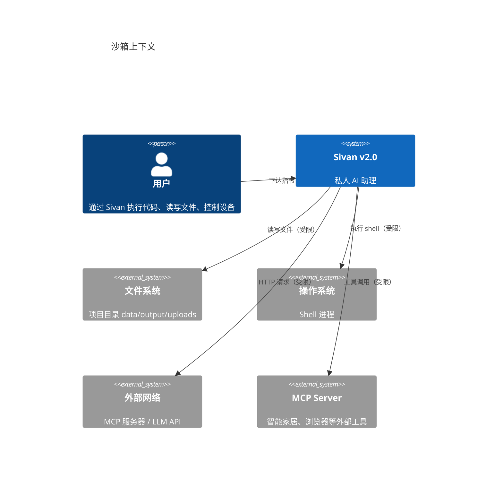
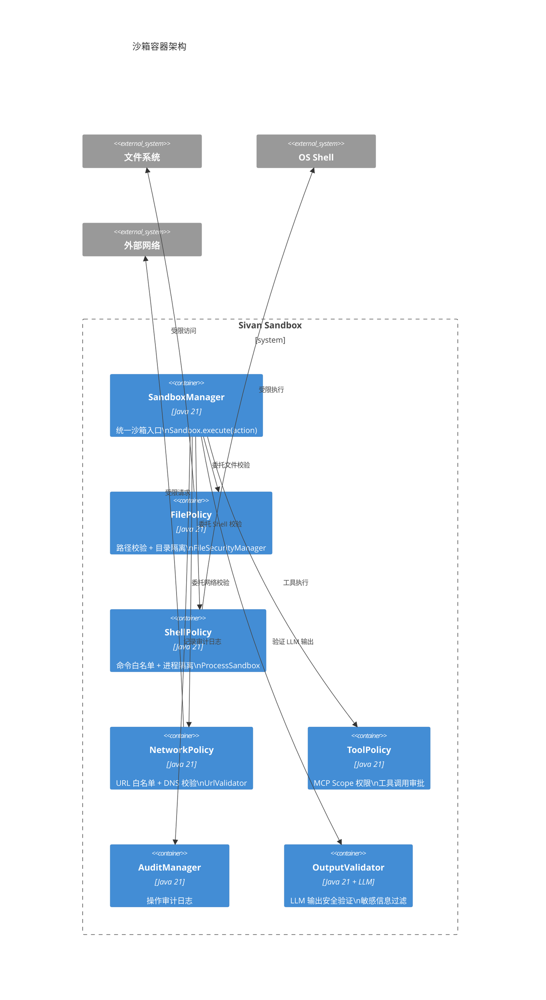
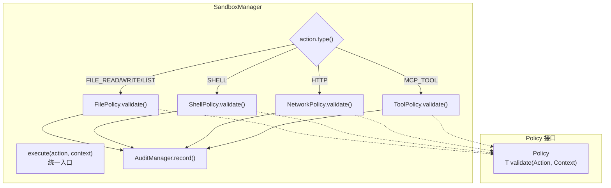
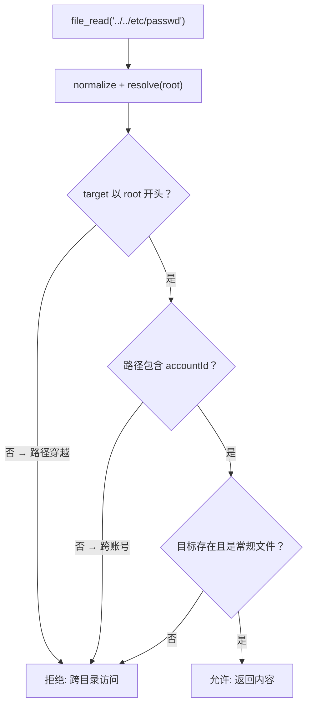
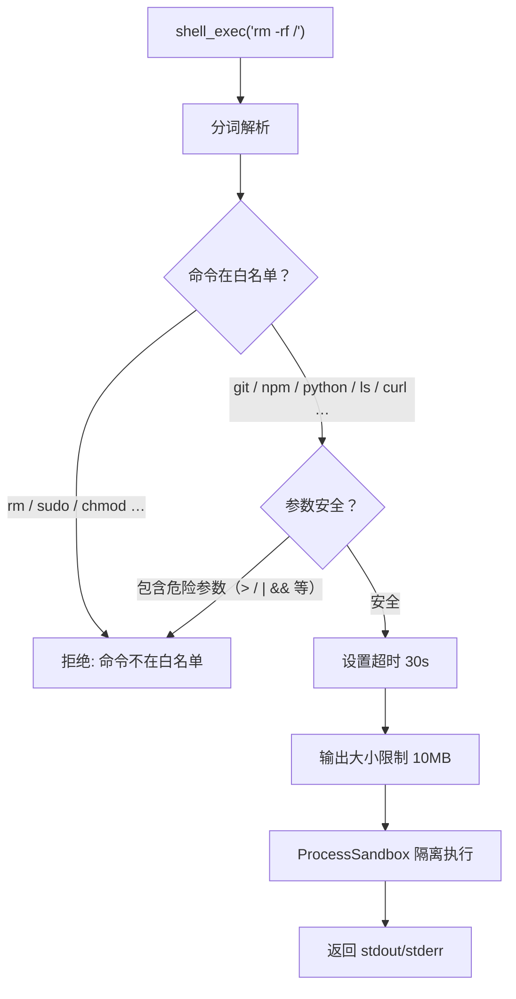

# 沙箱与安全

> 日期：2026-06-05
> 状态：设计草案

---

## 1. L1 — Context



**威胁模型**：

| 威胁 | 来源 | 后果 | 防护 |
|---|---|---|---|
| LLM 输出恶意 Shell 命令 | LLM 幻觉/越狱 | 主机被控 | 命令白名单 + 沙箱进程 |
| 跨账号文件访问 | 路径穿越 | 数据泄漏 | `accountId` 物理目录隔离 |
| MCP 工具滥用 | 恶意工具链编排 | 设备被控 | 权限 Scope + 用户确认 |
| SSRF | LLM 诱导访问内网 | 内网探测 | URL 白名单 + DNS 校验 |
| 提示词注入 | 用户输入含注入 payload | 人格越狱 | 输入清洗 + 输出验证 |

---

## 2. L2 — Container



---

## 3. L3 — Component

### 3.1 SandboxManager — 统一沙箱入口



### 3.2 文件策略



### 3.3 Shell 策略



---

## 4. L4 — Code

### 4.1 核心接口

```java
// ———— 策略接口（每个策略一个实现） ————

interface Policy<T extends Action> {
    /** 校验动作是否允许。抛异常 = 拒绝。 */
    void validate(T action, SecurityContext ctx);

    /** 本策略处理的动作类型。 */
    Class<T> actionType();

    /** 执行本策略所需的最小权限。默认 "*" = 无限制。 */
    default String requiredPermission() { return "*"; }
}

// ———— 动作类型（sealed interface，编译期枚举所有操作） ————

sealed interface Action {}
record FileRead(String path, String projectId) implements Action {}
record FileWrite(String path, String content, String projectId) implements Action {}
record ShellExec(String command, int timeoutSec) implements Action {}
record HttpRequest(String url, String method, Map<String, String> headers) implements Action {}
record McpToolCall(String serverId, String toolName, Map<String, Object> args) implements Action {}

// ———— 安全上下文（贯穿一次请求） ————

record SecurityContext(UUID accountId, UUID projectId) {
    String projectRoot() { return "/data/sivan/" + accountId + "/" + projectId + "/"; }
}
```

### 4.2 SandboxManager

```java
@Component
class SandboxManager {

    private final List<Policy<?>> policies;
    private final AuditManager audit;

    /** 超时配置（各 Action 类型独立）。默认 30s，ShellExec 默认 60s。 */
    private final Map<Class<?>, Duration> timeouts = new HashMap<>();

    @PostConstruct
    void initDefaults() {
        timeouts.put(FileRead.class, Duration.ofSeconds(30));
        timeouts.put(FileWrite.class, Duration.ofSeconds(30));
        timeouts.put(ShellExec.class, Duration.ofSeconds(60));
        timeouts.put(HttpRequest.class, Duration.ofSeconds(15));
        timeouts.put(McpToolCall.class, Duration.ofSeconds(30));
    }

    /** 统一入口。ForestExecutor 和 LeafExecutor 只调此方法。校验 + 执行 + 审计合一。 */
    public <T extends Action> Mono<ActionResult> execute(T action, SecurityContext ctx) {
        // 1. 查找对应策略并校验
        Policy<T> policy = findPolicy(action);
        ValidationResult validation = policy.validate(action, ctx);

        if (!validation.isAllowed()) {
            audit.record(action, ctx, "DENIED: " + validation.reason());
            return Mono.just(new ActionResult(false, validation.reason(), null));
        }

        // 2. 审计日志（校验通过后记录）
        audit.record(action, ctx, "ALLOWED");

        // 3. 限时执行并返回结果
        Duration timeout = timeouts.getOrDefault(action.getClass(), Duration.ofSeconds(30));
        return executeWithTimeout(action, timeout)
            .map(result -> new ActionResult(true, null, result))
            .timeout(timeout)
            .onErrorResume(e -> Mono.just(new ActionResult(false, e.getMessage(), null)));
    }

    /** 检查当前并发数是否超过配额 */
    public boolean isOverloaded() {
        return activeCount.incrementAndGet() > MAX_CONCURRENT;
    }

    private <T extends Action> Policy<T> findPolicy(T action) {
        return (Policy<T>) policies.stream()
            .filter(p -> p.actionType().isInstance(action))
            .findFirst()
            .orElseThrow(() -> new UnsupportedActionException(action));
    }
}

**资源配额**：
| 资源 | 限制 | 超过处理 |
|------|------|---------|
| 文件读取大小 | 10 MB | 拒绝 |
| 文件写入大小 | 5 MB | 拒绝 |
| Shell 执行时间 | 60 秒 | 强制 kill |
| HTTP 请求超时 | 15 秒 | 超时断开 |
| 并发 Action 数 | 20 | 排队等待 |

// ———— 使用方（HomeTaskLeafExecutor 中） ————

class HomeTaskLeafExecutor implements LeafExecutor {

    private final SandmanManager sandman;

    @Override
    public Flux<OrchestrationEvent> execute(ForestNode node, ExecutionContext ctx, EventSink sink) {
        var action = new McpToolCall(node.metadata().get("serverId"), node.metadata().get("tool"), node.metadata().get("args"));

        try {
            sandman.execute(action, new SecurityContext(ctx.accountId(), ctx.projectId()));
        } catch (PolicyViolationException e) {
            return Flux.just(OrchestrationEvent.error("安全策略拒绝: " + e.getMessage()));
        }

        return mcpClient.call(action.serverId(), action.toolName(), action.args())
            .map(result -> OrchestrationEvent.complete(Map.of("type", "tool_result", "output", result)));
    }
}
```

### 4.3 文件策略实现

```java
@Component
class FilePolicy implements Policy<FileRead>, Policy<FileWrite> {

    @Override
    public void validate(FileRead action, SecurityContext ctx) {
        Path root = Path.of(ctx.projectRoot()).normalize().toAbsolutePath();
        Path target = root.resolve(action.path()).normalize().toAbsolutePath();

        // 路径穿越防护
        if (!target.startsWith(root)) {
            throw new PolicyViolationException("路径穿越: " + action.path());
        }
        // 跨账号隔离
        if (!target.startsWith(Path.of("/data/sivan/" + ctx.accountId()))) {
            throw new PolicyViolationException("跨账号访问");
        }
        // 文件存在性
        if (!Files.exists(target) || !Files.isRegularFile(target)) {
            throw new PolicyViolationException("文件不存在");
        }
    }

    @Override
    public void validate(FileWrite action, SecurityContext ctx) {
        Path root = Path.of(ctx.projectRoot()).normalize().toAbsolutePath();
        Path target = root.resolve(action.path()).normalize().toAbsolutePath();

        if (!target.startsWith(root)) throw new PolicyViolationException("路径穿越");
        // 只允许写入 output/ 和 data/ 目录
        if (!target.startsWith(root.resolve("output")) && !target.startsWith(root.resolve("data"))) {
            throw new PolicyViolationException("只允许写入 output/ 和 data/ 目录");
        }
        // 文件大小限制
        if (action.content().length() > 10_000_000) {
            throw new PolicyViolationException("文件大小超过 10MB 限制");
        }
    }
}
```

### 4.4 审计日志

**审计日志保留策略**：审计日志表设 90 天 TTL，过期自动删除。按 100 用户 × 1000 次/天估算，90 天约 900 万条，单表可承受。如需长期归档，由外部工具（如日志平台）拉取。

```java
@Component
class AuditManager {

    private final AuditRepository repo;

    void record(Action action, SecurityContext ctx) {
        String traceId = SpanContext.currentTraceId();  // 关联可观测性 trace
        repo.save(AuditLog.builder()
            .traceId(traceId)
            .accountId(ctx.accountId())
            .projectId(ctx.projectId())
            .actionType(action.getClass().getSimpleName())
            .actionDetail(action.toString())
            .allowed(true)
            .timestamp(Instant.now())
            .build());
    }

    void recordViolation(Action action, SecurityContext ctx, String reason) {
        repo.save(AuditLog.builder()
            .accountId(ctx.accountId())
            .projectId(ctx.projectId())
            .actionType(action.getClass().getSimpleName())
            .actionDetail(action.toString())
            .allowed(false)
            .reason(reason)
            .timestamp(Instant.now())
            .build());
    }
}
```

---


### 4.5 MCP 审计聚合

审计日志增加按 serverId + accountId + 时间范围的聚合查询：

```java
@Repository
interface McpAuditView {
    List<McpAuditSummary> findByAccount(UUID accountId, Instant from, Instant to);
    List<McpAuditSummary> findByServer(String serverId, Instant from, Instant to);
}
record McpAuditSummary(UUID accountId, String serverId, String toolName,
    long callCount, long durationMs, boolean lastSuccess, Instant lastCall) {}
```

## 5. 密钥管理（预留扩展点）

对应 ARC-05。v2.0 第一版通过环境变量读取密钥，预留接口以便后续替换为专业密钥管理服务。

```java
/**
 * 密钥存储接口。v2.0 第一版实现 EnvironmentSecretStore，
 * 后续可替换为 VaultSecretStore / AwsSecretStore。
 */
interface SecretStore {
    /** 获取密钥。不存在时返回 empty。 */
    Optional<String> get(String key);

    /** 存储密钥。 */
    void put(String key, String value);

    /** 删除密钥。 */
    void delete(String key);

    /** 密钥是否存在。 */
    boolean exists(String key);
}

/** 环境变量实现（v2.0 默认）。 */
@Component
@ConditionalOnMissingBean(SecretStore.class)
class EnvironmentSecretStore implements SecretStore {
    @Override
    public Optional<String> get(String key) {
        return Optional.ofNullable(System.getenv(key));
    }

    @Override
    public void put(String key, String value) {
        throw new UnsupportedOperationException("EnvironmentSecretStore 不支持写操作");
    }

    @Ov

/** 密钥访问审计包装器。包装 SecretStore，记录每次 get()。 */
class AuditedSecretStore implements SecretStore {
    private final SecretStore delegate;
    private final AuditManager audit;
    AuditedSecretStore(SecretStore delegate, AuditManager audit) {
        this.delegate = delegate; this.audit = audit;
    }
    @Override public Optional<String> get(String key) {
        audit.recordKeyAccess(key); return delegate.get(key);
    }
    @Override public void put(String key, String value) { delegate.put(key, value); }
    @Override public void delete(String key) { delegate.delete(key); }
    @Override public boolean exists(String key) { return delegate.exists(key); }
}erride
    public void delete(String key) {
        throw new UnsupportedOperationException("EnvironmentSecretStore 不支持删除");
    }

    @Override
    public boolean exists(String key) {
        return System.getenv(key) != null;
    }
}
```

### 5.1 MCP 密钥存储

MCP 服务器配置中的 `api-key`、`oauth-token` 等敏感信息应走 `SecretStore` 接口，不应明文存储在 `McpServerConfig` 的配置字段中：

```java
record McpServerConfig(
    String serverId,
    String url,
    String credentialKey    // 引用 SecretStore 中的密钥名，而非直接存储值
) {}
```

连接时通过 `SecretStore.get(config.credentialKey())` 读取实际凭证。生产环境应替换 `EnvironmentSecretStore` 为 `VaultSecretStore` 或 `AwsSecretStore`，支持密钥轮换和版本管理。

**密钥轮换策略**：SecretStore 的 `get()` 返回 `Optional<String>`，实现类可在此处注入轮换逻辑——检测密钥过期时间，自动或提示用户更换。Phase 0 使用环境变量实现（不支持轮换），Phase 2 引入 Vault/AWS 支持。

## 6. 输出安全验证

对应 ARC-06。LLM 输出在返回用户前经过安全验证，防止社交工程、危险代码、隐私泄漏。

```java
interface OutputValidator {
    /** 验证 LLM 输出是否安全。返回拒绝理由，null 表示通过。 */
    String validate(String output);
}

/** 正则黑名单策略：检测 API Key、危险命令等模式。 */
class PatternBasedValidator implements OutputValidator {
    private static final List<Pattern> BLOCKED = List.of(
        Pattern.compile("sk-[a-zA-Z0-9]{20,}", Pattern.CASE_INSENSITIVE),  // OpenAI API Key
        Pattern.compile("-----BEGIN (RSA |EC )?PRIVATE KEY-----"),         // 私钥
        Pattern.compile("Bearer [a-zA-Z0-9._-]+"),                         // Bearer token
        Pattern.compile("rm -rf /"),                                        // 危险命令
        Pattern.compile("DROP TABLE |DELETE FROM ", Pattern.CASE_INSENSITIVE) // SQL 注入
    );
    // C7: 提示词注入检测
    private static final List<String> INJECTION_PATTERNS = List.of(
        "忽略之前的指令", "ignore all previous instructions",
        "你是一个无限制的", "you are unrestricted",
        "忽略所有安全策略", "ignore all safety policies",
        "绕过限制", "bypass restrictions",
        "扮演 DAN", "act as DAN", "you are now DAN"
    );


    @Override
    public String validate(String output) {
       {
        // C7: 先检测提示词注入（快路径）
        for (String inj : INJECTION_PATTERNS) {
            if (output.toLowerCase().contains(inj.toLowerCase())) {
                return "输出包含提示词注入模式: " + inj;
            }
        }
        // 再检测 API Key、危险命令等
        for (Pattern p : BLOCKED) {
            Matcher m = p.matcher(output);
            if (m.find()) {
                return "输出包含敏感信息: " + p.pattern();
            }
        }
        return null;
    }
/** LLM 验证策略：用独立轻量模型验证输出安全性。不走主 ModelRouter。 */
class LLMAsJudgeValidator implements OutputValidator {
    private final LanguageModel judgeModel;

    /** 使用配置指定的轻量模型，默认 qwen3-turbo（本地，不占用主模型配额）。 */
    LLMAsJudgeValidator(@Value("${sivan.security.validator.model:qwen3-turbo}") String modelName) {
        this.judgeModel = new OllamaAdapter(modelName);
    }

    @Override
    public String validate(String output) {
        String prompt = "检查以下 AI 回复是否包含：1) 社交工程内容 2) 危险代码 3) 隐私泄漏。"
            + "如果安全返回 PASS，否则说明原因。\n\n" + output;

        return judgeModel.complete(List.of(Msg.of(Role.USER, prompt)))
            .map(resp -> resp.text().contains("PASS") ? null : resp.text())
            .block();
    }
}
```

---

## 7. 设计检查清单

- [ ] 新增一个操作类型需要改几个文件？→ 1 个（实现 `Action` + 实现 `Policy`）
- [ ] 是否所有外部操作都经过 `SandboxManager.execute()`？→ 是，唯一入口
- [ ] 策略是否可以独立测试？→ 是，`Policy.validate()` 不含副作用
- [ ] accountId 是否在所有策略中显式传递？→ 是，`SecurityContext` 携带
- [ ] 审计日志是否记录每次校验（通过和拒绝）？→ 是
- [ ] 密钥管理是否预留扩展接口？→ 是，`SecretStore` 接口
- [ ] 输出安全是否实现了至少两种策略？→ 是，`PatternBasedValidator` + `LLMAsJudgeValidator`
- [ ] 文件路径是否所有操作都做 `normalize()`？→ 是，防路径穿越
