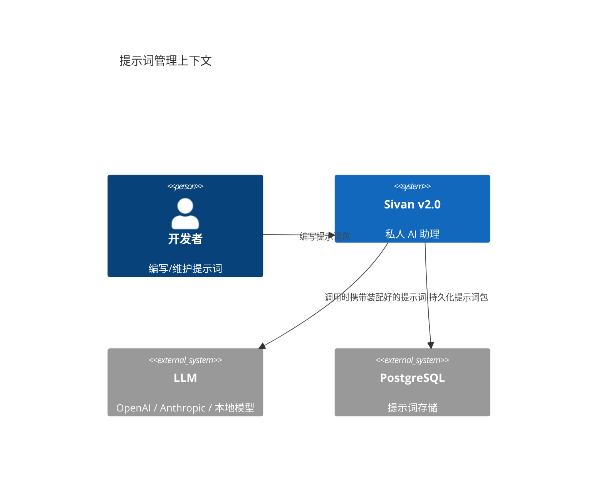
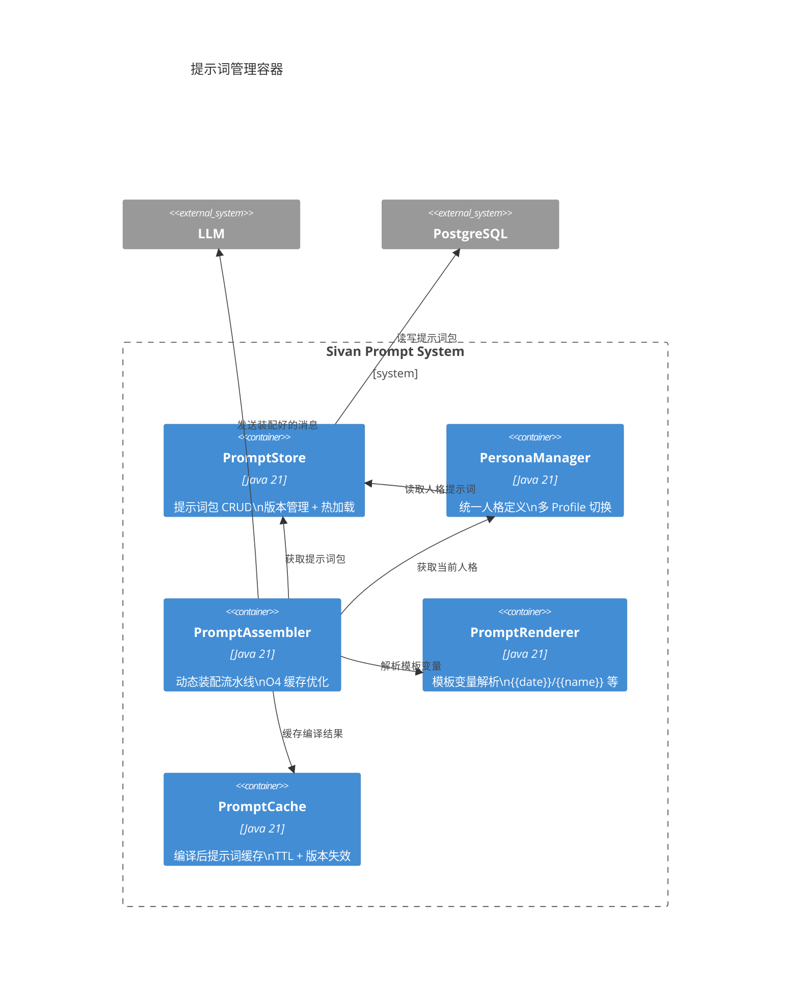
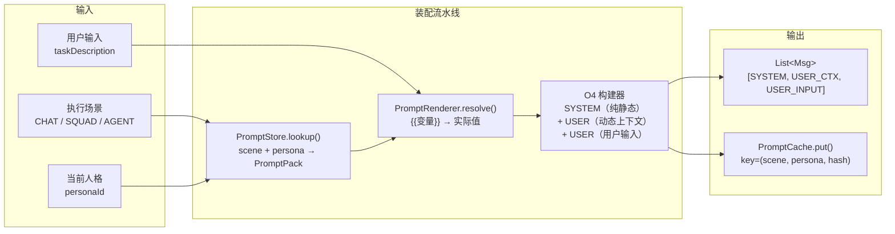
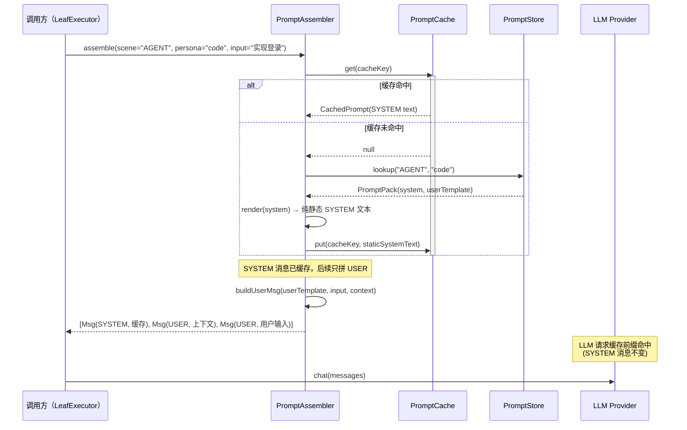
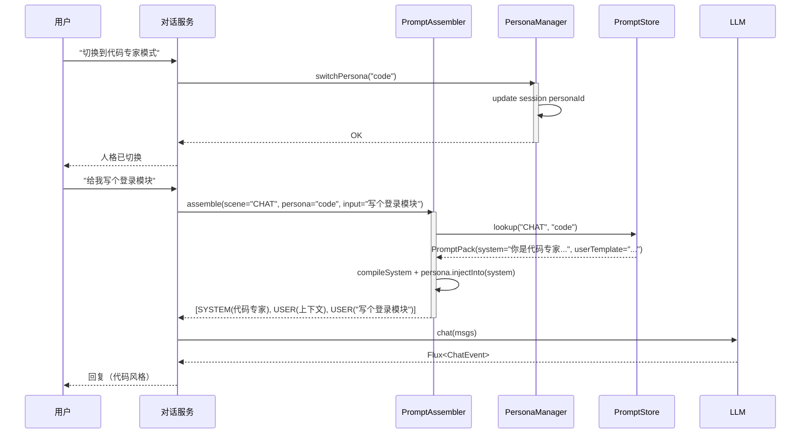

# 提示词管理与统一人格

> 日期：2026-06-05
> 状态：设计草案

---

## 1. L1 — Context



**核心问题**：

| 问题 | 现状（v1.0） | 目标（v2.0） |
|---|---|---|
| 提示词散落 | `ChatPrompts`、`OrchestrationPrompts`、`AgentPrompts`、`SquadPrompts` 四个类 | 统一 `PromptPack` 体系 |
| 人格不统一 | 每个 Agent 有自己的 system prompt，整体人格不一致 | `Persona` 中心化管理，所有提示词继承基础人格 |
| 缓存碎片化 | SYSTEM 消息前缀不可缓存（因 USER 消息动态拼接在其中） | O4 策略：纯静态 SYSTEM + 独立 USER 动态消息 |
| 版本管理无 | 提示词改完直接覆盖，无历史 | `PromptPack` 带版本号，可回滚 |

---

## 2. L2 — Container



---

## 3. L3 — Component

### 3.1 提示词装配流水线



### 3.2 O4 缓存策略



---

## 4. L4 — Code

### 4.1 PromptPack — 提示词包

```java
/**
 * 提示词包——一个场景 + 一个人格下的完整提示词集合。
 * 版本化、可回滚。
 */
class PromptPack {
    final String packId;           // "agent.code.default"
    final String scene;            // "CHAT" / "SINGLE_AGENT" / "SQUAD"
    final String personaId;        // "default" / "code" / "creative"
    final int version;
    final String systemTemplate;   // 纯静态 SYSTEM 模板（含 {{变量}}）
    final String userTemplate;     // USER 消息模板
    final List<String> fewShots;   // 可选：few-shot 示例
    final LocalDateTime createdAt;
    final String createdBy;

    /** 编译后的 SYSTEM 消息文本（纯静态，可缓存）。 */
    String compileSystem(Map<String, Object> vars) {
        return TemplateEngine.render(systemTemplate, vars);
    }
}
```

### 4.2 Persona — 人格定义

```java
/**
 * 人格——决定 AI 回复的语气、风格、知识边界。
 * 所有提示词组装时继承当前人格的基础指令。
 */
class Persona {
    final String personaId;         // "default" / "code" / "creative" / "professional"
    final String name;              // "默认助手" / "代码专家"
    final String baseInstruction;   // "你是一个专业的 AI 助手…"
    final Map<String, String> traits;  // { "tone": "专业", "style": "简洁", "knowledge": "2026-06" }
    final List<String> constraints;    // 行为约束列表

    /** 将人格指令注入系统提示词。 */
    String injectInto(String systemPrompt) {
        StringBuilder sb = new StringBuilder(systemPrompt);
        sb.append("\n\n## 人格设定\n").append(baseInstruction);
        for (var constraint : constraints) {
            sb.append("\n- ").append(constraint);
        }
        return sb.toString();
    }
}
```

### 4.3 PromptAssembler — 装配器

```java
@Component
class PromptAssembler {

    private final PromptStore store;
    private final PersonaManager personas;
    private final PromptCache cache;

    /**
     * 装配完整的消息列表。
     *
     * @return [SYSTEM（静态，可缓存前缀）, USER（动态上下文）, USER（用户输入）]
     */
    List<Msg> assemble(AssemblyRequest req) {

        // 1. 获取当前人格
        Persona persona = personas.resolve(req.personaId());

        // 2. 获取提示词包
        PromptPack pack = store.lookup(req.scene(), persona.personaId());

        // 3. SYSTEM：编译结果（不含人格注入）缓存
        String cacheKey = cacheKey(pack.packId(), pack.version());
        String systemText = cache.get(cacheKey);
        if (systemText == null) {
            systemText = pack.compileSystem(req.vars());
            cache.put(cacheKey, systemText);
        }
        // 人格注入在缓存命中后执行，确保不同 persona 不会读到脏缓存
        systemText = persona.injectInto(systemText);

        // 4. 构建动态上下文 USER 消息
        String userContext = buildUserContext(req);

        // 5. 构建用户输入 USER 消息
        String userInput = TemplateEngine.render(pack.userTemplate(), Map.of(
            "input", req.userInput(),
            "history", req.historyContext()
        ));

        // 6. 组装（O4 顺序：SYSTEM → USER_CTX → USER_INPUT）
        List<Msg> msgs = new ArrayList<>();
        msgs.add(Msg.of(Role.SYSTEM, systemText));
        msgs.add(Msg.of(Role.USER, userContext));
        msgs.add(Msg.of(Role.USER, userInput));
        return msgs;
    }

    private String cacheKey(String packId, int version) {
        return "prompt:" + packId + ":v" + version;
    }
}

record AssemblyRequest(
    String scene,              // "CHAT" / "SINGLE_AGENT" / "SQUAD"
    String personaId,          // "default" / "code" / ...
    String userInput,
    String historyContext,
    Map<String, Object> vars   // 模板变量
) {}
```

### 4.4 PromptStore — 存储与版本

```java
@Component
class PromptStore {

    private final Map<String, PromptPack> packs = new ConcurrentHashMap<>();

    /** 查找场景 + 人格对应的最新版提示词包。 */
    PromptPack lookup(String scene, String personaId) {
        String key = scene + "." + personaId;
        PromptPack pack = packs.get(key);
        if (pack == null) {
            pack = loadFromDb(key);
            packs.put(key, pack);
        }
        return pack;
    }

    /** 热加载：更新后调用，下次请求从 DB 重新加载。 */
    void reload(String scene, String personaId) {
        packs.remove(scene + "." + personaId);
    }
}
```

### 4.5 与 ForestExecutor 的集成

```java
class AgentLeafExecutor implements LeafExecutor {

    private final PromptAssembler assembler;
    private final ModelRouter router;

    @Override
    public Flux<OrchestrationEvent> execute(ForestNode node, ExecutionContext ctx, EventSink sink) {
        // 1. 装配提示词
        List<Msg> msgs = assembler.assemble(new AssemblyRequest(
            "SINGLE_AGENT",
            node.metadata().getOrDefault("persona", "default"),
            node.content(),
            ctx.historyContext(),
            Map.of("agent_name", node.metadata().get("agent_name"))
        ));

        // 2. 获取模型并调用
        LanguageModel model = router.forTask(TaskProfile.from(node));
        return model.chat(msgs, ModelParams.defaults())
            .map(event -> toOrchestrationEvent(event, sink));
    }
}
```

---

## 5. 人格切换流程



---

## 6. 设计检查清单

- [ ] 新增一个人格需要改几个文件？→ 1 个（DB 加一条 Persona 记录）
- [ ] 新增一个场景的提示词需要改几个文件？→ 1 个（DB 加一条 PromptPack）
- [ ] SYSTEM 消息是否纯静态？→ 是，支持 LLM 请求前缀缓存
- [ ] 动态上下文是否放在独立的 USER 消息中？→ 是，不污染 SYSTEM 缓存
- [ ] 人格是否能独立切换而不影响其他场景？→ 是，Persona 与 PromptPack 独立存储
- [ ] 提示词更新后是否需要重启？→ 否，`PromptStore.reload()` 支持热加载
