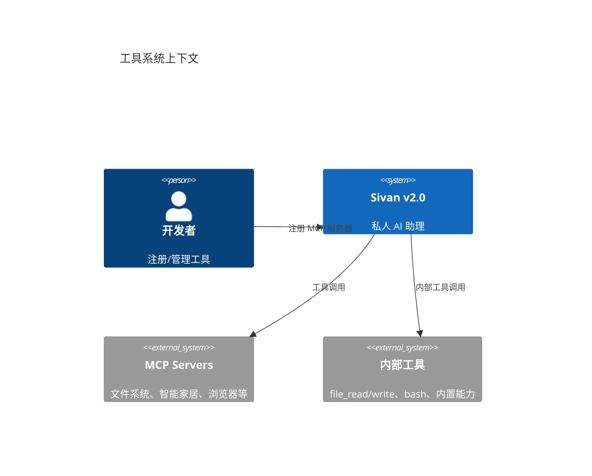
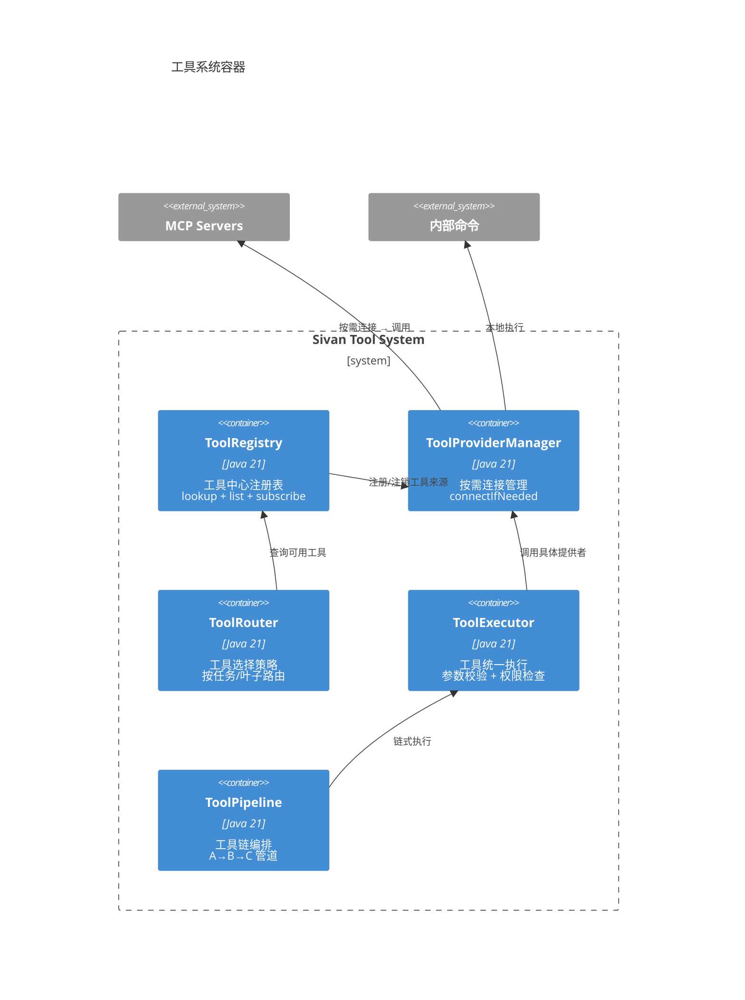
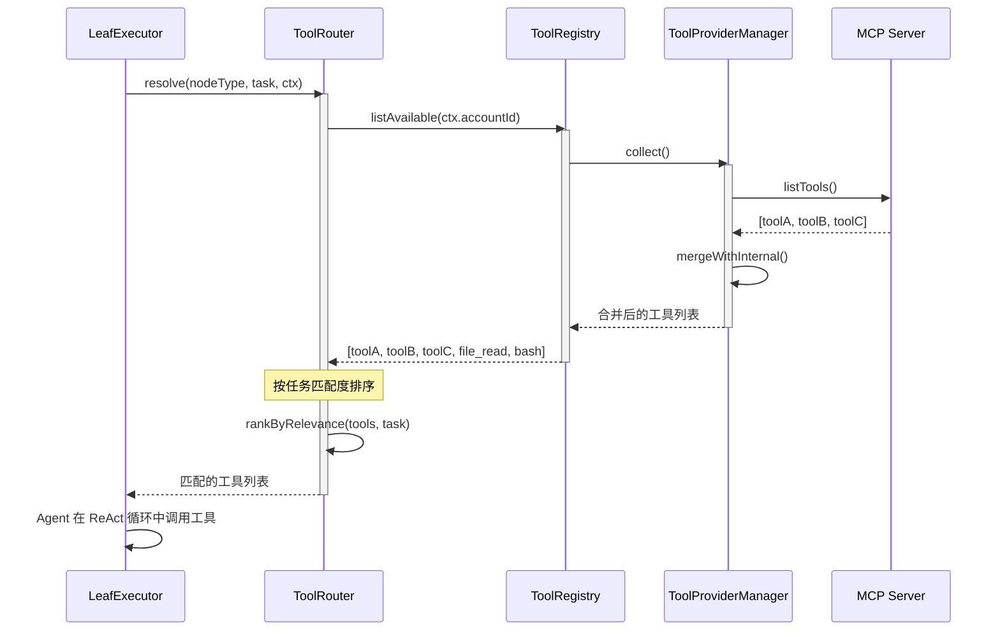
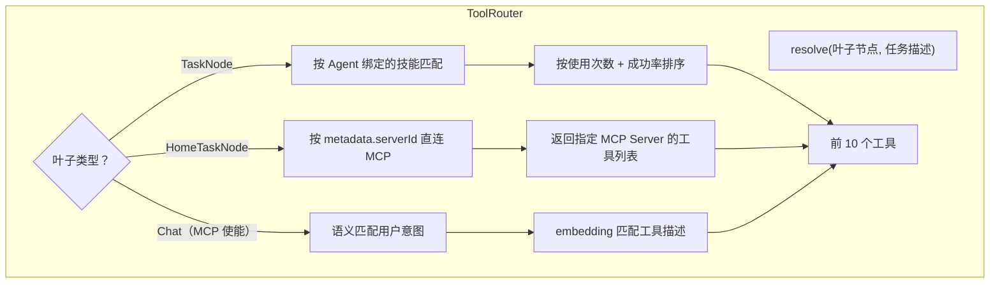
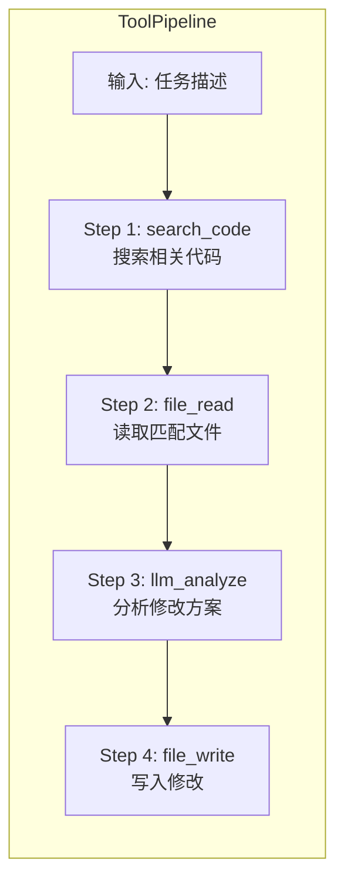
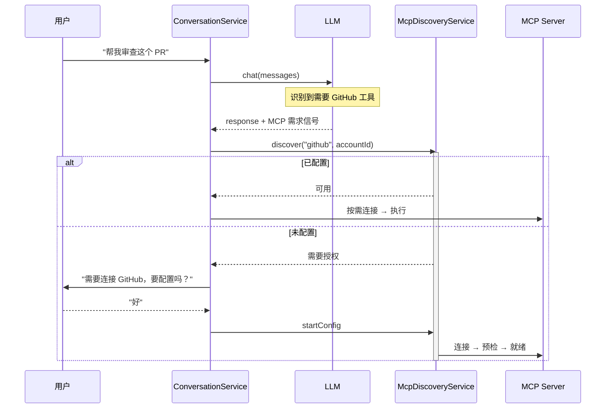
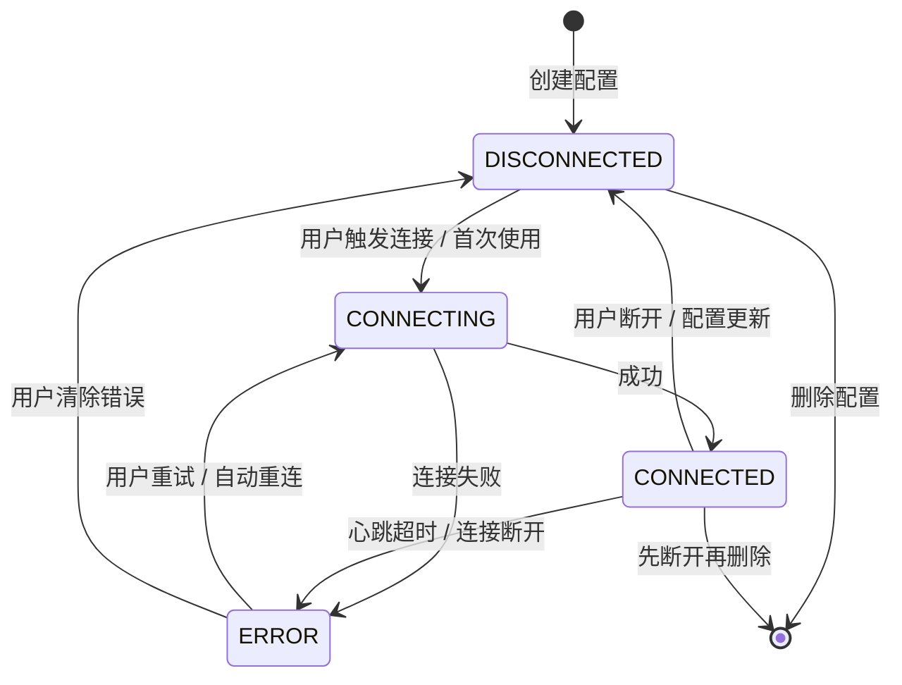

# 工具动态感知

> 日期：2026-06-05
> 状态：设计草案

---

## 1. L1 — Context



**核心问题**：

| 问题 | 现状（v1.0） | 目标（v2.0） |
|---|---|---|
| 工具注册两套 | `ToolRegistryImpl` + `McpToolProvider`，分不清边界 | 统一 `ToolRegistry`，MCP 和内部工具同接口 |
| 路由策略硬编码 | Agent 匹配工具靠 `toolAutoResolver.resolveForAgent()` | `ToolRouter` 按任务/叶子类型动态路由 |
| 工具链无感知 | 工具之间无依赖/顺序/组合关系 | 工具链编排：A→B→C 的管道模式 |
| 热加载不支持 | MCP 服务器重启后工具列表需重启 Sivan | `ToolRegistry` 支持运行时刷新 |

---

**连接策略**：按需建立。不启动、不预连接、不预先握手。仅当对话明确选择某个 MCP 服务器时才建立连接。

---

## 2. L2 — Container



---

## 3. L3 — Component

### 3.1 工具发现流程



### 3.2 工具路由策略



### 3.3 工具链流水线



---

## 4. L4 — Code

### 4.1 核心接口

```java
// ———— 工具规范（同 v1.0，保持兼容） ————

record ToolSpec(String name, String description, Map<String, Object> inputSchema) {}

// ———— 工具来源（每个 MCP 服务器或内部工具集一个实现） ————

interface ToolProvider {
    /** 提供者标识。MCP 服务器 ID 或 "internal"。 */
    String providerId();

    /** 本提供者支持的所有工具列表。 */
    List<ToolSpec> listTools();

    /** 调用一个工具。 */
    Mono<ToolResult> execute(String toolName, Map<String, Object> args);

    /** 本提供者是否健康可用。 */
    boolean isHealthy();
}

record ToolResult(boolean success, String output, Map<String, Object> metadata) {}

// ———— 路由策略接口 ————

interface ToolRoutingStrategy {
    /** 本策略适用的叶子类型。 */
    String supportedLeafType();

    /** 为叶子节点选择可用工具。 */
    List<ToolSpec> resolve(ForestNode node, String taskDescription, ToolRegistry registry);
}
```

### 4.2 ToolRegistry

```java
@Component
class ToolRegistry {

    private final List<ToolProvider> providers;
    private final ToolCache cache;

    /** 获取当前账户可用的所有工具列表（合并去重）。 */
    List<ToolSpec> listAvailable(UUID accountId) {
        return cache.get(accountId, () -> providers.stream()
            .filter(ToolProvider::isHealthy)
            .flatMap(p -> p.listTools().stream())
            .distinct()
            .toList());
    }

    /** 按名称查找工具（执行时定位用）。 */
    ToolProvider findProvider(String toolName) {
        return providers.stream()
            .filter(p -> p.listTools().stream().anyMatch(t -> t.name().equals(toolName)))
            .findFirst()
            .orElseThrow(() -> new ToolNotFoundException(toolName));
    }

    /** 运行时注册新 provider（热加载）。 */
    void register(ToolProvider provider) {
        providers.add(provider);
        cache.invalidate();
    }

    /** 移除 provider（MCP 断开时）。 */
    void unregister(String providerId) {
        providers.removeIf(p -> p.providerId().equals(providerId));
        cache.invalidate();
    }
}
```

### 4.3 ToolProviderManager（MCP 连接管理）

```java
@Component
class ToolProviderManager {

    private final ToolRegistry registry;

    /** 建立 MCP 连接并注册工具。 */
    Mono<Void> connectMcpServer(McpServerConfig config) {
        return McpClient.create(config)
            .flatMap(client -> client.listTools()
                .map(tools -> new McpToolProvider(config.serverId(), client, tools))
                .doOnNext(provider -> {
                    registry.register(provider);
                    log.info("MCP 服务器已连接: serverId={}, tools={}", config.serverId(), provider.listTools().size());
                })
            );
    }

    /** 断开 MCP 连接。 */
    void disconnectMcpServer(String serverId) {
        registry.unregister(serverId);
        McpClient.disconnect(serverId);
        log.info("MCP 服务器已断开: serverId={}", serverId);
    }

    /**
     * 按需连接——仅当对话明确选择某个 MCP 服务器时才建立连接。
     * 不启动、不预连接、不预先握手。
     *
     * 由 ConversationService 在解析消息中的 MCP 服务器选择时调用。
     */
    Mono<Void> connectIfNeeded(McpServerConfig config) {
        if (registry.isRegistered(config.serverId())) {
            return Mono.empty(); // 已连接
        }
        return connectMcpServer(config);
    }
}
```

**账号隔离**：MCP 服务器连接必须以 `accountId` 为维度隔离。ToolProviderManager 维护 `Map<UUID, Map<String, ToolProvider>>` 二级映射：第一层为 accountId，第二层为 serverId。

```java
// 连接查找逻辑
ToolProvider provider = connections.get(accountId).get(serverId);
```

用户 A 配置的 GitHub MCP 不会被用户 B 复用。同一用户在不同设备上登录时共享同一连接池（以 accountId 为 key）。

### 4.4 McpToolProvider

```java
class McpToolProvider implements ToolProvider {

    private final String serverId;
    private final McpClient client;
    private final List<ToolSpec> tools;

    @Override public String providerId() { return serverId; }
    @Override public List<ToolSpec> listTools() { return tools; }
    @Override public boolean isHealthy() { return client.isConnected(); }

    @Override
    public Mono<ToolResult> execute(String toolName, Map<String, Object> args) {
        return client.callTool(toolName, args)
            .map(result -> new ToolResult(result.success(), result.output(), result.meta()))
            .onErrorResume(e -> Mono.just(new ToolResult(false, e.getMessage(), Map.of())));
    }
}
```

### 4.5 工具预检

MCP 服务器按需连接后，执行前必须检查工具可用性。有问题提前告知用户，避免执行中报错。

```java
@Component
class ToolPreflight {

    private final ToolProviderManager connectionManager;
    private final ToolRegistry registry;

    /** 预检核心逻辑：检查可用性 + 凭证有效性。 */
    Mono<List<PreflightResult>> check(String serverId) {
        ToolProvider provider = registry.getProvider(serverId);
        if (provider == null) {
            return Mono.just(List.of(new PreflightResult(serverId, "*", false, "未连接", false)));
        }
        return provider.listToolsAsync()
            .flatMapMany(Flux::fromIterable)
            .flatMap(tool -> provider.listToolsAsync()
                .map(tools -> new PreflightResult(provider.providerId(), tool.name(), true, null, true))
                .onErrorResume(e -> Mono.just(new PreflightResult(provider.providerId(), tool.name(), false, e.getMessage(), false))))
            .collectList();
    }

    Mono<List<PreflightResult>> check(Mono<String> serverIdMono) {
        return serverIdMono.flatMap(serverId -> {
            ToolProvider provider = registry.getProvider(serverId);
            if (provider == null) {
                return Mono.just(List.of(new PreflightResult(serverId, "unknown", false, "MCP 服务器未连接")));
            }

            return provider.listToolsAsync()
                .map(tools -> tools.stream()
                    .map(tool -> {
                        boolean ok = provider.isHealthy();
                        return new PreflightResult(
                            serverId,
                            tool.name(),
                            ok,
                            ok ? null : provider.healthMessage()
                        );
                    })
                    .toList())
                .onErrorResume(e ->
                    Mono.just(List.of(new PreflightResult(serverId, "*", false, e.getMessage())))
                );
        });
    }
}

record PreflightResult(
    String serverId,
    String toolName,         // "*" 表示服务器级别
    boolean available,
    String message,          // null 表示正常
    boolean credentialValid  // 凭证是否有有效
) {
    boolean isServerLevel() { return "*".equals(toolName); }

    /** 是否可安全执行。 */
    boolean isReady() { return available && credentialValid; }

    String toDisplay() {
        if (!credentialValid) return "⚠️ " + serverId + " 凭证已失效，需要重新授权";
        if (available) return "✅ " + serverId + "/" + toolName + " 可用";
        if (isServerLevel()) return "❌ " + serverId + " 不可用: " + message;
        return "⚠️ " + serverId + "/" + toolName + " 不可用: " + message;
    }
}

// 在 ToolProvider 接口中增加：
interface ToolProvider {
    /** 当前是否健康可用。 */
    boolean isHealthy();

    /** 不可用时的原因。 */
    default String healthMessage() { return ""; }

    /** 异步获取工具列表（可包含健康检查）。 */
    default Mono<List<ToolSpec>> listToolsAsync() {
        return Mono.fromCallable(this::listTools);
    }
}
```

**使用场景**：

```java
// ConversationService 中，用户选择 MCP 服务器后：
public Mono<Void> handleMcpSelection(String serverId, UUID conversationId) {
    return toolPreflight.check(serverId)
        .flatMap(results -> {
            boolean allOk = results.stream().allMatch(PreflightResult::available);
            if (allOk) {
                return conversationService.appendMessage(conversationId,
                    "✅ " + serverId + " 已连接，工具可用");
            }
            // 有不可用的工具 → 告知用户
            String detail = results.stream()
                .filter(r -> !r.available())
                .map(PreflightResult::toDisplay)
                .collect(Collectors.joining("\n"));
            return conversationService.appendMessage(conversationId,
                serverId + " 部分工具不可用:\n" + detail + "\n是否继续？");
        });
}
```

### 4.6 按需发现（McpDiscoveryService）

对话中识别用户对 MCP 能力的需求，主动询问、引导配置。



```java
@Component
class McpDiscoveryService {

    private final ToolProviderManager connectionManager;
    private final ToolPreflight preflight;

    Mono<DiscoveryResult> discover(String mcpServerId, UUID accountId) {
        McpServerConfig existing = configRepo.findByAccount(accountId, mcpServerId);
        if (existing != null) {
            return connectionManager.connectIfNeeded(existing)
                .then(preflight.check(mcpServerId))
                .map(results -> {
                    boolean ok = results.stream().allMatch(PreflightResult::available);
                    return new DiscoveryResult(mcpServerId, ok, ok ? null : "不可用");
                });
        }
        return Mono.just(new DiscoveryResult(mcpServerId, false, "need_config"));
    }
}

record DiscoveryResult(String mcpServerId, boolean available, String message) {
    boolean needsConfig() { return "need_config".equals(message); }
}
```
> **安全注：OAuth 授权必须使用 PKCE（Proof Key for Code Exchange）**。
> `startConfig` 触发的 OAuth 授权流程必须启用 PKCE 扩展，防止授权码拦截攻击。
> 移动端和手表端场景无浏览器地址栏可见，未使用 PKCE 的 OAuth 流程易受中间人攻击。
> PKCE 要求：授权请求中携带 `code_challenge`，令牌交换时携带 `code_verifier`。

**ConversationService 集成**：

```java
McpNeedSignal need = McpNeedSignal.fromLlmResponse(response.text());
if (need != null) {
    return mcpDiscovery.discover(need.mcpServerId(), accountId)
        .flatMapMany(result -> {
            if (result.needsConfig()) {
                return Flux.just(askEvent(need));
            }
            return executeWithMcp(need.mcpServerId());
        });
}
```

### 4.7 内部工具提供者

Sivan 内置的工具集，不依赖外部 MCP 服务器。这些工具通过 `InternalToolProvider` 注册到 `ToolRegistry`，始终可用。

```java
@Component
class InternalToolProvider implements ToolProvider {

    private final FileSecurityManager fileSecurity;
    private final SandboxManager sandbox;

    @Override public String providerId() { return "internal"; }
    @Override public boolean isHealthy() { return true; }

    @Override
    public List<ToolSpec> listTools() {
        return List.of(
            new ToolSpec("file_read", "读取文件内容",
                Map.of("path", Map.of("type", "string", "description", "文件路径，相对于项目根目录"))),
            new ToolSpec("file_write", "写入文件（如文件已存在则覆盖）",
                Map.of(
                    "path", Map.of("type", "string", "description", "文件路径"),
                    "content", Map.of("type", "string", "description", "文件内容")
                )),
            new ToolSpec("file_list", "列出目录中的文件和子目录",
                Map.of("dir", Map.of("type", "string", "description", "目录路径，缺省为项目根目录"))),
            new ToolSpec("file_search", "在文件中搜索文本内容（grep）",
                Map.of(
                    "pattern", Map.of("type", "string", "description", "搜索关键词或正则表达式"),
                    "dir", Map.of("type", "string", "description", "搜索目录，缺省为项目根目录")
                )),
        );
    }

    @Override
    public Mono<ToolResult> execute(String toolName, Map<String, Object> args) {
        // 所有内部工具执行前必须经过 FileSecurityManager 路径校验
        return fileSecurity.validate(args, currentContext())
            .flatMap(validated -> switch (toolName) {
                case "file_read"   -> fileRead(validated);
                case "file_write"  -> fileWrite(validated);
                case "file_list"   -> fileList(validated);
                case "file_search" -> fileSearch(validated);
                default -> Mono.just(new ToolResult(false, "未知内部工具: " + toolName, Map.of()));
            });
    }
}
```

#### 4.7.1 FileSecurityManager — 文件路径安全校验

所有文件操作工具执行前必须经过路径校验，防止跨项目目录访问。

```java
@Component
class FileSecurityManager {

    /**
     * 校验并解析文件操作参数。
     * 1. 将相对路径解析为绝对路径（基于 project shortId 对应的根目录）
     * 2. 校验路径不越界（禁止 ../ 跳出项目目录）
     * 3. 校验路径不在禁止列表中（如 .env, .ssh）
     */
    Mono<ResolvedArgs> validate(Map<String, Object> args, ExecutionContext ctx) {
        UUID projectId = ctx.projectId();
        return projectRepo.findByProjectIdAndAccountId(projectId, ctx.accountId())
            .map(project -> {
                Path projectRoot = Path.of(storageRoot, "sivan",
                    accountRepo.shortId(ctx.accountId()),
                    project.shortId());
                return resolveAndValidate(args, projectRoot);
            });
    }

    private ResolvedArgs resolveAndValidate(Map<String, Object> args, Path projectRoot) {
        // 遍历所有路径参数，解析并校验
        Map<String, Object> validated = new HashMap<>(args);
        for (String key : List.of("path", "dir")) {
            if (args.containsKey(key)) {
                Path resolved = projectRoot.resolve((String) args.get(key)).normalize();
                if (!resolved.startsWith(projectRoot)) {
                    throw new SecurityException("路径越界: " + args.get(key));
                }
                validated.put(key, resolved.toString());
            }
        }
        return new ResolvedArgs(validated, projectRoot);
    }
}

record ResolvedArgs(Map<String, Object> args, Path projectRoot) {}
```

**路径校验规则**：

| 检查项 | 规则 |
|--------|------|
| 相对路径 | 基于 `{root}/sivan/{acctShortId}/{projectShortId}/` 解析 |
| 目录穿越 | `../` 解析后必须仍在项目根目录内 |
| 禁止列表 | `.env`、`.ssh`、`config/keys` 等敏感文件不可读写 |
| 写权限 | `file_write` 只允许写入 `data/`、`output/`、`uploads/` 子目录 |

#### 4.7.2 目录结构初始化

项目创建时自动初始化目录结构：

```
{root}/sivan/{acctShortId}/{projectShortId}/
├── data/          ← 数据结构化存储（分析的中间产物）
├── output/        ← 输出文件（报告、生成的内容）
└── uploads/       ← 用户上传文件（通过前端或 API 上传）
```

由 `ProjectService.create()` 在项目创建后触发：

```java
// ProjectService 中：
Mono<Project> create(CreateProjectRequest req, UUID accountId) {
    return shortIdGenerator.generate(SCOPE_PROJECT, accountId)
        .flatMap(shortId -> projectRepo.save(...))
        .flatMap(project -> initDirectories(project, accountId))
        .thenReturn(project);
}

private Mono<Void> initDirectories(Project project, UUID accountId) {
    Path projectRoot = Path.of(storageRoot, "sivan",
        accountRepo.shortId(accountId), project.shortId());
    return Mono.fromRunnable(() -> {
        Files.createDirectories(projectRoot.resolve("data"));
        Files.createDirectories(projectRoot.resolve("output"));
        Files.createDirectories(projectRoot.resolve("uploads"));
    });
}
```

### 4.8 ToolRouter

```java
@Component
class ToolRouter {

    private final ToolRegistry registry;
    private final List<ToolRoutingStrategy> strategies;

    /** 为叶子节点解析可用工具。 */
    List<ToolSpec> resolve(ForestNode node, String taskDescription) {
        ToolRoutingStrategy strategy = strategies.stream()
            .filter(s -> s.supportedLeafType().equals(node.nodeType()))
            .findFirst()
            .orElse(new DefaultToolStrategy());

        return strategy.resolve(node, taskDescription, registry);
    }
}

@Component
class AgentToolStrategy implements ToolRoutingStrategy {
    @Override public String supportedLeafType() { return "task"; }

    @Override
    public List<ToolSpec> resolve(ForestNode node, String task, ToolRegistry reg) {
        String agentName = node.metadata().get("agent_name");

        // 查询该 Agent 绑定的技能（从 SkillRepository）
        List<String> skillToolNames = skillRepo.findByAgentName(agentName);

        return reg.listAvailable(node.metadata().getAccountId()).stream()
            .filter(t -> skillToolNames.contains(t.name()))
            .sorted(Comparator.comparingInt(t -> usageCount(t.name())).reversed())
            .limit(10)
            .toList();
    }
}

@Component
class HomeToolStrategy implements ToolRoutingStrategy {
    @Override public String supportedLeafType() { return "home_task"; }

    @Override
    public List<ToolSpec> resolve(ForestNode node, String task, ToolRegistry reg) {
        String serverId = node.metadata().get("serverId");
        // 只返回指定 MCP 服务器的工具
        return reg.listAvailable(node.metadata().getAccountId()).stream()
            .filter(t -> reg.findProvider(t.name()).providerId().equals(serverId))
            .toList();
    }
}
```

### 4.9 与森林架构的集成

```java
class AgentLeafExecutor implements LeafExecutor {

    private final ModelRouter router;
    private final ToolRouter toolRouter;
    private final ToolRegistry toolRegistry;
    private final ToolExecutor toolExecutor;

    @Override
    public Flux<OrchestrationEvent> execute(ForestNode node, ExecutionContext ctx, EventSink sink) {
        // 1. 解析工具
        List<ToolSpec> tools = toolRouter.resolve(node, node.content());

        // 2. 构建 Agent（注入工具列表）
        Agent agent = Agent.builder()
            .agentId(node.metadata().get("agent_name"))
            .languageModel(router.forTask(TaskProfile.from(node)))
            .toolProvider(new AgentToolProvider(toolExecutor, tools))
            .build();

        // 3. 执行（ReAct 循环会按需调用工具）
        return agent.execute(buildContext(node, ctx));
    }
}
```

---

## 5. MCP 服务器配置管理

MCP 服务器需要完整的配置生命周期管理，从注册、连接、监控到断开的全流程。

### 5.1 配置实体

```java
/** MCP 服务器配置。用户通过前端管理界面添加/编辑/删除。 */
class McpServerConfig {
    UUID serverId;
    UUID accountId;

    /** 用户可读的名称。如 "我的 GitHub"、"智能家居"。 */
    String name;

    /** 服务器类型（决定连接协议和默认参数）。 */
    McpServerType serverType;  // STDIO / SSE / OAUTH

    /** 连接地址。STDIO 为命令，SSE/OAUTH 为 URL。 */
    String endpoint;

    /** OAuth 配置（OAUTH 类型需要）。 */
    OAuthConfig oauthConfig;

    /** 连接状态。由后端心跳定期更新。 */
    ConnectionStatus connectionStatus;  // DISCONNECTED / CONNECTING / CONNECTED / ERROR
    String lastError;
    LocalDateTime lastConnectedAt;

    /** 工具数量（缓存上次连接时的工具数量）。 */
    int toolCount;

    boolean active;
    LocalDateTime createdAt;
    LocalDateTime updatedAt;
}

enum McpServerType {
    STDIO,   // 本地 STDI/O 进程（如 Python MCP 代理）
    SSE,     // SSE 端点（远程服务）
    OAUTH    // OAuth 2.1 授权后连接（如 GitHub MCP）
}

enum ConnectionStatus {
    DISCONNECTED,
    CONNECTING,
    CONNECTED,
    ERROR
}

record OAuthConfig(
    String authorizationUrl,
    String tokenUrl,
    String clientId,
    String clientSecret,     // 加密存储（SecretStore）
    String scope
) {}
```

### 5.2 管理 API

```java
@RestController
@RequestMapping("/api/v2/mcp-servers")
class McpServerController {

    @GetMapping                              // 列出已配置的 MCP 服务器
    Flux<McpServerSummary> list(UUID accountId);

    @PostMapping                             // 添加 MCP 服务器
    Mono<McpServerDetail> create(@RequestBody CreateMcpRequest req, UUID accountId);

    @PutMapping("/{serverId}")               // 更新配置
    Mono<McpServerDetail> update(@PathVariable UUID serverId,
                                 @RequestBody UpdateMcpRequest req, UUID accountId);

    @DeleteMapping("/{serverId}")            // 删除配置（含断开连接）
    Mono<Void> delete(@PathVariable UUID serverId, UUID accountId);

    @PostMapping("/{serverId}/connect")      // 手动连接
    Mono<McpServerDetail> connect(@PathVariable UUID serverId, UUID accountId);

    @PostMapping("/{serverId}/disconnect")   // 手动断开
    Mono<McpServerDetail> disconnect(@PathVariable UUID serverId, UUID accountId);

    @GetMapping("/{serverId}/tools")         // 查看服务器提供的工具列表
    Flux<ToolSpec> listTools(@PathVariable UUID serverId, UUID accountId);

    @PostMapping("/{serverId}/preflight")    // 运行预检检查
    Mono<List<PreflightResult>> preflight(@PathVariable UUID serverId, UUID accountId);
}
```

### 5.3 连接生命周期



**状态管理逻辑**：

```java
@Component
class McpConnectionManager {

    /** 账户隔离的连接池：Map<accountId, Map<serverId, Connection>> */
    private final ConcurrentHashMap<UUID, ConcurrentHashMap<String, McpConnection>> connections;

    /** 连接心跳——每分钟检查所有活跃连接的健康状态。 */
    @Scheduled(fixedRate = 60000)
    void heartbeat() {
        connections.forEach((accountId, servers) ->
            servers.forEach((serverId, conn) -> {
                if (!conn.client.isHealthy()) {
                    conn.status = ConnectionStatus.ERROR;
                    conn.lastError = "心跳检测失败";
                    notifyUser(accountId, serverId, "MCP 服务器连接断开");
                }
            })
        );
    }

    /** 连接一个 MCP 服务器。 */
    Mono<McpConnection> connect(McpServerConfig config) {
        return McpClientFactory.create(config)
            .flatMap(client -> client.listTools()
                .map(tools -> {
                    McpConnection conn = new McpConnection(config, client, tools);
                    connections.computeIfAbsent(config.accountId(), k -> new ConcurrentHashMap<>())
                        .put(config.serverId(), conn);
                    return conn;
                })
            );
    }

    /** 断开连接（含清理）。 */
    Mono<Void> disconnect(UUID accountId, String serverId) {
        McpConnection conn = connections.getOrDefault(accountId, new ConcurrentHashMap<>())
            .remove(serverId);
        if (conn != null) {
            conn.client.disconnect();
            registry.unregister(serverId);
        }
        return Mono.empty();
    }
}

class McpConnection {
    final McpServerConfig config;
    final McpClient client;
    final List<ToolSpec> tools;
    ConnectionStatus status;
    String lastError;
    Instant lastConnectedAt;
}
```

### 5.4 前端管理界面

MCP 服务器管理面板需要包含：

```
┌─ MCP 服务器管理 ─────────────────────┐
│                                       │
│  [+] 添加服务器                         │
│                                       │
│  ┌─ 已配置的服务器 ──────────────────┐ │
│  │                                    │ │
│  │ 🔵 GitHub MCP        已连接 12 工具 │ │
│  │    └─ 型号: OAuth | 最后连接: 5 分钟前 │ │
│  │                                    │ │
│  │ 🔴 智能家居 MCP      连接失败      │ │
│  │    └─ 型号: SSE | 错误: 连接超时    │ │
│  │      [重试] [编辑] [删除]           │ │
│  │                                    │ │
│  │ ⚪ 文件系统 MCP      未连接        │ │
│  │    └─ 型号: STDIO                   │ │
│  │      [连接] [编辑] [删除]           │ │
│  └────────────────────────────────────┘ │
│                                         │
│  点击服务器 → 查看工具列表 / 预检报告    │
└─────────────────────────────────────────┘
```

### 5.5 安全措施

| 风险 | 应对 |
|------|------|
| 凭证泄露 | `OAuthConfig.clientSecret` 通过 `SecretStore` 加密存储，API 返回时脱敏 |
| 未授权连接 | OAuth 流程强制 PKCE（ADR-024），token 存储按 accountId 隔离 |
| 僵尸连接 | 每分钟心跳检测，连续 3 次失败自动断开并通知用户 |
| 配置泄露 | `McpServerConfig` 列表按 accountId 过滤，禁止跨账号访问 |

---

## 6. 设计检查清单

- [ ] 新增一种工具来源需要改几个文件？→ 1 个（实现 `ToolProvider`）
- [ ] 新增一种路由策略需要改几个文件？→ 1 个（实现 `ToolRoutingStrategy`）
- [ ] MCP 服务器是否支持运行时热加载？→ 是，`ToolProviderManager.connectMcpServer()` 可随时调用
- [ ] 工具列表是否缓存？→ 是，`ToolCache` 带 TTL + 失效
- [ ] 内部工具和外部工具是否统一接口？→ 是，都实现 `ToolProvider`
- [ ] 工具是否经过沙箱校验？→ 是，`ToolExecutor` 内部调 `SandboxManager.execute()`
- [ ] 文件操作工具是否经过路径安全校验？→ 是，`FileSecurityManager.validate()` 拒绝跨项目访问
- [ ] 内部工具是否暴露出外部 MCP 协议？→ 否，`InternalToolProvider` 仅在 `ToolRegistry` 内部注册
- [ ] 项目目录是否自动初始化？→ 是，`ProjectService.create()` 自动创建 `data/` `output/` `uploads/`
- [ ] MCP 服务器配置是否支持 CRUD？→ 是，`McpServerController` 完整增删改查
- [ ] MCP 连接状态是否可监控？→ 是，每 60 秒心跳检测 + 状态字段
- [ ] OAuth 凭证是否加密存储？→ 是，通过 `SecretStore` 加密
- [ ] 连接是否按 accountId 隔离？→ 是，`Map<accountId, Map<serverId, Connection>>`
