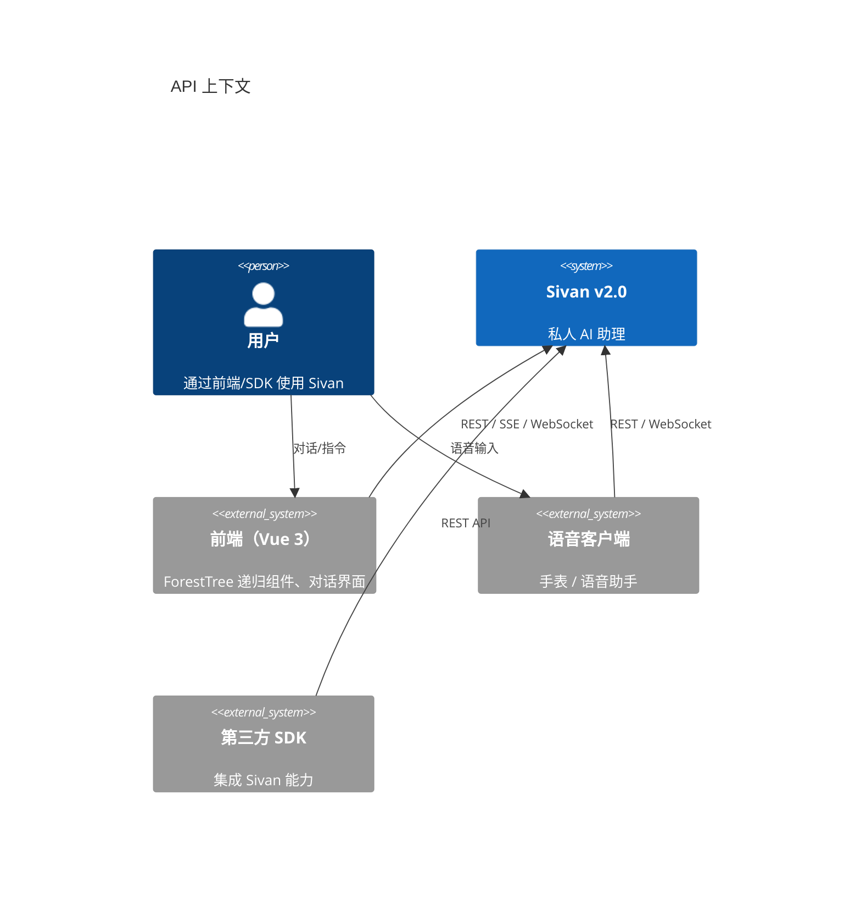
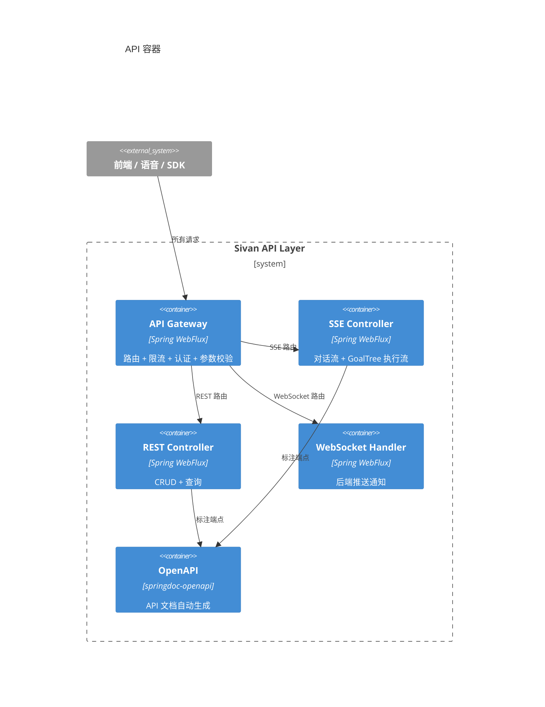
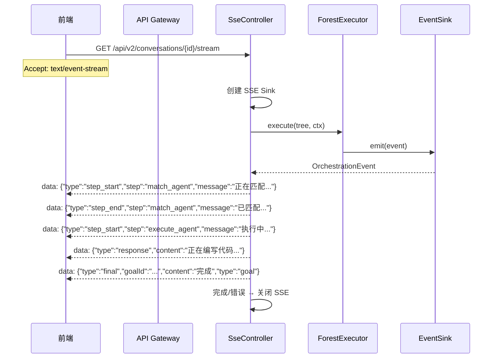

# API 契约

> 日期：2026-06-05
> 状态：设计草案

---

## 1. L1 — Context



**端点分类**：

| 类别 | 协议 | 用途 |
|---|---|---|
| 对话 | SSE（Server-Sent Events） | 实时对话 + GoalTree 执行流 |
| 查询 | REST JSON | GoalTree 进度、对话历史、模板管理 |
| 命令 | REST JSON | 创建/取消/暂停 GoalTree |
| 监听 | WebSocket | 后端主动推送（完成通知、异常告警） |
| 管理 | REST JSON | 用户配置、MCP 服务器管理 |

---

## 2. L2 — Container



---

## 3. L3 — 端点定义

### 3.1 SSE 对话流（核心）



SSE 事件协议：

```typescript
// 前端 TypeScript 类型定义

type SseEvent =
  | { type: 'step_start';  step: string; message: string }
  | { type: 'step_end';    step: string; message: string; meta?: Record<string, unknown> }
  | { type: 'response';    content: string }              // LLM token 块
  | { type: 'thinking';    content: string }              // 推理过程
  | { type: 'tool_call';   tool: string; inputSummary: string }
  | { type: 'tool_result'; tool: string; success: boolean; outputSummary: string }
  | { type: 'error';       message: string }
  | { type: 'final';       message?: string; [key: string]: unknown };
```

### 3.2 SSE 重连与续传

SSE 连接中断后，前端应能重连并恢复当前进度。

**断线重连协议**：
1. 前端持有所属 GoalTree 的 `forestId`。
2. 重连时发送 `Last-Event-ID`（SSE 标准字段），后端据此决定是否需要快照当前进度。
3. 后端提供快照端点：`GET /api/v2/goals/{forestId}/progress`，返回当前节点状态列表。
4. 前端重连后先获取快照恢复 UI 状态，再重新订阅 SSE 流。

```java
// 快照端点：断线重连时恢复进度
@GetMapping("/api/v2/goals/{forestId}/progress")
Flux<OrchestrationEvent> getProgress(@PathVariable String forestId) {
    return forestRepository.findProgressSnapshot(forestId); // 已持久化的节点状态
}

// SSE 端点（支持 Last-Event-ID）
@GetMapping(value = "/api/v2/conversations/{id}/stream", produces = MediaType.TEXT_EVENT_STREAM_VALUE)
Flux<ServerSentEvent<OrchestrationEvent>> stream(@PathVariable String id, 
    @RequestHeader("Last-Event-ID") Optional<String> lastEventId) {
    // lastEventId 可用于事件回放
}
```

### 3.3 REST 端点

```markdown
### GoalTree 管理

POST   /api/v2/goals                          — 创建 GoalTree（含自动拆解）
GET    /api/v2/goals                           — 列表（分页）
GET    /api/v2/goals/{goalId}                  — 详情（含进度树）
POST   /api/v2/goals/{goalId}/start            — 开始执行（返回 SSE 流）
DELETE /api/v2/goals/{goalId}                  — 取消执行

### 进度查询

GET    /api/v2/goals/{goalId}/progress         — 进度摘要（completed/total/activated）
GET    /api/v2/goals/{goalId}/tree             — 完整进度树（节点状态递归）
GET    /api/v2/conversations/{id}/progress     — 按对话查关联 GoalTree 进度

### 模板管理

GET    /api/v2/templates                        — 模板列表
POST   /api/v2/templates                        — 创建模板
PUT    /api/v2/templates/{id}                   — 更新模板
DELETE /api/v2/templates/{id}                   — 删除模板
POST   /api/v2/templates/{id}/instantiate       — 实例化为 GoalTree

### 对话

GET    /api/v2/conversations                    — 对话列表
POST   /api/v2/conversations/{id}/messages      — 发送消息（返回 SSE 流）

### MCP 服务器管理

GET    /api/v2/mcp/servers                      — 已连接的 MCP 服务器列表
POST   /api/v2/mcp/servers                      — 添加 MCP 服务器
DELETE /api/v2/mcp/servers/{serverId}           — 断开 MCP 服务器
GET    /api/v2/mcp/servers/{serverId}/tools     — 查看服务器提供的工具列表
```

---

## 4. L4 — Code

### 4.1 SSE Controller（核心）

```java
@RestController
@RequestMapping("/api/v2")
class ConversationController {

    private final ConversationService conversationService;

    @PostMapping("/conversations/{id}/messages")
    Flux<ServerSentEvent<?>> sendMessage(
        @PathVariable UUID id,
        @RequestBody SendMessageRequest request,
        @CurrentAccountId UUID accountId
    ) {
        return conversationService.handleMessage(id, request, accountId);
    }

    @GetMapping(value = "/conversations/{id}/stream", produces = MediaType.TEXT_EVENT_STREAM_VALUE)
    Flux<ServerSentEvent<?>> streamConversation(
        @PathVariable UUID id,
        @RequestParam(defaultValue = "STREAM") Delivery delivery,
        @CurrentAccountId UUID accountId
    ) {
        return conversationService.streamExecution(id, delivery, accountId);
    }
}
```

### 4.2 GoalController

```java
@RestController
@RequestMapping("/api/v2/goals")
class GoalController {

    private final GoalService goalService;

    @PostMapping
    Mono<GoalResponse> createGoal(@RequestBody CreateGoalRequest req, @CurrentAccountId UUID accountId) {
        return goalService.create(req, accountId);
    }

    @GetMapping
    Flux<GoalSummaryResponse> listGoals(
        @RequestParam(defaultValue = "0") int page,
        @RequestParam(defaultValue = "20") int size,
        @CurrentAccountId UUID accountId
    ) {
        return goalService.list(accountId, page, size);
    }

    @GetMapping("/{goalId}")
    Mono<GoalDetailResponse> getGoal(@PathVariable UUID goalId, @CurrentAccountId UUID accountId) {
        return goalService.getDetail(goalId, accountId);
    }

    @PostMapping("/{goalId}/start")
    Flux<ServerSentEvent<?>> startGoal(@PathVariable UUID goalId, @CurrentAccountId UUID accountId) {
        return goalService.startGoal(goalId, accountId);
    }

    @DeleteMapping("/{goalId}")
    Mono<Void> cancelGoal(@PathVariable UUID goalId, @CurrentAccountId UUID accountId) {
        return goalService.cancel(goalId, accountId);
    }

    @GetMapping("/{goalId}/progress")
    Mono<ProgressResponse> getProgress(@PathVariable UUID goalId, @CurrentAccountId UUID accountId) {
        return goalService.getProgress(goalId, accountId);
    }

    @GetMapping("/{goalId}/tree")
    Mono<ForestNodeResponse> getTree(@PathVariable UUID goalId, @CurrentAccountId UUID accountId) {
        return goalService.getTree(goalId, accountId);
    }
}
```

### 4.3 请求/响应 DTO

```java
// ———— 请求 ————

record SendMessageRequest(
    String content,
    @Nullable String targetAgent,      // 显式指定 Agent
    @Nullable String forceIntent,       // 强制的意图（调试用）
    Delivery delivery                   // STREAM / SUMMARY
) {}

record CreateGoalRequest(
    String title,
    String description,
    UUID conversationId
) {}

// ———— 响应 ————

record GoalSummaryResponse(
    UUID goalId,
    String title,
    String status,                // PENDING / ACTIVE / COMPLETED / FAILED
    int completedTasks,
    int totalTasks,
    LocalDateTime createdAt,
    LocalDateTime completedAt
) {}

record GoalDetailResponse(
    UUID goalId,
    String title,
    String description,
    String status,
    ProgressResponse progress,    // 含里程碑树
    LocalDateTime createdAt,
    LocalDateTime updatedAt,
    LocalDateTime completedAt
) {}

record ProgressResponse(
    int completed,
    int activated,
    int total,
    List<MilestoneProgress> milestones
) {
    record MilestoneProgress(
        String name,
        int order,
        String mode,              // SEQUENTIAL / PARALLEL / ...
        String status,            // completed / current / pending
        int completedTasks,
        int totalTasks
    ) {}
}

record ForestNodeResponse(
    String nodeId,
    String nodeType,
    String mode,
    String status,
    String content,
    List<ForestNodeResponse> children
) {}
```

### 4.4 错误码规范

```java
/**
 * 统一错误码。所有异常通过 @ExceptionHandler 转换为此格式返回。
 */
record ApiError(
    int code,
    String message,
    String detail,
    String path,
    Instant timestamp
) {
    static final int GOAL_NOT_FOUND = 40401;
    static final int GOAL_INVALID_STATE = 40001;
    static final int VALIDATION_ERROR = 40002;
    static final int TOOL_NOT_FOUND = 40402;
    static final int MODEL_NOT_FOUND = 40403;
    static final int POLICY_VIOLATION = 40301;
    static final int RATE_LIMITED = 42901;
    static final int INTERNAL_ERROR = 50000;
}

// 统一响应格式：
// {
//   "code": 40401,
//   "message": "目标不存在",
//   "detail": "goalId=550e8400-e29b-41d4-a716-446655440000 不存在或不属于当前账户",
//   "path": "/api/v2/goals/550e8400",
//   "timestamp": "2026-06-05T12:00:00Z"
// }
```

### 4.5 WebSocket 推送

```java
/**
 * WebSocket 用于后端主动推送（完成通知、异常告警）。
 * 不适合的场景用 SSE（SSE 更适合客户端发起、服务端流式返回）。
 */
@Configuration
class WebSocketConfig {

    @Bean
    HandlerMapping webSocketMapping(GoalNotificationHandler handler) {
        return new SimpleUrlHandlerMapping(Map.of(
            "/api/v2/ws/goals", handler
        ), 1);
    }
}

@Component
class GoalNotificationHandler extends TextWebSocketHandler {

    private final Map<String, WebSocketSession> sessions = new ConcurrentHashMap<>();

    @EventListener
    void onGoalTreeCompleted(GoalTreeCompleted event) {
        String sessionKey = event.accountId();
        WebSocketSession session = sessions.get(sessionKey);
        if (session != null && session.isOpen()) {
            session.sendMessage(new TextMessage("""
                {"type":"goal_completed","goalId":"%s","success":%s}
                """.formatted(event.rootNodeId(), event.success())));
        }
    }
}
```

### 5.1 移动端语音交付协议

手表/语音端通过 `POST /goals/voice` 提交任务后，有两种结果获取方式：

**方案 A（纯轮询）**：提交后返回 `forestId`，客户端每隔 5 秒轮询 `GET /api/v2/goals/{forestId}/progress` 获取进度。适用于手表端（资源受限，不适合维持长连接）。

**方案 B（WebSocket 推送）**：提交后建立 WebSocket 连接，服务端在 SUMMARY 完成后推送 `GoalTreeCompleted` 事件。适用于移动 App（可维持后台 WebSocket）。

**建议**：手表端走方案 A（轮询），移动端走方案 B（WebSocket）。轮询间隔统一为 5 秒（与 ProgressHeartbeat 节拍一致）。

---

## 5. 设计检查清单

### 实现状态（2026-06-12）

| # | 检查项 | 状态 | 说明 |
|---|--------|------|------|
| 1 | 新增一个端点需改几个文件 | ✅ | 只需 Controller 方法+可能 DTO |
| 2 | SSE 事件协议前后端一致 | ⚠️ | 文档 `step_start/step_end` 与实际 `phase_start/phase_end` 不匹配（前端实现优先） |
| 3 | 错误统一格式 | ✅ | `ApiError` record + `GlobalExceptionHandler` 使用 |
| 4 | 认证在所有端点强制 | ✅ | `@CurrentAccountId` 解析 JWT |
| 5 | WebSocket 推送 | ❌ | 未实现，当前由 SSE 替代方案覆盖 |
| 6 | API 文档自动生成 | ✅ | springdoc-openapi |
| 7 | GoalTree 模板 CRUD API | ✅ | `TemplateController` — GET/POST/PUT/DELETE `/api/v2/templates` + POST `/instantiate` |
| 8 | Goal 列表分页 | ✅ | `GET /api/v2/goals` 支持 page/size |
| 9 | Goal 详情 | ✅ | `GET /api/v2/goals/{goalId}` |
| 10 | MCP 路径前缀统一 | ✅ | `/api/v2/mcp-servers` |

### 与文档的差异说明

1. **创建即执行**：`POST /api/v2/goals` 创建后立即返回 SSE 流，文档的独立 `POST /start` 端点未实现（实践上合并更高效）
2. **SSE 流经 POST 而非 GET**：实际流式对话使用 `POST /{conversationId}/stream`，而非文档的 `GET /conversations/{id}/stream`
3. **WebSocket 暂未实现**：SSE 已覆盖核心推送需求，WebSocket 作为未来扩展保留
4. **事件协议差异**：前端实现的是编排阶段事件（`phase_start/phase_end/progress`），而非文档的步骤事件（`step_start/step_end`）
