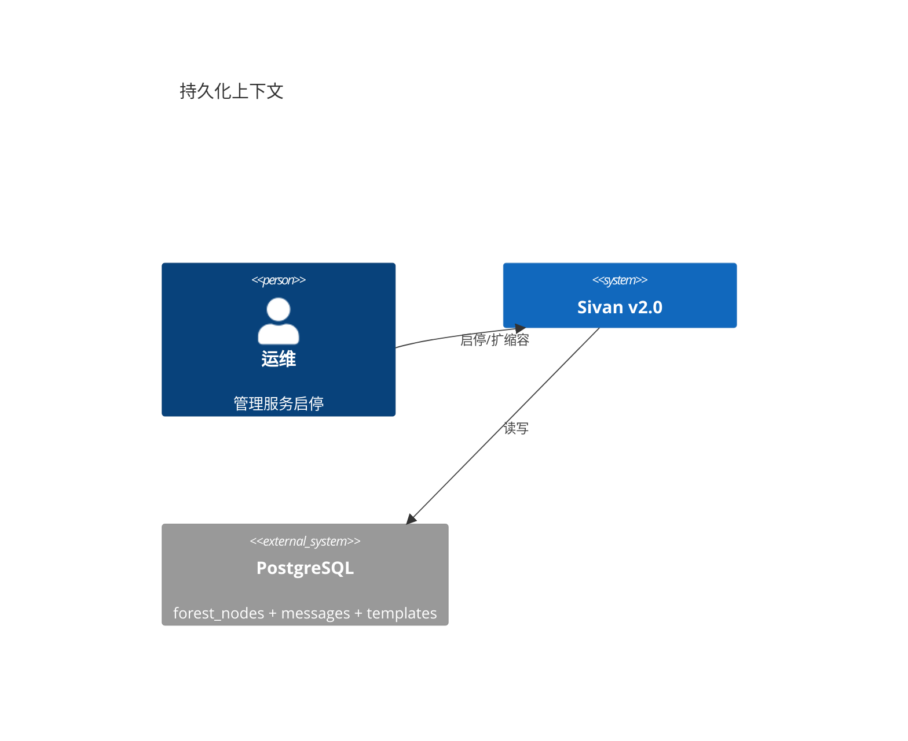
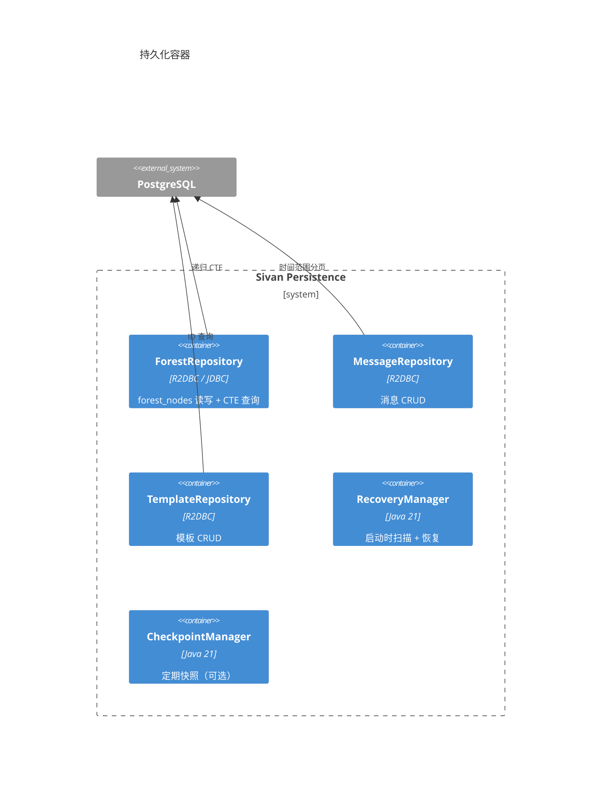
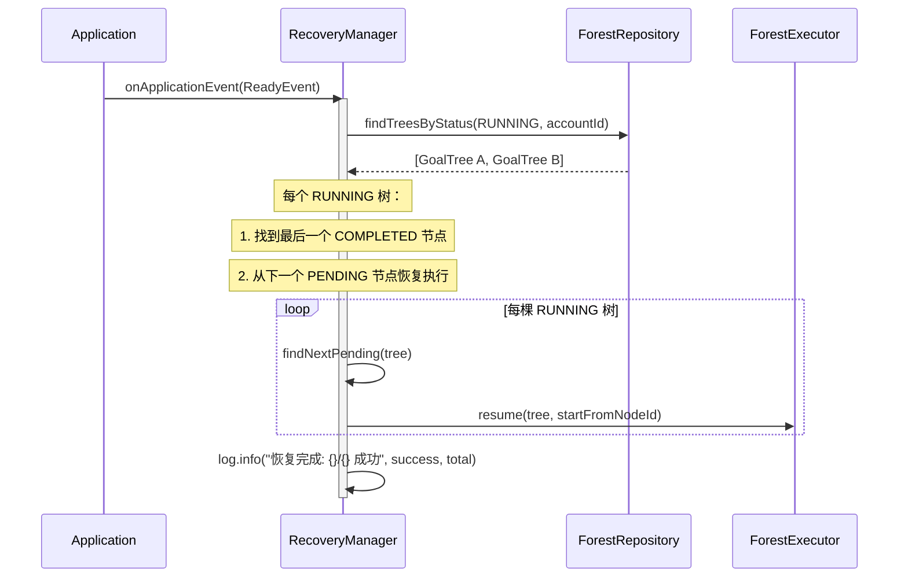
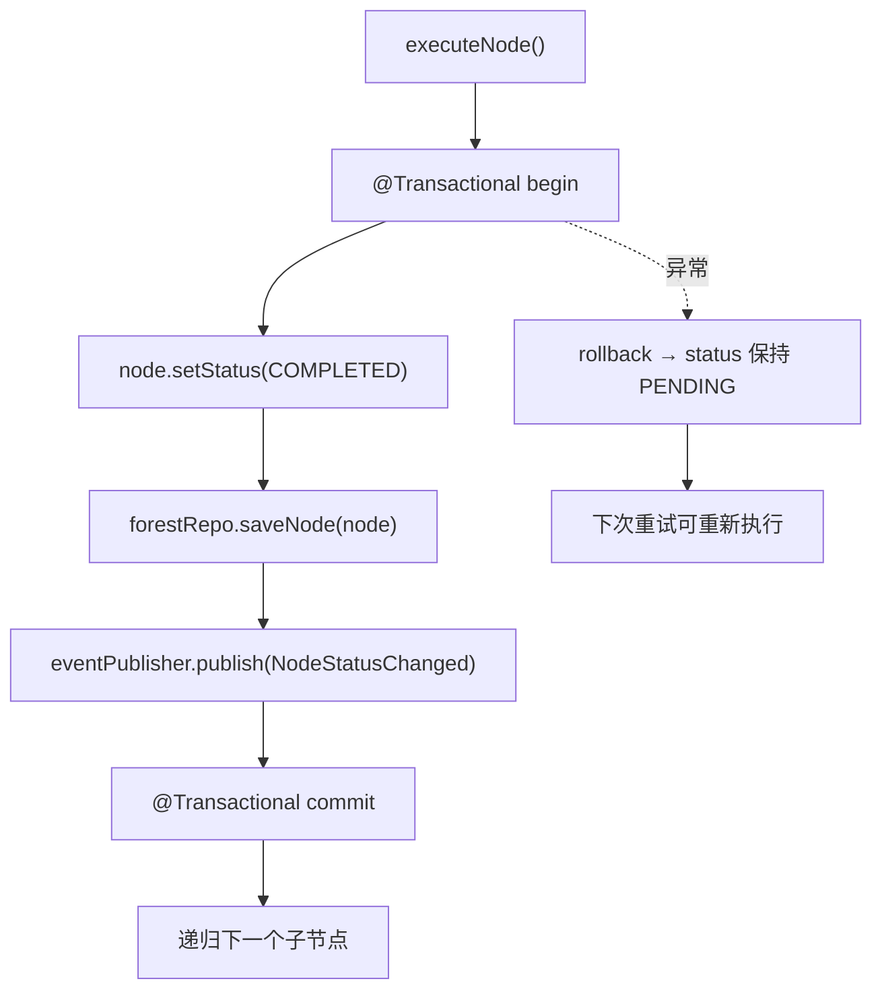

# 持久化与恢复

> 日期：2026-06-05
> 状态：设计草案

---

## 1. L1 — Context



**核心问题**：

| 场景 | 风险 | 解决 |
|---|---|---|
| 服务重启 | 所有 RUNNING 的 GoalTree 变为孤儿 | 启动时扫描 RUNNING 状态的树，重试恢复 |
| 进程崩溃 | 正在写入的节点 status 不一致 | `@Transactional` 保证单节点原子性 |
| 长时执行 | 单个 GoalTree 执行数小时，中间状态丢失 | 每个节点完成时持久化 status |
| 事件丢失 | 事件发布后订阅者未处理就崩溃 | 同步事件 + 单库事务，无需发件箱 |

---

## 2. L2 — Container



---

## 3. L3 — 恢复流程

### 3.1 启动恢复



### 3.2 节点原子性



---

## 4. L4 — Code

### 4.1 ForestRepository

```java
/**
 * 领域层接口。所有方法显式带 accountId 防止跨账号泄漏。
 */
interface ForestRepository {

    /** 加载整棵树（扁平节点 → ForestTreeBuilder 构建）。 */
    ForestNode findSubtree(UUID rootNodeId, UUID accountId);

    /** 按状态查询（用于启动恢复）。 */
    List<ForestNode> findTreesByStatus(NodeStatus status, UUID accountId);

    /** 查询某节点的下一个未执行兄弟（用于中断恢复）。 */
    Optional<ForestNode> findNextSibling(UUID nodeId, UUID accountId);

    /** 单节点更新。 */
    void saveNode(ForestNode node);

    /** 批量更新（整棵树一次写入）。 */
    void saveSubtree(ForestNode root);
}
```

### 4.2 R2DBC 实现

```java
@Component
class ForestRepositoryAdapter implements ForestRepository {

    private final DatabaseClient db;

    @Override
    public ForestNode findSubtree(UUID rootNodeId, UUID accountId) {
        List<ForestNodeEntity> rows = db.sql("""
            WITH RECURSIVE subtree AS (
                SELECT * FROM forest_nodes WHERE node_id = :rootId
                UNION ALL
                SELECT n.* FROM forest_nodes n
                JOIN subtree s ON n.parent_id = s.node_id
            )
            SELECT * FROM subtree s
            JOIN forests f ON f.forest_id = s.forest_id
            WHERE f.account_id = :accountId
            ORDER BY s."order"
            """)
            .bind("rootId", rootNodeId)
            .bind("accountId", accountId)
            .all()
            .collectList()
            .block();

        return ForestTreeBuilder.build(rows);
    }

#### CTE 分页限制

递归 CTE 的结果集不稳定，不支持传统 `OFFSET/LIMIT` 分页。如果需要对 `forest_nodes` 做列表分页（如查看某棵树下所有叶子节点），应使用替代方案：

1. **物化路径法**：在 `forest_nodes` 表增加 `path` 列（如 `rootId/1/2/5`），对叶子节点分页时使用 B-tree 索引的 `path` 前缀匹配 + `OFFSET/LIMIT`。
2. **仅查询叶子节点**：`SELECT * FROM forest_nodes WHERE parent_id IS NOT NULL AND children_ids = '{}'`（利用 GIN 索引的 `@>` 查询），不走 CTE。
3. **前端增量加载**：ForestTree 组件按需加载子节点（展开时查询 `WHERE parent_id = ?`），避免一次性加载整棵树。

**建议**：v2.0 使用方案 3（前端按需加载）为主，方案 1（物化路径）作为深树列表分页的后备。

    @Override
    public void saveNode(ForestNode node) {
        db.sql("""
            INSERT INTO forest_nodes (node_id, forest_id, node_type, parent_id, "order",
                   mode, status, content, importance, estimate_tokens, metadata, updated_at)
            VALUES (:nodeId, :forestId, :nodeType, :parentId, :order,
                    :mode, :status, :content, :importance, :tokens, :metadata::jsonb, NOW())
            ON CONFLICT (node_id) DO UPDATE SET
                status = EXCLUDED.status,
                content = EXCLUDED.content,
                updated_at = NOW()
            """)
            .bindValues(nodeToMap(node))
            .then()
            .block();
    }

#### 批量写入优化

高频场景下每个节点独立 `INSERT ... ON CONFLICT UPDATE` 会产生大量行锁和 WAL 日志。

**优化方案**：
1. **批量 flush**：PARALLEL 模式下子节点完成时，暂不立即持久化，由 `ProgressHeartbeat` 每 5 秒统一 flush 一次脏节点（`dirtyNodes` 列表）。
2. **批量 SQL**：使用 `INSERT INTO forest_nodes (...) VALUES (...), (...), ... ON CONFLICT DO UPDATE`，单次 SQL 写入多个节点。
3. **异步写入**：非关键路径的状态更新（如进度百分比）写入 `forest_node_progress` 表，与主表分离，减少主表写竞争。

```java
@Component
class BatchNodeFlusher {
    private final List<TreeNode> buffer = new ArrayList<>();

    @Scheduled(fixedRate = 5000)
    void flush() {
        if (buffer.isEmpty()) return;
        List<TreeNode> batch = new ArrayList<>(buffer);
        buffer.clear();
        repo.batchSave(batch);  // 批量 INSERT
    }
}
```

}
```

### 4.3 RecoveryManager

```java
@Component
class RecoveryManager {

    private final ForestRepository forestRepo;
    private final AccountRepository accountRepo;
    private final ForestExecutor executor;

    /** 应用启动时自动执行。 */
    @EventListener(ApplicationReadyEvent.class)
    void recoverOnStartup() {
        // 遍历所有活跃账号，分别恢复各账号下 RUNNING 状态的 GoalTree
        List<UUID> activeAccounts = accountRepo.findAllActiveIds();
        int success = 0;
        for (UUID accountId : activeAccounts) {
            List<ForestNode> runningTrees = forestRepo.findTreesByStatus(RUNNING, accountId);

        if (runningTrees.isEmpty()) {
            log.info("无需要恢复的 GoalTree");
            return;
        }

        log.info("发现 {} 个待恢复的 GoalTree", runningTrees.size());
        int success = 0;

        for (ForestNode root : runningTrees) {
            try {
                resumeTree(root);
                success++;
            } catch (Exception e) {
                log.error("GoalTree 恢复失败: goalId={}", root.nodeId(), e);
                root.setStatus(FAILED);
                forestRepo.saveNode(root);
            }
        }

        log.info("恢复完成: {}/{}", success, runningTrees.size());
    }

    /** 从断点恢复一棵树。 */
    private void resumeTree(ForestNode root) {
        // 1. 找到最后一个 COMPLETED 的叶子
        ForestNode lastComplete = findLastCompleted(root);

        // 2. 从下一个 PENDING 节点恢复
        ForestNode nextPending = (lastComplete != null)
            ? forestRepo.findNextSibling(lastComplete.nodeId(), null).orElse(null)
            : root; // 没有已完成节点 → 从头开始

        if (nextPending == null) {
            // 所有节点已完成 → 标记完成
            root.setStatus(COMPLETED);
            forestRepo.saveNode(root);
            return;
        }

        // 3. 从断点继续执行
        executor.execute(nextPending, ExecutionContext.create(root.accountId()))
            .subscribe();
    }

    /** 深度遍历找最后一个 COMPLETED 叶子。 */
    private ForestNode findLastCompleted(ForestNode node) {
        if (node.isLeaf() && node.status() == COMPLETED) return node;
        ForestNode last = null;
        for (ForestNode child : node.children()) {
            ForestNode found = findLastCompleted(child);
            if (found != null) last = found;
        }
        return last;
    }
}
```

### 4.4 事务边界

持久化分为两个独立的事务边界，避免长事务和全量回滚：

**边界一：森林结构持久化** — `GoalExecutionService.persistForestStructure()`

```java
// 通过 TransactionTemplate 开启独立事务，快速提交
// 即使后续执行失败，DB 中也有完整的森林结构记录
private void persistForestStructure(Forest forest, ExecutableNode root, ExecutionContext ctx) {
    transactionTemplate.executeWithoutResult(status -> {
        forestRepo.saveForest(forest, ctx.accountId());
        forestRepo.saveTree(root, forest.forestId(), ctx.accountId());
    });
}
```

**边界二（可选）：节点状态原子写入** — 由 `NodeStatusPersistenceListener` 处理

```java
// 在 @Transactional 上下文中调用时，与调用方共享事务；
// 在响应式流水线中，作为独立写入执行
@EventListener
public void onNodeStatusChanged(NodeStatusChanged event) {
    forestRepository.updateNodeStatus(event.nodeId(), event.newStatus(), accountId);
}
```

引擎执行本身不包裹事务，节点状态通过事件驱动逐条持久化，
单个节点失败不影响整棵树，也符合设计文档 §3.2 的节点级原子性。
```

### 4.5 领域事件的事务保证

Spring `ApplicationEventPublisher` + `@TransactionalEventListener` 保证：

```java
@Component
class EventConsistencyConfig {

    /**
     * 默认同步模式：发布者和订阅者在同一个事务中。
     * 订阅者异常 → 事务回滚 → 节点 status 恢复 PENDING。
     */
    @Bean
    ApplicationEventPublisher publisher(ApplicationEventPublisher raw) {
        return raw; // Spring 默认同步实现
    }

    /**
     * 需要异步处理的订阅者用 @Async。
     * 注意：异步订阅者的事务独立于发布者。
     */
    @Component
    static class AsyncSubscriber {

        @Async
        @TransactionalEventListener(phase = TransactionPhase.AFTER_COMMIT)
        void onGoalTreeCompleted(GoalTreeCompleted event) {
            // 事务已提交，节点已持久化
            // 此方法在任何事务外运行，失败不影响主流程
            notificationService.notifyUser(event);
        }
    }
}
```

---

## 5. 异常场景处理

| 场景 | 发生阶段 | 后果 | 防护 |
|---|---|---|---|
| `saveNode` 失败 | 写入 DB | 节点 status 未更新 | `@Transactional` 回滚，下次重试 |
| `eventPublisher` 异常 | 发布事件 | 事务回滚，status 恢复 | 回滚后不丢失 |
| 订阅者异常（同步） | 事件处理 | 事务回滚，status 恢复 | 同前 |
| 订阅者异常（异步） | 事件处理 | 事件丢失 | `@Async` + 失败日志 + 手动恢复 |
| 递归执行异常 | 执行节点 | 当前节点 FAILED，父线程捕获 | `doOnError` 设 FAILED + 记录 |
| 服务器崩溃 | 任意时刻 | 部分节点更新已写入 | RecoveryManager 启动时扫描 |

---

## 6. 设计检查清单

### 实现状态（2026-06-12）

| # | 检查项 | 状态 | 说明 |
|---|--------|------|------|
| 1 | 节点 status 变更事务性 | ⚠️ | 响应式流水线不兼容 `@Transactional`，通过 `emitStatusChange()` 事件驱动逐条持久化，单节点失败不影响整棵树 |
| 2 | 启动时自动恢复 RUNNING 树 | ✅ | `RecoveryManager` — `@EventListener(ApplicationReadyEvent.class)` 触发，扫描所有 RUNNING 根节点，找最后一个 COMPLETED 叶子，从下一个 PENDING 恢复 |
| 3 | 事件发布在事务内，失败回滚 | ✅ | Spring 默认同步事件模式，发布者和订阅者在同一事务 |
| 4 | 异步订阅者失败不影响主流程 | ✅ | `EventConsistencyConfig` — `@Async` + `@TransactionalEventListener(phase = AFTER_COMMIT)` |
| 5 | 递归执行异常设置 FAILED | ✅ | `ForestExecutor.doExecute()` 中 `onErrorResume` 设置 `NodeStatus.FAILED` + publish 失败事件 |
| 6 | 所有 Repository 方法带 accountId | ✅ | 接口强制 accountId 参数 |
| 7 | `findTreesByStatus` | ✅ | `ForestRepository.findRootNodesByStatus(status, accountId)` + 跨账号全局扫描 `findAllRootNodesByStatus` |
| 8 | `findNextSibling` | ✅ | `ForestRepository.findNextSibling(nodeId, forestId, accountId)` — 按 sort_order 查同父下一个 PENDING 兄弟 |

### 实现文件

| 组件 | 路径 |
|------|------|
| `RecoveryManager` | `sivan-infra/.../forest/execution/RecoveryManager.java` |
| `EventConsistencyConfig` | `sivan-infra/.../forest/execution/EventConsistencyConfig.java` |
| `ForestRepository.findRootNodesByStatus` | `sivan-domain/.../forest/service/ForestRepository.java` |
| `ForestRepository.findNextSibling` | `sivan-domain/.../forest/service/ForestRepository.java` |
| `ForestNodeJpaRepository.findAllRootNodesByStatus` | `sivan-infra/.../forest/repository/ForestNodeJpaRepository.java` |
| `ForestNodeJpaRepository.findNextPendingSibling` | `sivan-infra/.../forest/repository/ForestNodeJpaRepository.java` |
