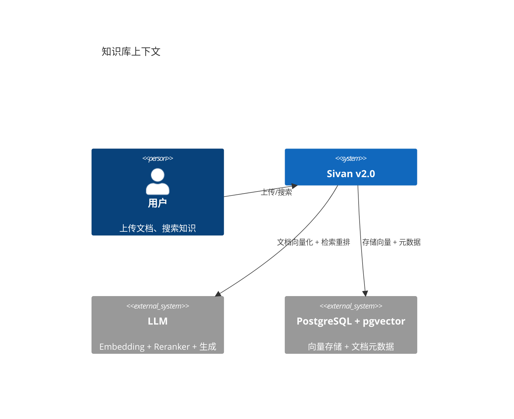
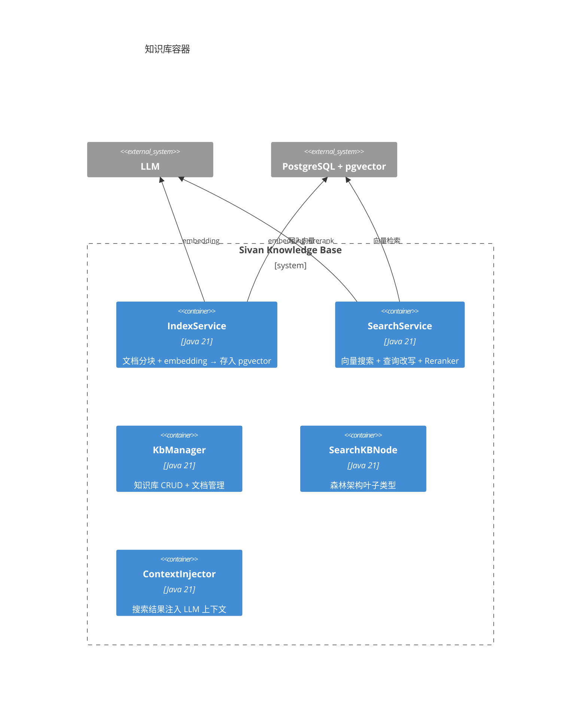
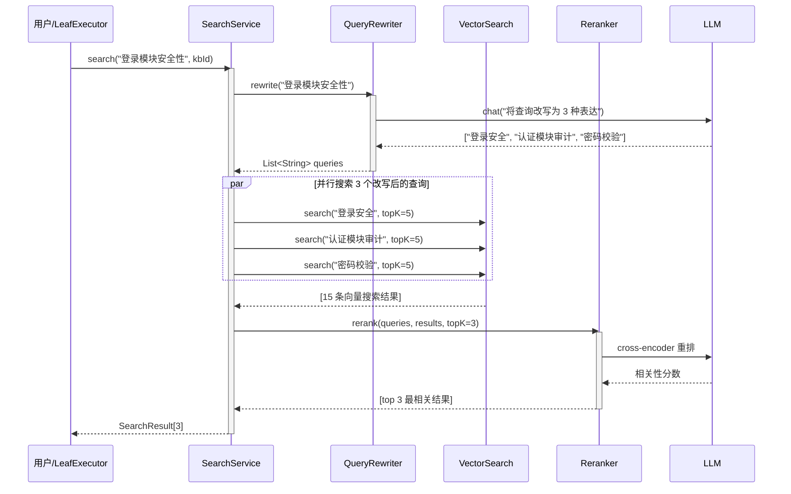
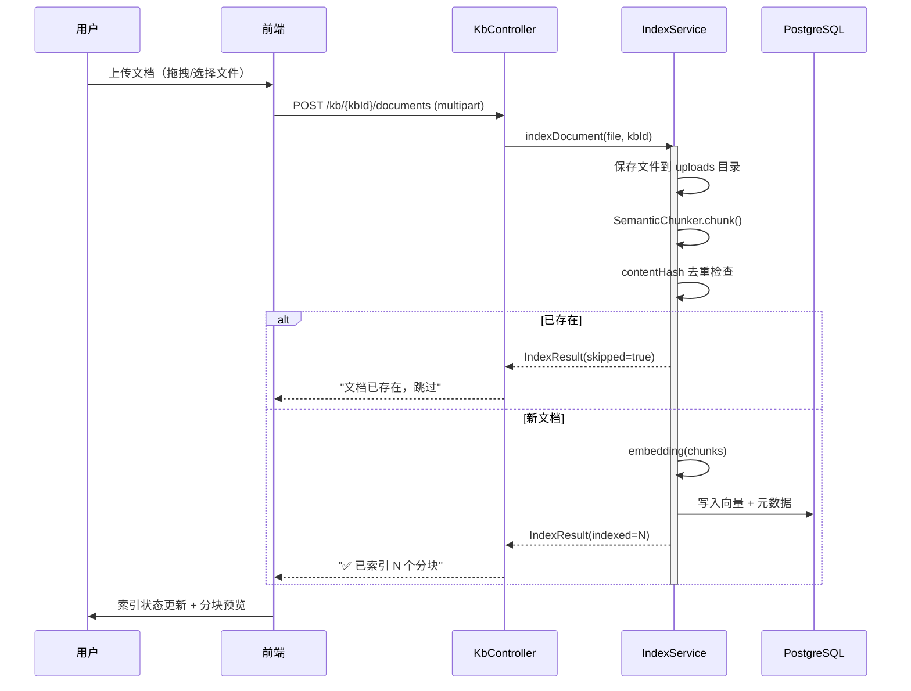

# 知识库与 RAG

> 日期：2026-06-05
> 状态：设计草案

---

## 1. L1 — Context



**核心能力**：

| 能力 | v1.0 现状 | v2.0 目标 |
|---|---|---|
| 文档索引 | 上传 → embedding → 存储 | + 语义分块 + 增量索引 + 内容哈希去重 |
| 搜索 | 基础向量搜索 | + 查询改写 + 多向量融合 + Reranker 重排 |
| 集成 | 仅对话注入 | + SearchKBNode 叶子类型 + ForestCompressor 自动注入 |
| 知识管理 | 无 | 知识库 CRUD、文档增删、来源追溯 |

---

## 2. L2 — Container



---

## 3. L3 — Component

### 3.1 索引流水线


### 3.2 搜索流水线



---

## 4. L4 — Code

### 4.1 索引服务

```java
@Component
class IndexService {

    private final EmbeddingService embedding;
    private final SemanticChunker chunker;
    private final VectorRepository vectorRepo;

    /** 索引一个文档。contentHash 相同则跳过。 */
    Mono<IndexResult> indexDocument(Document doc) {
        // 1. 分块
        List<Chunk> chunks = chunker.chunk(doc.content(), doc.format());

        // 2. 逐块检查去重
        return Flux.fromIterable(chunks)
            .flatMap(chunk -> {
                if (vectorRepo.existsByContentHash(chunk.contentHash())) {
                    return Mono.just(IndexResult.skipped(chunk));
                }
                return embedding.embed(chunk.text())
                    .flatMap(vector -> {
                        vectorRepo.save(VectorRecord.builder()
                            .chunkId(chunk.chunkId())
                            .kbId(doc.kbId())
                            .documentId(doc.documentId())
                            .content(chunk.text())
                            .contentHash(chunk.contentHash())
                            .embedding(vector)
                            .build());
                        return Mono.just(IndexResult.indexed(chunk));
                    });
            })
            .reduce(new IndexResult(0, 0), (acc, r) ->
                new IndexResult(acc.indexed() + (r.indexed() > 0 ? 1 : 0),
                                acc.skipped() + (r.skipped() > 0 ? 1 : 0)));
    }
}

record IndexResult(int indexed, int skipped) {}
```

### 4.2 SemanticChunker

```java
/**
 * 语义分块——三层次检测。
 * 1. Markdown 标题（## / ###）
 * 2. 代码块（```）
 * 3. 句子边界（。！？）
 */
class SemanticChunker {

    List<Chunk> chunk(String content, String format) {
        List<Chunk> chunks = new ArrayList<>();

        if ("markdown".equals(format)) {
            // 按标题分割
            String[] sections = content.split("(?=^###? )");
            for (int i = 0; i < sections.length; i++) {
                chunks.add(new Chunk(UUID.randomUUID().toString(), sections[i], hash(sections[i])));
            }
        } else {
            // 普通文本：按 500 字符分段，在句子边界分割
            String[] sentences = content.split("(?<=[。！？\n])");
            StringBuilder current = new StringBuilder();
            for (String s : sentences) {
                if (current.length() + s.length() > 500 && current.length() > 0) {
                    chunks.add(new Chunk(UUID.randomUUID().toString(), current.toString().strip(), hash(current.toString())));
                    current = new StringBuilder();
                }
                current.append(s);
            }
            if (current.length() > 0) {
                chunks.add(new Chunk(UUID.randomUUID().toString(), current.toString().strip(), hash(current.toString())));
            }
        }
        return chunks;
    }

    private String hash(String text) {
        return DigestUtils.sha256Hex(text);
    }
}

record Chunk(String chunkId, String text, String contentHash) {}
```

### 4.3 搜索服务

```java
@Component
class SearchService {

    private final EmbeddingService embedding;
    private final Reranker reranker;
    private final QueryRewriter queryRewriter;
    private final VectorRepository vectorRepo;

    /** 搜索并重排，返回 topK 结果。 */
    Mono<SearchResponse> search(String query, UUID kbId, int topK) {

        // 1. 查询改写：如果启用
        return queryRewriter.rewrite(query)
            .flatMapMany(Flux::fromIterable)
            .flatMap(rewritten -> {
                // 2. 向量搜索（每个改写查询独立超时，默认 10 秒）
                return embedding.embed(rewritten)
                    .flatMap(vec -> vectorRepo.search(vec, kbId, topK))
                    .timeout(Duration.ofSeconds(10));
            }, 3)  // 最多 3 个并发查询
            .collectList()
            .flatMap(allResults -> {
                // 3. 合并去重
                List<VectorRecord> deduped = deduplicate(allResults);

                // 4. Reranker 重排
                return reranker.rerank(query, deduped, topK)
                    .map(ranked -> new SearchResponse(ranked, ranked.size()));
            });
    }

    private List<VectorRecord> deduplicate(List<VectorRecord> results) {
        Set<String> seen = new HashSet<>();
        return results.stream()
            .filter(r -> seen.add(r.chunkId()))
            .toList();
    }
}
```

### 4.4 查询改写

```java
@Component
class QueryRewriter {

    private final ModelRouter router;

    /**
     * 将原始查询改写为多个表达，扩大召回。
     * 通过 LLM 一次调用生成。
     */
    Mono<List<String>> rewrite(String original) {
        return router.defaultModel().complete(List.of(
            Msg.of(Role.SYSTEM, "将用户查询改写为 3 种不同的表达。每行一条，不要序号。"),
            Msg.of(Role.USER, original)
        )).map(response -> {
            List<String> queries = new ArrayList<>();
            queries.add(original); // 保留原查询
            for (String line : response.text().split("\n")) {
                String q = line.strip();
                if (!q.isEmpty()) queries.add(q);
            }
            return queries;
        });
    }
}
```

### 4.5 SearchKBNode 叶子类型

```java
/**
 * 知识库搜索叶子节点。
 * 出现在 GoalTree 中需要查询知识库的阶段。
 */
class SearchKBNode extends ExecutableNode {
    String query;
    String kbId;       // 指定知识库，null = 全部
    int topK;

    @Override public String nodeType() { return "kb_search"; }
}

@Component
class SearchKBLeafExecutor implements LeafExecutor {

    private final SearchService searchService;
    private final ContextInjector injector;

    @Override
    public String supportedType() { return "kb_search"; }

    @Override
    public Flux<OrchestrationEvent> execute(ForestNode node, ExecutionContext ctx, EventSink sink) {
        SearchKBNode kbNode = (SearchKBNode) node;

        return searchService.search(kbNode.query, kbNode.kbId, kbNode.topK)
            .flatMapMany(result -> {
                // 将搜索结果注入到后续节点的上下文中
                injector.inject(result, ctx);
                return Flux.just(OrchestrationEvent.complete(Map.of(
                    "type", "kb_search",
                    "query", kbNode.query,
                    "results", result.count()
                )));
            });
    }
}
```

### 4.6 与 ForestCompressor 的上下文集成

```java
@Component
class ContextInjector {

    /**
     * 将搜索结果格式化为 LLM 可用的上下文文本。
     * 在 ForestCompressor.compress() 中被调用。
     */
    String formatForPrompt(List<SearchResultItem> results) {
        StringBuilder sb = new StringBuilder("## 相关知识\n");
        for (SearchResultItem item : results) {
            sb.append("- [").append(item.score()).append("] ")
              .append(item.content()).append("\n");
        }
        return sb.toString();
    }
}
```

---

## 5. 外部知识库连接器框架（G4）

### 5.1 连接器接口

每个外部数据源实现一个 `Connector`，通过 MCP 协议查询。

```java
interface KnowledgeConnector {
    /** 连接器标识，如 "confluence"、"slack"。 */
    String connectorId();

    /** 支持的索引模式。 */
    IndexMode defaultIndexMode();

    /** 搜索外部数据源（ON_DEMAND 模式，默认）。 */
    Mono<List<SearchResultItem>> search(String query, int topK, UUID accountId);

    /** 索引外部数据到本地 pgvector（SYNC 模式，可选）。 */
    Mono<Void> syncIndex(UUID accountId);
}

enum IndexMode {
    ON_DEMAND,  // 实时查询外部 API，不存储（默认，隐私优先）
    SYNC        // 同步到本地 pgvector 后搜索
}

record SearchResultItem(String content, String source, String url, float score) {}
record SearchResponse(List<VectorRecord> items, int count) {}
```

### 5.2 预置连接器

```java
@Component
class SlackConnector implements KnowledgeConnector {
    @Override public String connectorId() { return "slack"; }
    @Override public IndexMode defaultIndexMode() { return IndexMode.ON_DEMAND; }

    @Override
    public Mono<List<SearchResult>> search(String query, int topK, UUID accountId) {
        // 使用用户授权的 Slack API Token 实时查询
        return slackClient.searchMessages(query, topK);
    }
}

@Component
class ConfluenceConnector implements KnowledgeConnector {
    @Override public String connectorId() { return "confluence"; }
    @Override public IndexMode defaultIndexMode() { return IndexMode.ON_DEMAND; }

    @Override
    public Mono<List<SearchResult>> search(String query, int topK, UUID accountId) {
        return confluenceClient.search(query, topK);
    }
}
```

### 5.3 连接器注册表

```java
@Component
class ConnectorRegistry {

    private final Map<String, KnowledgeConnector> connectors;

    ConnectorRegistry(List<KnowledgeConnector> connectorList) {
        this.connectors = connectorList.stream()
            .collect(Collectors.toMap(KnowledgeConnector::connectorId, Function.identity()));
    }

    /** 搜索所有已启用的连接器。 */
    Flux<SearchResult> searchAll(String query, int topK, UUID accountId) {
        return Flux.fromIterable(connectors.values())
            .flatMap(c -> c.search(query, topK / connectors.size(), accountId));
    }
}
```

---

## 6. 知识库管理

知识库不仅是搜索工具，还需要完整的管理功能来支撑文档的上传、索引监控和内容维护。

### 6.1 管理 API

```java
// ===== 知识库 CRUD =====

@RestController
@RequestMapping("/api/v2/knowledge-bases")
class KbController {

    @GetMapping                     // 列出知识库
    Flux<KbSummary> list(UUID accountId);

    @PostMapping                    // 创建知识库
    Mono<KbDetail> create(@RequestBody CreateKbRequest req, UUID accountId);

    @GetMapping("/{kbId}")          // 查看详情（含文档统计）
    Mono<KbDetail> detail(@PathVariable UUID kbId, UUID accountId);

    @PutMapping("/{kbId}")          // 更新配置（名称/描述/检索策略）
    Mono<KbDetail> update(@PathVariable UUID kbId, @RequestBody UpdateKbRequest req, UUID accountId);

    @DeleteMapping("/{kbId}")       // 删除知识库（含所有文档和向量）
    Mono<Void> delete(@PathVariable UUID kbId, UUID accountId);

    @PostMapping("/{kbId}/reindex") // 全量重建索引
    Mono<Void> reindex(@PathVariable UUID kbId, UUID accountId);
}

// ===== 文档管理 =====

@RestController
@RequestMapping("/api/v2/knowledge-bases/{kbId}/documents")
class KbDocumentController {

    @GetMapping                     // 列出文档（含索引状态）
    Flux<DocumentSummary> list(@PathVariable UUID kbId, UUID accountId,
                                @RequestParam(defaultValue = "0") int page,
                                @RequestParam(defaultValue = "20") int size);

    @PostMapping                    // 上传文档（支持多格式）
    Mono<DocumentDetail> upload(@PathVariable UUID kbId,
                                @RequestParam("file") MultipartFile file,
                                UUID accountId);

    @DeleteMapping("/{docId}")      // 删除文档（含向量）
    Mono<Void> delete(@PathVariable UUID kbId, @PathVariable UUID docId, UUID accountId);

    @PostMapping("/{docId}/reindex") // 重新索引单篇文档
    Mono<IndexResult> reindex(@PathVariable UUID kbId, @PathVariable UUID docId, UUID accountId);

    @GetMapping("/{docId}/chunks")  // 查看文档的分块详情
    Flux<ChunkDetail> chunks(@PathVariable UUID kbId, @PathVariable UUID docId, UUID accountId);
}
```

### 6.2 实体模型

```java
/** 知识库。一个知识库包含多篇文档，独立配置检索策略。 */
class KnowledgeBase {
    UUID kbId;
    UUID accountId;
    UUID projectId;

    String name;
    String description;

    /** 检索策略配置。 */
    RetrievalConfig retrievalConfig;

    /** 统计（定期刷新，非实时）。 */
    int documentCount;
    int chunkCount;
    IndexStatus indexStatus;     // COMPLETE / PARTIAL / BUILDING / STALE
    LocalDateTime lastIndexedAt;

    boolean active;
    LocalDateTime createdAt;
    LocalDateTime updatedAt;
}

/** 文档。一篇被上传到知识库的原始文件。 */
class Document {
    UUID documentId;
    UUID kbId;

    String fileName;
    String filePath;             // 存储在 uploads 目录的实际路径
    String fileFormat;           // markdown / pdf / txt / code
    long fileSize;

    /** 索引状态。 */
    DocumentIndexStatus indexStatus;  // PENDING / INDEXED / FAILED / SKIPPED
    int chunkCount;
    String errorMessage;              // 索引失败时的错误信息

    String contentHash;               // 全文哈希，用于去重
    LocalDateTime createdAt;
    LocalDateTime indexedAt;
}

/** 检索策略配置。可在知识库级别独立配置。 */
record RetrievalConfig(
    boolean expandQuery,              // 是否启用查询改写
    int topK,                         // 检索返回条数（默认 5）
    int rerankTopK,                   // 重排后返回条数（默认 3）
    double similarityThreshold,       // 相似度阈值（默认 0.65）
    String rerankerModel,             // 重排模型名称（null 表示不启用）
    ChunkStrategy chunkStrategy       // 分块策略
) {
    static RetrievalConfig defaults() {
        return new RetrievalConfig(true, 5, 3, 0.65, null, ChunkStrategy.AUTO);
    }
}

enum ChunkStrategy {
    AUTO,        // 自动检测格式选择最佳分块
    MARKDOWN,    // 按 Markdown 标题分块
    SEMANTIC,    // 按语义边界分块
    FIXED_SIZE   // 按固定大小分块
}
```

### 6.3 索引状态管理

| 状态 | 含义 | 用户可见提示 |
|------|------|------------|
| `COMPLETE` | 所有文档已成功索引 | ✅ 已就绪 |
| `PARTIAL` | 部分文档索引成功，部分失败 | ⚠️ N/M 文档索引失败 |
| `BUILDING` | 正在索引中 | 🔄 正在索引… |
| `STALE` | 文档已更新但未重新索引 | ⏳ 需要重新索引 |

文档级别的索引状态在文档列表中实时展示：

```
📄 架构设计文档.md       ✅ 已索引 (12 分块)
📄 需求规格说明书.pdf     ✅ 已索引 (45 分块)
📄 旧版接口文档.md       ⚠️ 索引失败: 格式不支持
📄 新上传的代码.txt      🔄 排队中…
```

前端提供筛选器按索引状态过滤文档列表，方便用户定位失败的文档并重新索引。

### 6.4 管理流程：上传 → 索引 → 验证



### 6.5 前端 KbPanel 组件扩展

知识库面板需要包含以下功能区：

```
┌─ 知识库面板 ──────────────────────┐
│                                    │
│  [📁 项目文档]   检索设置 ⚙️  [+] 新建 │
│  🔄 已就绪 - 3 文档 / 67 分块      │
│                                    │
│  ┌─ 文档列表 ────────────────────┐ │
│  │ 📄 架构设计.docx    ✅  12 块  │ │
│  │ 📄 API 规范.md      ✅  8 块   │ │
│  │ 📄 需求文档.pdf     ⚠️ 失败    │ │
│  │                              │ │
│  │ 拖拽文件到此处或点击上传       │ │
│  └──────────────────────────────┘ │
│                                    │
│  [🔍 搜索测试]                     │
│  ┌──────────────────────────────┐ │
│  │ 输入测试查询…           [搜索]│ │
│  └──────────────────────────────┘ │
│  搜索结果预览：                    │
│  ┌──────────────────────────────┐ │
│  │ 0.92 | 架构设计.docx §3.1     │ │
│  │ 0.85 | API 规范.md §2.4      │ │
│  └──────────────────────────────┘ │
└────────────────────────────────────┘
```

| 功能区 | 说明 |
|--------|------|
| 知识库选择器 | 下拉切换当前项目下的知识库 |
| 检索设置 | 展开面板配置 topK/阈值/查询改写开关 |
| 文档列表 | 含索引状态、分块数、上传时间、重新索引按钮 |
| 上传区 | 拖拽或选择文件，自动触发索引 |
| 搜索测试 | 输入查询关键词，实时预览检索结果质量 |

---

## 7. 设计检查清单

- [ ] 新增一种检索策略需要改几个文件？→ 1 个（实现 `RetrievalStrategy`）
- [ ] 新增一个外部数据源需要改几个文件？→ 1 个（实现 `KnowledgeConnector`）
- [ ] 索引是否支持增量更新（contentHash 去重）？→ 是
- [ ] 搜索是否支持查询改写 + 多向量融合？→ 是
- [ ] 默认索引模式是否为 ON_DEMAND（隐私优先）？→ 是
- [ ] Reranker 是否可插拔？→ 是，`Reranker` 接口
- [ ] 知识库搜索是否可作为 GoalTree 的叶子节点？→ 是，`SearchKBNode`
- [ ] 搜索结果是否自动注入 LLM 上下文？→ 是，`ContextInjector`
