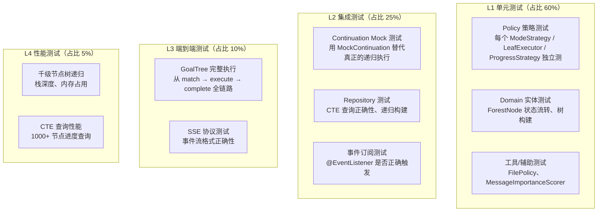

# 测试策略

> 日期：2026-06-05
> 状态：设计草案

---

## 1. 测试分层



---

## 2. L1 单元测试

### 2.1 ModeStrategy 测试

```java
class SequentialModeStrategyTest {

    private final SequentialModeStrategy strategy = new SequentialModeStrategy();

    @Test
    void shouldExecuteChildrenInOrder() {
        var node = new InnerGoalNode(SEQUENTIAL, List.of(
            new TaskNode("A"),
            new TaskNode("B"),
            new TaskNode("C")
        ));

        // Mock Continuation：记录执行顺序
        List<String> order = new ArrayList<>();
        Continuation mock = (child, ctx, depth) -> {
            order.add(child.content());
            return Flux.empty();
        };

        strategy.execute(node, ExecutionContext.create(UUID.randomUUID()), 0, mock).blockLast();

        assertThat(order).containsExactly("A", "B", "C");
    }
}
```

### 2.2 Policy 测试

```java
class FilePolicyTest {

    private final FilePolicy policy = new FilePolicy();

    @Test
    void shouldRejectPathTraversal() {
        var action = new FileRead("../../etc/passwd", "proj-1");
        var ctx = new SecurityContext(UUID.randomUUID(), UUID.randomUUID());

        assertThrows(PolicyViolationException.class, () -> policy.validate(action, ctx));
    }

    @Test
    void shouldAllowProjectFilePath() {
        UUID accountId = UUID.randomUUID();
        var action = new FileRead("output/result.txt", "proj-1");
        var ctx = new SecurityContext(accountId, UUID.randomUUID());

        // 不抛异常 = 通过
        policy.validate(action, ctx);
    }
}
```

### 2.3 ProgressStrategy 测试

```java
class ConditionalProgressTest {

    private final ProgressAggregator aggregator = new ProgressAggregator();

    @Test
    void shouldCountOnlyActivatedBranches() {
        var root = new InnerGoalNode(CONDITIONAL, List.of(
            new TaskNode("A").withStatus(COMPLETED),
            new TaskNode("B").withStatus(PENDING),   // 未触达
            new TaskNode("C").withStatus(RUNNING)
        ));

        Progress progress = aggregator.aggregate(root);

        assertThat(progress.completed()).isEqualTo(1);
        assertThat(progress.activated()).isEqualTo(2); // A + C
        assertThat(progress.total()).isEqualTo(3);
    }
}
```

---

## 3. L2 集成测试

### 3.1 MockContinuation

```java
/**
 * Continuation Mock——用于测试 ModeStrategy 时替代真实的递归执行。
 * 不执行子节点，只记录调用顺序。
 */
class MockContinuation implements Continuation {

    private final List<ExecutableNode> invoked = new ArrayList<>();

    @Override
    public Flux<OrchestrationEvent> execute(ExecutableNode child, ExecutionContext ctx, int depth) {
        invoked.add(child);
        // 标记为 COMPLETED 以推进进度
        child.setStatus(COMPLETED);
        return Flux.just(OrchestrationEvent.stepEnd("mock", child.content()));
    }

    List<ExecutableNode> getInvoked() { return List.copyOf(invoked); }
}
```

### 3.2 CTE 递归查询测试

```java
@SpringBootTest
class ForestRepositoryTest {

    @Autowired
    private ForestRepository repo;

    @Test
    @Sql("/sql/sample_tree.sql")
    void shouldLoadFullSubtree() {
        ForestNode root = repo.findSubtree(TEST_ROOT_NODE_ID, TEST_ACCOUNT_ID);

        assertThat(root).isNotNull();
        assertThat(root.nodeType()).isEqualTo("inner_goal");
        assertThat(root.children()).hasSize(3);
        assertThat(root.children().get(0).children()).hasSize(2); // PARALLEL 子树
    }

    @Test
    @Sql("/sql/deep_tree.sql")
    void shouldHandleDeeplyNestedTree() {
        // 1000 层深度的树
        ForestNode root = repo.findSubtree(DEEP_ROOT_ID, TEST_ACCOUNT_ID);
        assertThat(root).isNotNull();
        // 验证递归正常，不栈溢出
    }
}
```

---

## 4. L3 端到端测试

### 4.1 GoalTree 全链路

```java
@SpringBootTest(webEnvironment = SpringBootTest.WebEnvironment.RANDOM_PORT)
class GoalTreeE2ETest {

    @Autowired
    private WebTestClient client;

    @Test
    void shouldExecuteGoalTreeFromMatchToComplete() {
        // 1. 创建
        var created = client.post()
            .uri("/api/v2/goals")
            .bodyValue(new CreateGoalRequest("测试", "执行一个简单任务", null))
            .exchange()
            .expectStatus().isOk()
            .expectBody(GoalSummaryResponse.class)
            .returnResult().getResponseBody();

        // 2. 开始执行
        List<SseEvent> events = client.post()
            .uri("/api/v2/goals/{id}/start", created.goalId())
            .exchange()
            .expectStatus().isOk()
            .returnResult(SseEvent.class)
            .getResponseBody()
            .collectList().block();

        // 3. 验证事件序列
        assertThat(events).isNotEmpty();
        assertThat(events.get(0).type()).isEqualTo("step_start");
        assertThat(events.get(events.size() - 1).type()).isEqualTo("final");
    }
}
```

---

## 5. 设计检查清单

- [ ] 每个 ModeStrategy 是否有对应的单元测试？→ 是，`MockContinuation` 驱动
- [ ] 每个 Policy 是否有正常路径 + 拒绝路径测试？→ 是
- [ ] 每个 ProgressStrategy 是否有进度计算测试？→ 是
- [ ] CTE 递归查询是否有深树性能测试？→ 是，1000 层深度
- [ ] 端到端测试是否覆盖 match→execute→complete 全链路？→ 是
- [ ] 所有测试是否可本地运行（无需外部 MCP/LLM）？→ 是，MockContinuation 替代
