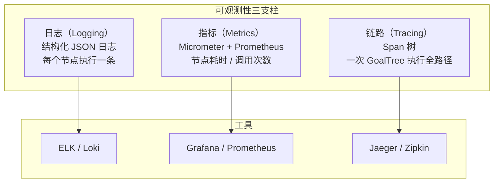

# 可观测性

> 日期：2026-06-05
> 状态：设计草案

---

## 1. 观测维度



---

## 2. 结构化日志

### 2.1 日志格式

```java
// 每个节点执行完成后输出一条结构化日志
{
  "level": "INFO",
  "timestamp": "2026-06-05T12:00:00.123Z",
  "logger": "sivan.executor",
  "message": "节点执行完成",
  "fields": {
    "traceId": "goal-550e8400",
    "nodeId": "550e8400-e29b-41d4-a716-446655440000",
    "nodeType": "task",
    "mode": "SEQUENTIAL",
    "status": "COMPLETED",
    "durationMs": 1234,
    "depth": 3,
    "tokens": 567,
    "error": null
  }
}
```

### 2.2 日志配置

```java
@Component
class StructuredLogging {

    private static final Logger log = LoggerFactory.getLogger("sivan.executor");

    void logNodeExecution(ExecutableNode node, ExecutionContext ctx, long durationMs, int tokens) {
        StructuredArguments fields = Fields.builder()
            .traceId(ctx.span().traceId())
            .nodeId(node.nodeId())
            .nodeType(node.nodeType())
            .mode(node.mode().name())
            .status(node.status().name())
            .durationMs(durationMs)
            .depth(ctx.depth())
            .tokens(tokens)
            .build();

        if (node.status() == FAILED) {
            log.warn("节点执行失败", fields);
        } else {
            log.info("节点执行完成", fields);
        }
    }
}
```

#### Reactor 上下文传播

`StructuredLogging` 当前通过 `SpanContext.currentTraceId()` 静态方法获取 traceId，但 Reactor 线程切换（`subscribeOn`/`publishOn`）时静态方法无法感知 Reactor `Context`，可能导致 traceId 丢失。

**修复**：进入 Reactor 链后，traceId 通过 Reactor `Context` 传递：

```java
// ForestExecutor 入口：将 traceId 写入 Reactor Context
Mono.defer(() -> executeNode(root, ctx))
    .contextWrite(ctx -> ctx.put("traceId", SpanContext.currentTraceId()))
    .contextWrite(ctx -> ctx.put("accountId", frozen.accountId()));

// StructuredLogging 从 Reactor Context 读取
class StructuredLogging {
    static MDC log(String message) {
        String traceId = Context.current().getOrDefault("traceId", "unknown");
        // ...写入 MDC
    }
}
```

确保 `Hooks.enableAutomaticContextPropagation()` 在生产环境开启，让 Reactor 自动将 Context 传播到 `boundedElastic` 调度的任务。

---

## 3. 指标清单

### 3.1 业务指标

| 指标名 | 类型 | 标签 | 来源 |
|---|---|---|---|
| `goal.tree.created` | Counter | accountId | TreeMatcher.match() |
| `goal.tree.completed` | Counter | accountId, success | GoalTreeCompleted 事件 |
| `goal.tree.duration` | Timer | accountId, mode | 根节点 COMPLETED |
| `goal.node.duration` | Timer | nodeType, mode | 每个 executeNode |
| `goal.node.skipped` | Counter | nodeType, policy | BudgetEnforcer |
| `goal.node.failed` | Counter | nodeType, error | NodeExecutionFailed 事件 |

#### 指标细分

`goal.tree.duration` 记录了从 `execute` 到 `complete` 的耗时。对于 SUMMARY 模式，用户可能数小时后才查询结果，该时长会误导性能分析。

**改进**：将执行耗时拆分为两个指标：

| 指标 | 含义 | 说明 |
|------|------|------|
| `goal.tree.execution_duration` | 实际执行耗时 | `execute()` 开始到最后一个节点完成，不受 SUMMARY 挂起影响 |
| `goal.tree.total_duration` | 端到端耗时 | 从用户创建 GoalTree 到用户首次读取结果（含 SUMMARY 等待时间） |

同时增加分位值标签：`p50`、`p95`、`p99`，按场景（STREAM vs SUMMARY）区分。

### 3.2 系统指标

| 指标名 | 类型 | 说明 |
|---|---|---|
| `llm.call.duration` | Timer | LLM 调用耗时 |
| `llm.tokens.total` | Counter | token 消耗总量 |
| `llm.cost.usd` | Counter | 累计费用 |
| `mcp.call.duration` | Timer | MCP 工具调用耗时 |
| `mcp.server.healthy` | Gauge | MCP 连接健康状态 |
| `db.cte.query.duration` | Timer | 递归 CTE 查询耗时 |
| `eventbus.published` | Counter | 领域事件发布数 |

### 3.3 Prometheus / Grafana

```yaml
# application.yml
management:
  endpoints:
    web:
      exposure:
        include: health,metrics,prometheus
  metrics:
    export:
      prometheus:
        enabled: true
    tags:
      application: ai-sivan
```

---

## 4. 链路追踪

### 4.1 实现

```java
/**
 * Trace 上下文——贯穿一次 ForestExecutor.execute() 的全路径。
 * 每个节点执行时创建一个 child span。
 */
class Tracer {

    private static final ThreadLocal<TraceContext> current = new ThreadLocal<>();

    /** 开始一次新的追踪。 */
    static TraceContext start(String traceId, String rootNodeId) {
        var ctx = new TraceContext(traceId, null, rootNodeId, Instant.now());
        current.set(ctx);
        return ctx;
    }

    /** 创建子 Span（进入子节点时调用）。 */
    static Span childSpan(TraceContext parent, String nodeId, String nodeType) {
        var span = new Span(parent.traceId(), parent.spanId(), nodeId, nodeType, Instant.now());
        parent.addChild(span);
        return span;
    }

    /** 结束 Span（节点完成时调用）。 */
    static void endSpan(Span span, String status, long durationMs) {
        span.end(status, durationMs);
        // 异步导出
        SpanExporter.export(span);
    }
}

record Span(String traceId, String parentSpanId, String spanId, String nodeType, Instant startTime) {
    String status;
    long durationMs;
}
```

#### 采样策略

默认对每次执行创建完整 trace 在高并发下可能压垮 Jaeger。

**采样策略**：
| 场景 | 采样率 | 理由 |
|------|--------|------|
| SUMMARY 模式 | 100% | 低频、异步，每次都有价值 |
| CONDITIONAL 模式 | 100% | LLM 决策关键路径 |
| PARALLEL 模式 | 10%（按 forestId 采样） | 高频执行，采样即可 |
| SEQUENTIAL 模式 | 50% | 中频 |
| 错误/异常 | 100% | 必须记录 |

**技术实现**：在 `Tracer` 入口处按 `ExecutionMode` + `forestId.hashCode() % 10` 判断是否采样：

```java
boolean shouldSample(ExecutableNode root) {
    return switch (root.mode()) {
        case SUMMARY, CONDITIONAL -> true;     // 全量
        case PARALLEL -> root.nodeId().hashCode() % 10 == 0;  // 10%
        case SEQUENTIAL -> root.nodeId().hashCode() % 2 == 0;  // 50%
        case HIERARCHICAL -> root.nodeId().hashCode() % 2 == 0; // 50%
        case CONSENSUS -> true;                 // 全量（合成阶段关键）
    };
}
```

---

## 5. 设计检查清单

- [ ] 所有节点执行是否输出结构化日志？→ 是
- [ ] 关键业务路径是否有 Prometheus 指标？→ 是
- [ ] LLM 调用耗时和 token 消耗是否被追踪？→ 是
- [ ] 一次 GoalTree 执行是否可以完整追溯每个节点？→ 是，Trace Span 树
- [ ] 可观测性组件故障是否影响主流程？→ 否，异步导出，失败静默
