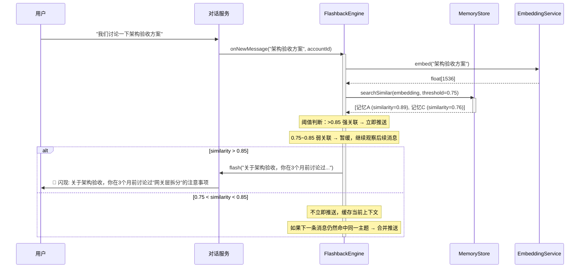

# 记忆与闪现

> 日期：2026-06-05
> 状态：设计草案

---

## 1. 定位

Flashback 不是"注入 system prompt"，也不是"等用户来问"。它是**系统主动识别当前场景与历史记忆的关联，把用户可能遗忘但此刻相关的信息推送过去**。

```
场景示例：
  用户正在讨论"架构验收方案"
  系统在后台做语义匹配
  → 命中 3 个月前一次对话："当时讨论过微服务拆分的一些注意事项"
  → 主动推送："关于架构验收，你在3个月前有个类似的讨论，提到过'网关层拆分'的注意事项"

  用户不需要问"我上次说了什么"——系统自己识别场景推送。
  用户想不到那条记忆——但系统觉得相关，主动提醒。
```

**与注入式和问答式的区别**：

| 模式 | 触发 | 方向 | 用户感知 |
|---|---|---|---|
| 注入式（❌ 废弃） | 每次对话 | 系统→prompt | 无感知，消耗 token |
| 问答式（MemoryQA） | 用户提问 | 用户→系统 | 显式提问 |
| **闪现（Flashback）** | **场景匹配** | **系统→用户** | **系统主动推送** |

---

## 2. 流程



---

## 3. 设计

```java
/**
 * 闪现引擎——在对话流中识别场景关联，主动推送相关记忆。
 *
 * 不注入 prompt，不等用户提问。每次消息到来时做语义匹配，
 * 高关联度时主动推送给用户。
 */
@Component
class FlashbackEngine {

    private final MemoryStore memoryStore;
    private final EmbeddingService embedding;
    private final FlashbackPusher pusher;

    /** 消息到来时触发。由 ConversationService 调用。 */
    void onNewMessage(String content, UUID accountId) {

        // 1. 语义匹配
        float[] vec = embedding.embed(content);
        List<ScoredMemory> matches = memoryStore.searchSimilar(vec, accountId, 0.75, 3);

        if (matches.isEmpty()) return;

        float topScore = matches.get(0).similarity();

        // 2. 阈值判断
        if (topScore > 0.85) {
            // 强关联 → 立即推送
            pushFlash(matches.get(0), content);

        } else if (topScore > 0.75) {
            // 弱关联 → 加入暂存区，等待下一条消息确认
            pendingFlash(accountId).add(new PendingFlash(content, matches));
        }
    }

    /** 暂存区确认：下一条消息来临时，检验是否同一主题。 */
    void confirmPending(UUID accountId, String nextContent) {
        PendingFlash pending = pendingFlash(accountId);
        if (pending == null) return;

        float[] nextVec = embedding.embed(nextContent);
        float similarity = cosineSimilarity(pending.contextVec, nextVec);

        if (similarity > 0.80) {
            // 同一主题 → 合并推送
            pusher.push(pending.toFlashMessage());
        }
        // 不相关 → 丢弃暂存
        clearPending(accountId);
    }

    private void pushFlash(ScoredMemory memory, String currentContent) {
        pusher.push(new FlashMessage(
            memory.memoryId(),
            "💡 关于「%s」，你在 %s 讨论过类似的问题：\n%s"
                .formatted(currentContent, timeAgo(memory.createdAt()), memory.content())
        ));
    }
}

/**
 * 推送器——将闪现消息发送给用户。
 * 通过 WebSocket 推送到前端，以"系统消息"气泡展示。
 */
@Component
class FlashbackPusher {

    private final WebSocketManager ws;

    void push(FlashMessage msg) {
        ws.send(msg.accountId(), Map.of(
            "type", "flashback",
            "memoryId", msg.memoryId(),
            "message", msg.formatted(),
            "timestamp", Instant.now().toString()
        ));
    }
}

record FlashMessage(UUID memoryId, String formatted) {}

record ScoredMemory(Memory memory, float similarity) {
    String content() { return memory.content(); }
    LocalDateTime createdAt() { return memory.createdAt(); }
}
```

#### 推送频率与用户控制

Flashback 通过 WebSocket 主动推送。为避免刷屏，需提供细粒度控制：

1. **场景级别开关**：用户可设置 `flashback.max_per_session`（每次对话最多 3 次）、`flashback.blocked_tags`（屏蔽特定标签，如"工作"、"购物"）。
2. **频率限制**：同一用户每分钟最多推送 1 条，每小时最多 5 条，超过后排队到下一时段。
3. **推送优先级**：按用户画像标签权重排序——权重 > 0.8 立即推，0.6~0.8 排到下个时段，< 0.6 不推。

```java
class FlashbackThrottle {
    private final RateLimiter perMinute = RateLimiter.create(1);  // 1/分钟
    private final RateLimiter perHour   = RateLimiter.create(5);  // 5/小时

    boolean allowPush(UUID accountId, FlashbackCandidate candidate) {
        if (candidate.relevance() < 0.6) return false;
        if (candidate.weight() < 0.8) return false;  // 排队
        return perMinute.tryAcquire() && perHour.tryAcquire();
    }
}
```


---

## 4. 记忆存储（补充语义搜索）

```sql
ALTER TABLE memories ADD COLUMN embedding vector(1536);  -- pgvector

CREATE INDEX idx_memories_embedding ON memories
    USING ivfflat (embedding vector_cosine_ops) WITH (lists = 100);
```

#### Embedding 版本管理

`vector(1536)` 的维度与 embedding 模型绑定。更换模型（如 text-embedding-3-small 的 1536 维 → Cohere embed-v3 的 1024 维）后，现有向量无法使用。

**策略**：
1. `embeddings` 列声明为 `vector(4096)`（当前最大常见维度），使用前 N 维。
2. 在 `memories` 和 `document_chunks` 表增加 `embedding_model` 列记录生成模型标识。
3. 查询时按 `embedding_model` 过滤，只与同模型向量计算相似度。
4. 模型升级后，旧向量逐步异步重算（后台 Job），不阻塞线上服务。

```sql
ALTER TABLE memories ADD COLUMN embedding_model VARCHAR(64) DEFAULT 'openai/text-embedding-3-small';
ALTER TABLE document_chunks ADD COLUMN embedding_model VARCHAR(64) DEFAULT 'openai/text-embedding-3-small';
```

```java
@Repository
interface MemoryStore {

    /** 语义搜索：寻找与当前上下文相关的历史记忆。 */
    List<ScoredMemory> searchSimilar(float[] queryVec, UUID accountId, double threshold, int topK);
}
```

---

## 5. 记忆层级（更新）

| 层级      | 范围   | 语义匹配范围 | 推送策略               |
|---------|------|---|--------------------|
| SESSION | 本次对话 | 不匹配 | 对话结束后沉淀为 PROJCET 级 |
| PROJCET | 本项目  | 不匹配 | 定期更新沉淀为 USER 级     |
| PATTERN | 执行模式 | 仅在 GoalTree 匹配时 | 不作为闪现推送            |
| USER    | 用户级别 | 全部匹配 | 强关联推送，弱关联缓存        |

---

## 6. 设计检查清单

- [ ] Flashback 是否注入到 system prompt？→ ❌ **禁止**。闪现是主动推送，不是上下文注入
- [ ] Flashback 是否等用户提问才触发？→ ❌ **禁止**。系统主动识别场景推送
- [ ] 语义匹配是否使用 embedding？→ 是，pgvector 索引
- [ ] 是否有阈值分级（强关联立即推 / 弱关联缓存确认）？→ 是，0.85 / 0.75
- [ ] 推送是否通过 WebSocket 即时到达？→ 是，FlashbackPusher
- [ ] 用户是否可以关闭 Flashback？→ 是，`user_preferences.flashback_enabled`
