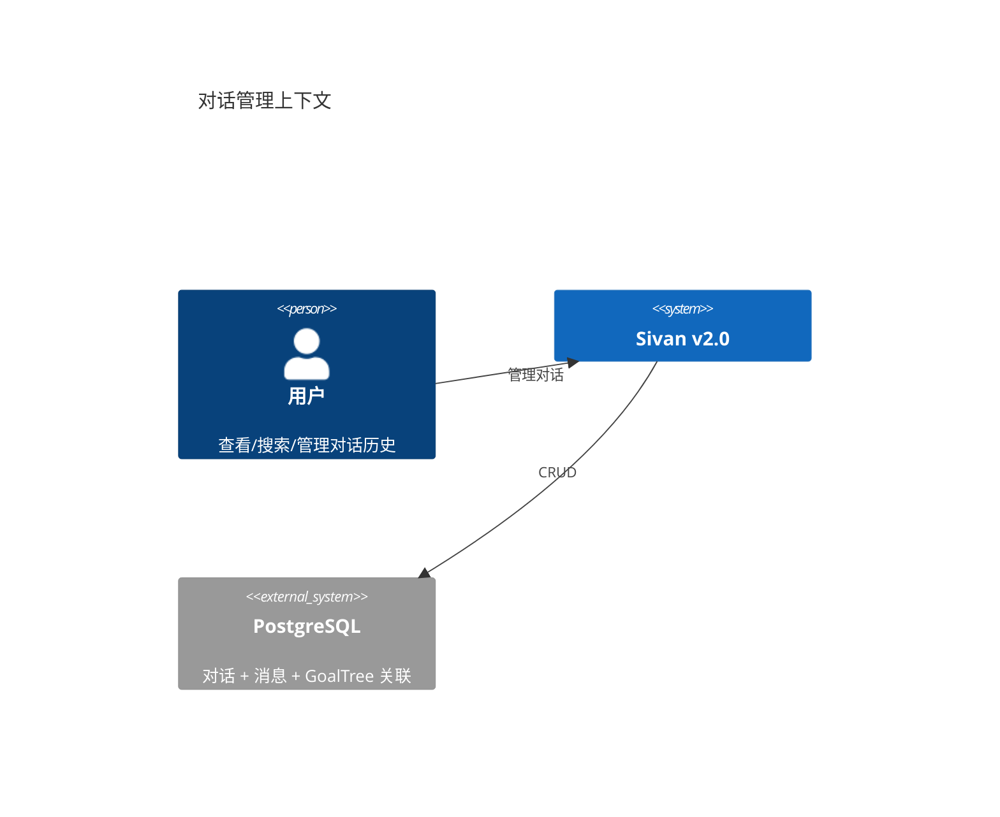

# 对话管理

> 日期：2026-06-05
> 状态：设计草案

---

## 1. L1 — Context



---

## 2. 核心模型

```java
/**
 * 对话——一个用户与 Sivan 的持续会话。
 * 包含零个或多个 GoalTree 执行记录。
 */
class Conversation {
    UUID conversationId;
    UUID accountId;
    UUID projectId;

    String title;           // 自动生成或用户指定
    String status;          // ACTIVE / ARCHIVED / DELETED

    /** 关联的 GoalTree（一个对话可以关联多个）。 */
    List<UUID> goalTreeIds;

    // 压缩/摘要状态
    String lastSummary;     // 最后一次压缩的摘要文本
    int totalMessages;
    LocalDateTime lastActivityAt;
    LocalDateTime createdAt;
}

/**
 * 消息——对话中的一条记录。
 * 消息本身不树化存储，但在注入时由 MessageTreeBuilder 构建瞬态树。
 */
class Message {
    UUID messageId;
    UUID conversationId;
    UUID parentMsgId;       // 回复/工具调用归属
    String role;            // user / assistant / tool
    String content;
    String contentType;     // text / image / audio / tool_call / tool_result
    String msgType;         // 'normal' / 'goal_start' / 'goal_end' / 'summary'
    int importance;         // MessageImportanceScorer 计算
    LocalDateTime createdAt;
}
```

---

## 3. 关键查询

```java
@Repository
interface MessageRepository {

    /** 分页查询（对话主页列表用）。 */
    Page<Message> findByConversation(UUID conversationId, Pageable page);

    /** 时间范围查询（压缩引擎用）。 */
    List<Message> findRecent(UUID conversationId, int limit);

    /** 按重要性查询（高价值消息优先保留）。 */
    List<Message> findImportant(UUID conversationId, double minImportance);

    /** 搜索消息内容。 */
    Page<Message> search(UUID accountId, String keyword, Pageable page);
}
```

---

## 4. 对话与 GoalTree 的关联

```java
/** 查询一个对话关联的所有 GoalTree。 */
@GetMapping("/api/v2/conversations/{id}/goals")
Flux<GoalSummaryResponse> getConversationGoals(@PathVariable UUID id, @CurrentAccountId UUID accountId) {
    Conversation conversation = conversationService.findById(id, accountId);
    return goalService.listByIds(conversation.goalTreeIds(), accountId);
}
```

---

## 5. 设计检查清单

### 实现状态（2026-06-12）

| # | 检查项 | 状态 | 说明 |
|---|--------|------|------|
| 1 | 对话支持 CRUD | ✅ | `ConversationCrudService` + `ForestConversationController` |
| 2 | 消息支持全文搜索 | ✅ | `GET /api/v2/conversations/messages/search?keyword=&page=&size=` |
| 3 | 对话与 GoalTree 双向关联 | ✅ | GoalTree→Conversation（Forest.conversationId）+ `GET /{id}/goals` 查询端点 |
| 4 | 消息保留原文，压缩不影响存储 | ✅ | `compressedContext` 是额外快照，原文始终保留在 messages 表 |
| 5 | 消息重要性由独立打分器决定 | ⚠️ | `MessageImportanceScorer` 已实现，importance 字段已持久化（V21 迁移），但 compression 中尚未调用写入 |
| 6 | Conversation 含 status 字段 | ✅ | `status` 字段/V21 迁移（ACTIVE/ARCHIVED/DELETED） |
| 7 | Message 含 msgType/importance | ✅ | `msgType`/`importance` 字段/V21 迁移 |

### 实现文件

| 组件 | 路径 |
|------|------|
| 消息搜索接口方法 | `IMessageRepository.search()` + `MessageJpaRepository.searchByContent()` |
| 消息搜索服务 | `MessageCrudService.searchMessages()` |
| 消息搜索端点 | `ForestConversationController.searchMessages()` |
| 对话 GoalTree 关联 | `ForestConversationService.getForestsByConversation()` + 端点 |
| 状态字段 | `Conversation.status` / `Message.msgType` / `Message.importance` + V21 迁移 |
