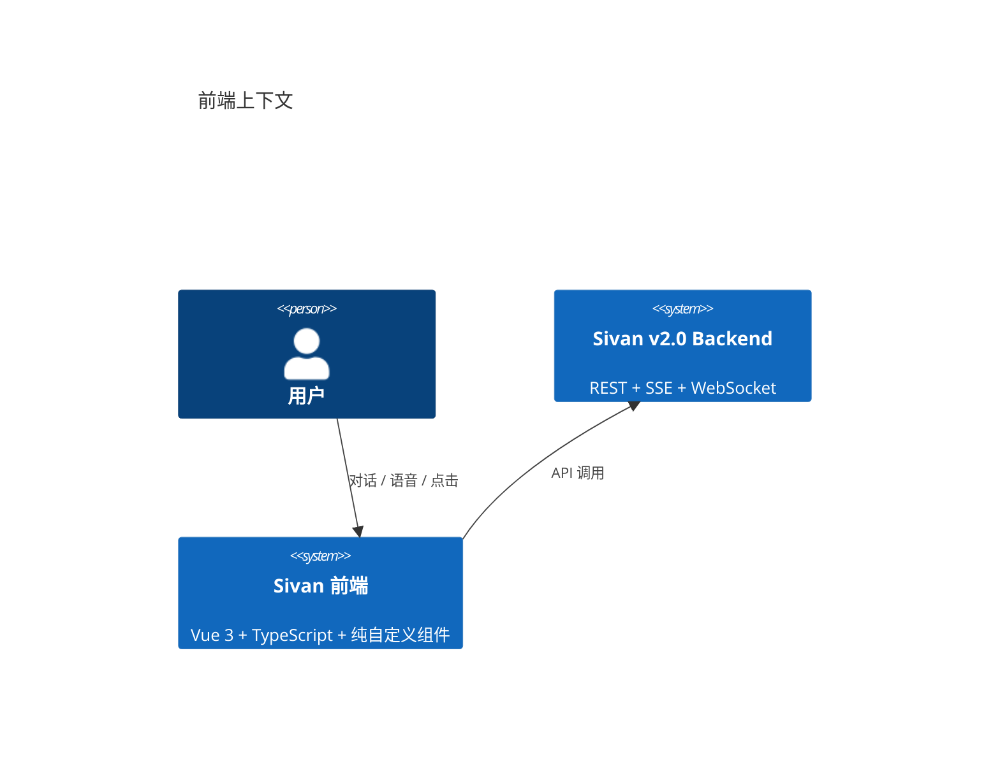
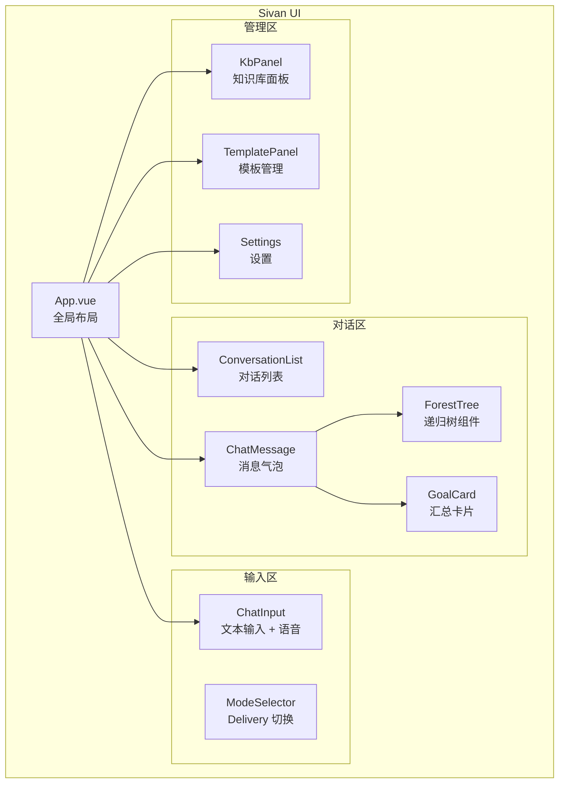

# 前端交互升级

> 日期：2026-06-05
> 状态：设计草案

---

## 1. L1 — Context



---

## 2. 组件树



---

## 3. 简单对话模式（CHAT）

v2.0 统一用树模型执行所有输入，但**前端不需要让用户感知到树**。简单对话时，界面保持纯粹的"消息列表 + 输入框"样式，树只在后端运行。

### 3.1 两种视图模式

```typescript
type ViewMode = 'chat' | 'tree'

// 视图状态管理
const viewMode = ref<ViewMode>('chat')
const activeGoalTree = ref<ForestNode | null>(null)

// 当后端返回的树深度 ≤ 1 且叶子类型为 message 时，保持 chat 模式
// 当树深度 ≥ 2 或包含 TaskNode 时，允许切换到 tree 模式
```

| 场景 | 后端产出的树 | 前端视图 |
|------|-------------|---------|
| 简单聊天 | `MessageNode` 单节点（或带上下文叶子） | 纯消息气泡，不显示树 |
| 单 Agent 执行 | `TaskNode` 单层 | 消息气泡底部显示轻量进度条 |
| 复杂编排 | 多层 `InnerGoalNode` + `TaskNode` | 消息气泡 + 可展开的 `ForestTree` |

### 3.2 SSE 事件驱动的视图切换

SSE 事件中的 `tree_depth` 字段驱动前端自动切换视图：

```typescript
// useSseStream.ts 增强
function handleSseEvent(data: SseEvent) {
  switch (data.type) {
    case 'step_start':
      if (data.tree_depth >= 2) {
        // 切换到树视图
        viewMode.value = 'tree'
        activeGoalTree.value = buildTree(data.nodes)
      }
      break

    case 'final':
      if (viewMode.value === 'chat' && data.goal_tree) {
        // 执行完成，如果深度 >= 2 提供"查看详情"入口
        hasGoalTree.value = true
        goalSummary.value = data.summary
      }
      break
  }
}
```

```vue
<!-- 消息气泡中的简单模式开关 -->
<template>
  <div class="message" :class="`role-${msg.role}`">
    <div class="bubble">
      <div v-if="msg.content" class="text">{{ msg.content }}</div>

      <!-- 简单进度条（SINGLE_AGENT / 浅树) -->
      <div v-if="msg.progress && viewMode === 'chat'" class="simple-progress">
        <div class="progress-bar">
          <div class="progress-fill" :style="{ width: msg.progress + '%' }"></div>
        </div>
        <span class="progress-text">{{ msg.progressLabel }}</span>
      </div>

      <!-- GoalTree 详情入口（简单模式下的折叠入口） -->
      <button
        v-if="msg.hasGoalTree && viewMode === 'chat'"
        class="detail-link"
        @click="viewMode = 'tree'; expandTree(msg.goalId)"
      >
        📋 查看执行详情 →
      </button>

      <!-- 展开后的完整树视图 -->
      <ForestTree
        v-if="viewMode === 'tree' && msg.goalTree"
        :node="msg.goalTree"
        :depth="0"
      />
    </div>
  </div>
</template>
```

### 3.3 对话中的轻量进度指示

简单对话模式下，用户不需要看到树结构，但需要知道执行状态：

| 状态 | 展示 |
|------|------|
| 执行中 | 打字指示器 + 当前步骤文字（"正在搜索知识库…"） |
| 等待工具调用 | "正在调用工具…" |
| 等待 HITL 确认 | "需要你的确认 →"（可点击） |
| 已完成 | 正常回复文本 |
| 已完成（含 GoalTree） | 回复文本 + "📋 查看执行详情" 链接 |

### 3.4 简单对话 ↔ 树视图的切换规则

```
用户发送消息 → SSE 开始推送

  SSE 深度 = 0（MessageNode）→ 保持 chat 模式
  SSE 深度 = 1（单层 TaskNode）→ 显示进度条，完成后提供"查看详情"
  SSE 深度 ≥ 2 → 自动切换到 tree 模式

用户点击"收起" → 回到 chat 模式，树折叠为"📋 查看执行详情"链接
用户点击"查看详情" → 切换到 tree 模式，展开 ForestTree
```

### 3.5 设计确认

- 用户不需要知道"树"的存在 —— 纯聊天场景下 ForestTree 完全不出现
- 从 chat 到 tree 的切换是无损的 —— 任何时候都可以展开/收起
- 语音场景默认 chat 模式，执行完成后 TTS 朗读摘要，需要查看详情时在设备上展开
- 新手引导期间强制 chat 模式，直到用户第一次手动展开 ForestTree 后记录偏好

---

## 4. ForestTree 递归组件

```vue
<!-- ForestTree.vue — 递归渲染 GoalTree 进度树 -->
<template>
  <div class="forest-tree">
    <TreeNode
      v-for="child in node.children"
      :key="child.nodeId"
      :node="child"
      :depth="0"
    />
  </div>
</template>

<!-- TreeNode.vue — 单节点渲染 -->
<template>
  <div
    class="tree-node"
    :class="[`depth-${depth}`, `status-${node.status.toLowerCase()}`]"
  >
    <div class="node-row" @click="expanded = !expanded">
      <!-- 展开/折叠图标 -->
      <span v-if="node.children?.length" class="toggle">{{ expanded ? '▼' : '▶' }}</span>

      <!-- 状态图标 -->
      <span class="status-icon">{{ statusIcon(node) }}</span>

      <!-- 名称 -->
      <span class="node-name">{{ node.content }}</span>

      <!-- 模式标签 -->
      <span v-if="node.mode && node.mode !== 'NONE'" class="mode-badge">{{ modeLabel(node.mode) }}</span>

      <!-- 进度 -->
      <span class="node-progress">{{ node.completed }}/{{ node.total }}</span>
    </div>

    <!-- 子树 -->
    <div v-if="expanded && node.children?.length" class="node-children">
      <TreeNode
        v-for="child in node.children"
        :key="child.nodeId"
        :node="child"
        :depth="depth + 1"
      />
    </div>
  </div>
</template>

<script setup lang="ts">
import { ref, computed } from 'vue'

const props = defineProps<{
  node: ForestNode
  depth: number
}>()

const expanded = ref(props.depth < 2) // 默认展开前两层

function statusIcon(node: ForestNode): string {
  const map: Record<string, string> = {
    completed: '✅', running: '🔄', pending: '⏳',
    failed: '❌', cancelled: '🚫', skipped: '—'
  }
  return map[node.status.toLowerCase()] || '⏳'
}

function modeLabel(mode: string): string {
  const map: Record<string, string> = {
    SEQUENTIAL: '→', PARALLEL: '↔', CONDITIONAL: '⚡',
    HIERARCHICAL: '⊞', CONSENSUS: '⊕'
  }
  return map[mode] || mode
}
</script>
```

#### 全部展开的 DOM 风险

1000 节点全部展开时 DOM 元素可达 ~5000+（每节点含容器、图标、文本、进度条等），引发重排卡顿。

**防护措施**：
1. **自动折叠**：展开节点数 > 50 时，自动折叠前一层级，始终保证可视区 DOM < 500 元素。
2. **`content-visibility: auto`**：CSS 属性，浏览器原生跳过可视区外的渲染，显著降低首次渲染成本。
3. **虚拟滚动降级**：展开后元素 > 500 时切换到虚拟列表（`vue-virtual-scroller`），仅渲染可视区域内的节点。
4. **警告提示**：展开 > 200 节点时，提示用户"当前展开节点数较多，建议折叠已完成分支"。

---

## 5. 消息气泡与 GoalCard

```vue
<!-- 消息气泡：左(user)右(assistant)布局 -->
<template>
  <div class="message" :class="`role-${msg.role}`">
    <div class="avatar">{{ msg.role === 'user' ? '👤' : '🤖' }}</div>
    <div class="bubble">
      <!-- 普通文本回复 -->
      <div v-if="msg.content" class="text">{{ msg.content }}</div>

      <!-- GoalTree 汇总卡片（SUMMARY 模式） -->
      <GoalCard
        v-if="msg.goalTree"
        :goal="msg.goalTree"
        @expand="fetchTreeDetail(msg.goalTree.goalId)"
      />
    </div>
  </div>
</template>

<!-- GoalCard.vue — 可展开的汇总卡片 -->
<template>
  <div class="goal-card" @click="expanded = !expanded">
    <div class="goal-card__header">
      <span class="goal-card__icon">{{ goal.status === 'COMPLETED' ? '✅' : '🔄' }}</span>
      <span class="goal-card__title">{{ goal.title }}</span>
      <span class="goal-card__stats">{{ goal.completedTasks }}/{{ goal.totalTasks }} 任务</span>
      <span class="goal-card__expand">{{ expanded ? '收起' : '展开' }}</span>
    </div>

    <div v-if="expanded" class="goal-card__detail">
      <ForestTree :node="goal.tree" :depth="0" />
    </div>
  </div>
</template>
```

---

## 6. SSE 事件处理

```typescript
// useSseStream.ts — SSE 事件处理 composable
export function useSseStream() {
  const events = ref<SseEvent[]>([])
  const tree = ref<ForestNode | null>(null)

  function connect(url: string) {
    const source = new EventSource(url)

    source.onmessage = (e) => {
      const data = JSON.parse(e.data)
      events.value.push(data)

      switch (data.type) {
        case 'final':
          // 执行完成，关闭连接
          source.close()
          break
        case 'error':
          console.error('SSE error:', data.message)
          break
      }
    }
  }

  return { events, tree, connect }
}
```

## 7. 国际化（i18n）

### 6.1 资源加载策略

| 资源类型 | 加载方式 | 说明 |
|---------|---------|------|
| 前端 UI 文本 | 前端静态 JSON 文件（`zh-CN.json`, `en.json`） | 构建时打包，运行时按 `Accept-Language` 切换 |
| 后端错误消息 | 后端 i18n 资源文件，通过 `t(key, args)` 动态渲染 | SSE 事件中的 `message` 字段已本地化 |
| LLM 输出 | 不翻译（LLM 按用户输入语言回复） | — |

### 6.2 SSE 事件本地化

SSE 事件中的 `message` 字段在后端按用户 `Accept-Language` Header 动态渲染：

```java
// 后端按用户语言渲染错误消息
String localizedMessage = messageSource.getMessage(errorCode, args, locale);
event = new OrchestrationEvent("error", localizedMessage, ...);
```

前端不承担运行时翻译责任——所有用户可见文本在发送到前端前已完成本地化。

### 6.3 前端资源文件结构

```
src/
  locales/
    zh-CN/
      goal.json        # 目标树相关文本
      template.json    # 模板匹配相关文本
      flashback.json   # 闪现相关文本
      errors.json      # 错误消息
    en/
      goal.json
      template.json
      flashback.json
      errors.json
```

---


## 8. 首次使用引导

```vue
<!-- OnboardingGuide.vue — 首次对话引导卡片 -->
<template>
  <div v-if="showOnboarding" class="onboarding-card">
    <div class="onboarding-avatar">🤖</div>
    <div class="onboarding-text">
      <p>你好，我是灵枢——你的私人 AI 助理。</p>
      <p>你可以直接告诉我要做什么：</p>
      <ul>
        <li>"帮我重构登录模块"</li>
        <li>"审查一下这段代码的安全性"</li>
        <li>"每天 7 点开空调到 24 度"</li>
        <li>"帮我写周报"</li>
      </ul>
      <button @click="dismiss">开始使用 →</button>
    </div>
  </div>
</template>

<script setup>
import { ref } from 'vue'
const showOnboarding = ref(!localStorage.getItem('onboarding_done'))
function dismiss() {
  showOnboarding.value = false
  localStorage.setItem('onboarding_done', 'true')
}
</script>
```

#### 引导状态持久化

`localStorage` 记录 `onboarding_done` 无法跨设备同步。用户更换设备或清除缓存后会再次显示引导。

**改进**：引导完成状态写入后端 `user_profiles` 表：
```sql
ALTER TABLE user_profiles ADD COLUMN onboarding_done BOOLEAN DEFAULT false;
ALTER TABLE user_profiles ADD COLUMN onboarding_completed_at TIMESTAMP;
```

前端在首次加载时调用 `GET /api/v2/user/profile` 获取 `onboarding_done`，完成后调用 `PUT /api/v2/user/profile` 持久化。这样用户在任何设备上登录都不会重复看到引导。


**初次 GoalTree 展开提示**——用户第一次执行时在进度树顶部显示提示，第二次自动消失。

**模板探索入口**——对话窗口左下角 `[💡 看看我能做什么]`，点击展示 3-5 个推荐模板卡片，每个卡片带"试试"按钮，点击自动输入对应指令。

---


## 9. 递归渲染性能验证

ForestTree 组件递归渲染 1000 节点时，DOM 节点数可能超出浏览器渲染能力。实现前确认：

| 节点数 | 预估 DOM 节点 | 渲染时长目标 | 警告线 |
|---|---|---|---|
| 100 | ~500 | < 50ms | > 100ms |
| 1000 | ~5000 | < 200ms | > 500ms |
| 5000 | ~25000 | — | 必须做虚拟滚动 |

**验证方案**：

```typescript
// 原型测试：mock 1000 节点树，测量首次渲染时长
const root = buildMockTree(1000)
const start = performance.now()
renderForestTree(root, document.getElementById('app'))
const duration = performance.now() - start
console.assert(duration < 200, '渲染超时:', duration)
```

**缓解措施**（如渲染超时）：
1. 折叠状态下的子树不生成子 DOM（当前已有：`expanded ? children : null`）
2. CSS `content-visibility: auto` 跳过不可见区域的渲染
3. 1000+ 节点时切换为虚拟滚动（`vue-virtual-scroller` 或自行实现）

## 10. 设计检查清单

### 实现状态（2026-06-12）

| # | 检查项 | 状态 | 说明 |
|---|--------|------|------|
| 1 | ForestTree 可递归渲染任意深度 | ✅ | `TreeNode` 自引用递归 |
| 2 | 支持 STREAM/SUMMARY 两种模式 | ⚠️ | STREAM 完备，SUMMARY 前端 `ModeSelector` 组件已创建，后端模式切换逻辑存在 |
| 3 | 节点状态有不同图标区分 | ✅ | 6 种状态（含新增 SKIPPED） |
| 4 | SSE 连接完成后自动关闭 | ✅ | `useChatStream.ts` 处理 |
| 5 | 纯自定义组件（无第三方 UI 库） | ✅ | 全部自定义组件 |
| 6 | 简单对话模式隐藏树视图 | ⚠️ | 当前树通过 `PipelineDialog` 弹窗展示，非直接内嵌 |
| 7 | chat ↔ tree 视图切换 | ❌ | 核心交互模式未实现，树以独立弹窗展示 |
| 8 | GoalCard 汇总卡片 | ✅ | `GoalCard.vue` 组件已创建（SUMMARY 模式可展开卡片） |
| 9 | ModeSelector 切换组件 | ✅ | `ModeSelector.vue` 组件已创建 |
| 10 | SKIPPED 节点状态 | ✅ | `types/forest.ts` 补充 |

### 实现文件

| 组件 | 路径 |
|------|------|
| `GoalCard.vue` | `sivan-ui/src/components/chat/GoalCard.vue` |
| `ModeSelector.vue` | `sivan-ui/src/components/chat/ModeSelector.vue` |
| 类型补充 | `sivan-ui/src/types/forest.ts`（SKIPPED） |
