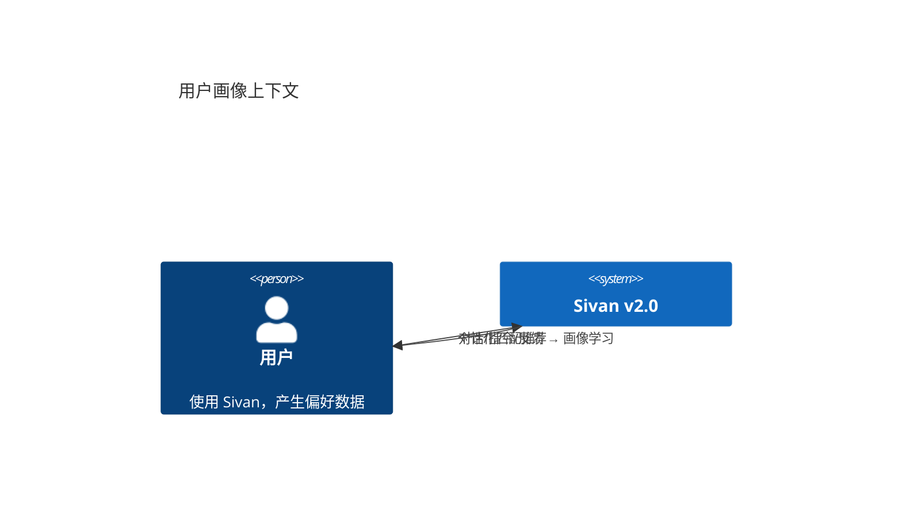

# 用户画像与自适应

> 日期：2026-06-05
> 状态：设计草案

---

## 1. L1 — Context



---

## 2. 画像模型

```sql
CREATE TABLE user_profiles (
    profile_id     UUID PRIMARY KEY,
    account_id     UUID UNIQUE NOT NULL,
    display_name   VARCHAR(64),

    -- 技术偏好
    tech_stack     TEXT[] DEFAULT '{}',       -- ["Java", "React", "PostgreSQL"]
    expertise      TEXT[] DEFAULT '{}',       -- ["后端", "系统架构"]
    preferred_lang VARCHAR(16) DEFAULT 'zh',

    -- 行为特征
    common_tasks   TEXT[] DEFAULT '{}',       -- 常见任务类型
    avg_complexity DOUBLE PRECISION,          -- 任务平均复杂度
    active_hours   INT[],                     -- 活跃时段

    -- 自动学习控制
    auto_learn     BOOLEAN DEFAULT TRUE,

    updated_at     TIMESTAMPTZ NOT NULL DEFAULT NOW()
);
```

---

## 3. 自动学习

```java
@Component
class ProfileLearner {

    private final ProfileRepository profileRepo;
    private final ModelRouter router;

    /** 从对话中提取兴趣标签。由 GoalTreeCompleted 和 Message 触发。 */
    @EventListener
    void onConversationEnd(ConversationEnded event) {
        List<Message> messages = messageRepo.findRecent(event.conversationId(), 20);
        String text = messages.stream().map(Message::content).collect(Collectors.joining("\n"));

        // LLM 提取兴趣标签
        router.defaultModel().complete(List.of(
            Msg.of(Role.SYSTEM, "从以下对话中提取用户的技术栈偏好和兴趣标签。输出 JSON。"),
            Msg.of(Role.USER, text)
        )).subscribe(response -> {
            ProfileTags tags = parseJson(response.text());
            profileRepo.findByAccount(event.accountId()).ifPresent(profile -> {
                profile.techStack(merge(profile.techStack(), tags.techs()));
                profile.expertise(merge(profile.expertise(), tags.expertise()));
                profileRepo.save(profile);
            });
        });
    }
}
```

---

## 4. 设计检查清单

- [ ] 用户是否可手动编辑画像？→ 是
- [ ] 画像是否支持自动学习？→ 是
- [ ] 学习结果是否影响模板匹配和智能体推荐？→ 是
- [ ] 画像是否有版本历史？→ 是，`profile_changelog` 表
