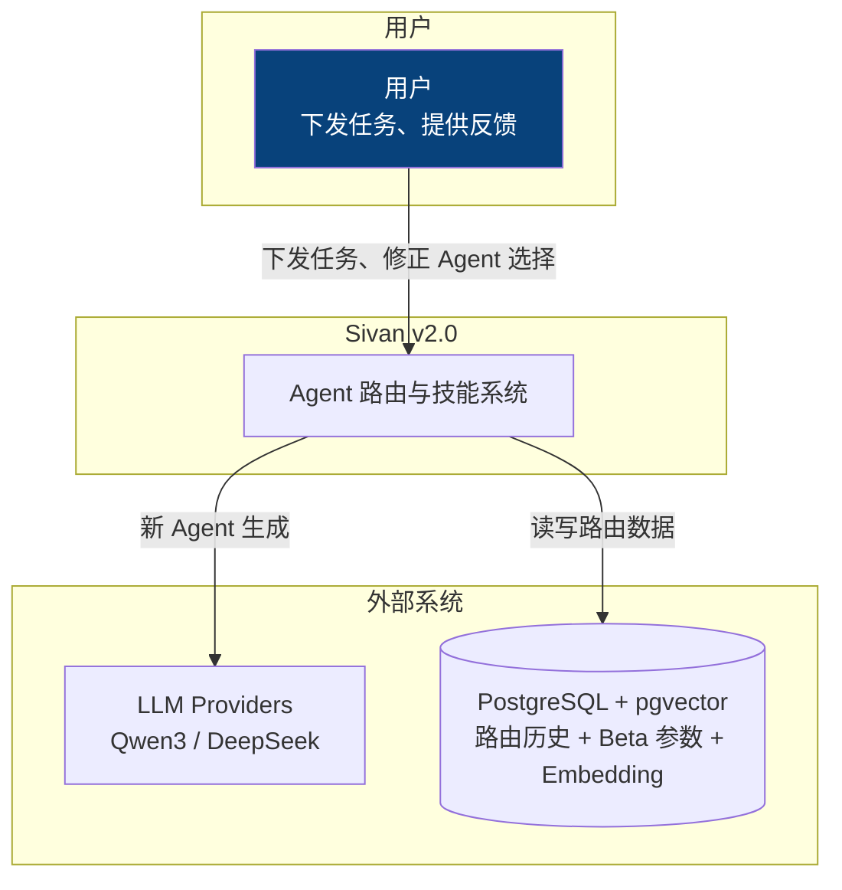
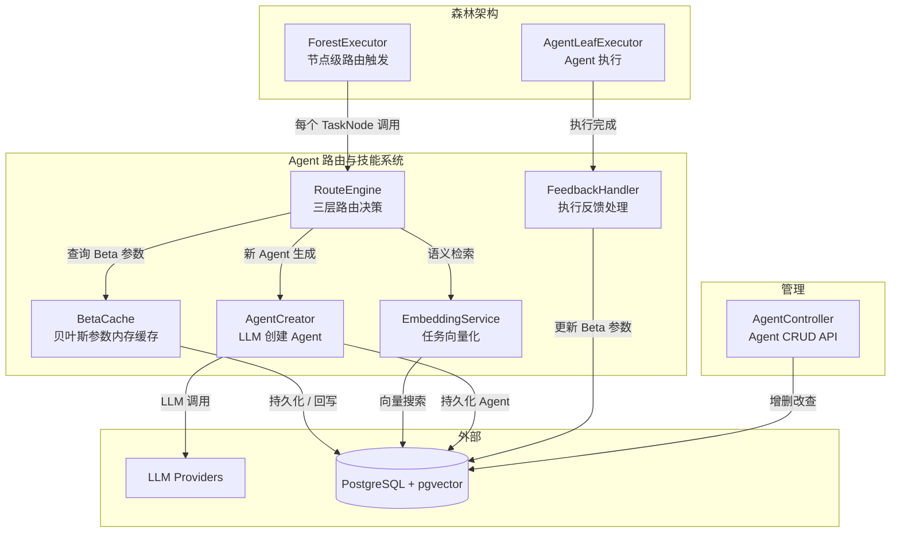
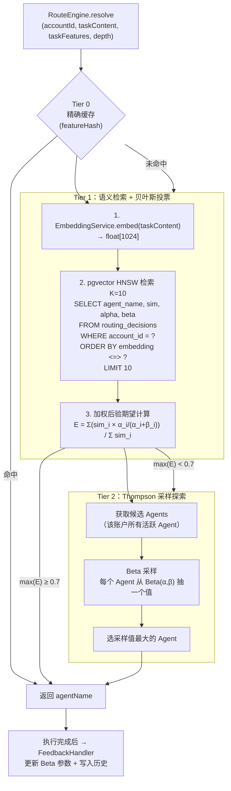
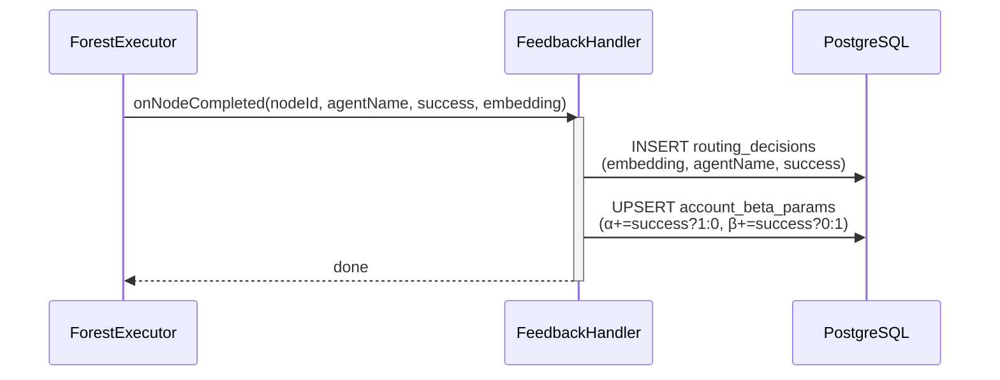

# Agent 路由与技能匹配系统 — 详细设计

> 日期：2026-06-11
> 状态：方案设计

---

## 1. 背景

### 1.1 项目现状

Sivan v2.0 采用 Forest 架构统一执行引擎。每个 `TaskNode` 在 Forest 执行树中代表一个原子任务，需要分配 Agent（智能体）和技能（工具绑定）来执行。当前系统已完成：

- **ForestExecutor** 统一递归遍历 + 5 种 Mode 策略
- **AgentLeafExecutor** 叶子节点执行（ReAct 循环 + 工具调用）
- **RoutingEngine** 多策略路由（AdaptiveRoutingStrategy、SemanticRoutingStrategy、MLRoutingStrategy）
- **AgentController** Agent 的 CRUD 管理 API
- **TreeMatcher** 任务分解为执行树

### 1.2 当前问题

| 问题 | 表现 | 根因 |
|------|------|------|
| **M L R o u t i n g S t r a t e g y 每 次 调 L L M** | 路 由 延 迟 5 0 0 m s ~ 3 s | 策 略 设 计 缺 陷 ， 不 区 分 场 景 使 用 L L M |
| **无 历 史 学 习** | 同 一 用 户 同 一 任 务 每 次 重 新 评 分 | 路 由 决 策 不 持 久 化 ， 不 累 积 经 验 |
| **意 图 判 断 与 A g e n t 选 择 分 离** | c l a s s i f y I n p u t T y p e ( ) 先 判 类 型 ， 再 路 由 A g e n t | 两 次 分 析 同 一 段 文 本 ， 信 息 不 共 享 |
| **只 在 对 话 开 始 时 处 理** | F o r e s t 执 行 树 中 多 阶 段 无 法 分 配 不 同 A g e n t | 路 由 插 入 点 不 在 执 行 器 中 |
| **可 用 户 数 据 未 利 用** | r o u t i n g _ d e c i s i o n s 表 只 记 录 不 学 习 | 缺 少 反 馈 闭 环 |

### 1.3 设计目标

1. **零 L L M 路 由** — 常 规 路 由 不 调 L L M ， L L M 仅 在 创 建 新 A g e n t 时 使 用
2. **节 点 级 路 由** — F o r e s t 执 行 树 中 每 个 T a s k N o d e 独 立 路 由
3. **贝 叶 斯 自 适 应** — 成 功 / 失 败 反 馈 即 时 更 新 信 心 度
4. **语 义 泛 化** — 未 见 任 务 通 过 e m b e d d i n g 匹 配 相 似 历 史
5. **全 P o s t g r e S Q L 存 储** — 不 引 入 R e d i s / 向 量 数 据 库

---

## 2. 系统上下文（C4 L1）



---

## 3. 容器视图（C4 L2）



---

## 4. 组件视图（C4 L3）

### 4.1 RouteEngine — 三层路由决策



### 4.2 三层路由策略对比

| 层 | 机制 | 延迟 | 命中率预期 | 触发条件 |
|------|------|------|----------|---------|
| Tier 0 | `md5(taskFeatures)` 精确匹配 | < 1ms | ~30% | 重复任务 |

| Tier 1 | pgvector HNSW 语义检索 + 贝叶斯加权 | ~5-10ms | ~50% | 相似历史任务 |
| Tier 2 | Beta 分布 Thompson 采样 | < 1ms | ~15% | 探索新路径 |
| Tier 3 | LLM 创建新 Agent | ~1-3s | ~5% | 全新任务类型 |

### 4.3 贝叶斯模型

```
Beta(α, β) 分布：
  α = 成功次数 + 1（先验）
  β = 失败次数 + 1（先验）

  期望值   E = α / (α + β)
  方差     Var = αβ / ((α+β)²(α+β+1))
  
  样本少时（α≈1, β≈1）：期望≈0.5，方差大 → 鼓励探索
  样本多时（α=50, β=5）：期望≈0.91，方差小 → 稳定利用
```

**Thompson 采样（Tier 2）**：

```
对每个候选 agent，从 Beta(α,β) 采样一个随机值：
  x ~ Gamma(α, 1), y ~ Gamma(β, 1)
  sample = x / (x + y)
  
  选 sample 最大的 agent → 自动平衡探索与利用
  （方差大的 Beta 分布更可能产生极端采样值，从而有机会被选中）
```

### 4.4 FeedbackHandler — 反馈闭环



---

## 5. 数据模型

### 5.1 表结构

利用已有的 `routing_decisions` 表，新增向量列替代新表，避免功能重合。

```sql
-- 路由历史（利用已有 routing_decisions 表，新增向量列）
ALTER TABLE routing_decisions
    ADD COLUMN IF NOT EXISTS task_embedding vector(1024),   -- 任务文本 embedding
    ADD COLUMN IF NOT EXISTS duration_ms INTEGER;          -- 执行耗时

CREATE INDEX IF NOT EXISTS idx_rd_embedding
    ON routing_decisions
    USING hnsw (task_embedding vector_cosine_ops)
    WITH (m = 16, ef_construction = 64);

CREATE INDEX IF NOT EXISTS idx_rd_account_agent
    ON routing_decisions (account_id, selected_agent, created_at DESC);


-- Beta 参数（新建，用于 O(1) 聚合查询，避免每次 scan routing_decisions）
CREATE TABLE account_beta_params (
    account_id      UUID NOT NULL,
    feature_hash    VARCHAR(64) NOT NULL,  -- md5(taskFeatures.toString())
    agent_name      VARCHAR(128) NOT NULL,
    alpha           INTEGER DEFAULT 1,
    beta            INTEGER DEFAULT 1,
    updated_at      TIMESTAMPTZ DEFAULT NOW(),
    PRIMARY KEY (account_id, feature_hash, agent_name)
);


-- Agent 定义（已有表，此处仅列关键字段）
CREATE TABLE agents (
    agent_id        UUID PRIMARY KEY,
    account_id      UUID NOT NULL,
    agent_name      VARCHAR(128) NOT NULL,
    display_name    VARCHAR(128),
    description     TEXT,
    system_prompt   TEXT,
    category        VARCHAR(64),
    status          VARCHAR(16) DEFAULT 'ACTIVE',
    -- ... 其他字段
);
```

### 5.2 字段说明

| 字段 | 说明 |
|------|------|
| `task_embedding` | Embedding 模型输出的 1024 维向量，使用 cosine 距离 |
| `feature_hash` | `md5(TaskFeatures 序列化)`，用于 Tier 0 精确缓存 |
| `alpha / beta` | Beta 分布参数，先验=1/1，每次成功 α+1，失败 β+1 |
| `vector_cosine_ops` | pgvector HNSW 索引操作符类 |

### 5.3 HNSW 索引参数

| 参数 | 值 | 说明 |
|------|-----|------|
| `m` | 16 | 每个节点的最大连接数，越高精度越高 |
| `ef_construction` | 64 | 构建时的动态列表大小 |
| `ef_search` | 40 | 查询时的动态列表大小（运行时设置） |

---

## 6. 关键流程

### 6.1 正常路由（Tier 1 命中）

```
用户: "帮我重构登录模块，加上双因素认证"
  │
  ├─ 1. ConversationService.streamMessage()
  │     ├─ FeatureExtractor.extract() → TaskFeatures{CODING, LEVEL_4, ...}
  │     ├─ featureHash = md5(TaskFeatures)
  │     └─ TreeMatcher.match() → 执行树
  │
  ├─ 2. ForestExecutor.executeNode(TaskNode "架构设计")
  │     ├─ RouteEngine.resolve(accountId, "架构设计", null, 1)
  │     │   ├─ Tier 0: featureHash 查 BetaParams → 未命中
  │     │   ├─ Tier 1: embedding → pgvector HNSW → K=10
  │     │   │   → agent="架构师", expectation=0.92 ≥ 0.7 ✅
  │     │   └─ 返回 "架构师"
  │     ├─ metadata.agentName = "架构师"
  │     └─ AgentLeafExecutor.execute(agent=架构师, tools=[...])
  │
  ├─ 3. ForestExecutor.executeNode(TaskNode "后端实现")
  │     ├─ RouteEngine.resolve(accountId, "后端实现", null, 2)
  │     │   ├─ Tier 1: embedding → pgvector
  │     │   │   → agent="开发者", expectation=0.85 ≥ 0.7 ✅
  │     │   └─ 返回 "开发者"
  │     └─ AgentLeafExecutor.execute(agent=开发者, tools=[...])
  │
  └─ 4. 节点完成 → FeedbackHandler
        ├─ INSERT routing_decisions
        └─ UPSERT account_beta_params (α+1/β+1)
```

### 6.2 探索（Tier 2）

```
ForestExecutor.executeNode(TaskNode "安全审查")
  ├─ Tier 1 检索 → 最大期望 = 0.52 < 0.7 → 降级
  │
  ├─ Tier 2: Thompson 采样
  │   ├─ 候选 agents: ["架构师"(α=45,β=5), "开发者"(α=30,β=3), "安全专家"(α=5,β=1)]
  │   ├─ Beta 采样:
  │   │   ├─ 架构师: Beta(45,5) → sample=0.89（稳定高）
  │   │   ├─ 开发者: Beta(30,3) → sample=0.91（偶然高）
  │   │   └─ 安全专家: Beta(5,1) → sample=0.83
  │   └─ 选中 "开发者"（探索）
  │
  └─ 执行完成 → 更新 Beta: "开发者" β+1（"安全审查"用"开发者"不合适）
      → 下次 "安全审查" 更不可能选 "开发者"
```

### 6.3 创建新 Agent（Tier 3）

```
ForestExecutor.executeNode(TaskNode "安全审查")
  ├─ Tier 1: 无相似历史（全新任务类型）
  ├─ Tier 2: 候选 Agents 为空（无活跃 Agent）
  │
  ├─ Tier 3: LLM 创建新 Agent
  │   ├─ 调用 AgentPrompts.agentCreateUser("review", "安全审计专家", null)
  │   ├─ LLM 返回: { displayName, description, systemPrompt, ... }
  │   ├─ AgentDefinition → INSERT INTO agents
  │   ├─ account_beta_params UPSERT → (featureHash, "安全审计专家", α=1, β=1)
  │   └─ 返回 "安全审计专家"
  │
  ├─ 注入节点 metadata
  └─ AgentLeafExecutor.execute(agent=安全审计专家)
      └─ 完成后 → α+1（成功）
```

### 6.4 重复任务（Tier 0 命中）

```
第二次同样任务:
  RouteEngine.resolve(accountId, "后端实现", taskFeatures, 2)
  ├─ Tier 0: featureHash 查 BetaParams
  │   → featureHash 命中 → agent="开发者", E=0.91 ≥ 0.7 ✅
  └─ 返回 "开发者"（O(1)，零向量检索）
```

---

## 7. 接口定义

### 7.1 RouteEngine（核心路由接口）

```java
public interface RouteEngine {

    /**
     * 为任务节点解析 Agent。
     *
     * @param accountId     账户 ID
     * @param taskContent   节点任务内容
     * @param taskFeatures  特征向量（预先提取，避免重复计算）
     * @param depth         树深度
     * @return Agent 解析结果
     */
    Mono<RouteResult> resolve(UUID accountId, String taskContent,
                              TaskFeatures taskFeatures, int depth);
}

record RouteResult(
    String agentName,
    int tier,                // 0/1/2/3 哪层命中
    double confidence,
    String[] skillNames      // 推荐绑定的技能名称列表
) {}
```

### 7.2 FeedbackHandler（反馈接口）

```java
public interface RouteFeedbackHandler {

    /**
     * 节点执行完成后的反馈处理。
     *
     * @param accountId     账户 ID
     * @param agentName     使用的 Agent
     * @param success       是否成功
     * @param taskContent   任务内容（用于 embedding）
     * @param taskFeatures  特征向量（用于 featureHash）
     * @param durationMs    执行耗时
     */
    void onNodeCompleted(UUID accountId, String agentName, boolean success,
                         String taskContent, TaskFeatures taskFeatures,
                         int durationMs);
}
```

### 7.3 RouteEngine 实现（Spring Bean）

```java
@Component
public class PgRouteEngine implements RouteEngine {

    // Tier 0: 精确缓存
    private Mono<RouteResult> tier0(UUID accountId, TaskFeatures features) {
        String hash = md5(features.toString());
        return betaRepo.find(accountId, hash)
            .filter(p -> p.expectation() >= 0.7)
            .map(p -> new RouteResult(p.agentName(), 0, p.expectation(), null));
    }

    // Tier 1: 语义检索 + 贝叶斯加权
    private Mono<RouteResult> tier1(UUID accountId, String content) {
        float[] emb = embeddingService.embed(content);
        return pgVectorRepo.findSimilar(accountId, emb, 10)
            .flatMap(histories -> {
                // 加权后验期望
                if (!histories.isEmpty()) {
                    double exp = weightedPosterior(histories);
                    if (exp >= 0.7) return Mono.just(...);
                }
                return Mono.empty();
            });
    }

    // Tier 2: Thompson 采样
    private Mono<RouteResult> tier2(UUID accountId) {
        return agentRepo.findAllByAccount(accountId)
            .flatMap(agents -> {
                // 对每个 agent 做 Beta 采样
                String bestAgent = null;
                double bestSample = -1;
                for (var agent : agents) {
                    BetaParam p = betaRepo.find(accountId, agent.getAgentName());
                    double sample = betaSample(p.alpha(), p.beta());
                    if (sample > bestSample) {
                        bestSample = sample;
                        bestAgent = agent.getAgentName();
                    }
                }
                return Mono.just(new RouteResult(...));
            });
    }

    // Beta 采样：Gamma 近似
    private double betaSample(int alpha, int beta) {
        double x = new Random().nextGaussian() * Math.sqrt(alpha) + alpha;
        double y = new Random().nextGaussian() * Math.sqrt(beta) + beta;
        x = Math.max(x, 0); y = Math.max(y, 0);
        return x / (x + y);
    }
}
```

---

## 8. 具体改进：替换当前 RoutingEngine

### 8.1 当前实现的问题

```java
// 当前 RoutingEngine 的问题:
public class RoutingEngine {
    // ❌ 调 LLM 每次
    // ❌ 无历史记忆
    // ❌ classifyInputType 和 resolve 分离
    // ❌ 只在对话开始时调用

    private List<RoutingStrategy> strategies;  // 包含 MLRoutingStrategy

    public Mono<String> resolve(...) {
        return Flux.fromIterable(strategies)
            .flatMap(strategy -> strategy.route(...))  // ❌ 每次调 LLM
            .collectList()
            .mapNotNull(results -> selectBest(results, ...));
    }
}
```

### 8.2 替换后的结构

```java
@Component
public class PgRouteEngine implements RouteEngine {

    private final AgentRepository agentRepo;
    private final BetaParamRepository betaRepo;
    private final PgVectorRepository pgVectorRepo;
    private final EmbeddingService embeddingService;
    private final AgentCreator agentCreator;

    public Mono<RouteResult> resolve(UUID accountId, String taskContent,
                                      TaskFeatures taskFeatures, int depth) {
        String hash = md5(taskFeatures.toString());

        // Tier 0: 精确缓存
        RouteResult r0 = tryTier0(accountId, hash);
        if (r0 != null) return Mono.just(r0);

        // Tier 1: 语义检索 + 贝叶斯加权
        RouteResult r1 = tryTier1(accountId, taskContent).block();
        if (r1 != null) return Mono.just(r1);

        // Tier 2: Thompson 采样探索
        RouteResult r2 = tryTier2(accountId);
        if (r2 != null) return Mono.just(r2);

        // Tier 3: LLM 创建新 Agent
        return agentCreator.createAndSave(accountId, taskContent)
            .map(name -> new RouteResult(name, 3, 0.5, null));
    }
}
```

### 8.3 替换收益

| 指标 | 当前 RoutingEngine | 替换后 (PgRouteEngine) |
|------|-------------------|----------------------|
| LLM 调用率 | 每次（MLRoutingStrategy） | **~5%**（仅 Tier 3） |
| P50 延迟 | ~500ms | **< 5ms**（Tier 0/1） |
| P95 延迟 | ~3s | **~2s**（仅 Tier 3 时） |
| 经验累积 | 无 | 每次反馈更新 Beta |
| 节点级路由 | 不支持 | 每个 TaskNode 独立路由 |
| 用户习惯适应 | 无 | Beta 分布自动跟踪 |

---

## 9. Chat 与 Task 执行路径分叉

### 9.1 问题

`PgRouteEngine` 的三层路由解决了 Agent 分配问题，但所有节点统一使用 **`TaskNode`**（`nodeType="task"`），全部走 **`AgentLeafExecutor`**（ReAct 循环 + 工具调用）路径。即使纯聊天场景（"你好"、"今天天气怎么样"）也背负了完整的 Agent 执行开销：

| 开销项 | 说明 |
|--------|------|
| Agent 定义加载 | 查询数据库加载 systemPrompt、绑定技能 |
| 全量工具注册 | 注册所有 MCP 工具到 ReAct 循环 |
| A2A 总线订阅 | 订阅 AgentMessageBus，准备 Agent-to-Agent 通信 |
| ReAct 循环 | LLM 可能幻觉调用工具，造成额外延迟和 Token 消耗 |
| RouteFeedback | Beta 参数更新、Embedding 写入 |

### 9.2 方案

`RouteResult` 增加 `intent` 字段，区分为 `"chat"` 或 `"task"` 两种意图。`ForestConversationService` 根据 intent 决定构建哪种节点类型，从而选择对应的执行器：

```
PgRouteEngine.resolve()
├── intent = "chat"（简单对话，无需工具）
│   → 构建 MessageNode（nodeType="message"）
│   → ChatLeafExecutor 执行（轻量单次 LLM 调用）
│
└── intent = "task"（需要工具/多步推理）
    → 构建 TaskNode（nodeType="task"）
    → AgentLeafExecutor 执行（ReAct + 工具调用）
    → 原 routing 决策流不变
```

### 9.3 RouteResult 定义变更

```java
// 变更前
public record RouteResult(
    String agentName,
    String category,
    int tier,
    double confidence
) {}

// 变更后 — 增加 intent 字段
public record RouteResult(
    String agentName,
    String category,
    int tier,
    double confidence,
    String intent       // "chat" | "task"
) {}
```

### 9.4 意图判断

意图判断复用 `classifyInputType()` 的逻辑，该函数已存在于 `PgRouteEngine` 中：

```java
private String classifyInputType(String taskDescription) {
    if (taskDescription == null || taskDescription.isBlank()) return "chat";
    // 包含任务关键词 → 判定为 task
    // 否则 → chat
}
```

**chat 判定条件**：
- 空消息或纯问候（"你好"、"Hi"）
- 无需工具的简单问答（"今天星期几"）
- 情绪表达（"谢谢"、"不错"）
- 上下文延续（"继续"、"然后呢"）

**task 判定条件**：
- 包含任务关键词（分析/处理/生成/创建/执行/查找/计算/翻译/总结/提取/转换/合并等）
- 用户消息中包含明确的操作动词
- 对话历史中存在之前的 task 节点（上下文继承）

**后续可优化方向**：
- 当 Tier 1/2 语义检索命中历史 Agent 时，自动判定为 task
- 仅当 Tier 3（LLM 创建新 Agent）时，通过 classifyInputType 判定
- 用户可手动指定意图（如通过 `/task` 命令强制走 Agent 路径）

### 9.5 Forest 执行树构建变更

`ForestConversationService.addRuntimeMetadata()` 中，根据 `RouteResult.intent` 决定节点类型：

```
if (routeResult.intent.equals("chat")) {
    // 构建 MessageNode → 后续由 ChatLeafExecutor 执行
    MessageNode node = new MessageNode(taskContent);
    node.metadata().put("agentName", null);  // Chat 路径无 Agent
} else {
    // 构建 TaskNode → 后续由 AgentLeafExecutor 执行
    TaskNode node = new TaskNode(taskContent);
    node.metadata().put("agentName", routeResult.agentName());
    node.metadata().put("_routeTier", routeResult.tier());
    node.metadata().put("_routeConfidence", routeResult.confidence());
}
```

**注意**：chat 路径不经过 `RoutingDecisionRecorder` 持久化——纯对话交互无需记录路由决策，路由日志页面只展示 task 路由。

### 9.6 执行路径对比

| 维度 | Chat 路径（ChatLeafExecutor） | Task 路径（AgentLeafExecutor） |
|------|-----------------------------|-------------------------------|
| 节点类型 | `MessageNode` | `TaskNode` |
| LLM 调用 | 单次 `model.chat()` | ReAct 循环，最多 200 轮 |
| 工具调用 | 无 | 全量 MCP 工具 + A2A |
| System Prompt | 无 | 加载 Agent 定义中的 systemPrompt |
| 多 Agent 协作 | 无 | A2A 消息总线 |
| 路由反馈 | 无 | RouteFeedback 更新 Beta 参数 |
| 路由日志 | 不记录 | 记录（`RoutingDecisionRecorder`） |
| 首 Token 延迟 | ~50ms | ~200ms（工具注册 + Agent 加载） |
| Token 消耗 | 消息本体 | 消息 + system prompt + 技能 + ReAct 上下文 |

### 9.7 风险与边界

| 风险 | 影响 | 应对 |
|------|------|------|
| chat/task 误判 | 需要工具的请求走了 chat 路径→无法完成任务 | classifyInputType 关键词库覆盖常见操作动词；用户可通过 `/task` 手动指定 |
| chat 路径无法升级 | 对话进行中需要工具 | 在 MessageNode 执行后，根据 LLM 回复内容重新评估是否需要升级到 Task 路径 |
| 空路由记录 | chat 路径无路由日志，调试困难 | 可按 conversationId 从森林执行树追溯 |

---

## 10. Skill 匹配机制

### 9.1 设计原则

```
Agent 定边界，任务定组合。

边界 controll: Agent.category 决定可用的技能范围
组合 flexibility: embedding 语义匹配按任务动态补充技能
```

| 原则 | 说明 |
|------|------|
| **category 前缀匹配** | Agent 的 category 作为技能白名单前缀，避免"架构师"调用部署脚本 |
| **固有技能优先** | Agent 绑定的 skillIds 始终可用，不受 category 过滤 |
| **语义拓展** | 在 category 边界内，通过 embedding 匹配任务所需的额外工具 |
| **无界拒绝** | 任何不在 category 前缀范围或未绑定的技能，不注入 ReAct 循环 |

### 9.2 工具分类体系

每个工具注册时声明 `category` 标签，按前缀分层：

```yaml
categories:
  architecture:          # 架构师
    - design_review      # 设计评审
    - tech_doc           # 技术文档
    - uml_model          # UML 建模

  development:           # 开发者
    - code_generate      # 代码生成
    - debug              # 调试
    - code_review        # 代码审查
    - unit_test          # 单元测试

  testing:               # 测试工程师
    - test_case          # 测试用例
    - auto_test          # 自动化测试
    - perf_test          # 性能测试

  review:                # 代码审查员
    - code_review        # 代码审查
    - security_audit     # 安全审计
    - best_practice      # 最佳实践检查

  general:               # 通用助手（全量工具）
    - *                  # 所有可用的工具
```

**约束**：每个工具必须属于且仅属于一个 category。`general` 为通配，可访问所有工具。

### 9.3 技能解析流程

```
AgentLeafExecutor 准备执行:
  │
  ├─ 1. 取 Agent.category（如 "architecture"）
  │
  ├─ 2. 取 Agent.skillIds → 固有技能（始终可用）
  │     └─ category 兼容性检查（跨 category 的固有技能需白名单）
  │
  ├─ 3. DefaultToolResolver.resolveForAgent(agentName, accountId)
  │     ├─ embedding 匹配工具描述
  │     └─ 返回候选工具列表
  │
  ├─ 4. 边界过滤:
  │     for tool in candidates:
  │       if tool.category 与 agent.category 不兼容:
  │         continue  # 跳过（如架构师不能调用部署脚本）
  │       if tool 已在固有技能中:
  │         add to final  # 去重
  │       else:
  │         if tool.category in agent.category 前缀范围:
  │           add to final  # 语义拓展
  │
  └─ 5. 注入 ReAct 循环 tools 参数
```

**category 兼容性规则**：

```
agent.category = "architecture"
  compatible("architecture")        → true
  compatible("development")         → false  # 不能调代码生成
  compatible("general")             → true   # 通用工具可用
  compatible("architecture.*")      → true   # 前缀匹配

agent.category = "general"
  compatible("*")                   → true   # 全通配
```

### 9.4 与路由的关系

```
路由 → 确定 "谁来做"     → agent.category = "architecture"
技能 → 确定 "用什么做"   → category 边界内按任务自由组合

执行结果:
  Agent "架构师" (architecture)
    ├─ 固有: [design_review, tech_doc]
    ├─ 语义匹配: [uml_model]（← "画个架构图"）
    ├─ 边界过滤: ✓ 全部在 architecture 范围内
    └─ 注入 tools: [design_review, tech_doc, uml_model]
  → 下次类似任务: Tier 0/1 命中，直接复用该组合
```

### 9.5 防止超级个体

```
❌ 错误: Agent "架构师" 执行 "帮我写个单元测试"
   → 链接了 unit_test 工具 → 架构师做了开发者的事
   → 边界模糊 → 需要 LLM 了解太多上下文

✅ 正确: Agent "架构师" 执行 "帮我画个系统架构图"
   → 语义匹配到 uml_model → category 兼容
   → 执行完成 → 技能组合固化到 cache
   → 下次同类任务 1ms 命中

✅ 正确: 当路由下一节点是 "单元测试"
   → RouteEngine 路由到 Agent "开发者" (development)
   → 开发者固有 unit_test → 自然匹配
   → 分工明确，各司其职
```

### 9.6 与 Beta 路由的协同

```
Agent "架构师" 多次执行 "架构设计" 任务:
  每次语义匹配的技能可能不同:
    前 5 次: [design_review]
    后 10 次: [design_review, uml_model]（用户需求扩展）

  Tier 1 语义检索命中时:
    返回的不仅是 agentName，还包括历史技能组合
  
  account_beta_params 存储:
    featureHash → "架构师" → α=15, β=0
    技能组合存储到 routing_decisions.task_embedding 语义关联
  
  下次同类任务:
    Tier 0 命中 → 直接返回 agent + 技能组合
    Tier 1 命中 → 加权平均历史技能组合
    Tier 2 探索 → 使用 Agent 固有技能
```

---

## 11. 实施计划

### Phase 1：数据基础设施（1-2 天）

```
1. 创建 routing_decisions 表 + HNSW 索引
2. 创建 account_beta_params 表
3. EmbeddingService 集成 pgvector
4. BetaParamRepository（CRUD + UPSERT）
```

### Phase 2：三层路由核心（2-3 天）

```
1. PgRouteEngine 实现 Tier 0（精确缓存）
2. PgRouteEngine 实现 Tier 1（pgvector 检索 + 贝叶斯加权）
3. PgRouteEngine 实现 Tier 2（Thompson 采样探索）
4. FeedbackHandler 实现（监听 NodeStatusChanged 事件）
```

### Phase 3：替换集成（1 天）

```
1. ForestConversationService 中插入 PgRouteEngine 调用
2. ForestExecutor.executeNode() 中插入节点级路由
3. 替换当前 RoutingEngine
4. 移除 MLRoutingStrategy（不再需要）
```

### Phase 4：调优（持续）

```
1. 监控 Tier 1/2/3 命中率
2. 调整 Tier 1 阈值（0.7→0.65/0.75）
3. HNSW 索引参数调优（ef_search/ef_construction）
4. 离线分析 routing_history，识别冷门 Agent
```

---

## 12. 风险与应对

| 风险 | 影响 | 应对 |
|------|------|------|
| 向量检索延迟 > 10ms | 路由延迟增加 | 降低 `ef_search` 值；增加 Tier 0 覆盖率 |
| Beta 参数膨胀 | 脏数据累积 | 定期清理 `alpha+beta < 3` 的条目 |
| Agent 数量过多 | Thompson 采样候选多 | 只采样最近 30 天活跃的 Agent |
| embedding 服务不可用 | Tier 1 降级 | 跳过 Tier 1，直接走 Tier 2/3 |
| pgvector 索引构建慢 | 首次部署慢 | 使用 IVFFlat 索引（更快）或后台异步构建 |

---

## 13. 附录

### 13.1 pgvector 配置参考

```yaml
# application.yml
spring:
  datasource:
    url: jdbc:postgresql://localhost:5432/sivan?options=-c%20vector.hnsw_ef_search=40
  jpa:
    properties:
      hibernate:
        jdbc:
          batch_size: 50

sivan:
  routing:
    tier0-threshold: 0.7
    tier1-k: 10
    tier1-threshold: 0.7
    embedding:
      model: qwen3-embedding:0.6b
      dimension: 1024
```

### 13.2 Embedding/Reranker 配置说明

Embedding 和 Reranker 是**系统级配置**，与 LLM 提供商不同：

1. **不由用户管理** — 配置在 `llm_providers` 表中以 `tags` 标记 `embedding`/`reranker` 区分，由部署者通过 API（`PUT /api/settings/embedding-config`）设置
2. **换模型需重建索引** — 修改配置后调用 `POST /api/settings/embedding-config/rebuild-index` 全量重算向量
3. **维度统一** — 所有向量表统一为 `vector(1024)`，由 hibernate-vector 自动类型映射
4. **前端不暴露** — 用户设置页面不包含 Embedding/Reranker 配置入口

### 13.2 关键 SQL 模板

```sql
-- Tier 1 语义检索 + 贝叶斯加权
WITH similar AS (
    SELECT agent_name, success,
           1 - (task_embedding <=> :emb) AS sim
    FROM routing_decisions
    WHERE account_id = :aid
    ORDER BY task_embedding <=> :emb
    LIMIT :k
),
agent_expectations AS (
    SELECT s.agent_name,
           SUM(s.sim * (p.alpha::float / (p.alpha + p.beta))) AS weighted_sum,
           SUM(s.sim) AS total_weight
    FROM similar s
    LEFT JOIN account_beta_params p
        ON p.account_id = :aid
       AND p.feature_hash = :hash
       AND p.agent_name = s.agent_name
    GROUP BY s.agent_name
)
SELECT agent_name,
       COALESCE(weighted_sum / NULLIF(total_weight, 0), 0.5) AS expectation
FROM agent_expectations
ORDER BY expectation DESC
LIMIT 1;
```

```sql
-- FeedbackHandler UPSERT
INSERT INTO account_beta_params (account_id, feature_hash, agent_name, alpha, beta)
VALUES (:aid, :hash, :agent, 2, 1)
ON CONFLICT (account_id, feature_hash, agent_name) DO UPDATE
SET alpha = account_beta_params.alpha + CASE WHEN :success THEN 1 ELSE 0 END,
    beta  = account_beta_params.beta  + CASE WHEN :success THEN 0 ELSE 1 END,
    updated_at = NOW();
```
