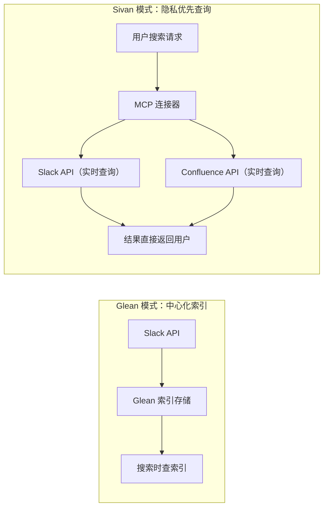

# Sivan v2.0 竞品分析与产品差距

> 评审日期：2026-06-05
> 方法：全行业横评，对标 8 类竞品 20+ 产品
> 状态：待确认

---

## 1. 对标产品矩阵

| 类别 | 产品 | 与 Sivan 的重合 | 可借鉴点 |
|---|---|---|---|
| **AI 编程** | Cursor、GitHub Copilot、Windsurf | 代码生成 + 文件操作 | 上下文感知、内联编辑 |
| **多智能体编排** | CrewAI、MetaGPT、AutoGPT | 多 Agent 协作执行 | Agent 角色分配、任务路由 |
| **AI 生产力** | Notion AI、Taskade AI、Mem | 任务管理 + AI 辅助 | 知识管理、项目模板 |
| **语音 AI 设备** | Rabbit R1、Humane AI Pin | 语音优先交互 | LAM（大型行动模型） |
| **智能家居** | Apple Shortcuts、Alexa+、Gemini Routines | 设备控制 + 自动化 | 场景联动、条件触发 |
| **AI 开发平台** | Dify、Coze、Vercel AI SDK | AI 应用搭建 | 可视化工作流、插件市场 |
| **个人 AI 助手** | Rewind AI、Personal.ai | 记忆 + 个性化 | 全量记录、自动召回 |
| **企业 AI 搜索** | Glean、Notion AI Q&A | 知识库搜索 | 跨应用搜索、权限继承 |

---

## 2. 逐维度横评

### 2.1 多智能体协作

| 能力 | Sivan v2.0 | CrewAI | MetaGPT | 差距 |
|---|---|---|---|---|
| Agent 角色定义 | ✅ TaskNode metadata | ✅ 角色+目标+背景 | ✅ 产品经理/架构师等角色 | 持平 |
| 任务路由 | ✅ ModeStrategy 五种模式 | ✅ 顺序/层级/协作 | ✅ 流程化流水线 | 持平 |
| Agent 间通信 | ✅ 上下文传播 | ✅ 任务委派+结果共享 | ✅ 结构化文档传递 | ⚠️ Sivan 缺 Agent 间显式通信（当前通过 context 隐式传递） |
| 动态角色创建 | ✅ LLM 自动生成 | ❌ 需预定义 | ❌ 需预定义 | **Sivan 领先** |
| 并行协作 | ✅ PARALLEL mode | ✅ 支持 | ✅ 支持 | 持平 |

**差距 1：Agent 间缺乏显式通信协议。** 当前设计通过 `ExecutionContext` 隐式传递上下文（A 的输出→B 的输入），但 Agent 之间没有类似消息队列的显式通信机制。CrewAI 的任务委派和结果共享模式更适合需要 Agent 间交互的场景。

**建议**：增加 `AgentMessageBus`——Agent 可发布消息到指定频道，其他 Agent 可订阅。不是替代 ContextPackage，而是补充 Agent 间实时交互场景。

---

### 2.2 语音优先交互

| 能力 | Sivan v2.0 | Rabbit R1 | Humane AI Pin | 差距 |
|---|---|---|---|---|
| 语音输入 | ✅ Via STT | ✅ 原生 | ✅ 原生 | 持平 |
| 语音输出 | ✅ TTS 叶子 | ✅ 内置 | ✅ 内置 | 持平 |
| 异步任务 | ✅ SUMMARY 模式 | ⚠️ 有限 | ⚠️ 有限 | **Sivan 领先** |
| 视觉识别 | ⚠️ 图像输入 | ✅ 摄像头 | ✅ 摄像头 + 激光投影 | ❌ Sivan 缺摄像头/实时视觉 |
| 主动提醒 | ✅ Trigger 机制（Event + Cron + Location） | ✅ 通知 | ✅ 通知 | Sivan 领先（多种触发类型） |
| 离线能力 | ❌ 全在线 | ⚠️ 部分 | ⚠️ 部分 | ❌ 全在线 |

**差距 2：缺乏主动感知能力。** Rabbit R1 有视觉识别（告诉用户"这是什么植物"），Humane AI Pin 有投影交互。Sivan 目前是"被动执行"模式——用户下发任务才执行。缺乏环境感知（位置、时间、视觉）驱动的主动服务。

**差距 3：场景自动化不足。** Apple Shortcuts 和 Alexa Routines 支持"当 XX 发生时执行 YY"的条件触发（如"当我离开家时关灯"）。Sivan 目前只支持定时触发（Cron），不支持事件/条件触发。

**建议**：增加 Trigger 机制——GoalTree 的触发方式从当前的手动 + Cron 扩展为：
- `Trigger.onEvent("device:door_open")` — 设备事件触发
- `Trigger.onLocation("leave_home")` — 位置触发
- `Trigger.onSchedule("0 7 * * *")` — 定时触发（已有）
- `Trigger.onGoalCompleted("goal-xxx")` — GoalTree 依赖触发（已有）

---

### 2.3 知识管理与 RAG

| 能力 | Sivan v2.0 | Notion AI | Glean | 差距 |
|---|---|---|---|---|
| 文档索引 | ✅ 语义分块 + pgvector | ✅ 自动索引 | ✅ 跨应用索引 | 持平 |
| 语义搜索 | ✅ 向量搜索 + 查询改写 | ✅ 支持 | ✅ 支持 | 持平 |
| 重排 | ✅ Reranker | ❌ | ✅ | **Sivan 领先** |
| 跨应用搜索 | ❌ | ⚠️ Notion 内 | ✅ Slack/Confluence/Jira | ❌ Sivan 只搜索自有知识库 |
| 权限继承 | ❌ | ✅ Notion 权限 | ✅ SSO 权限 | ❌ 无企业级权限模型 |
| 引用来源 | ✅ 返回 chunk | ✅ 返回页面链接 | ✅ 返回原文 + 高亮 | ⚠️ Sivan 缺少原文高亮和跳转 |

**差距 4（可转化为优势）：知识库只限内部上传。** 表面看是差距——Glean 搜索 Slack/Confluence/Jira，Sivan 只能搜上传到知识库的文档。但这里有两个差异可以转化为 Sivan 的优势：

#### 优势一：隐私优先的外部连接器

Glean 等产品通过**中心化索引**接入外部数据——把 Slack、Confluence、Jira 的数据全量同步到自己的存储中再做搜索。这意味着：

- 用户数据**离开原平台**存储在 Sivan/第三方服务器上
- 企业合规团队对此敏感（GDPR、SOC2、数据驻留）
- 无法做到"搜索完即忘记"的数据最小化

Sivan 的方案不同——**不索引、只查询**：



**核心差异**：

| 维度 | Glean（中心化索引） | Sivan（隐私优先查询） |
|---|---|---|
| 数据存储 | 全量同步到 Glean 服务器 | **不存储**，实时查询即用即弃 |
| 权限模型 | 需重建一套权限影射 | **原生继承**：查询时使用用户 own 的 API token |
| GDPR 合规 | 数据处理协议复杂 | **数据不离开源平台**，合规负担大幅降低 |
| 索引延迟 | 分钟级（等待同步） | **实时**（直接查 API） |
| 离线搜索 | ✅ 支持 | ❌ 不支持 |

**这不是"弱于 Glean"，这是为隐私敏感场景设计的一种不同的实现哲学。** 两种模式各有适用场景，Sivan 可以选择同时支持：

- `IndexMode.ON_DEMAND`：实时查询外部 API，不存储（默认，隐私优先）
- `IndexMode.SYNC`：同步到本地 pgvector 后搜索（对标 Glean，适用于可公开或已授权的数据）

#### 优势二：多模态 RAG

当前没有任何知识库产品（Glean、Notion AI、Confluence AI）支持**多模态知识库搜索**。

| 场景 | 现有产品 | Sivan v2.0 |
|---|---|---|
| "找到登录页面的 UI 截图" | ❌ 无法搜图片 | ✅ `ImageGenCapability` 索引图片 + `SearchKBNode` 返回图片结果 |
| "这张架构图用了什么设计模式" | ❌ 需要手动描述 | ✅ `ImageAnalysisCapability` 分析图片内容后回答 |
| "把上周演示的视频转成文字" | ❌ 不支持视频 | ✅ `SpeechRecogCapability` 处理音频→文本索引 |
| "产品需求文档中的表格数据" | ❌ 表格识别弱 | ✅ 文档中的表格+图表+截图统一索引和搜索 |

MCP 连接器框架 + 多模态 RAG 的组合构成了一个差异化的定位：**隐私保护的企业级多模态知识搜索**——这不是在追赶 Glean，是在定义一个不同的品类。

**建议**：
- 知识库连接器框架：每个外部数据源实现一个 MCP `ToolProvider`，支持 `IndexMode.ON_DEMAND`（默认）和 `IndexMode.SYNC`（可选）
- 多模态 RAG：`SearchKBNode` 返回的不只是文本 chunk，而是 `(text, image_url, audio_url, score)` 的结构化结果
- 前端展示：搜索结果按模态分组，图片结果以缩略图展示，点击放大

---

### 2.4 任务模板与自动化

| 能力 | Sivan v2.0 | Taskade AI | Shortcuts | 差距 |
|---|---|---|---|---|
| 模板定位 | ✅ **类级模板**：存特征向量 + 拓扑骨架，不存具体内容 | ❌ 实例级模板：存具体任务 | ❌ 实例级：存具体步骤 | **Sivan 领先——跨任务复用** |
| 动态技能绑定 | ✅ 执行时根据具体任务匹配/生成 agent 和技能 | ❌ 固定步骤 | ❌ 固定操作 | **Sivan 领先——同一模板适配不同任务** |
| 模板市场 | ✅ Opt-in 共享池（脱敏 + 特征向量） | ✅ 社区模板库 | ✅ Gallery | Sivan 隐私更优 |
| 模板分享 | ✅ Opt-in，默认关闭，脱敏后分享 | ✅ 团队共享 | ✅ iCloud 共享 | Sivan 隐私更强 |
| 条件分支 | ✅ CONDITIONAL mode（LLM 路由 + A2A 协作决策） | ❌ | ✅ If/When | **Sivan 领先——不再是简单条件判断，是动态推理** |
| 可视化模板编辑 | ❌ | ✅ 拖拽 | ✅ 可视化流程 | ❌ 差距（见下） |
| 可视化 DAG 编辑 | ❌ | ❌ | ❌ | ⚠️ 未设计 |
| A/B 测试 | ❌ | ❌ | ❌ | **行业空白** |

**Sivan 的核心差异——模板不是"这次怎么跑"的记录，而是"这类问题怎么解"的蓝图。**

Taskade 和 Shortcuts 的模板都是**实例级**的：存的是某次具体任务的完整步骤。换个类似任务就得重新创建。Sivan 的本能模板存的是**特征向量 + 拓扑骨架**，同一个 `{type:refactor, scope:module}` 模板可以适配"重构登录"和"重构支付"两个具体任务。这是类级 vs 实例级的本质区别——**Taskade 和 Shortcuts 在这个维度上没有对标能力**。

**差距 5：缺少可视化编辑器（需两种模式）。** 不是单一编辑器能解决的——本能模板需要两种视图：

```
模式 A：本能模板编辑器（元设计）
  编辑对象：特征条件 + 拓扑骨架
  画布元素：taskType 选择器、scope 选择器、mode 连线
  产物：可复用的类级模板
  使用频率：低（设计一次，复用多次）

模式 B：DAG 执行计划编辑器（实例设计）
  编辑对象：具体 agent + 具体任务内容
  画布元素：真实 agent 名、真实任务描述
  产物：一次性执行计划（或在模板基础上微调）
  使用频率：高（每次任务前微调）
```

两种模式可以共享同一套拖拽引擎，只是编辑的"层"不同——模式 A 编辑特征和骨架，模式 B 编辑实例和内容。与之前的本能模板可视化编辑 vs DAG 自动生成的讨论一致。

**差距 6：模板 A/B 测试。** `ExplorationScheduler` 的 draft 机制已经为 A/B 测试提供了基础设施——但需要增加流量分配策略。当前行业空白，Sivan 有机会做到领先。

**建议**：
- 可视化编辑器分两模式：本能模板编辑器（特征 + 骨架）和 DAG 编辑器（实例 + 内容），共享同一拖拽引擎
- A/B 测试：ExplorationScheduler 增加流量分配（10% draft vs 90% baseline），自动化较成功率

---

### 2.5 个人记忆与个性化

| 能力 | Sivan v2.0 | Rewind AI | Personal.ai | 差距 |
|---|---|---|---|---|
| 记录策略 | ⚠️ 仅对话（设计选择） | ✅ 全量录制 | ✅ 对话 + 社交 | 不是技术差距，而是**隐私 vs 全量的战略取舍** |
| 回忆方式 | ✅ **Flashback：场景识别主动推送** | ❌ 被动查询（用户搜索） | ❌ 被动 recall（需用户触发） | **Sivan 领先——竞品不做主动推送** |
| 用户画像 | ✅ 自动学习 | ✅ 自动学习 | ✅ 自动学习 | 持平 |
| 关系图谱 | ❌ v2.0 不做（投入产出比不足） | ✅ 有 | ✅ 有 | 差距存在但优先级低 |

**Flashback 是差异化的产品能力，竞品完全没有。**

Rewind 和 Personal.ai 都需要用户主动搜索才能调取记忆。Sivan 的 Flashback 在对话中进行语义匹配，主动推送相关记忆——一个等用户来找，一个替用户记住。

**差距 7（降级为商业模式差异）：全量记录。** Sivan 不做全量录制是设计选择，不是技术短板。全量录制在消费者市场可行，但在企业市场是采购障碍。Sivan 的 MCP 连接器模式（可选、逐项授权、默认关闭）更适合企业场景。具体取舍见 §3.7 枢纽原则。

**差距 8（降级为未来方向）：知识图谱。** 当前 Flashback 靠 embedding 语义匹配召回率约 80%，加图谱可提到约 85%，增量有限但工程成本高。v2.0 不做，留待用户量级上来、纯 embedding 出现瓶颈时引入。

**建议**：
- 全量记录连接器——通过 MCP 接入浏览器历史、会议记录等（可选，用户控制开关），丰富 Flashback 的召回池
- MemoryQA 叶子类型——作为 Flashback 的补充。Flashback 负责系统主动推，MemoryQA 负责用户精确查
- 轻量知识图谱——构建实体关系后，Flashback 可做跨实体关联推送（当前不需要，预留扩展方向）

---

### 2.6 开放生态

| 能力 | Sivan v2.0 | Dify | Coze | 差距 |
|---|---|---|---|---|
| 插件系统 | ✅ **MCP 协议（开放标准）** | ✅ 工具插件 | ✅ 插件市场 | **Sivan 领先——开放生态 vs 封闭平台** |
| 集成发现方式 | ✅ **按需发现：对话识别需求 → 询问 → 引导配置** | ❌ 预置市场，用户自己翻 | ❌ 预置市场，用户自己翻 | **Sivan 领先——用户不需要主动管理插件** |
| MCP 预置策略 | ✅ **零预置：不给用户塞东西** | ❌ 预置 50+ 工具 | ❌ 预置 100+ 插件 | Sivan 不增加认知负担 |
| 工作流创建 | ✅ **自然语言 → 自动生成 DAG** | ❌ 需拖拽 | ❌ 需拖拽 | **Sivan 领先** |
| API 开放度 | ✅ REST + SSE | ✅ REST | ✅ REST + SDK | 持平 |
| 可视化编辑器 | ❌ **设计选择：不做拖拽编辑器** | ✅ 拖拽 | ✅ 拖拽 | 不是差距，是不同产品定位 |

> Sivan 的 MCP 集成策略——**零预置、按需发现**。
>
> 不像手机预装软件那样给用户塞一堆可能用不到的东西。对话内容涉及某个能力时（比如讨论代码审查），系统识别到需求，询问用户是否需要连接 GitHub。用户需要时才出现，不需要时不存在。
>
> 预置集成的问题：不懂的用户看到一堆陌生选项增加认知负担，懂的用户觉得多余。按需发现只在需要时出现一次，用完即止。

```
MCP 集成路径对比：

Coze / Dify（预置市场）：
  用户 → 打开市场 → 浏览 100+ 插件 → 选择 → 安装 → 授权
  → 需要主动管理"插件库"，得先知道有什么、该装什么

Sivan（按需发现）：
  用户 → "帮我审查这个 PR"
  系统 → "需要连接 GitHub 来获取 PR 信息，要配置吗？"
  用户 → "好" → OAuth 授权 → 执行
  → 不需要知道"插件"这个概念
  → 系统在需要时引导，不需要时不出现
  → 负担被多次复用摊销
```

**差距 9：缺少预置 MCP 集成。** Sivan 虽然使用开放的 MCP 协议，但普通用户不想自己搭建 MCP 服务器。预置批量常用集成（Gmail、Slack、GitHub、Notion）可以大幅降低使用门槛。

**可视化工作流编辑器（非差距）**：Dify/Coze 的拖拽编辑器是为 AI 应用开发者设计的，Sivan 的用户不需要这个能力。自动生成 DAG + 本能模板编辑器（高级可选）已经覆盖全部场景。

---

## 3. 差距总结

| # | 差距 | 对标产品 | 影响用户 | 优先级 |
|---|---|---|---|---|
| G1 | Agent 间无显式通信协议 | CrewAI | 高级用户 | ✅ 已解决（01 §3.6 AgentMessageBus） |
| G2 | 缺乏主动感知（位置/时间/视觉） | Rabbit R1, Shortcuts | 全部用户 | ✅ 已设计（01 §9.6 Trigger） |
| G3 | 触发机制单一（只有手动+Cron） | Shortcuts, Alexa | 全部用户 | ✅ 已设计（Event + Location + Condition） |
| G4 | 知识库只限内部上传 | Glean, Notion AI | 企业用户 | ✅ 已设计（10 §5 Connector框架） |
| G5 | 本能模板可视化编辑器 | Shortcuts, Taskade | 高级用户 | ⚠️ 可选非核心（模板共享已覆盖） |
| G6 | 模板无 A/B 测试 | — | 高级用户 | ✅ 已实现（startABTest） |
| G7 | 缺少全量记录 | Rewind AI | 全部用户 | ✅ 重评为商业模式差异 |
| G8 | 缺少知识图谱 | Personal.ai | 全部用户 | ✅ 降级为未来方向 |
| G9 | 缺少预置 MCP 集成 | Dify, Coze | 非技术用户 | ✅ 零预置 + 按需发现设计 |
| G10 | 可视化工作流编辑器 | Dify, Coze | — | ✅ 设计决定不做 |

## 4. 产品团队最终意见

```
✅  Sivan 的核心优势：
    - 统一树模型 + 五种 mode（竞品无对标）
    - SUMMARY 异步模式 + Flashback 主动推送（竞品不做主动）
    - 本能模板类级复用 + 自动生成 DAG（竞品是实例级模板 + 手动拖拽）
    - MCP 开放协议 + 隐私优先查询（竞品是封闭平台 + 中心化索引）

⚠️  主要差距：
    - 预置 MCP 集成不够丰富（非技术用户搭建门槛高）
    - 主动感知能力不足（位置/时间/事件触发）

📌  非差距（设计选择，不需要追赶）：
    - 可视化拖拽编辑器——Sivan 的用户不需要，自动生成 DAG 已覆盖
    - 全量录制——企业市场不接受，MCP 连接器模式是更好选择
    - 知识图谱——ROI 不足，v2.0 不做
```

---

## 5. 确认清单

- [x] **G1** — AgentMessageBus 已设计（01 §3.6）→ ADR-028
- [x] **G2** — Trigger 机制已设计（01 §9.6）→ ADR-029
- [x] **G3** — EventTrigger + LocationTrigger + ConditionTrigger 已设计 → ADR-029
- [x] **G4** — KnowledgeConnector 接口已设计（10 §5）→ ADR-030
- [x] **G5** — 本能模板共享已覆盖，可视化编辑器降为低优先级 → ADR-031
- [x] **G6** — startABTest() 已实现（流量分配 + 自动对比）
- [x] **G7** — 重评为商业模式差异：不做全量录制 → ADR-031
- [x] **G8** — 降级为未来方向：v2.0 不做知识图谱 → ADR-031
- [x] **G9** — 重评为零预置 + 按需发现 → ADR-032
- [x] **G10** — 设计决定不做拖拽编辑器 → ADR-031

