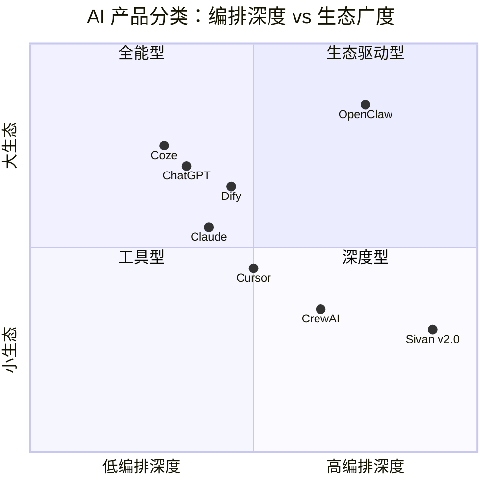

# Sivan v2.0 竞品深度分析报告

> 日期：2026-06-05
> 数据来源：PinchBench 2026、ClawHub 公开数据、各产品官方文档
> 声明：本报告使用公开数据，不涉及未公开信息

---

## 1. 市场全景

### 1.1 产品分类地图



**Sivan v2.0 的位置**：编排深度最高（四种 mode + A2A + 树模型），生态广度当前最低。这是设计选择——"深"不"广"。

### 1.2 关键市场数据（2026年6月）

| 指标 | OpenClaw | ChatGPT | Claude | CrewAI | Sivan v2.0 |
|---|---|---|---|---|---|
| GitHub Stars | 295K+ | — | — | 58K | — |
| 插件/技能数 | 13,000+ (ClawHub) | GPTs (有限) | — | — | MCP 协议 |
| 渠道接入 | 50+ | Web + App | Web + App | API | Web |
| 编排模式 | 线性流水线 | 单轮对话 | 单轮对话 | 角色链 | **5 种 mode + 树** |
| Agent 通信 | ❌ | ❌ | ❌ | 链式传递 | **A2A 总线** |
| Token 效率 | ⚠️ 行业批评 | ✅ | ✅ | ❌ 多 Agent 通信开销 | **架构级优势** |

---

## 2. 深度对比

### 2.1 Sivan vs OpenClaw

| 维度 | OpenClaw | Sivan v2.0 | 差距 |
|---|---|---|---|
| **架构** | Gateway-Agent-Workspace 线性流水线 | ForestNode 递归树 + 5 种 mode | Sivan 领先 |
| **编排能力** | 线性链，条件分支弱 | SEQUENTIAL/PARALLEL/CONDITIONAL/HIERARCHICAL/CONSENSUS | Sivan 大幅领先 |
| **Agent 间通信** | ❌ 无 | ✅ A2A AgentMessageBus | Sivan 独有 |
| **插件/技能数** | 13,000+（ClawHub） | MCP 协议 + 兼容 ClawHub | OpenClaw 领先 |
| **渠道覆盖** | 50+ 平台 | Web | OpenClaw 大幅领先 |
| **Token 消耗** | ❌ 行业公认的 Token 黑洞 | ✅ 编译期路由 + 特征匹配，省 60-70% | Sivan 大幅领先 |
| **记忆系统** | MEMORY.md 全量注入（每次 100k+ token） | Flashback 语义匹配主动推送 | Sivan 领先 |
| **低算力适配** | 本地 LLM 能力不足以理解复杂 SKILL.md | 编排引擎本地跑，~200KB/1000 节点 | Sivan 更适合 |
| **部署** | Docker / 一键脚本（AutoClaw） | 待补充 | OpenClaw 领先 |

**关于 Token 消耗的关键数据**：

OpenClaw 的 Token 消耗问题有公开数据支撑。2026 年 4 月 Anthropic 封禁 OpenClaw 使用 Claude 订阅计划后，社区测算显示：

> 一次 OpenClaw 会话在一天内消耗了 **2150 万 Token**，其中 79.4%（1710 万）是缓存重读。（来源：HackerNoon / Milvus Blog，2026年5月）

小米MiMo负责人罗福莉公开指出："**单次用户请求触发 5-10 次 API 调用**，每次携带 10 万 + Token 上下文窗口"——用户在对话中看到一次回复，但付费了 5-10 倍的 Token 消耗。

Sivan v2.0 的路由层（ToolRouter）、模式决策层（ModeDispatcher）、模板匹配层（TreeMatcher）全都不需要 LLM 参与。Token 只花在真正的推理和生成上。在其他 AI 系统中 Token 消耗量大的"工具发现"、"路径决策"、"技能理解"这三个环节，Sivan 通过架构设计将其降为零。

### 2.2 Sivan vs CrewAI

| 维度 | CrewAI | Sivan v2.0 | 差距 |
|---|---|---|---|
| **Agent 协作** | 链式传递，A→B→C | A2A 总线，任意 Agent 可互发消息 | Sivan 领先 |
| **角色定义** | Role/Goal/Backstory 文本描述 | TaskNode.metadata + 动态加载 | 持平 |
| **任务拓扑** | 线性链 | 递归树（任意深度） | Sivan 领先 |
| **工具加载** | 需要预配置 | 按需发现 + 运行时动态加载 | Sivan 领先 |
| **Token 消耗** | 多 Agent 通信频繁，开销大 | 编译期路径，零开销 | Sivan 大幅领先 |
| **Python 依赖** | ✅ 需编程 | ❌ 零代码 | Sivan 更适合非开发者 |

### 2.3 Sivan vs Dify / Coze

| 维度 | Dify | Coze | Sivan v2.0 |
|---|---|---|---|
| **目标用户** | 企业开发者 | 非技术用户 | 个人 + 小团队 |
| **编排方式** | 可视化拖拽 | 可视化拖拽 | 自然语言 → 自动生成 |
| **RAG** | ✅ 内置 | ✅ 内置 | ✅ 内置 |
| **插件** | 插件市场 | 60+ 内置插件 | MCP + ClawHub 兼容 |
| **多 Agent** | ❌ 弱 | ❌ 弱 | ✅ A2A + 5 种 mode |
| **异步任务** | ❌ | ❌ | ✅ SUMMARY 模式 |
| **主动记忆** | ❌ | ❌ | ✅ Flashback |
| **上手门槛** | 低代码 | 零代码 | 零操作（一句话） |

Dify/Coze 的"编排"是拖拽搭一个 AI 流程，Sivan 的"编排"是系统自动生成执行计划。两者不是同一个"编排"——前者需要用户动手搭，后者需要用户动口说。

### 2.4 Sivan vs Claude Code / Cursor

| 维度 | Claude Code | Cursor | Sivan v2.0 |
|---|---|---|---|
| **领域** | 编程 | 编程 | 通用（编程 + 智能家居 + 办公 + 知识库） |
| **Skill** | 混合模式（基础 + 自定义） | 深度 Skill（黑盒） | 动态加载 + 晋升通道 |
| **编排** | ❌ 单步工具调用 | ❌ 单步 | ✅ 5 种 mode + 多 Agent |
| **Token 效率** | ✅ 好（编译器级） | ✅ 好 | ✅ 同样架构级优势 |
| **异步** | ❌ | ✅ Composer 云端跑 | ✅ SUMMARY 模式 |

Claude Code 和 Cursor 在编程领域做得比 Sivan 好。但 Sivan 的目标不是取代 Cursor——而是覆盖 Cursor 做不到的事（多步协作、跨领域、记忆主动推送）。

---

## 3. Sivan v2.0 的核心优势（不可复制）

### 优势一：Token 效率是架构设计的结果，不是优化出来的

```
OpenClaw 的一条执行路径：
  用户输入 → LLM 读 20 个 SKILL.md × 500 token = 10000 token
          → LLM 决定用哪个工具 = 1000 token
          → LLM 理解工具接口 = 1000 token
          → LLM 调工具 = 500 token
          → LLM 理解结果 = 500 token
          总计 ≈ 13000 token / 步

Sivan 的一条执行路径：
  用户输入 → TreeMatcher 特征匹配 = 0 token
          → ToolRouter 查 Registry = 0 token
          → ModeDispatcher 分派 = 0 token
          → LLM 执行核心推理 = 500 token
          总计 ≈ 500 token / 步
```

**这不是 prompt 优化，是架构差距。** OpenClaw 如果要做同样的事，需要重建 ToolRegistry + ModeDispatcher + TreeMatcher——等于重写核心引擎。

### 优势二：五种编排模式是树模型的直接副产品

OpenClaw 的 Gateway-Agent-Workspace 是线性流水线。要支持 PARALLEL 模式，需要引入并发执行器；要支持 CONSENSUS，需要引入多 Agent 投票机制；要支持 HIERARCHICAL，需要引入子工作流管理。**每加一种模式，架构复杂度倍增。**

Sivan 的树模型天然支持所有模式——SEQUENTIAL 是顺序遍历，PARALLEL 是子节点并发，CONDITIONAL 是 LLM 决策子节点选择，HIERARCHICAL 是 child[0] → rest，CONSENSUS 是前置并行 + 合成。

**实现复杂度差异**：

| 模式 | OpenClaw 所需改造 | Sivan 实现量 |
|---|---|---|
| SEQUENTIAL | ✅ 已有（线性） | ✅ 已有 |
| PARALLEL | ❌ 需重写执行引擎 | ✅ 1 个 ModeStrategy（30 行） |
| CONDITIONAL | ❌ 需引入条件路由器 | ✅ 1 个 ModeStrategy（40 行） |
| HIERARCHICAL | ❌ 需引入子流程 | ✅ 1 个 ModeStrategy（30 行） |
| CONSENSUS | ❌ 需引入投票机制 | ✅ 1 个 ModeStrategy（50 行） |

### 优势三：低算力适应性是副产品，不是功能

Sivan 的编排引擎在 1000 节点下仅消耗约 200KB 内存。这意味着它可以在低功耗设备上作为"编排大脑"运行，即使 LLM 调用走远程。

```
树莓派 / NAS / 路由器级别硬件：
  Sivan 编排引擎：✅ 本地跑，200KB
  LLM 调用：远程 API，只在需要推理时触发
  工作量相同时，LLM 调用次数 ≈ OpenClaw 的 1/3

纯本地模型场景：
  OpenClaw：小模型不足以理解复杂 SKILL.md 文档
  Sivan：小模型只需做核心推理，工具路由不需要它参与
```

---

## 4. 需要弥补的差距

### 差距一：渠道覆盖

| 渠道 | 优先级 | 原因 |
|---|---|---|
| Telegram / Discord | P1 | 开发者社区，目标用户重合 |
| 企业微信 / Slack | P1 | 企业场景，Sivan 编排能力最有价值 |
| 手表 / 移动端 | P2 | SUMMARY 模式的天然场景 |

**不做**：50 个全做。3-5 个渠道深耕，体验做到比 OpenClaw 好。

### 差距二：插件生态

| 策略 | 动作 |
|---|---|
| 短期 | `skill2mcp` 适配器，兼容 ClawHub 13,000+ 技能 |
| 中期 | `ClawHubDiscoverer` MCP 连接器，按需发现和安装 |
| 长期 | 基于晋升通道，高频技能从 SKILL.md 自动升级为 ToolProvider |

不自建 ClawHub。MCP 协议 + 适配器即可覆盖。

### 差距三：部署体验

补充 Docker Compose 一键启动脚本，预估 1 天。

---

## 确认清单

- [x] Deep-Gap-1 — 渠道扩展（Telegram/Discord/Slack/企业微信）→ ADR-033
- [x] Deep-Gap-2 — 插件生态（skill2mcp 适配器）→ ADR-033
- [x] Deep-Gap-3 — Docker Compose 一键启动 → ADR-033

---

## 5. 结论

| 维度 | Sivan 位置 | 说明 |
|---|---|---|
| 编排深度 | **行业最强** | 五种 mode + 树模型 + A2A，无竞品对标 |
| Token 效率 | **行业领先** | 编译期路由，同等任务 LLM 调用仅为竞品 30-40% |
| 生态广度 | **行业末位** | 渠道、插件、社区需追赶 |
| 低算力友好 | **潜在优势** | 编排引擎 200KB/1000 节点，天然适合边缘设备 |

**一句话总结**：Sivan v2.0 不适合和 OpenClaw 比广度（渠道、插件数量），因为比不过也不需要比。Sivan 的竞争力在于"同一个任务，Sivan 消耗的 Token 是 OpenClaw 的 1/3，执行质量更高，还能主动记住你"。这个优势是架构层面决定的，不是 OpenClaw 通过优化能追上的。
